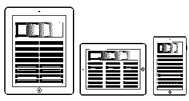
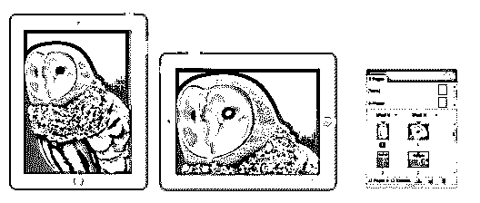
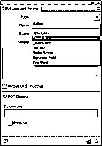
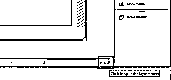

# InDesign CS6

> 原文：<https://www.educba.com/indesign-cs6-top-ten-new-features/>

## InDesign CS6 简介

新的 InDesign CS6 具有有趣的新功能和丰富的增强功能，可对设计元素(如布局、排版和适合各种媒体的出版友好性)进行完美的精确控制。

有了 Adobe 的数字出版套件，为[数字媒体的各个方面(如出版](https://www.educba.com/career-in-digital-media/)、平板电脑和网络)进行设计比以往任何时候都要简单。使用最新软件的另一个优势是可以很好地配合使用熟悉的 InDesign 工作流来处理出版和数字媒体。

<small>3D 动画、建模、仿真、游戏开发&其他</small>

### InDesign CS6 中的十大新功能

以下是为 [InDesign CS6](https://www.adobe.com/products/indesign.html) 增加更多价值的最新功能。

*   液体含量
*   替代布局
*   数字出版
*   文本框架调整
*   链接内容
*   内容传送器
*   交互性
*   EPUB & [HTML5](https://www.educba.com/html5-vs-flash/)
*   生产力提高
*   扩展经理 CS6

#### 1.液体含量

在过去的几年里，设计的重点发生了巨大的变化。随着智能手机和平板电脑在通信领域的使用越来越多，设计师们不得不设计出多种版本的设计，以便在不同设备间顺畅流动，而无需考虑最终用户的差异。

liquid layout 是最新的功能，可以帮助设计人员在不同的设备平台上创建多种页面大小和方向的内容。通过应用动态页面规则，您可以确定在创建不同大小或比例的替代布局时，页面设计元素的显示方式。

使用页面工具选择页面，然后从控制栏中选择液体页面规则，或者您可以在“窗口”>“交互”>“液体布局”的“液体布局”面板中手动选择该工具。

#### 2.替代布局

每个设计师在按照客户要求完成特定尺寸的设计后，都会遇到令人畏惧的情况。但是，电话在最后一刻响起，客户在电话的另一端问，你能把模板尺寸改成新的尺寸并立即发送吗？你迄今为止投入的所有劳动都白费了。放松；新的 InDesign 有一个解决方案，让您可以快速修复尺寸，避免痛苦跟踪制作部分的时间。

使用 InDesign CS6 中新的替代版面功能，只需点击几下鼠标即可完成工作。Adobe 深知这一要求在日益苛刻的印刷和数字媒体中的重要性。有了这项新功能，设计人员可以在同一个文件中为同一个文档创建不同的页面尺寸。

例如，您可以设计一个具有多个变体的文档，作为水平和垂直布局。

您可以通过以下任何一种方法选择替代布局

选择“布局”>“创建替代布局”

从“页面”面板菜单中选择创建替代布局。

#### 3.数字出版

InDesign CS6 的另一个明显改进是其数字出版部分。在这里，除了打印和 web 意图之外，现在用户可以在创建文档之前指定数字出版意图。最重要的是，新功能旨在轻松地将内容从一种媒体转换到另一种媒体，或者从一种设备规格转换到另一种设备规格。Adobe 爱好者和设计社区对此并不感到惊讶，因为他们预计该功能迟早会包含在 InDesign 中，因为 Adobe 的旧文档模型迫切需要改变，这是当今工作流程迫切需要的。

以前，不属于布局的原始内容的图形被链接，并且当原始内容改变时，用户必须手动更新链接的项目。在这个版本中，Adobe 大力扩展了其覆盖范围，远远超过了之前的版本。现在，可以将布局中的对象链接到具有其他文档布局的其他对象。您可以选择将一个布局定义为父框架，其他布局将作为子框架。InDesign 智能地记住父对象的内容及其连接。如果父框架中的内容被修改，子项将指示链接中的更改。警告会显示在子布局中，单击即可轻松更新。

#### 4.文本框架调整

对于设计者来说，摆弄文本框选项总是一件艰难的工作。为了在很大程度上简化这项工作， [InDesign](https://www.educba.com/course/adobe-indesign-training-course/) 引入了灵活的列宽选项。借助此功能，您可以通过调整文本框架的大小来轻松控制列的数量和宽度。

一旦达到设定的数量，列将自动添加，如果文件达到最大列宽，列将被删除。

#### 5.链接内容

链接内容是定义为在几个其他页面上轻松复制一个页面的图像和内容的功能。内容可以是各种各样的，从链接、文本框、页面上的交互式对象、组到整个页面项目。不管它们包含在哪个帧中，都可以独立地进行链接。

在多设备发布作业中，链接内容的一个主要优势是显而易见的。但是，该功能适用于所有类型的出版物。链接内容功能可与替代布局共享，以使用生成布局中的内容。

编辑>放置和链接

#### 6.内容传送带

内容收集器和内容放置器工具在使链接内容方便设计者使用方面起着至关重要的作用。它们允许您轻松地复制内容并将其放在打开的 InDesign 文档中。内容传送带显示复制的内容，这些内容反过来用于在多个文档之间放置和链接内容。

自定义样式映射

链接内容的优点不仅限于上面提到的内容。复制和映射文本、段落、表格和单元格等各种形式的内容的样式变得比以往任何时候都容易。您可以轻松地将一个对象的样式复制并映射到另一个对象。

#### 7.交互性

**PDF 表单**

InDesign CS6 使得设计表单并将其直接导出为 PDF 变得更加容易。最新版本的按钮和库加载了可用于设计交互式表单的内容。现在不需要在 Adobe Acrobat 中对 PDF 表单进行后期处理。相反，您可以选择通过 InDesign 指定 tab 键顺序和工具提示。

**土坯边缘**

在交互设计工具和 Adobe Edge web motion 的帮助下，很容易在网站上制作动画内容。通过使用 web 标准如 [JavaScript](https://www.educba.com/course/online-java-script-training/) 、 [HTML5 和 CSS3](https://www.educba.com/course/online-html5-and-css3-training/) 。可以在你的布局上放置一个边缘包来赋予它交互和动画效果。

**语言支持**

拥有 HunSpelli 字典的世界知名作曲家走到一起，为 InDesign 增加了使用多种世界语言的优势。

InDesign 中的大多数语言都是从汉语词典中移植过来的。HunSpell 是一个开源平台，用户可以选择下载所需语言的拼写和断字词典。

#### 8.EPUB 和 HTML5

在新的 InDesign CS6 中，EPUB 文件的导出工作流程得到了更大程度的简化。用户可以选择他们想要导出文件的 EPUB 版本。除了新增的功能之外，还重新排列了用于导出 EPUB 文件的对话框，以便于使用。

**HTML5**

为了方便和高效，对导出到 [HTML](https://www.educba.com/course/online-html-5-training/) 做了很多改进。增强的支持很少

*   从外部 [CSS](https://www.educba.com/course/css-training-tutorials/) 文件获得的样式信息
*   支持基于 Flash 的视频
*   访问链接多个 CSS 文件
*   链接多个外部 java 脚本

#### 9.生产力提高

Adobe 通过增强现有工具并不时做出有价值的补充来增加其产品的价值。同样，新的 InDesign CS6 具有一套生产力增强功能，可帮助用户提高工作效率

**分割窗口**

现在很容易比较同一文档的两种不同布局。拆分窗口功能允许您将现有窗口拆分为两个窗格，以便于比较两种布局的内容。

要访问拆分窗口选项，您可以选择以下方法

*   点击文档右下角的 spit 窗口按钮
*   窗口>排列>拆分窗口
*   在“页面”面板中打开布局菜单，然后单击“拆分窗口”

**以以前的格式保存**

使用 InDesignMarkup Language (IDML)将现有文档保存为以前版本的格式，以帮助尚未更新该软件的其他人。IDML 格式文件可以用 CS4 或之后发布的版本打开。

#### 10.扩展经理 InDesign CS6

Adobe extension manager 始终是忠实的 Adobe 粉丝的附加软件。和往常一样，CS6 版本在扩展管理器中也有一些改进。

该版本增加了许多有趣的功能，其中之一是快速搜索工具。与旧版本不同，在新搜索工具的帮助下，通过名称和元数据标签搜索文件扩展名变得更加容易。

依赖特性是版本中另一个重要的特性，在依赖特性的帮助下，一个扩展可以有多个依赖扩展，依赖信息可以在 MXI 文件中指定。

Adobe InDesign CS6 新增了所有功能，再次证明了 InDesign 是出版和版面管理方面最灵活、最用户友好的软件。随着越来越关注为多种设备设计布局，设计师社区和爱好者很容易期待 Adobe 越来越关注多样化的垂直管理。

### 推荐文章

这是 InDesign CS6 的综合指南。这里我们讨论了 InDesign CS6 中的 10 大新功能。您也可以阅读以下文章，了解更多信息——

1.  [Adobe 编辑软件](https://www.educba.com/adobe-editing-softwares/)
2.  [什么是 Adobe InDesign](https://www.educba.com/what-is-adobe-indesign/)
3.  [Adobe Photoshop 中的功能](https://www.educba.com/top-10-features-in-adobe-photoshop/)
4.  [Adobe Photoshop Elements](https://www.educba.com/adobe-photoshop-element-tools/)

