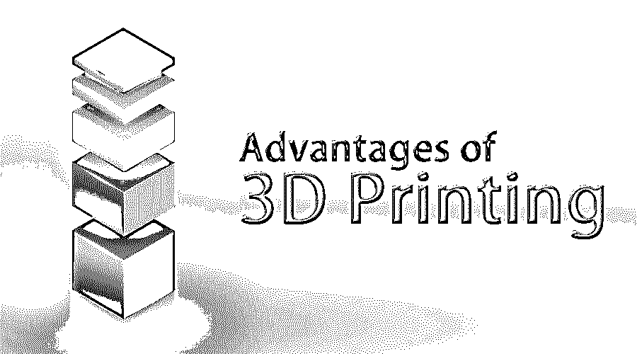

# 3D 打印的优势

> 原文：<https://www.educba.com/advantages-of-3d-printing/>

## 3D 打印优势介绍

在本主题中，我们将了解 3d 打印的优势。这种 3D 打印也被称为添加制造，这是一种通过连接或固化材料来创建三维物体的过程&在计算机控制下将它们一层一层地放在一起。3D 打印很受欢迎，并已在制造业领域奠定了基础。这项技术现在被专业人士和业余爱好者普遍使用。3d 打印是一项进步的技术，每年都在被先进的 3D 打印机更新。一台打印机通常需要 5-20 个小时来完成整个过程，这取决于打印机的性质。由于 3D 打印是一个动态过程，3D 打印的零件不能在打印后立即使用；它们需要一些后处理表面加工才能达到效果。

此活动总是从数字 3D 模型或 CAD 文件开始。科幻作家亚瑟·C·克拉克在 1964 年发明了这项技术。3D 打印的基本技术包括由打印机软件将模型分成精细的二维层，然后遵循 g 代码语言的规则集，以便打印机执行进一步的处理。印刷过程中使用的材料也可能不同。金属和塑料是最常用的材料。

<small>3D 动画、建模、仿真、游戏开发&其他</small>

这种 3D 打印技术的优势可以帮助设计师和专业人士在选择更好的制造工艺时做出更好的决定，并将有助于提供更好的结果。

### 3D 打印的优势

十大优势如下:

#### 1.更实惠

这种 3D 打印处理劳动力成本低，这是 3D 打印技术最重要的优势之一。劳动力成本在决定创建一个框架所用的资金量方面有着巨大的作用。在处理传统制造时，劳动力成本非常高，并且需要有经验的机器操作员。但是，在 3D 打印机中，我们只需要操作员按下按钮，其余的程序由打印机的自动化过程完成。还有，用 3D 打印制造产品等于小规模大批量制造。

#### 2.更快的生产

与旧的制造方法相比，3D 打印机生产模型的速度也是使用这种技术的一个优势。因此，3d 打印比传统的制造方法更快更容易。从蓝图阶段到最终产品，3D 打印快速融入了想法和设计。复杂的设计可以从 CAD 模型中提取出来并用于打印，完成这一过程只需几个小时。

#### 3.更好的物品质量

设计师最大的拦路虎是如何尽可能系统地制造物品。添加制造机器在一个内置的一步过程中完成任务。这一过程非常高效，在构建阶段不需要机器操作员的任何干预。CAD 设计完成并上传到机器后，只需几个小时就能得到结果。设计者实现了对最终产品的完全控制，因为机器只需一步即可生产一个零件，从而减少了对焊接、喷漆等各种制造过程的依赖。

#### 4.降低风险

一个有缺陷的原型可能会耗费设计者的时间和金钱。即使是模具的微小变化也可能对财务状况产生巨大影响。适当的设计验证是投资昂贵模具的重要部分。3D 打印技术有助于在投资昂贵的制造工具之前，通过打印生产就绪的原型来检查设计；因此，它消除了原型制作过程中的风险。

#### 5.创意设计和定制的自由

虽然传统的制造方法更好地创造了同一件东西的数百个副本，但它的结果是同样的毫无生气和单调的设计。而 3D 打印让设计师可以自由设计创意模型，进行无限定制，更容易满足客户的个性化需求。增材制造的大部分限制都围绕着如何高效地创建打印以减少对支持的依赖性。因此，设计师可以自由地创建模型和复杂的几何图形。

#### 6.混合原料的使用

大规模生产不鼓励原材料的组合，因为它可能很昂贵。此外，产品设计者必须首先计算用于减法或注射模具制造的材料，并结合化学和物理元素。但是有了 [3D 打印技术](https://www.educba.com/careers-in-3d-printing/)，除了设计师的想象力，什么都不是限制。这项技术很容易适应各种原材料，如金属、生物材料、玻璃、陶瓷、纸张、银等。

#### 7.可持续性

减法制造方法，如数控铣削，会产生大量的废料。这些方法从第一个初始块中去除了大量的材料。幸运的是，3D 打印只使用制造零件所需的材料。此外，材料可以重复使用和回收用于进一步的处理。因此，添加制造导致非常少的浪费，并节省了大量资金。

#### 8.易接近

如今，越来越多的人开始接触 3D 打印。3D 笔也可以产生与 3D 打印机相同的效果。随着这项技术的进步和发展，许多设计师、公司和专业人士可以随时随地创造他们需要的产品。

#### 9.实际产品测试

3D 打印提供了体验产品原型的触觉和感觉的优势，以测试它并搜索设计中的任何错误或缺点。设计者甚至可以在出现问题的情况下修改 CAD 设计，并再次打印修改后的版本。

#### 10.无限制地使用形状和几何图形

旧的制造技术依靠模具和切割技术来生产想要的形状。因此，用这种技术设计复杂的形状对设计者来说既困难又麻烦。随着 3D 打印的引入，这一挑战也可以被克服，并且随着合适材料的可用性，这一技术可以实现预期的结果。

### 结论

3D 打印技术是一种更好、更便宜、更快、更可持续、更灵活、更环保的现代技术。我们生活在一个快节奏的世界里，一切都需要迅速，因此，这就是 3D 打印技术可以用来将我们的想象转化为现实的地方；这是印刷业的一大优势。

### 推荐文章

这是 3D 打印优势的指南。在这里，我们讨论了 3D 打印技术在现实世界中的 10 大优势。也可以看看下面的文章了解更多。

1.  [3D 动画职业](https://www.educba.com/careers-in-3d-animation/)
2.  [3D 软件设计生涯](https://www.educba.com/3d-software-design/)
3.  [三维建模软件](https://www.educba.com/3d-modeling-software/)

