# Autodesk 字符生成器

> 原文：<https://www.educba.com/autodesk-character-generator/>

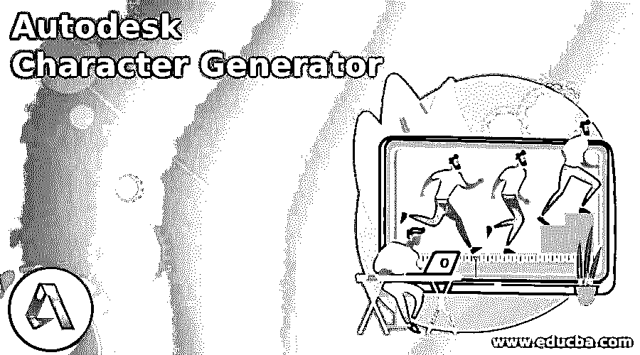

## Autodesk 字符生成器简介

Autodesk Character Generator 是一款流行的基于云的软件，无需外部工具或功能即可设计 3D 角色。随着 3d 行业技术的快速发展，用户现在可以在该软件的帮助下设计和创建 3D 模型和人物角色。

Autodesk Character Generator 非常有用，并且具有友好的用户界面。该产品向学生、教师、专业培训师和 3D 建模师提供付费和免费版本。3D 艺术家使用该软件来设计项目和任务，精确地创建模型。此外，它只需要用户端付出最少的努力来生成所需的字符。

<small>3D 动画、建模、仿真、游戏开发&其他</small>

### 什么是 Autodesk 字符生成器？

Autodesk Character Generator 是一款软件工具，旨在减轻艺术家的努力和劳动，并利用创造性的想法和想象力创建真实合理的 3d 角色。该程序帮助用户创建完全装配的 3D 模型和人类角色。此外，用户可以选择和创建不同纹理、渐变风格、艺术纹理和图案的衣服、头发和面部结构。

Autodesk Character Generator 还可以帮助用户创建装配和纹理模型，以及可以在动画和电影中使用的模型。Autodesk Character Generator 软件收集了大量的体型皮肤形式、头发样本、眼睛颜色、衣服和其他用于创建精心设计和描绘的 3D 模型的创造性特征。用户可以很容易地选择和修改模型的现有风格和设计，并创造自己独特的人物与此程序。

Autodesk Character Generator 是一个非常精通的程序，它拥有一个男性、女性、创意设计等角色和模型库。在这个程序上创建设计的最好部分是，它可以帮助用户将模型导出到其他 Autodesk 程序，如 MAYA、BLENDER、MAX 和其他程序。这将帮助用户创建和生成可视化模型，并将想法和想象变成现实。

字符生成器的一些主要功能是-

*   模型和角色可以从带有角色生成器的庞大库中选择。此外，为了在游戏程序或动画电影中直接使用 3D 模型，该软件提供了广泛的完全装配的男性、女性和其他设计的模型。
*   Character Generator 为其用户提供的最佳功能是从广泛的预定义库中选择身体皮肤、头发颜色和类型、衣服、鞋子和其他世俗特征。此外，这项技术让用户可以轻松地修改他们的 3D 模型和角色。
*   字符生成器提供的另一个重要功能是混合来自同一组的两个不同字符的功能。用户可以使用两个不同的模型，并将它们合并以创建一个真实而古怪的模型。

尽管 Character Generator 的免费版本已经终止，但该程序仅适用于 Maya 的其他 Autodesk 程序套件、Maya LT、3D Max、Mudbox 和其他程序。

### 如何使用 Autodesk 字符生成器？

以下是使用字符生成器的步骤-

1.  在网页浏览器中，打开 https://charactergenerator.autodesk.com/
2.  接下来，单击登录选项
3.  使用创建的电子邮件 id 登录 Autodesk 网站。
4.  登录后，将上传如下所示的页面。

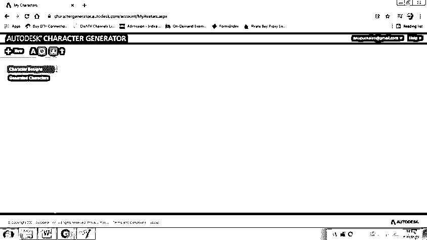

5.  单击新选项，如下所示。

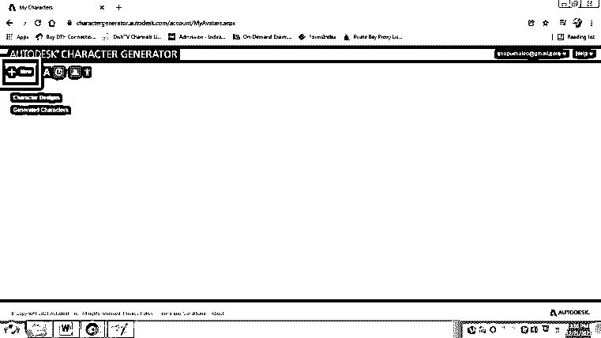

6.  单击“新建”后，将会上传一个页面，如下所示

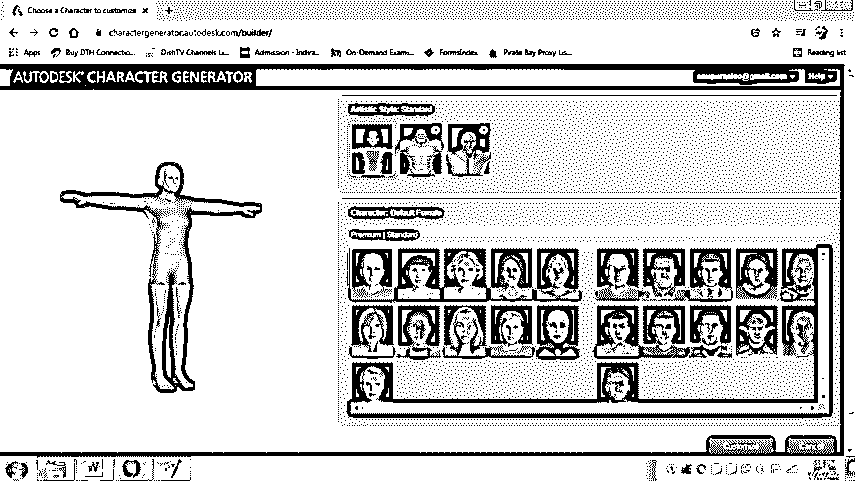

7.  选择模型和角色，如下所示

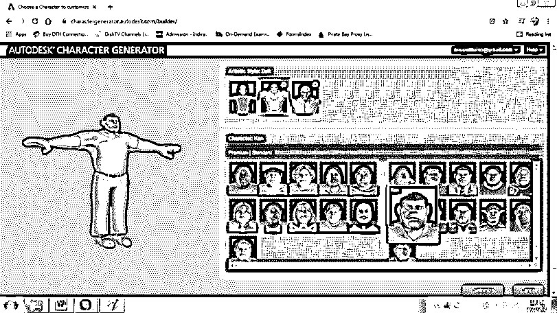

8.  单击“定制”,修改现有模型并向其添加其他功能

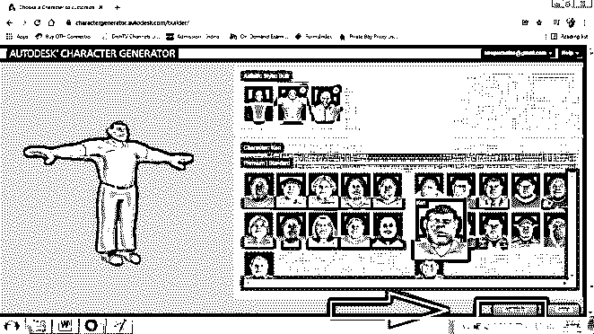

9.  在此之后，我们可以看到一个页面，其中所有的特征，如面部、眼睛、头发、身体和服装都可供选择，如下所示

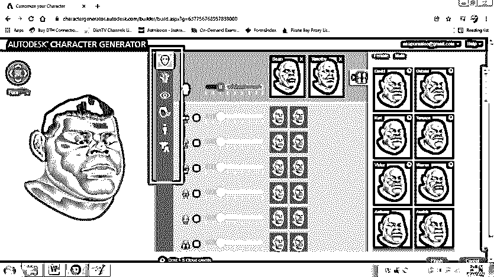

*   接下来，从选项中选择眼睛，并做出相应的选择

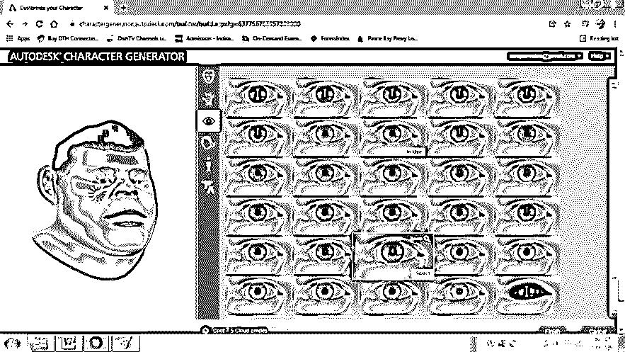

11.  接下来，从选项中选择发型，并做出相应的选择

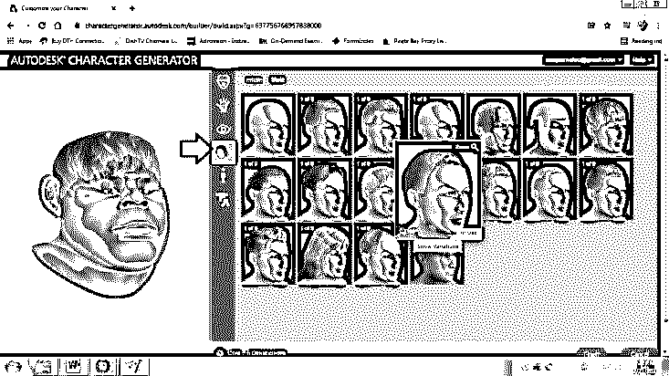

*   接下来，从选项中选择身体类型并做出相应的选择，如下所示

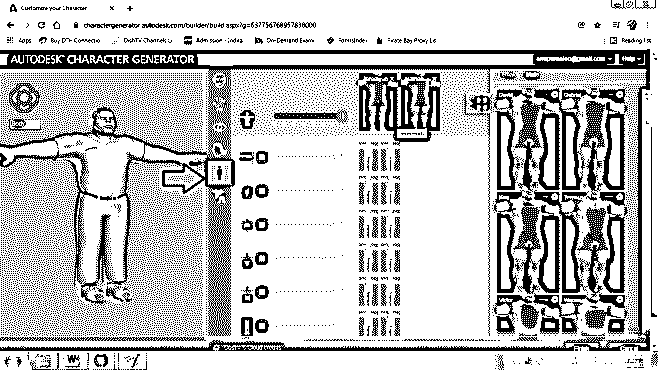

13.  接下来，从选项中选择布料类型，并做出相应的选择，如下所示

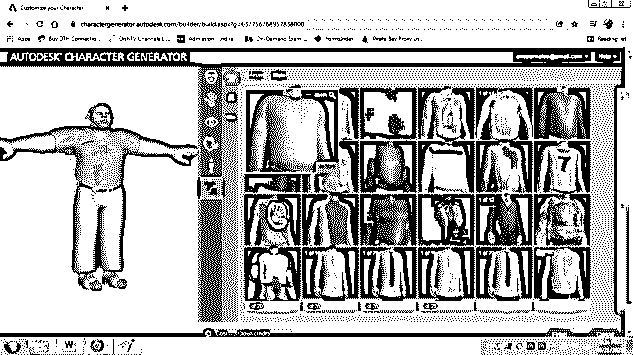

*   最后，点击 FINISH 并保存角色，如下所示

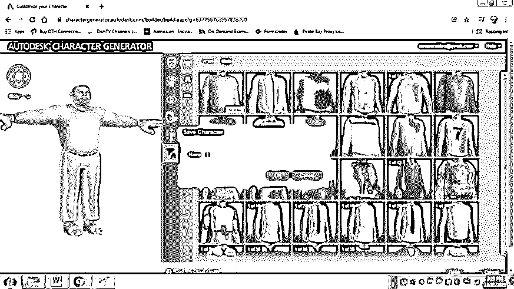

*   同样，我们也可以创造女性角色和其他创造性的模型

### 结论

在上面的文章中，我们详细了解了字符生成器及其众多的功能和特性。该程序是一个方便的软件，用户只需很少的努力，甚至不需要额外的努力。

如果使用得当，Autodesk Character Generator 可以为年轻的 3D 艺术家或初学者提供一个生成模型和角色的平台，而无需学习 3D Max 等复杂的程序。该软件将促进和加强初学者的 3D 知识。

### 推荐文章

这是 Autodesk 字符生成器指南。在这里，我们讨论 Autodesk 字符生成器及其众多功能和特性。您也可以看看以下文章，了解更多信息–

1.  [什么是 Autodesk](https://www.educba.com/what-is-autodesk/)
2.  [Autodesk 卸载工具](https://www.educba.com/autodesk-uninstall-tool/)
3.  [AutoCAD 中的 Leader](https://www.educba.com/leader-in-autocad/)
4.  [在 AutoCAD 中旋转](https://www.educba.com/revolve-in-autocad/)

