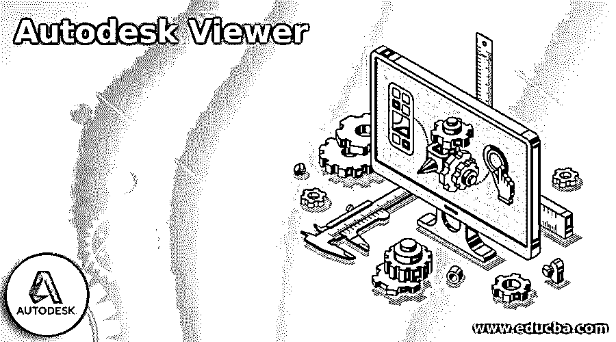
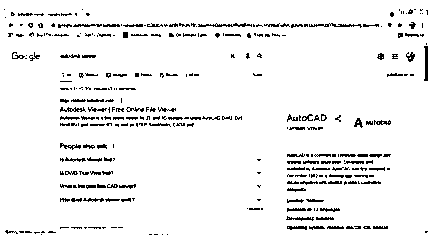
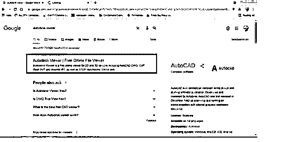
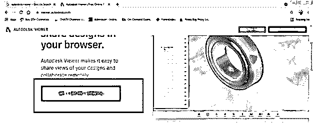
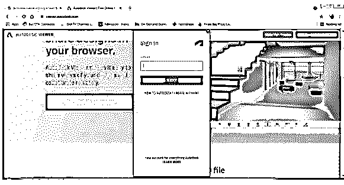
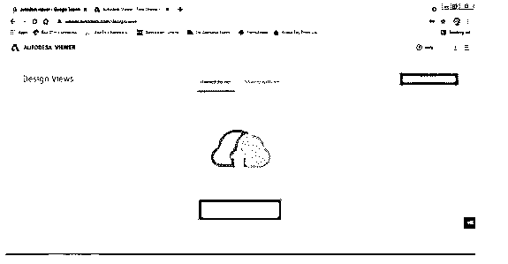
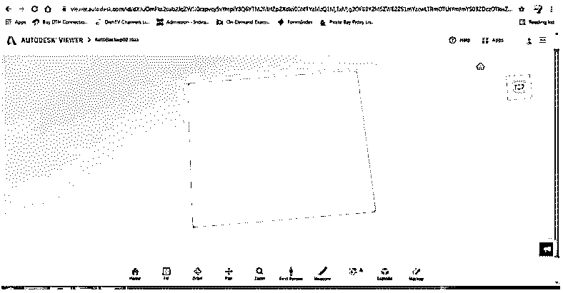

# Autodesk Viewer

> 原文：<https://www.educba.com/autodesk-viewer/>

## Autodesk Viewer 简介

Autodesk Viewer 是由 Autodesk Company 开发的程序，用于在单一平台上查看、共享和设计 DWG、DWF、RVT、马克斯的 2D 和三维文件以及许多其他文件格式。此外，Autodesk 是一家开发 2D 和 3D 程序的跨国软件公司，拥有大量使用其产品的用户。

### 什么是 Autodesk Viewer？

*   Autodesk Viewer 是一款在线免费浏览器，专为在移动应用程序和桌面上查看特殊的 2D 和三维文件格式而创建。通常，用户可能需要打开和查看某些文件格式，而无需下载特定的程序或软件。该 Autodesk Viewer 开始发挥作用，帮助用户检查来自 AutoCAD、3D Max、3D Maya、Revit、Fusion 360 等程序的文件。
*   它是最好的浏览器之一，支持浏览器模式，Windows 和 MAC 操作系统，以及 Chrome 操作系统。这个观众的目标是室内和室外设计师、动画师、建模师、3D 艺术家、建筑师和许多职业道路上的用户。
*   它还可以帮助用户打开和查看 2D 和 3D 文件，并在需要时标记和测量图表或绘图。

### Best Autodesk Viewer

Autodesk 为观众提供了广泛的查看程序，帮助用户打开、查看、共享、编辑、标记和测量 2D 和 3D 文件，而无需在桌面上安装较重的软件。一些浏览器软件是在线的，其他的文件比实际程序要求的要小。

<small>3D 动画、建模、仿真、游戏开发&其他</small>

这些 autodesk 查看器如下:

#### 1.DWG 真实观

它基于 Windows 操作系统，有助于在需要时与其他队友一起在线测量、查看、审阅和标记文件。这个特殊的浏览器可以帮助处理 DWG 和 DXF 的文件格式。AutoCAD、Fusion 360、BIM 360、Civil 3D、3d Max 和 Revit 是与此查看器兼容的软件。

#### 2.FBX 评论

它支持 Windows 桌面/移动和 MAC 操作系统。它有助于打开 3D 模型和动画文件，并且在使用 MudBox、3D Maya 和 Motion builder 程序时表现良好。此外，它可以帮助用户打开 OBJ，FBX，AMC，DXF 和 3Ds 文件格式。

#### 3.设计评论

这是一个基于 Windows 的 Autodesk 查看器，可在 Autodesk 网站上免费获得。它有助于查看、测量和计算 2D 和 3D CAD 文件中的修改。该特定程序可与 AutoCAD、Inventor 和 NAVISWORKS 软件配合使用。

#### 4.MOLDFLOW 通讯器

这个特定的 Autodesk Viewer 专门用于处理三维文件并创建三维文件的副本。它还帮助用户打印、模拟和预测 3D 数据和文件。该浏览器在互联网上也有免费版本。模流分析和模流顾问是我们可以使用 Autodesk viewer 的两个程序。它有助于打开和查看制造商文件格式。

#### 5.NAVISWORKS 自由

使用 Autodesk Viewer，用户可以轻松测量和分析 2D 和三维数据格式，并根据文件类型对其进行分离。这种特殊的查看器与 Windows 操作系统兼容，并且在 Inventor、BIM 360、AutoCAD、Revit 和 NAVISWORKS 程序中运行良好。

#### 6.AUTOCAD WEB 应用程序

这种特殊的 Autodesk Viewer 是最好的交流平台之一，有助于创建 CAD 绘图，而无需在桌面上下载任何程序。用户可以非常有效和容易地创建、查看、编辑和共享 CAD 文件和绘图。该浏览器是一个开源的 web 应用程序，不需要用户付出任何努力。专为在 Google Drive、Drop box、Autodesk Drive 和 Microsoft One Drive 的云上处理 DWG 文件格式而设计。

### 使用 Autodesk 查看器

用户可以毫不费力地操作 Autodesk Viewer 并充分利用该浏览器，因为它可以用于 80 多种文件格式和 15 种以上的程序。

使用 Autodesk Viewer 的步骤如下:

1.去谷歌搜索 Autodesk Viewer。

2.点击第一个链接，如下图所示。

3.屏幕上将打开一个网页。点击开始查看。

4.你必须登录才能查看你的文件。

5.点击上传新文件开始编辑和查看您的文件。

6.上传后，文件就可以修改了，您可以相应地测量或编辑它们。

### 结论

在本文中，我们详细了解了不同的 Autodesk 查看器及其用途、优点和职业道德。充分了解这些 Autodesk 查看器将有助于观众了解他们的未来。正如我们在本文中所研究的，有时，我们可能不需要安装一个特定的程序来进行微小的修改或分析设计。相反，我们可以在 Autodesk Viewers 的帮助下执行这些细微的更改，如上面的文章所示。

### 推荐文章

这是 Autodesk Viewer 的指南。在这里，我们讨论介绍，最佳 autodesk 查看器，并使用更好的理解。您也可以看看以下文章，了解更多信息–

1.  [Autodesk 卸载工具](https://www.educba.com/autodesk-uninstall-tool/)
2.  [融合 360 替代方案](https://www.educba.com/fusion-360-alternative/)
3.  [什么是 Autodesk](https://www.educba.com/what-is-autodesk/)
4.  [SketchUp 替代方案](https://www.educba.com/sketchup-alternative/)

