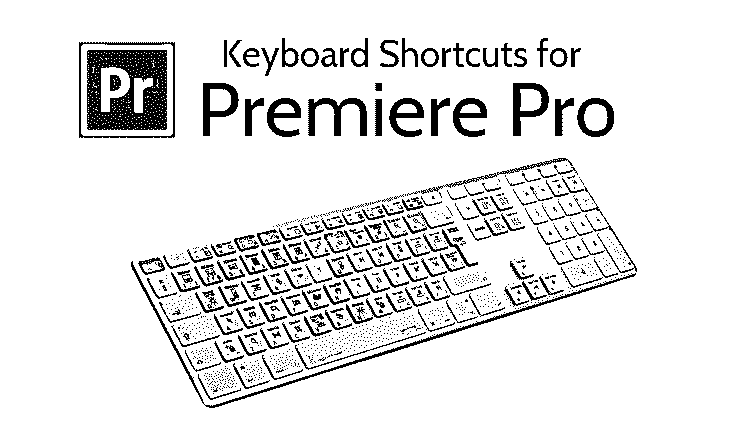

# Premiere Pro 的键盘快捷键

> 原文：<https://www.educba.com/keyboard-shortcuts-for-premiere-pro/>

## 什么是 Premiere Pro 键盘快捷键？

Adobe Premiere Pro 是 Adobe Systems Timeline 视频编辑应用程序。Premiere Pro 支持最高 10，240 分辨率的 RGB 和 YUV 格式的 8，192[10]视频编辑，最高支持 32 位颜色。音频样本编辑，支持 VST 音频插件，并提供 5.1 环绕声混合。Premiere Pro 的插件架构允许您导入和导出 QuickTime 或 DirectShow 支持之外的格式，以支持各种各样的应用程序。

您可以使用 GUI 查看已分配和可分配的按键。当鼠标悬停在键盘布局上时，工具提示会显示完整的命令名称。当您为键盘布局选择修饰键时，键盘会显示所有需要修改的快捷键。为了达到这个效果，你也可以按硬件键来改变它。

<small>3D 动画、建模、仿真、游戏开发&其他</small>

当您在键盘布局上选择该按键时，您可以查看分配给该未修改按键的所有命令以及所有其他修改组合。

*   Premiere Pro 检测键盘的硬件并显示相应的键盘布局。
*   如果 Premiere Pro 检测到不支持的键盘，美国的标准视图。英文键盘。默认是显示 [Adobe Premiere Pro 默认](https://www.educba.com/what-is-adobe-premiere-pro/)的预置。
*   当您更改快捷键时,“预置”弹出式菜单会更改为“自定”。在进行必要的更改时，您可以选择“另存为”将个性化快捷方式保存为预设。

### 应用程序 Premiere Pro 的快捷方式

*   可以为应用程序快捷键和命令快捷键指定命令。
*   快捷键的功能与面板焦点无关，并且面板快捷键仅适用于焦点面板。
*   一些键盘快捷键仅在特定面板中有效。这意味着您可以多次获得同一个密钥。也可以使用弹出窗口，显示一定数量的面板快捷方式(例如，对于时间线)。
*   如果快捷方式面板具有与应用程序快捷方式相同的快捷方式，则当它被聚焦时将不起作用。
*   使用搜索标准过滤的命令列表可以搜索命令。要创建快捷方式(甚至添加修饰符)，您也可以通过单击快捷方式列并键入它们的键来分配快捷方式。
*   显示已被另一个应用程序快捷方式使用的应用程序快捷方式的快捷方式。
*   同一面板中的另一个命令已经使用了一个面板快捷键。
*   如果面板被聚焦，该面板将覆盖应用程序快捷方式。

### Premiere Pro 的键盘快捷键

| **结果** | **窗户** | **苹果操作系统** |
| **文件** |
| 项目/生产… | ctrlalta | OptCmdN |
| 序列… | CtrlN | CmdN |
| 箱子 |  | 煤矿管理局 |
| 标题… | CtrlT | CtrlT |
| 打开项目/生产 | CtrlO | CmdO |
| 在 Adobe Bridge 中浏览 | ctrlalta | OptCmdO |
| 关闭项目 | CtrlShiftW | ShiftCmdW |
| 关闭 | CtrlW | CmdW |
| 救援 | CtrlS | CmdS |
| 另存为 | ctrlylts | ShiftCmdS |
| 保存一份副本 | ctrlylts | OptCmdS |
| 捕获 | ctrlalta | OptCmdN |
| 批量捕获 | F5 | F5 |
| 从媒体浏览器导入 | CtrlAltN | OptCmdN |
| 导入 | ctrlalta | OptCmdI |

#### 导出快捷键

| 媒体… | CtrlM | CmdM |
| 选择… | CtrlShiftH | ShiftCmdH |
| 出口 | CtrlQ |  |

#### 编辑快捷键

| 取消 | ctrl z | CmdZ |
| 重做 | CtrlShiftZ | ShiftCmdZ |
| 切口 | CtrlX | CmdX |
| 复制 | CtrlC | CmdC |
| 粘贴 | CtrlV | CmdV |
| 粘贴插页 | ctrl shift TV | ShiftCmd |
| 粘贴属性 | ctrlalta | OptCmdV |
| 清楚的 | 删除 | 转发删除 |
| 波纹删除 | 移位删除 | ShiftForwardDelete |
| 复制 | ctrl+shift 组合键 | ShiftCmd |
| 全选 | CtrlA | CmdA |
| 取消全选 | CtrlShiftA | ShiftCmdA |
| 查找… | ctrl f | CmdF |
| 编辑原件 | CtrlE | 煤矿管理局 |

#### 剪辑快捷键

| 制作子片段… | CtrlU | cmfu |
| 音频频道… | 变化 | 变化 |
| 速度/持续时间… | CtrlR | CmdR |
| 插入 | , | , |
| 写得过多 | . | . |
| 使能够 | 变化 | ShiftCmdE |
| 环 | CtrlI | CmdI |
| 组 | CtrlG | CmdG |
| 取消组 | CtrlShiftG | ShiftCmdG |

#### 序列快捷键

| 在工作区渲染效果 | 进入 | 返回 |
| 匹配框架 | 英语字母表中第六个字母 | 英语字母表中第六个字母 |
| 添加编辑 | ctrl lk | CmdK |
| 将编辑添加到所有轨道 | CtrlShiftK | ShiftCmdK |
| 修剪编辑 | 英语字母表中第二十个字母 | 英语字母表中第二十个字母 |
| 将所选编辑扩展到播放头 | 英语字母表中第五个字母 | 英语字母表中第五个字母 |
| 应用视频过渡 | CtrlD | CmdD |
| 应用音频过渡 | CtrlShiftD | ShiftCmdD |
| 将默认过渡应用于选择 | 变化 | 变化 |
| 电梯 | ; | ; |
| 提取 | ' | ' |
| 放大 | = | = |
| 缩小 | – | – |

#### 转到 Gap 快捷键

| 顺序中的下一个 | 移位； | 移位； |
| 序列中的上一个 | ctrlshift | Opt> |
| 突然的 | 英语字母表的第 19 个字母 | 英语字母表的第 19 个字母 |

#### Premiere Pro 标记键

| 边缘 | 英语字母表中第九个字母 | 英语字母表中第九个字母 |
| 规划 | 英语字母表中第十五个字母 | 英语字母表中第十五个字母 |
| 标记剪辑 | 英语字母表中第二十四个字母 | 英语字母表中第二十四个字母 |
| 标记选择 | /td > |  |
| 转到中 | 变化 | 变化 |
| 去外面 | 变化 | 变化 |
| 清场 | ctrl shift | 镜片 |
| 离开 | ctrl shift to | 光电子 |
| 清除输入清除输出 | CtrlShiftX | OptX，是吗 |
| 添加标记 | 英语字母表中第十三个字母 | 英语字母表中第十三个字母 |
| 跳到下一个标记 | 变化 | 变化 |
| 前往上一个标记 | CtrlShiftM | ShiftCmdM |
| 清除当前标记 | ctrlalta | 快选吧 |
| 清除所有标记 | CtrlAltShiftM | OptCmdM |

#### 键入对齐快捷键

| 左边的 | ctrl+shift 组合键 | ShiftCmdL |
| 中心 | CtrlShiftC | ShiftCmdC |
| 对吧 | ctrl shift | ShiftCmdR |
| 制表位… | ctrl shift | ShiftCmdT |
| 模板… | CtrlJ | CmdJ |

#### 选择快捷键

| 上面的下一个对象 | ctrl alt | OptCmd |
| 下面的下一个对象 | CtrlAlt[ | OptCmd[ |

#### 排列键

| 置前 | ctrl+shift 组合键 | ShiftCmd] |  |
| 提出 | Ctrl] | Cmd] |
| 置后 | ctrl+shift 组合键 | ShiftCmd[ |
| 向后发送 | Ctrl[ | Cmd[ |

#### 工作区快捷键

< tdShift9

| 重置当前工作空间… | AltShiftO | OptShiftO |
| 音频剪辑混音器 | 轮班 9 |
| 音轨混合器 | 轮班 6 | 轮班 6 |
| 效果控制 | 轮班 5 | 轮班 5 |
| 效果 | 轮班 7 | 轮班 7 |
| 媒体浏览器 | 轮班 8 | 轮班 8 |
| 程序监控器 | 轮班 4 | 轮班 4 |
| 项目 | 轮班 1 | 轮班 1 |
| 源监视器 | 轮班 2 | 轮班 2 |
| 时间表 | 轮班 3 | 轮班 3 |

#### 帮助键

这个帮助键快捷键对于 Premiere Pro 键盘来说是最有帮助的键之一。

| Adobe Premiere Pro 帮助… | 子一代 | 子一代 |

#### 键盘按键

| 透明海报框架 | CtrlShiftP | OptP |
| 切换到 1 号摄像机 | Ctrl1 | Ctrl1 |
| 切换到 2 号摄像头 | Ctrl2 | Ctrl2 |
| 切到 3 号摄像机 | Ctrl3 | Ctrl3 |
| 切换到 4 号摄像头 | Ctrl4 | Ctrl4 |
| 切换到 5 号摄像头 | Ctrl5 | Ctrl5 |
| 切换到 6 号摄像头 | Ctrl6 | Ctrl6 |
| 切到 7 号摄像头 | Ctrl7 | Ctrl7 |
| 切换到 8 号摄像头 | Ctrl8 | Ctrl8 |
| 切到 9 号摄像机 | Ctrl9 | Ctrl9 |
| 降低剪辑音量 | [ | [ |
| 降低剪辑音量很多 | 轮班[ | 轮班[ |
| 展开所有轨道 | 移位= | 移位= |
| 导出框架 | CtrlShiftE | 变化 |
| 将下一个编辑扩展到播放头 | 改变 | 改变 |
| 将上一个编辑扩展到播放头 | 变化 | 变化 |

#### 混音器面板菜单快捷键

| 显示/隐藏曲目… | 特拉尔特 | OptCmdT |
| 环 | CtrlL | CmdL |
| 仅仪表输入 | ctrl shift | ctrl shift |

#### 捕获面板快捷键

| 录制视频 | 英语字母表中第二十二个字母 | 英语字母表中第二十二个字母 |
| 录制音频 | 英语字母表中第一个字母 | 英语字母表中第一个字母 |
| 驱逐 | 英语字母表中第五个字母 | 英语字母表中第五个字母 |
| 快进 | 英语字母表中第六个字母 | 英语字母表中第六个字母 |
| 转到入点 | 英语字母表中第十七个字母 | 英语字母表中第十七个字母 |
| 前往出点 | 英语字母表中第二十三个字母 | 英语字母表中第二十三个字母 |
| 记录 | 英语字母表第七个字母 | 英语字母表第七个字母 |
| 重绕 | 英语字母表中第十八个字母 | 英语字母表中第十八个字母 |
| 后退 | 左边的 | 左边的 |
| 站出来 | 对吧 | 对吧 |
| 停止 | 英语字母表的第 19 个字母 | 英语字母表的第 19 个字母 |

#### 效果控制面板菜单键

| 移除所选效果 | 退格 | 删除 |
| 新的自定义框 | 计算机的 ctrl 按键 | 煤矿管理局 |  |
| 删除自定义项目 | 退格 | 删除 |

#### Premiere Pro 历史面板键

| 倒退 | 左边的 | 左边的 |
| 站出来 | 对吧 | 对吧 |
| 删除 | 退格键 | 删除 |
| 在源代码监视器中打开 | 变化 | 变化 |
| 父目录 | ctrlp | CmdUp |
| 选择目录列表 | 左移 | 左移 |
| 选择媒体列表 | 右移 | 右移 |
| 环 | CtrlL | CmdL |
| 玩 | 空间 | 空间 |
| 前往下一个编辑点 | 向下 | 向下 |
| 前往上一个编辑点 | 向上 | 向上 |
| 播放/停止开关 | 空间 | 空间 |
| 录制开/关切换 | Zero | Zero |
| 后退 | 左边的 | 左边的 |
| 站出来 | 对吧 | 对吧 |
| 环 | CtrlL | CmdL |

#### 工具快捷键

| 选择工具 | 英语字母表中第二十二个字母 | 英语字母表中第二十二个字母 |
| 轨道选择工具 | 英语字母表中第一个字母 | 英语字母表中第一个字母 |
| 波纹编辑工具 | 英语字母表的第 2 个字母 | 英语字母表的第 2 个字母 |
| 滚动编辑工具 | 英语字母表中第十四个字母 | 英语字母表中第十四个字母 |
| 速率拉伸工具 | 英语字母表中第十八个字母 | 英语字母表中第十八个字母 |
| 剃刀工具 | 英语字母表中第三个字母 | 英语字母表中第三个字母 |
| 滑动工具 | 英语字母表中第二十五个字母 | 英语字母表中第二十五个字母 |
| 滑动工具 | 英语字母表中第二十一个字母 | 英语字母表中第二十一个字母 |
| 钢笔工具 | 英语字母表中第十六个字母 |  |
| 手工工具 | 英语字母表中第八个字母 | 英语字母表中第八个字母 |
| 缩放工具 | 英语字母表中第二十六个字母 | 英语字母表中第二十六个字母 |

现在我们将看到多媒体 Premiere Pro 键盘快捷键

#### 多媒体快捷键

< tdUpUp < td55 < tdCmdUp

| 前往下一个编辑点 | 向下 | 向下 |
| 前往任何轨道上的下一个编辑点 | siftdown | siftdown |
| 前往上一个编辑点 |
| 前往任何轨道上的上一个编辑点 | 上来 | 上来 |
| 转到选定的剪辑结尾 | 移位终止 | 移位终止 |
| 前往所选剪辑的开始位置 | 轮班回家 | 轮班回家 |
| 跳到序列-片段结尾 | 结束 | 结束 |
| 前往序列-片段开始 | 家 | 家 |
| 增加剪辑音量 | ] | ]> |
| 增加剪辑音量很多 | Shift] | Shift] |
| 最大化或恢复活动框架 | “移位” | “移位” |
| 最大化或恢复光标下的框架 | ' | ' |
| 最小化所有轨道 | 移位- | 移位- |
| 玩耍 | 变化 | 变化 |
| 从内向外玩 | CtrlShiftSpace | OptK |
| 使用前滚/后滚播放入到出 | 移位空间 | 移位空间 |
| 从播放头播放到出点 | CtrlSpace | ctrl 空间 |
| 播放停止开关 | 空间 | 空间记录 |
| 显示嵌套序列 | CtrlShiftF | 变化 |
| 波纹修剪下一个编辑到播放头 | 英语字母表中第二十三个字母 | 英语字母表中第二十三个字母 |
| 波纹修剪上一次编辑到播放头 | 英语字母表中第十七个字母 | 英语字母表中第十七个字母 |
| 选择摄像机 1 | One | One |
| 选择摄像机 2 | >2 | Two |
| 选择摄像机 3 | Three | Three |
| 选择摄像机 4 | Four | Four |
| 选择摄像机 5 |
| 选择摄像机 6 | Six | Six |
| 选择摄像机 7 | Seven | Seven |
| 选择摄像机 8 | Eight | Eight |
| 选择摄像机 9 | Nine | Nine |
| 选择查找框 | 改变 | 改变 |
| 选择播放头处的片段 | 英语字母表中第四个字母 | 英语字母表中第四个字母 |
| 选择下一个剪辑 | CtrlDown | chmdown |
| 选择下一个面板 | ctrl+shift 组合键 | ctrl+shift 组合键 |
| 选择上一个剪辑 | ctrlp |
| 选择上一个面板 | CtrlShift， | CtrlShift， |
| 设置海报框架 | 变化 | CmdP |
| 向左穿梭 | 英语字母表中第十个字母 | 英语字母表中第十个字母 |
| 向右穿梭 | 英语字母表中第十二个字母 | 英语字母表中第十二个字母 |
| 向左慢速穿梭 | ShiftJ | ShiftJ |
| 穿梭慢右 | 变化 | ShiL |
| 穿梭停止 | 英语字母表中第十一个字母 | 英语字母表中第十一个字母 |
| 后退 | 左边的 | 左边的 |
| 后退五帧–单位 | 变化 | 变化 |
| 站出来 | 对吧 | 对吧 |
| 向前移动五帧–单位 | 右移 | 右移 |
| 切换所有音频目标 | Ctrl9 | Ctrl9 |
| 切换所有源音频 | ctrl alt 9 | OptCmd9 |
| 切换所有源视频 | CtrlAlt0 | OptCmd0 |
| 切换所有视频目标 | Ctrl0 | Cmd0 |
| 搓擦时切换音频 | Ctrl0 | Cmd0 |
| 切换全屏 | ' Ctrl ' | ' Ctrl ' |
| 切换多摄像机视图 | Shift0 | Shift0 |
| 切换修剪类型 | 变化 | CtrlT |
| 向后修剪 | ctrl 向左 | OptionLeft < |
| 向后修剪许多 | CtrlShiftLeft | OptShiftLeft |
| 向前修剪 | CtrlRight | 完全的 |
| 向前修剪许多 | ctrl shift tright | OptShiftRight |
| 将下一个编辑修剪到播放头 | > CtrlAltW | OptW |
| 将上一次编辑修剪到播放头 | ctrlalt | OptQ(自动更正) |

现在我们将看到项目面板 Premiere Pro 键盘快捷键

#### 项目面板键

< tdTabTab <

| 工作空间 1 | AltSwift1 | OptSwift1 |
| 工作区 2 | AltSwift2 | OptSwift2 |
| 工作空间 3 | AltSwift3 | OptSwift3 |
| 工作空间 4 | AltSwift4 | OptSwift4 |
| 工作空间 5 | AltSwift5 | OptSwift5 |
| 工作区 6 | AltSwift6 | OptSwift6 |
| 工作空间 7 | AltSwift7 | OptSwift7 |
| 工作空间 8 | AltSwift8 | OptSwift8 |
| 工作空间 9 | AltSwift9 | OptSwift9 |
| 缩放至序列 | \ | \ |
| 向上扩展选择 | 迅速的 | 迅速的 |
| 向下移动选择 | 向下 | 向下 |
| 移动选择结尾 | 结束 | 结束 |
| 将所选内容移至首页 | 家 | 家 |
| 向左移动选择 | 左边的 | 左边的 |
| 向下移动选择页面 | 下一页 | 向下翻页> |
| 向上移动选择页面 | 页上移 | 页上移 |
| 向右移动选择 | 对吧 | 对吧 |
| 向上移动选择 | 向上 | 向上 |
| 下一列字段 |
| 下一行字段 | 进入 | 返回 |
| 在源代码监视器中打开 | 变化 | 变化 |
| 前一列字段 | 移位标签 | 移位标签 |
| 前一行字段 | ShiftEnter | Shift |
| 下一个缩略图大小 | Shift] | Shift] |
| 缩略图大小先前 | 轮班[ | 轮班[ |
| 切换视图 | Shift\ | Shift\ |

#### Premiere Pro 时间轴面板键

| 添加剪辑标记 | Ctrl > |  |
| 清除选择 | 退格 | 删除 |
| 降低音轨高度 | Alt- | 选择- |
| 降低视频轨道高度 | Ctrl- | Cmd- |
| 增加音轨高度 | Alt= | Opt= |
| 增加视频轨道高度 | Ctrl= | Cmd<= |
| 将剪辑选择向左挪动五帧 | AltShiftLeft | ShiftCmdLeft |
| 将剪辑选择向左挪动一帧 | alt 向左 | cmdlet |
| 将剪辑选择向右挪动五帧 | AltSwiftLeft | ShiftCmdLeft |
| 将剪辑选择向右挪动一帧 | 没问题的 | CmdRight |
| 波纹删除 | alt 退格键 | OptDelete |
| 设定工作区栏的入点 | Alt[< | Opt[ |
| 设置工作区栏出点 | 备选] | Opt] |
| 显示下一个屏幕 | ctrlalta | OptCmdN |
| 显示上一个屏幕 | 下一页 | 下一页 |
| 幻灯片剪辑选择左五帧 | AltShift， | OptShift， |
| 将剪辑选择向左滑动一帧 | Alt， | Opt， |
| 幻灯片剪辑选择右侧五帧 | AltShift。 | OptShift。 |
| 将剪辑选择向右滑动一帧 | 表示“另类的” | 选择。 |
| 滑动剪辑选择左五帧 | CtrlAltShiftLeft | OptShiftCmdLeft |
| 滑动剪辑选择向左一帧 | CtrlAltLeft | OptCmdLeft |
| 滑动剪辑选择右五帧 | ctrl altshifttright | OptShiftCmdRight |
| 滑动剪辑选择右移一帧 | CtrlAltRight | OptCmdRight |

#### 标题快捷键

< tdCtrl

| 弧形工具 | 英语字母表中第一个字母 | < A |
| 大胆的 | CtrlB | mdB |
| 将字距减少五个单位 | AltShiftLeft | OptShiftLeft |
| 将字距减少一个单位 | < AltLeft | optlight |
| 减少五个单位 | AltShiftDown | OptShiftDown |
| 减少一个单位的行距 | alt 向左 | optlight |
| 将文本大小减小五磅 | CtrlAltShiftLeft | OptShiftCmdLeft |
| 将文本大小减小一磅 | CtrlAltLeft | OptCmdLeft < |
| 椭圆工具 | 英语字母表中第五个字母 | 英语字母表中第五个字母 |
| 将字距增加五个单位 | ShiftAltRight | OptShiftRight |
| 将字距增加一个单位 | 没问题的 | 完全的 |
| 领先五个单位 | 交替升档 | OptShiftUp |
| 领先一个单位 | 好吧，好吧 | OptUp |
| 将文本大小增加 5 磅 | ctrlalt = | OptShiftCmdRight |
| 将文本大小增加一磅 | CtrlAltRight | OptCmdRight |
| 插入版权符号 | CtrlAltShiftC | OptShiftCmdC |
| 插入注册符号 | Ctrl | OpShiftCmdR |
| 意大利语族的 | CtrlI | CmdI |
| 线条工具 | 英语字母表中第十二个字母 | 英语字母表中第十二个字母 |
| 将所选对象向下微移五个像素 | siftdown | siftdown |
| 将所选对象下移一个像素 | 向下 | 向下 |
| 将所选对象向左微移五个像素 | 左移 | 左移 |
| 将所选对象向左挪动一个像素 | 左边的 | 左边的 |
| 将所选对象向右微移五个像素 | 右移 | 右移 |
| 将所选对象向右微移一个像素 | 对吧 | 对吧 |
| 将所选对象向上微移五个像素 | 上来 | Shift |
| 将所选对象上移一个像素 | 向上 | 向上 |
| 钢笔工具 | 英语字母表中第十六个字母 | 英语字母表中第十六个字母 |
| 将对象定位到底部标题安全边距 | CtrlShiftD | ShifCmdD |
| 将对象定位到左侧标题安全边距 | CtrlShiftF | ShiftCmdF |
| 将对象定位到顶部标题安全边距 | ctrl shift to | ShiftCmdO |
| 矩形工具 | 英语字母表中第十八个字母 | 英语字母表中第十八个字母 |
| 旋转工具 | 英语字母表中第十五个字母 | 英语字母表中第十五个字母 |
| 选择工具 | 英语字母表中第二十二个字母 | 英语字母表中第二十二个字母 |
| 文字工具 | 英语字母表中第二十个字母 | 英语字母表中第二十个字母 |
| 强调 |
| 立式工具 | 英语字母表中第三个字母 | 英语字母表中第三个字母 |
| 楔形工具 | 英语字母表中第二十三个字母 | 英语字母表中第二十三个字母 |

#### 装饰监视器面板

| 关注传出和传入 | Alt1 | Opt1 |
| 关注输入端 | Alt3 | Three |
| 侧重于外向方面 | Alt2 | Opt2 |
| 环 | CtrlL | Cmd>L |
| 向后修剪大修剪偏移 | AltShiftLeft | OptShiftLeft |
| 向后修剪一帧 | alt 向左 | optlight |
| 向前配平大配平偏移量 | AltShiftRight | OptShiftRight |
| 向前修剪一帧 | 没问题的 | 完全的 |

### 结论

Premiere Pro 键盘快捷键可用于制作高清晰度视频广播质量所需的所有常见视频编辑任务。它用于导入视频、音频和图形，并创建新编辑的视频版本，这些版本可以导出为媒体和分发格式。使用 Premiere Pro 创建视频时，可以一起编辑不同的视频和静止图像。视频可以添加标题，过滤器，并可以应用其他效果。

### 推荐文章

这是 Premiere Pro 的键盘快捷键指南。这里我们讨论 Premiere Pro 最顶端的快捷键，我们可以在键盘的帮助下使用它们。您也可以看看以下文章——

1.  [Adobe Premiere Pro 插件](https://www.educba.com/adobe-premiere-pro-plugins/)
2.  [安装 Adobe Premiere Pro](https://www.educba.com/install-adobe-premiere-pro/)
3.  [Adobe Premiere 替代品](https://www.educba.com/adobe-premiere-alternatives/)
4.  [土坯的种类](https://www.educba.com/types-of-adobe/)

