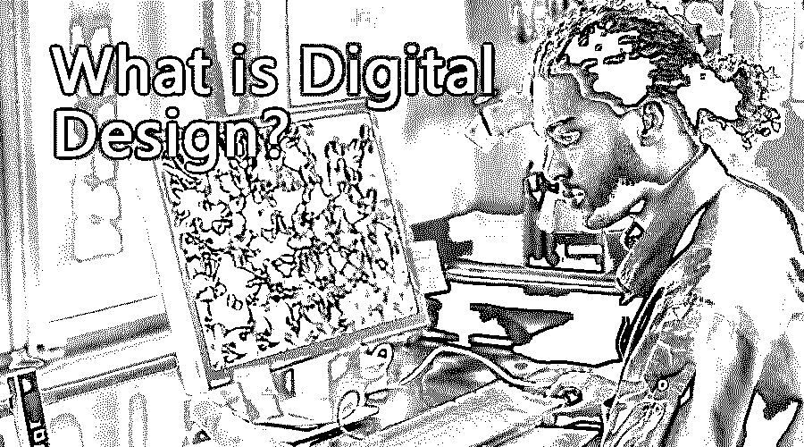

# 什么是数字设计？

> 原文：<https://www.educba.com/what-is-digital-design/>

## 数字设计导论

在数字平台上创建和观看的任何演示或设计都称为数字设计。数字设计现在被广泛使用。在纸上创建设计已经成为传统，设计师现在使用各种数字资源来创建和开发令人惊叹的设计和演示。这些设计可以是任何形式，并且可以在任何平台上制备。Microsoft Word 文档也是使用技术和数字源创建的数字设计。同样，这些可以是多媒体演示、签名、3D 模型、动画、网页、网络广告、电子邮件或其他社交宣传材料。

### 理解数字设计

这也可以被称为平面设计。图形设计是用来创造用户和客户之间的沟通。图形设计使用插图，摄影和印刷作为其主要组成部分。设计师使用文本、图片、符号和各种设计创造视觉表现。平面设计师也被认为是一个多任务者，因为他使用多种设计软件和图像编辑器来创建一个视觉演示。目前，设计行业对平面设计师和图像编辑的需求很大。

<small>3D 动画、建模、仿真、游戏开发&其他</small>

### 数字设计如何让工作变得如此简单？

它可以让设计师的工作变得简单易行。早先，人们用铅笔和纸来创造设计。这个过程既麻烦又费时，还浪费了大量的金钱。在这个过程中，如果需要任何更改，用户将从头到尾开始整个过程。随着可以在数字平台上开发和创作的数字设计和演示的出现，这项工作变得简单和最小化。现在唯一花的时间就是了解设计用的软件，工作也差不多完成了。

有如此多的选项供用户选择。用户可以使用任何他想使用的软件，并且觉得既方便又省时。一些图形软件是 CorelDraw、Adobe Illustrator、Adobe InDesign、Microsoft PowerPoint 等。

### 你能用数字设计做什么？

这样，用户可以在电脑屏幕上设计他们的想象。我们可以创建标志和品牌、海报、网站设计和元素、产品设计、平面广告、杂志、新闻编辑、LED 板、广告牌、名片、名片、动画、模型、3d 模型、产品模型、室内设计、建筑等等。

### 使用数字设计

使用数字设计非常简单高效。这些程序对用户友好，界面流畅快捷。用户可以根据自己的需要和要求使用大量的数字节目。图形设计师将使用 2d 图形程序，如 CorelDraw、Illustrator 或 InDesign。

图像编辑器将使用 2d 光栅编辑器，如 Photoshop、Lightworks 或任何其他图像编辑器。3D 艺术家会使用 Maya、Max、Flash、Blender 等软件。这些全数字软件彼此相似。一旦用户开始使用它们，他们就可以很容易地得到它们。此外，还有在线教程和课程来教用户关于这个软件。

### 优势

使用它的一些主要优点是-

*   通信
*   高效省时
*   表达创造力的自由
*   减少投资和金钱浪费
*   提高能力和技能。

### 所需技能

想象力和创造力是开发和创造任何设计所需要的最好的设计技能。此外，判断、观察、分析思维也是创造好的概念所必需的。设计师使用图像、文本、插图、创意、界面设计、页面布局技术和印刷制作方法来创建一个合适的设计。

### 为什么要用数字化设计？

为了让我们的工作更简单直接，我们应该使用数字设计。它已经成为我们日常生活的一部分。无论我们走到哪里，我们都能看到数字设计和展示的使用。今天，数字和图形设计在小学和机构中被教授。这只能证明行业和市场对数字设计的使用有巨大的需求。

### 范围

它可以用来创造概念和想法，甚至通过品牌和广告来销售。这些产品可以使用数字设计出售。这在娱乐、医疗保健、营销、广告、印刷媒体、出版物等各个领域都有应用。今天，所有的报纸、杂志、传单、小册子都是在一个数字平台上设计的，然后进行相应的印刷。这个领域非常光明，在未来几年，一切都将使用数字设计。

### 谁是学习数字设计技术的合适受众？

这不限于任何观众。每个人都被认为是学习数字设计过程的合适人选。不仅设计师应该是一个学习者，而且一个门外汉也可以学习一些设计技巧，以便在日常生活中使用。

### 这项技术将如何帮助你的职业发展？

这本身就是一个巨大的行业，越来越多的人被这个行业所吸引。学习这些将会给用户一个机会来扩展他们对创造力和想法的看法。该技术将帮助用户提高他们预先获得的技能，并打开学习和掌握新技能和能力的大门。这将最终帮助他们发展自己的事业和未来的目标。

### 结论

它有一个非常明亮的范围。这些年来，它对所有的设计师和艺术家都变得非常有用和有帮助。一个好的概念的使用现在只有在数字设计的帮助下才能在数字平台上被可视化和看到。这项技术被证明是发明以来最好的。

### 推荐文章

这是一个什么是数字设计的指南。在这里，我们讨论数字设计的基本概念、工作和优势。你也可以浏览我们推荐的其他文章来了解更多信息-

1.  [什么是 UI 设计师？](https://www.educba.com/what-is-ui-designer/)
2.  [什么是 Adobe Illustrator？](https://www.educba.com/what-is-adobe-illustrator/)
3.  [Photoshop 中的铅笔工具](https://www.educba.com/pencil-tool-in-photoshop/)
4.  [Adobe Photoshop 命令](https://www.educba.com/photoshop-commands/)

