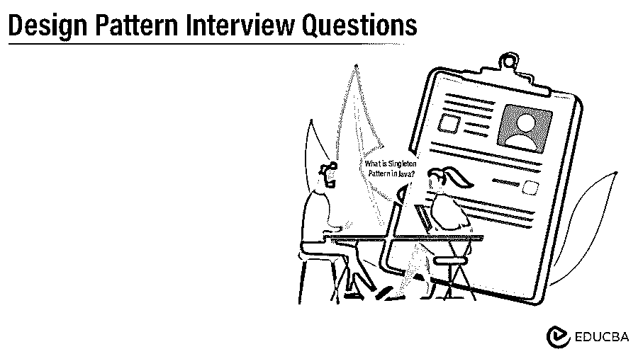

# 设计模式面试问题

> 原文：<https://www.educba.com/design-pattern-interview-questions/>

## 设计模式介绍面试问答

设计模式是对软件开发过程中最常遇到的问题的一种很好的解决方案。设计模式代表了经验丰富的软件开发人员在一段时间内发展出来的最佳实践。它们促进了可重用性，这导致了更健壮和可维护的代码。建筑师 Christopher Alexander 在《模式语言》一书中首次描述了设计模式。后来，他们在设计模式中被描述:由四位作者(Erich Gamma、Richard Helm、Ralph Johnson 和 John Vlissides)编写的可重用面向对象软件的元素，也被称为“四人帮”。

设计模式可以分为三大类:
创造模式
行为模式
功能模式

<small>3D 动画、建模、仿真、游戏开发&其他</small>

所以在准备设计方面的工作面试时。相信你一定想知道最常见的 2022 设计模式面试问答，帮助你轻松破解设计模式面试。下面是顶级设计模式面试问题和答案的列表。

下面列出了一些常见的 2022 年设计模式面试问题:

### 第 1 部分-设计模式面试问题(基础)

#### 1.Java 中的 Singleton 模式是什么？

**答:**
Singleton 模式是一种创建模式，它只允许创建一个类的实例，该实例可用于整个应用程序。单例设计模式的主要优点是节省内存，因为单个实例可以反复使用；不需要在每次请求时都创建一个新对象。例如，在我们的应用程序中，我们可以使用由多个对象共享的单个数据库连接，而不是为每个请求创建一个数据库连接。

#### 2.使用单例设计模式的缺点是什么？

**回答:**
使用单体设计模式的主要缺点是:
a)单体导致代码紧密耦合。singleton 对象是全局公开的，可供整个应用程序使用。因此，使用这个对象的类变得紧密耦合；全局对象中的任何变化都会影响使用它的所有其他类。
b)他们隐藏依赖，而不是暴露它们。
c)单例模式不支持继承。克隆等技术可能会违反独生子女原则。如果一个应用程序运行在多个 JVM 上，那么在这种情况下，Singleton 可能会被破坏。

#### 3.你将使用哪种设计模式来创建一个复杂的对象？

**答案:**
生成器设计模式用于构造一个复杂的对象。它旨在解决工厂和抽象设计模式的问题。

#### 4.当我们可以使用新的操作符时，为什么要使用工厂类来实例化一个类？

**答案:**
工厂类在设计方面提供了灵活性。以下是工厂类的一些好处:
。工厂设计模式导致了更多解耦的代码，因为它允许我们对相关代码隐藏创建逻辑
。它允许我们引入控制容器的反转。
·当您更改应用程序时，它给了您更多的灵活性，因为我们的创作逻辑对相关代码是隐藏的。

#### 5.工厂和抽象工厂设计模式有什么区别？

**答:**
工厂和抽象工厂都是创造性的设计模式。这两者之间的主要区别是，工厂模式通过继承创建一个对象，并且只生产一种产品。另一方面，抽象工厂模式通过组合创建对象并生产产品系列。

### 第 2 部分-设计模式面试问题(高级)

#### 6.Java 中的观察者设计模式是什么？

**回答:**观察者设计模式是定义对象间一对多依赖关系的行为设计模式之一&在我们对一个对象的状态感兴趣时很有用。我们希望在对象状态发生任何变化时得到通知。在观察者设计模式中，当一个对象改变它的状态时，它的所有依赖对象都会被自动通知，这个对象称为主体，而依赖对象称为观察者。Java 提供了使用 java.util.Observable 类& java.util.Observer 接口实现 Observer 设计模式的库。

#### 7.Java 中策略和状态设计模式的区别？

**答案:**
这两种策略，以及一种状态设计模式，在实践中是相似的，但它们有不同的实现方式；下面是这两者之间的一些主要区别:
a .策略设计模式定义了一组算法来执行特定的行为，而状态设计模式允许对象在其内部状态改变时改变其行为。
b .策略设计模式不允许我们存储对上下文对象的引用，而状态设计模式存储对包含它们的上下文对象的引用。
c .在策略设计模式中，客户端知道选择哪个策略来实现，而在状态设计模式中，客户端不决定选择哪个状态来实现。策略模式处理一个对象如何执行一个特定的任务，而状态设计模式处理一个对象是什么。
e .在策略设计模式中不存在后继者/前趋者关系，而在状态设计模式状态中，状态作为后继者&前趋者彼此相关。

#### 8.什么是空对象模式？

**答案:**
空对象模式是一种空对象代替实例变量的空检查的设计模式。Null Object 反映了一种什么都不做的关系，而不是检查空值。它还可以用于在数据不可用的情况下提供默认行为。

#### 9.举一个装饰者设计模式的例子？

**答:**
装饰模式，也称为结构模式，用于在运行时为特定对象添加额外的功能。它通过一个装饰对象包装原始对象。例如，当你买汉堡时，你可以通过添加额外的馅料和酱料来定制它；现在，这些项目的成本必须添加到最终价格中。定制将因客户而异，并由商店提供。用不同的馅料创造不同类别的汉堡，最终会创造出很多类别。装饰器通过基于客户请求在运行时扩展单个 Burger 类的功能来解决这个问题。

#### 10.使用原型设计模式比使用 new 关键字创建实例有什么好处？

**答案:**
有时候，对象创建是重量级的，需要大量资源；创建新实例会影响性能。在这种情况下，使用原型设计模式，它指的是创建重复的对象。如果原型设计模式中已经存在一个类似的对象，那么克隆就完成了，同时考虑到性能。

### 推荐文章

这是一个设计模式面试问题和答案的综合指南，以便候选人可以轻松地解决这些设计模式面试问题。您也可以阅读以下文章，了解更多信息——

1.  [系统设计面试问题](https://www.educba.com/system-design/)
2.  [平面设计面试问题](https://www.educba.com/graphic-design-interview-questions/)
3.  [UI 设计师面试问题](https://www.educba.com/ui-designer-interview-questions/)
4.  [AutoCAD 面试问题](https://www.educba.com/autocad-interview-questions/)

