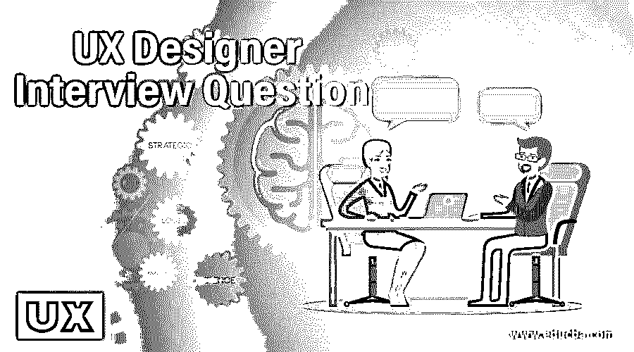

# UX 设计师面试问题

> 原文：<https://www.educba.com/ux-designer-interview-questions/>

## UX 设计师面试问题介绍

准备面试可能会让人不知所措。即使一个人全心全意地做了准备，也无法预测面试结果如何；这完全取决于面试官的气质。所以我的建议是，当你面对面试官时，要努力观察他/她的肢体语言。

尽管如此，做好准备去做总是更好的，尤其是对于一个设计面试。我们必须把我们设计的基本概念清晰地植入我们的脑海，因为我们永远不知道我们的面试也可能是一个惊喜的设计挑战！

<small>3D 动画、建模、仿真、游戏开发&其他</small>

### 十大 UX 设计师面试问答

我做了一些研究，并提出了 UX 设计师职位面试中最常见的问题。记住，这些只是给你的提示和一些提示，让你为面试做好最好的准备，但现实中没有办法预测面试。

在准备 UX 设计师职位的面试时，请记住我们谈论的是在创造性的以客户为中心的场景中工作，所以确保你的回答总是围绕并提到客户和产品关系。这是一个安全的赌注。

这些问题分为两部分

### 第 1 部分- UX 设计师面试问题(基础)

这第一部分包括基本的面试问题和答案。

#### 1.给我们介绍一下你自己？

**答案:**
这是一个面试经典。因为这是面试官从你的回答中最容易理解他/她应该如何以及为什么雇佣你的方式。

*   从这个问题来看，这似乎是一个非正式的谈话初学者，但面试官真正想知道的是你是如何结束 UX 设计师的工作的，以及你对这个领域真正了解多少。通过判断这一点，他/她可能会决定你是否是一个了解 UX 设计师所有角落的合适人选。
*   在这里，你可以讲一个小故事，告诉我是什么激励你成为一名 UX 设计师，以及你为什么选择这家公司。

#### 2.你是团队成员吗？

**答案:**
面试官其实想知道的是两件事的答案。

*   第一，你将如何应对团队中客户/设计师同事/高级设计师的负面反馈？你可以说你愿意接受任何反馈，只要它不含糊。应该是清晰的，切中要害的。
*   第二，在团队和调查中分享你的设计理念并改变它们，你感觉如何？如果公司从你的设计中获利，作为一名 UX 设计师，这将是你的壮举，所以分享实际上是一种责任。

#### 3.UX 与 UI 设计或其他设计学科有什么区别？

答案:
这是这次面试中的常见问题。

*   面试官想知道你是否了解 UX 设计师的角色和职责，他们与其他设计师的角色有何不同，你是否能够运用 UX 的设计理念与其他设计学科合作。这里的建议是先研究这家公司需要的那些角色，然后给出你的答案。
*   尝试提及其他学科就像 UX 设计的子集，设计学科随着产品而变化，但在 UX 设计中，基本布局对所有人来说都是一样的。

#### 4.你将如何改进我们的产品？

回答:
这里面试官想知道你对这个职位和公司的调查做得对不对。如果是一家大公司，只有在需要的时候才提出一个替代方案，但是让这个方案只符合公司当前的趋势。外交也可以应用。不要害怕说出你的观点，但微妙和准确的话会被听到。如果是一家初创企业，那么尽量不要批评产品，而是谈论如何让它出名。确保你也了解目标用户。

#### 5.设计挑战？

**答案:**
这里没什么多说的了。有些面试官太专注于工作了，他们只会在你面前提出挑战，并对你进行评判。在这里，你也可以向他们展示你的作品。

### 第 2 部分- UX 设计师面试问题(高级)

第二部分包括高级面试问题和答案

#### 6.你如何工作和处理一个设计？

**答案:**
在这种情况下，你也可以向他们展示你的作品集。谈谈你创作的最好的作品或你最喜欢的设计。这样，你可以向他们展示你的工作方式。同样，无论是哪种情况，试着根据你作为该公司 UX 设计师的角色来回答。

#### 7.你为什么想在这里工作？

**回答:**
这是一个直接的问题，需要你的一些自信，否则，面试官不会在进行面试时投入他们和你的时间。这个问题可能有不同的答案。也许是大的设计公司，在这样的公司获得经验可以提高你作为设计师的水平。或者它可能是一家初创企业，你的角色可能不仅仅是一名设计师，因此你比其他 UX 设计师更有优势来应对任何危机情况。试着相应地排列答案。

#### 8.你觉得我们产品的这种新方法怎么样？你觉得有利可图吗？

**回答:**
这是另一种鉴别你是否是团队成员的方法。面试官想知道你是否是一个灵活的人，准备好应对产品设计中的现场变化。所以如果你研究一下这个领域的新趋势会更好。如果你不知道这种方法，一定要说明你不知道这种方法，但你心里有另一种方法可以提高盈利能力。这会让面试官看到你更注重解决问题，而不是关注问题。

#### 9.是什么激励你成为 UX 设计师的？

**回答:**
这里面试官想知道你是否真的热爱你的工作，并且将来会有更好的表现。所以你可以谈谈你最喜欢的项目，或者一件轶事。那些改变职业领域的人会面临这个问题。记住；尽量简短，只回答与 UX 设计相关的问题。

#### 10.你认为自己五年后会怎样？

**答案:**
这也是面试经典。但是在这里，面试官想知道你是否会对公司和你的工作负责。他们想确定你是否值得将他们的资产投资于你。你可以说，我参加这次面试是有原因的，如果我的工作得到认可，我会在工作需要的地方落脚，如果幸运的话，我也会与这家公司一起成长。

### 结论

这些是通常会遇到的一些常见问题。你可以想一些额外的问题，比如:如果你的设计被泄露或抄袭，你会有什么感受？或者这个职位有什么让你兴奋的地方？等等。它们都是对相同问题的不同表述方式。这里警觉和观察是关键。

### 推荐文章

这是 UX 设计师面试问题指南。在这里，我们讨论了十大 UX 设计师面试问题的介绍和答案。您也可以浏览我们的其他相关文章，了解更多信息——

1.  [软件设计原理](https://www.educba.com/software-design-principles/)
2.  [什么是 Adobe Illustrator？](https://www.educba.com/what-is-adobe-illustrator/)
3.  [UI 设计师面试问题](https://www.educba.com/ui-designer-interview-questions/)
4.  [什么是 UI 设计师？](https://www.educba.com/what-is-ui-designer/)

