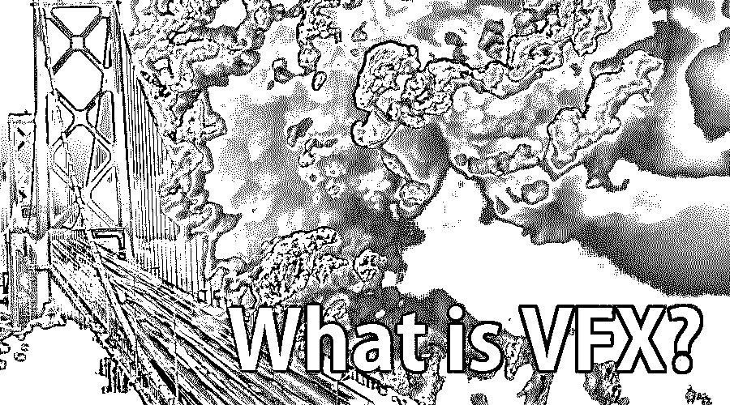

# 什么是 VFX？

> 原文：<https://www.educba.com/what-is-vfx/>

## VFX 简介

VFX 指的是利用电影制作中捕捉到的现场动作来创造影像的过程。视觉效果处理现实生活镜头和计算机生成图像(CGI)的合并，以制作看起来很有感觉的场景；然而，在电影中拍摄是有风险的、昂贵的、不切实际的、令人厌倦的或具有挑战性的。借助软件的[帮助创造的视觉效果已经可以为电影制作人所用，这要归功于低成本且简单易用的计算机软件程序的开发。](https://www.educba.com/vfx-softwares/)

### VFX 如何让工作变得简单？

它是灵活的，并且它们为从现场画面视觉效果、改变的视频和计算机生成的图像的广泛的视频创作提供了优势。

<small>3D 动画、建模、仿真、游戏开发&其他</small>

这里有许多方法可以帮助你简化工作。

#### 1.创造刺激，展示你的作品

在您的项目中使用各种 VFX 技术，使您能够在产品开发的初始阶段就设想并向客户展示产品，而不是在投入所有资源和精力制作产品之后。此外，使用它可以让你以传统拍摄程序无法比拟的方式来观察产品。

动画和视觉效果影响视频制作的实用方法。

*   减少演员和实景拍摄的费用。
*   向视觉效果中添加可在以后修改/更改的元素。

#### 2.X 因素:娱乐和记忆

我们大脑处理图像的速度比文字快好几倍。因此，使用引人入胜的视觉效果会给用户留下持久的印象。它们有助于与观众建立视觉和情感上的联系。因此，它和动画可以使无聊的话题吸引用户。

#### 3.用视觉效果强化品牌形象

当特殊的视觉效果利用颜色、设计和元素来匹配你的业务时，品牌扩张和品牌知名度得到加强。这巩固了你的品牌传播和风格，吸引了更多的观众。几乎每部电影和电视节目都使用了某种类型的增强可视化。虽然这些在巨大的支出创作中显而易见，包括建筑物引爆或大型机器人行动，但它们同样可以是基本的，如为企业整理镜头的基础，或使其看起来就像艺人在不同的世界。

#### 4.对 VFX 艺术家的职业生涯感到好奇吗？这里有一个近距离的观察

一个 VFX 的监督者在一个电影或电视项目的早期被带进这个项目。有问题的人合法地与电影的制作人和执行人员一起工作，因为他们检查内容并整理每个镜头的要求。由于一部电影或节目的如此大量的镜头必须适应 VFX，在预生成中有这个主管可以节省大量的工作时间，并使特殊的可视化过程明显更加熟练和完美。

一旦进入工作室，VFX 的主管将开始与一组插画师、3D 艺术家和概念专家合作，制作原型效果，供电影导演决定。当草稿完成后，这位主管与导演核对，设计产品的每个镜头，并决定其配置设置。认识到在片场需要什么会让拍摄变得简单很多。

这部电影的视觉外观的特点是这个团队精心制作的作品；最终，没有精彩的视觉和特效，科幻或奇幻电影什么都不是。

### 所需的技能和资格

VFX 专业人士必须证明在创造视觉效果的能力，并应拥有对细节的眼睛。该行业通常青睐拥有图形艺术领域学位和一些相关经验的艺术家。除此之外，以下技能和资格是这项工作的基础。

*   **动画体验**–一名 VFX 艺术家不仅要擅长创造令人惊叹的视觉效果，还必须具备扎实的动画知识。他们应该了解动画原理，如运动、缩放和计时。
*   **视频制作**——了解视频制作的技术要素，包括舞台、灯光和声音，是必不可少的
*   **计算机熟练程度**–计算机软件和工具是图形艺术家最好的朋友，帮助他们提高输出。
*   **沟通技巧**–为了在团队中有效地表达想法，沟通是一项必备的技能。这将有助于提供和运输令人满意的产品并达到目标。
*   时间管理对于电影和工作室来说，时间是至关重要的。因此，这些艺术家需要在期限内工作。拥有优秀的时间管理技能将有助于保持稳定的工作进度。

**VFX 行业的必备工具**

VFX 艺术家必须精通以下工具:

*   Adobe 软件(After Effects、Photoshop、Illustrator、Premiere Pro)

### VFX 艺术家教育和培训

尽管成为一名 VFX 艺术家没有最低的先决条件，但对于艺术家来说，获得平面设计、动画或艺术学位是理想的。他们必须精通软件和艺术基础。公司倾向于那些拥有大量作品组合和足够多年相关工作经验的人。

### 职业选择

一个人可以从以下行业开始他的视觉艺术家生涯。

*   电视频道/制作公司
*   VFX 工作室
*   博彩业
*   媒体和广告
*   自由记者

一旦毕业，学生有很多选择来开始他们的职业生涯。

*   故事板艺术家，VFX 艺术家
*   动画艺术家。
*   色键艺术家
*   资产开发
*   建筑建模
*   Roto 艺术家
*   绘画艺术家
*   初级排字工
*   合成艺术家
*   匹配移动艺术家
*   婚介艺术家
*   短片制作人
*   编者ˌ编辑

### 结论

近年来，VFX 和动画产业一直呈指数级增长，与之相关的机会也越来越多。在今天，这一职业是一种充实而富有艺术修养的职业。VFX 商业领域的工作机会正以前所未有的速度增长。如果你对电影和视觉效果充满热情，这是进入这个利润丰厚、回报丰厚的行业的正确时机。

### 推荐文章

这是一本关于什么是 VFX 的指南？在这里，我们讨论了概念，教育，培训，以及 VFX 如何使它变得容易。您也可以浏览我们推荐的其他文章，了解更多信息——

1.  [VFX 软件](https://www.educba.com/vfx-softwares/)
2.  [什么是 ZBrush](https://www.educba.com/what-is-zbrush/)
3.  [VFX vs CGI](https://www.educba.com/vfx-vs-cgi/)
4.  [VFX 公司](https://www.educba.com/vfx-companies/)

