# 什么是像素艺术？

> 原文：<https://www.educba.com/what-is-pixel-art/>

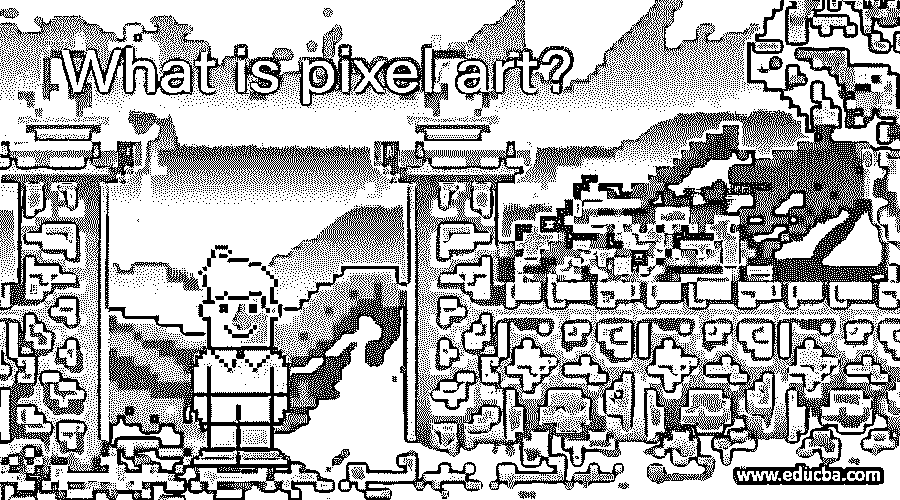

## 什么是像素艺术？

在这篇文章中，我们将了解什么是像素艺术。像素艺术就像 2D 雕刻，你可以完全控制和操纵每一个像素，以区分像素艺术和像素化艺术。你可以使用任何工具来创建艺术，因为你想控制像素，无论你使用哪个工具。所以，绘画的技巧和使用的工具同样重要。像素艺术是从局限性中诞生的，所以许多手工技术今天仍在使用。一般来说，在数字艺术中，锯齿是一个祸害，但在像素艺术中，锯齿让一切都变得清晰。

### 硬件工具

*   鼠标——它擅长点击并提供精确性，但是很难画出来。这是很好的收尾工作。
*   平板电脑——它擅长笔画，有直观的控制，但很难点击或点击，它适合初始草图。
*   键盘——它是最强大的工具，因为键盘快捷键使得制作艺术和动画的过程更快，你甚至可以制作自己的快捷键来满足你的需要。

### 软件、程序和设置

*   专业像素艺术计划–graphics gale、MS Paint XP/Vista、Aseprite、推广
*   通用艺术程序–绘画工具 SAI、GIMP、Adobe Photoshop
*   软件工具——不管使用什么程序，你都需要铅笔工具、滴管、橡皮擦、水桶
*   其他必备工具–选择工具、重新着色工具、线条工具、旋转工具、颜色设置、圆形工具
*   避免-模糊，画笔，模糊的梯度，因为你不能预测的结果或输出，因为你想 100%控制的作品。
*   画布大小——根据艺术风格，你可以为可玩角色设定较大的精灵和画布比例，如《梅德罗伊德 II:萨摩斯归来》,或为可玩角色设定较小的精灵和画布比例，如《超级银河战士》,或设定较小的精灵和画布比例，如《洞穴物语》。

**步骤 1:** 让我们进行一些手工练习，我们使用的工具是 photoshop，因此创建一个新文档，并将尺寸更改为像素，并将宽度和高度设置为 40，分辨率设置为 72 像素/英寸，其余设置保留默认值。

<small>3D 动画、建模、仿真、游戏开发&其他</small>

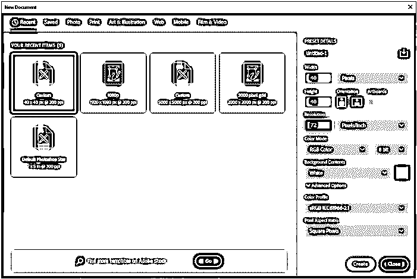

**步骤 2:** 画布将非常小，所以 alt 和鼠标滚轮滚动以放大，然后从视图菜单转到显示网格或按 Ctrl +'

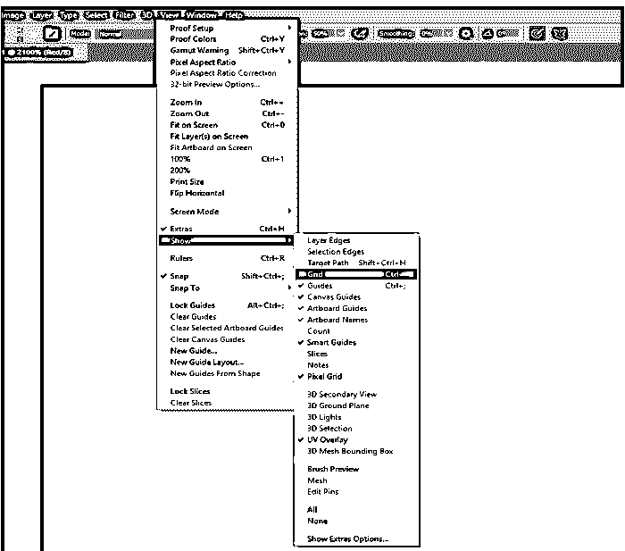

第三步:我们可以看到网格很大，对于像素艺术，我们需要一个小的网格尺寸。

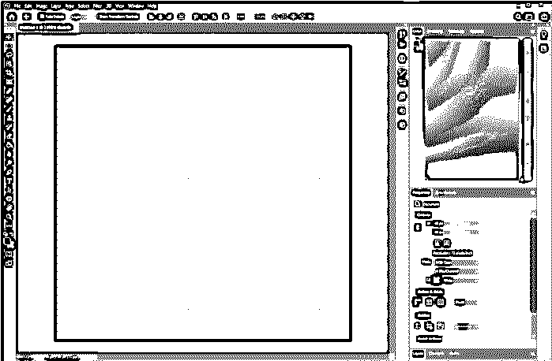

**步骤 4:** 然后从编辑菜单转到指南、网格和切片首选项。

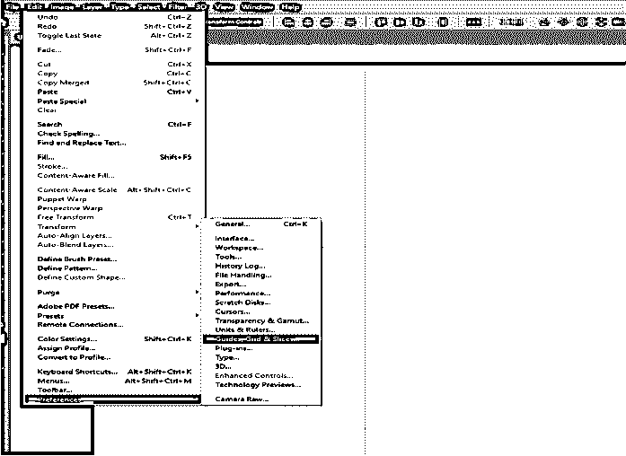

**第五步:**每隔 1 个像素换成网格线，颜色换成浅灰色。

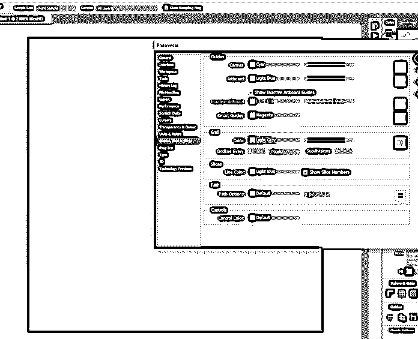

**步骤 6:** 然后在常规部分，将图像插值从双三次自动更改为保留硬边缘的最近邻。

**第七步:**然后新建一层，命名为 Character。

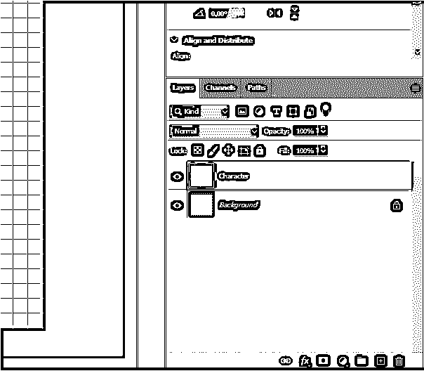

现在是绘画的时候了，当我们使用画笔工具时，我们可以画出像这样的平滑边缘，这是我们在像素艺术中不想要的。

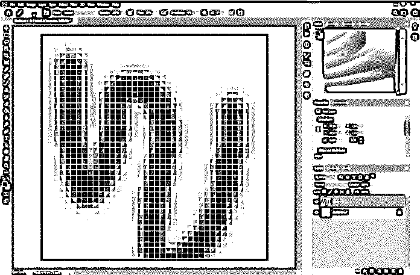

步骤 9: 因此，我们将使用铅笔工具，这样我们就可以得到如图所示的清晰像素。

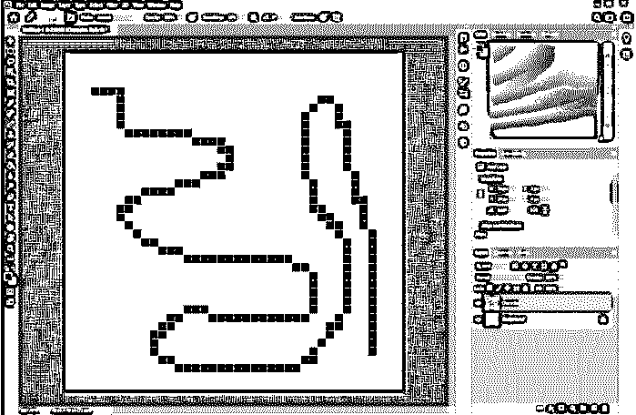

**步骤 10:** 撤销前一步，然后解锁背景，并给它一个名字，然后使用油漆桶工具或按 G 填充灰色的背景。

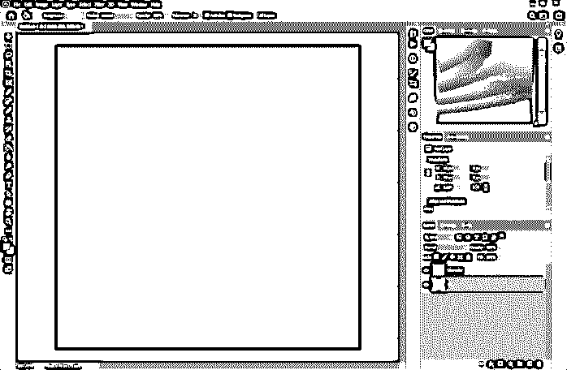

步骤 11: 现在我们要创建一个调色板。我们将创建一个简单的艺术只用三种颜色，即红色，黑色和白色。所以，我们把背景改成了灰色。对于更复杂的调色板，我们可以去 color.adobe.com，那里有很多预置的。此外，我们可以选择一种颜色，它会为我们创建一个调色板。

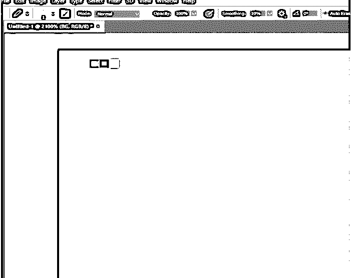

第 12 步:你可以使用吸管工具从调色板中取样颜色并开始绘制。假设如果你犯了一个错误，想使用橡皮擦，那么确保模式是铅笔，将删除像素。

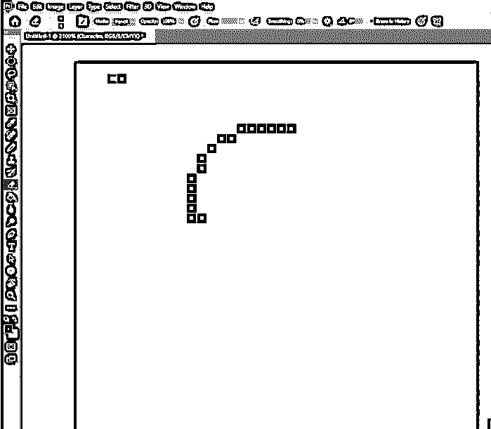

**第 13 步:**正如我们看到的，我们已经创建了一个基本的脸型

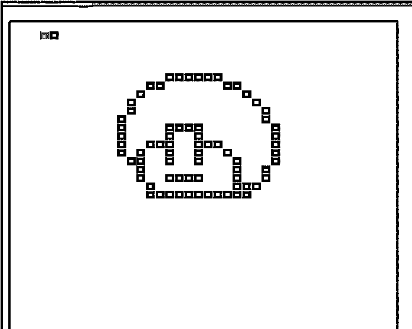

**第 14 步:**如果我们正在创建一个游戏资产，那么艺术品将会以一个小得多的比例被观看，因此为了在绘图的同时预览它，我们可以从窗口- >排列中打开一个新窗口

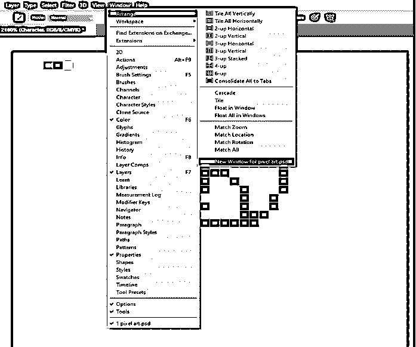

第 15 步:我们可以将窗口移动到任何我们想要的地方，并使用 Ctrl +'关闭网格，以查看输出在游戏引擎中的显示效果。

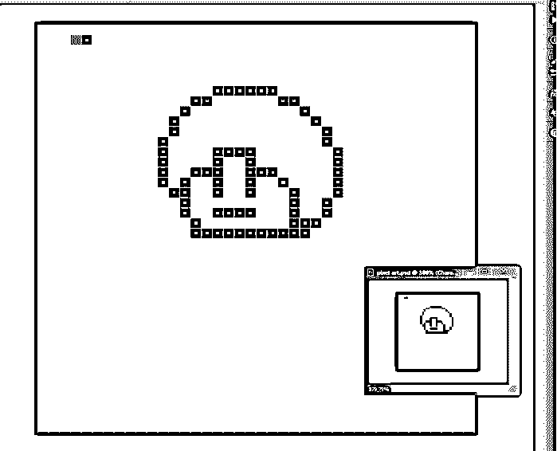

步骤 16: 现在假设我们想用白色像素填充一个区域，我们使用油漆桶工具，然后像素会溢出边界，因为 photoshop 正在使用反走样来平滑像素。

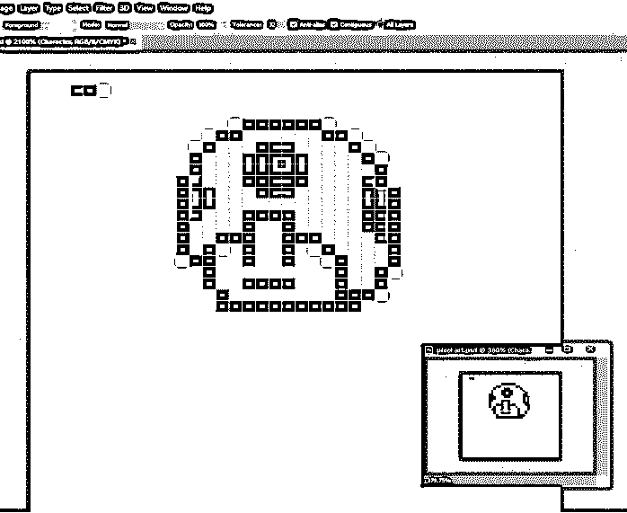

**步骤 17:** 因此，如果我们关闭抗锯齿，那么我们可以在边界内填充。

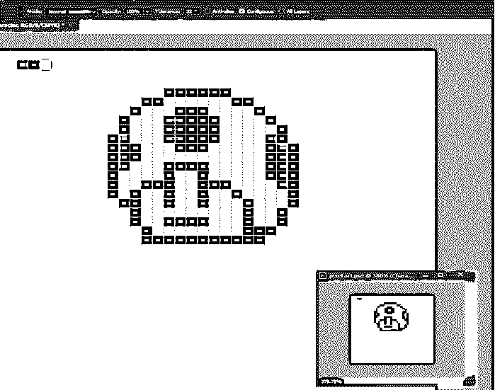

步骤 18: 现在我们可以关闭网格来查看实际的艺术，我们也将关闭像素网格。

**步骤 19:** 然后我们可以从调整面板调整饱和度，选择色调/饱和度。

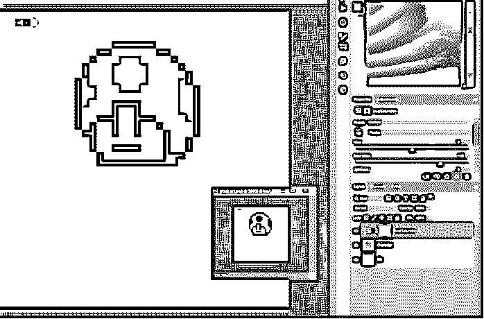

**步骤 20:** 然后右键点击字符图层和调整后合并图层。

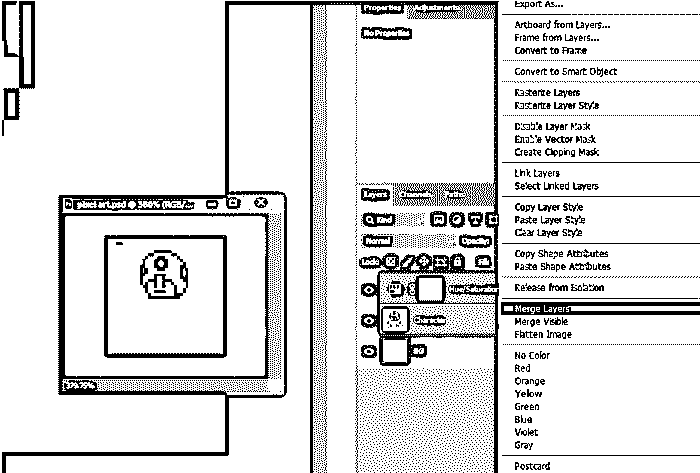

**步骤 21:** 现在，如果我们想在网上分享或送给别人，那么它的尺寸太小了，所以我们需要放大它，但首先我们将裁剪图像以保留必要的部分，并打开网格以帮助裁剪。

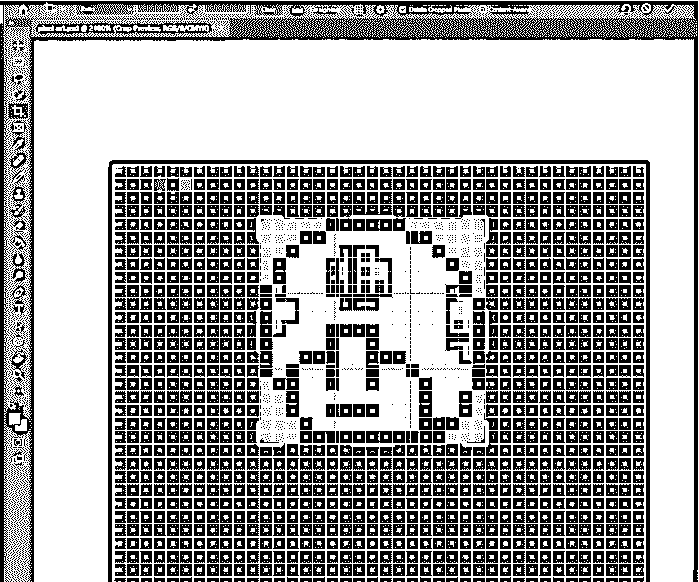

**步骤 22:** 然后从图像菜单转到图像大小或者按 Alt + Ctrl + I。

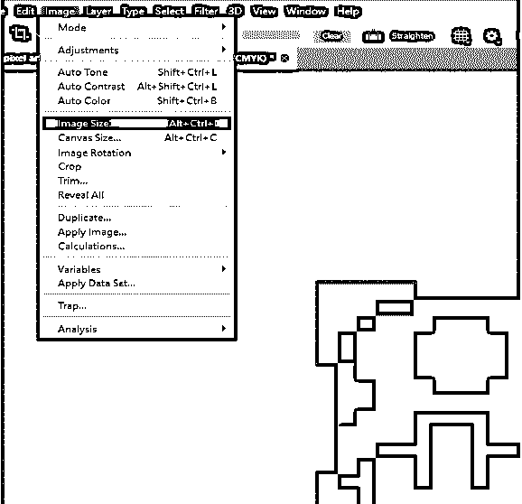

步骤 23: 因此，我们可以设置宽度和高度为 256 像素，并重新采样到最近的邻居，这给了我们硬边。

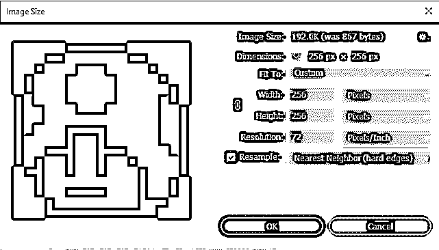

**步骤 24:** 然后按 Ctrl + 1 查看实际大小，这是我们可以通过使用另存为和图像质量到高与他人分享的内容。

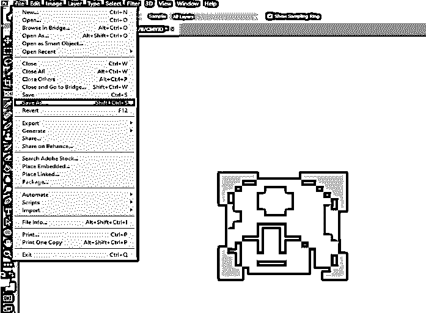

第 25 步:这就是我们最终的像素作品。

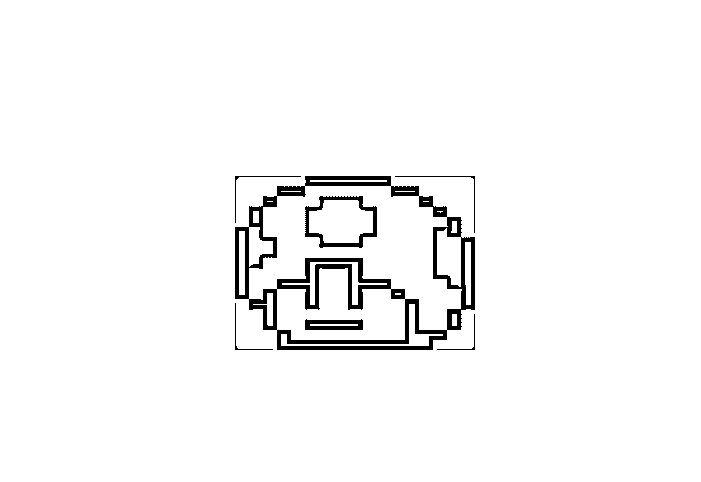

### 结论

在这篇文章中，我们学习了什么是像素艺术。首先，我们开始了创造像素艺术的先决条件，如硬件工具和程序使用。然后，我们在 photoshop 中创建了一个样本像素作品，作为演示用于创建像素艺术的技术的工具。

### 推荐文章

这是一个什么是像素艺术的指南？.在这里，我们讨论的介绍，先决条件，创造像素艺术一样，硬件工具和程序。您也可以看看以下文章，了解更多信息–

1.  [像素效果 Photoshop](https://www.educba.com/pixel-effect-photoshop/)
2.  [复古效果 Photoshop](https://www.educba.com/vintage-effect-photoshop/)
3.  [在特效后发光](https://www.educba.com/glow-in-after-effects/)
4.  [Photoshop 中的半色调](https://www.educba.com/halftone-in-photoshop/)

