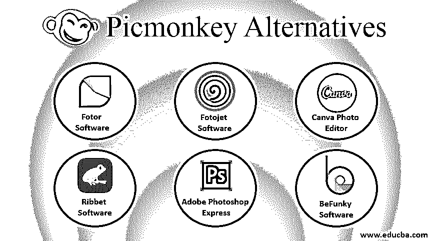

# Picmonkey 替代品

> 原文：<https://www.educba.com/picmonkey-alternative/>

## PicMonkey 有哪些替代品？

PicMonkey 是一款为你提供照片在线编辑和设计工具的软件。您可以在任何互联网浏览器或其官方移动应用程序(即 PicMonkey 移动应用程序)上使用该软件。它于 2012 年 3 月推出，旨在提高照片编辑的在线创作能力。我们有一些 PicMonkey 软件的替代软件。这个软件是 Fotor 软件，Fotojet 软件，BeFunky 软件，Canva 照片编辑软件，Ribbet 软件，以及许多其他软件。在本文中，我们将看到所有这些软件，以便我们可以分析它们来了解 PicMonkey 软件的替代软件。

由于 PicMonkey 不提供免费版本，你可以使用该软件的替代品。因此，让我们继续讨论该软件的替代品:

<small>3D 动画、建模、仿真、游戏开发&其他</small>

### PicMonkey 的最佳替代品

让我们讨论 Picmonkey 的一些最佳替代方案。我们可以替代的第一个替代软件是 Fotor 软件:

#### 1.Fotor 软件

这个软件不是个人用于照片编辑工作的。取而代之的是，它为你提供了一些有助于照片编辑工作的工具，并为你提供了类似于 Picmonkey 软件的工具。该软件提供的工具有设计工具、拼贴制作工具和照片编辑器。照片编辑器用许多令人兴奋的工具和功能帮助你编辑照片。这个软件的加分点在于，它对所有人都是免费的，如果你是初学者，你可以有这个软件用于你的照片编辑工作的学习目的。

这个软件成立于 2012 年，你可以从官网下载的是[www.fotor.com](https://www.fotor.com/)。它会不时地更新新功能。2016 年，HDR 曲线调整被添加到其平台，而 2017 年，自定义纵横比被添加到其拼贴功能中。

#### 2.Fotojet 软件

Fotojet 软件也向所有人提供免费访问，但你必须为使用该软件的一些高级功能付费。这对照片编辑作品的初学者来说也是很好的学习目的，你可以拥有与 PicMonkey 软件相同的功能来进行照片编辑和设计。这个软件允许你编辑你从不同类型的媒体如脸书、你的个人电脑和其他数字媒体平台上拍摄的照片。

#### 3.劣质软件

与上述两个软件一样，PicMoneky 软件的这一替代方案也允许其用户免费订阅，并为他们提供三个主要工具，如照片编辑器、拼贴制作工具和类似于 PicMonkey 软件工具的设计工具，但在使用该软件期间，您必须处理一些广告。您可以通过不同的方式拍摄照片以进行编辑，例如您的个人电脑、脸书、Google Drive 和 DropBox。

这个软件成立于 2007 年 1 月，创始人是泰京·塔塔尔和奥兹西克西拉尔。如果你想下载它，然后去这个链接[www.befunky.com](https://www.befunky.com/)。

#### 4.Canva 照片编辑软件

Canva Photo Editor 也是 PicMonkey 系列中最好的照片编辑软件之一，完全免费。它为您提供了不同的菜单类型，允许您根据自己的用途裁剪照片和调整照片大小。这不是很难的软件；其实非常好用。只需将您的图像放入该软件的编辑器部分，然后使用该软件提供的简单工具开始编辑工作。它还提供了简单的处理过滤器和调整，使我们的工作在这个软件中变得容易。

#### 5.Ribbet 软件

Ribbet 也有一个类似 PicMonkey 的用户界面，你可以使用它的一些创造性工具和功能来编辑不同类型的照片。由于它也是免费软件，你可以享受它的学习工作，并获得专业知识的照片编辑和设计工作，没有任何费用。该软件将许多编辑工具放在您的指尖上，这样编辑照片就成了您的游戏，您可以从您的工作中获得最佳输出。

#### 6.Adobe Photoshop Express

这也是免费的编辑移动软件，由 adobe systems 开发为图像编辑软件。可以安装在 Android、iOS、Windows、跨平台等不同操作系统上。您可以从 Adobe Photoshop Express 网站下载该软件。它于 2016 年推出，允许你在智能手机或平板电脑上编辑你的图像。有了这个软件，你可以探索你的想法，创造一个不同类型的自然编辑作品。

#### 7.Pixlr Express 软件

该软件取代了 PicMonkey 软件，因为它也提供了与 PicMonkey 相同的功能。该软件有两个版本，如普通版和快速版。速成版是 PicMonkey 软件的最佳替代品。您可以在这个软件中拥有免费和高级的设施，并享受这个软件令人兴奋的功能。一旦你开始使用这个软件，你会发现这个软件的快速版比普通版要好。这个软件还提供了[裁剪工具](https://www.educba.com/crop-tool-in-photoshop/)，调整大小工具，以及许多其他重要的编辑工具，这些工具与 PicMonkey 软件的工具最为相似。

所有上述软件都是 PicMonkey 软件的重要和主要替代软件，它允许您使用 PicMonkey 软件为您提供的类似照片编辑功能。

### 结论

在这篇文章之后，为你的照片编辑和设计选择一个最好的 PicMonkey 软件对你来说是一件容易的事情。一旦你选择了其中最好的一个，你就可以成为处理与照片编辑工作相关的工具的专家。

### 推荐文章

这是 Picmonkey 替代方案的指南。在这里，我们讨论了照片编辑和设计的 Picmonkey 的 7 大替代方案的基本概念。您也可以浏览我们的其他相关文章，了解更多信息——

1.  [Inkscape 替代|流行替代软件](https://www.educba.com/inkscape-alternative/)
2.  【Adobe Lightroom 的最佳替代品
3.  RabbitMQ 有哪些替代方案？
4.  [QlikView 替代品&同类软件](https://www.educba.com/qlikview-alternatives/)

