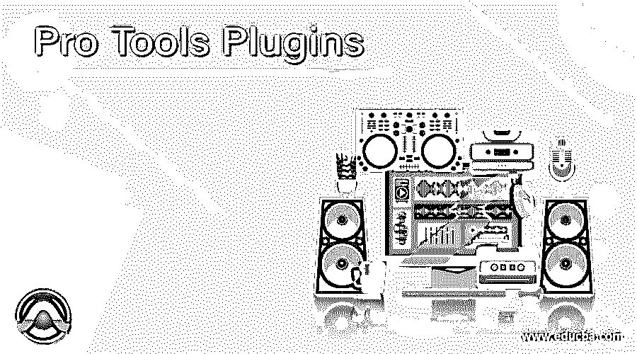

# 专业工具插件

> 原文：<https://www.educba.com/pro-tools-plugins/>

## Pro Tools 插件简介

Pro tools 插件可以理解为与 pro tools 一起使用的附加软件程序，用于增强其工作能力，并使其能够执行不同类型的任务，这些任务在设计时并不包括在内。它提供了两种类型的插件，这意味着你可以免费下载它的插件，一种是免费使用，另一种是付费下载。这两种类型的插件有不同的功能和能力，在这个软件中做一个特定的任务。

### 不同的 Pro Tools 插件

这里我们将介绍一些重要的 pro 工具的免费插件，你可以很容易地使用它们来提高你的项目工作效率。

<small>3D 动画、建模、仿真、游戏开发&其他</small>

#### 1.a1 立体控制

*   这个插件由 Alex Hilton 提供，他是它的供应商，你可以从 www.alexhiltor 免费下载它，它具有所有高级功能。
*   它用于通过仅使用一个信号来扩展或限制轨道的立体声宽度，这使得管理立体声宽度的限制变得容易，而不是以传统方式进行。
*   您可以根据项目的要求或项目的复杂程度，在混音过程中在单个轨道或轨道组上，或者在主总线的最终母带制作解决方案上使用这种强大的技术。
*   它集成了所有低音频率的安全低音算法中心，并且该低音算法低于立体声场中央的可调值。
*   如果你想保持最大的透明度和清晰度，那么它提供了坚实和清晰的平滑运作的目的。

#### 2.充足的打击乐器 Cloudrum V1.01

*   它是一种乐器类型的插件，供应商是 Amplesound。他们发布了 AAX 格式的版本，你可以从 www.amplesound.net 下载，也可以从这里获得其他相关的细节和更新。
*   这是一种放松的钢舌鼓，有 3 个八度音域，产生有效的音调，为它们增添色彩，并为音乐增添独特的温和性，而不考虑流派。
*   大小是 760 MB，44.1 kHz，用这个软件可以轻松使用。
*   它为具有立体声和单声道模式的麦克风提供了两个位置，以便在其中做出不同的变化。
*   CPC 也是它的功能之一，CPC 代表自定义参数控制。它使用 MIDI CC 或自动化来控制项目工作的任何控制器。
*   双差采样可以在 L 和 R 通道进行，而不会遇到任何问题。
*   为了提高人性化，它分离了每个音符的循环以及力度层。

#### 3.吉他装置 6 播放器

*   这是一个 AAX 格式和工具类型的插件，由 Native Instruments 作为一个可扩展的效果引擎推出。你可以访问 www.native.instruments.com/en/products/komprig-6-player/上的[来获得这个插件以及其他相关的更新。](https://www.native-instruments.com/en/)
*   它有一个匹配的音箱放大器模拟，50 种不同类型的现成可用的预置，以及 13 种效果。
*   它包括在 KOMPLETE START 包中，该包有 2000 个声音和 6 GB 内容的免费捆绑包。
*   它基于一个非常强大的吉他钻机 6 专业版，提供了一个简单易用的用户界面，有很多专业组件，使这个软件更加用户友好。
*   MIDI 和自动化工具也与它集成，这简化了工作流程。它有一系列的辅助工具，如节拍器，两个磁带走带设备，有助于在我们工作期间轻松录制和播放。

#### 4.4U 系列

*   这是霍拉工作室的插件，是 AAX 和 RTAS 的格式。你可以把它看作一个特效插件，要下载它，请访问[www.hofa-plugins.de/en/plugins/4u/](http://www.hofa-plugins.de/en/plugins/4u/)。你也可以从这个网站获得不同类型的更新信息。
*   它用于通过仅使用一个旋钮而不使用其他额外输入或工具来实现低频和高频的完美平衡。
*   它具有可变倾斜宽度功能，有助于正确管理宽度。
*   分别处理低音和高音，以便以平滑的方式完成与此功能相关的工作，而不会失去原有的工作质量。
*   它为低切和高切提供了具有许多可调参数的附加滤波器。
*   立体声、中、侧、左和右处理的例程可以通过该插入单独执行，而不会干扰其他相关内容。
*   在有效输出的情况下，过采样可以达到 32 倍。

#### 5.Bitscope 苦

*   它是插件的 AAX 格式，它的供应商是 Stillwell，它作为一个效果插件推出，以增加 Pro tools 中特定类型的效果，并提供可调参数，以便根据工作的需要进行更改。
*   它显示一个音频信号使用了多少位，包括样本的削波，报告每个执行的步骤，以及数模转换过程中样本间削波的估计原因。
*   你可以在 Stillwell 的官方网站上下载，它是[www.stillwellaudio.com](https://www.stillwellaudio.com/)。你可以免费拥有它的所有附加功能。在这里你也会及时得到更新。
*   它还显示音频采样速率，并揭示数字信号的比特率。您可以在 Bitter 显示屏上移动鼠标光标，以查看音频流采样速率。

这些是 Pro tools 的一些重要的免费插件，你可以用来增强这个软件的功能。你也可以根据你工作的最终结果的要求，使用付费插件。

### 结论

现在你对 Pro tools 的插件有了很好的了解，并且知道插件如何增加它们的工作能力。你可以使用上面讨论的插件，将它们与专业工具一起使用，完成不同类型的相关任务。你也可以搜索更多的免费插件，因为市场上有很多免费插件，有很多好的特性。

### 推荐文章

这是一个专业工具插件指南。在这里，我们讨论了介绍和不同的专业工具插件，以便更好地理解。您也可以看看以下文章，了解更多信息–

1.  [3ds Max 插件](https://www.educba.com/3ds-max-plugins/)
2.  [Photoshop 中的插件](https://www.educba.com/plugins-in-photoshop/)
3.  [3ds Max 工具](https://www.educba.com/3ds-max-tools/)
4.  [ZBrush 插件](https://www.educba.com/zbrush-plugins/)

