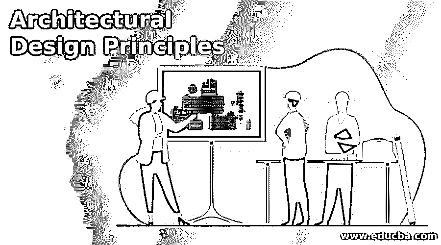

# 建筑设计原则

> 原文：<https://www.educba.com/architectural-design-principles/>

## 建筑设计原理导论

架构设计原则是为架构工作进行设计并在软件中使用它们来获得期望结果的基本规则。基于特定模式的建筑设计软件的原则，通过遵循这些原则，设计者可以轻松地完成大量的设计工作，如果遵循建筑设计原则，编程专家可以根据他们的要求调整该软件的工作空间。Rhino 3d，Skectup，Revit Architecture，Auto CAD 都是一些建筑设计软件，你可以用建筑设计原理来获取更多关于这个术语的知识。

### 建筑设计原则列表

在开始建筑领域的设计之前，你必须了解它的原理，以准确的方式做你的设计工作，并得到最适合你的项目工作的结果。

<small>3D 动画、建模、仿真、游戏开发&其他</small>

#### 1.为改变而建造，而不是为持久而建造

在开发任何建筑结构的想法时，你必须记住一些要点，即你的设计应该具有灵活性，能够适应不断变化的时间，面对挑战和那个时代的要求，从而减少失败的可能性。

#### 2.风险管理和模型分析

对于设计，使用适当的工具，并根据现实世界将其可视化，以了解设计中出现的风险以及如何消除风险。一旦你准备好了你的模型，在进行最终设计之前，从不同的方面对它进行适当的分析，以获得一个无故障的结果，同时将风险可能性降到最低。

#### 3.通过沟通和协作方法使用模型和可视化进行评审

当您设计任何模型时，都需要来自不同利益相关者的评审，以获得他们对您的设计的观点，并获得关于您的设计中需要做哪些更改以降低失败概率的知识。所以沟通和协作是帮助你在不同平台上向利益相关者展示你的设计并得到他们的评论的方法。

#### 4.关注点分离

在任何建筑项目的设计过程中，系统中总是有许多组件，因此必须在这些组件之间进行适当的分离，以便不会有那些组件的重叠。由于适当安排，该系统将得到顺利维护。

#### 5.单一责任原则

系统的不同组件或模块必须以这种方式进行设计，以便它们清楚地显示出它们在任何单独的建筑项目的设计中的重要性，并且人们可以容易地理解它对于正确处理该组件的模型的责任。这些分离还将每个组件与其他组件集成在一起。

#### 6.最少知识原则

我们的设计中有许多组件，因此任何组件或对象都不能有其他组件的过多细节，因为这可能会由于相互依赖而给系统的正确维护带来问题。

#### 7.最大限度地减少前期大型设计

在任何项目的设计过程中，设计随着项目的每一个主要步骤而变得庞大，但是在开始时要尽量避免任何项目的庞大设计，因为在进行最终设计时，可能需要对该设计的每一个组成部分进行多种类型的更改，这可能会在该设计的项目处理中产生问题。

#### 8.不重复设计组件的功能

每个设计组件应该用不同的代码标识，这样它们的功能就不会相互重叠；如果发生这种情况，那么在设计中进行更改时，清晰度会降低。所以你应该记住这一点。

#### 9.通过逻辑层对组件进行识别和分组

设计中的每个组件都必须有正确的标识，以便可以轻松地识别任何工作时间，并且您应该在逻辑层中为相关组件安排一个组，以便用户可以理解它们所构成的结构，并且不同组件可以有单独的分组。

#### 10.明确定义各层之间的通信协议

组件的各个层必须有一个良好建立的通信路径，这样就可以很容易地为场景和生产环境收集知识。

#### 11.定义图层的数据格式

我们的设计中有许多包含大量数据的组件，因此每层都应该有良好的数据格式，这样设计的处理和实施对我们来说就变得非常容易。

这些是设计师在开始设计建筑项目之前必须知道的一些建筑设计原则。在本文的每一步中，您可能会在相同的关注点获得大量信息。

### 结论

所以这是一个关于建筑设计原则的讨论，我们看到了我们应该做什么来获得一个无风险和有效的建筑设计项目。你可以更深入地分析这些原则，这样你就可以更清楚地确定它的关键原则。

### 推荐文章

这是一本建筑设计原则指南。这里我们讨论架构设计原则的介绍和列表。您也可以看看以下文章，了解更多信息–

1.  [3ds Max 替代品](https://www.educba.com/3ds-max-alternatives/)
2.  [软件维护类型](https://www.educba.com/software-maintenance-types/)
3.  [软件配置管理工具](https://www.educba.com/software-configuration-management-tools/)
4.  [GIS 软件](https://www.educba.com/gis-software/)

