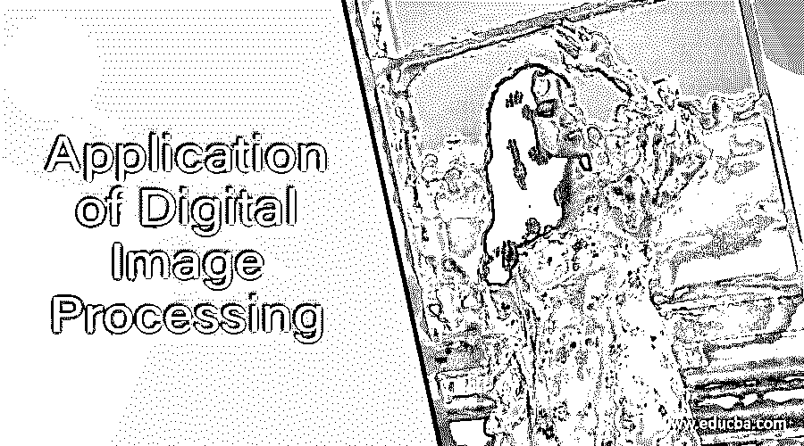

# 数字图像处理的应用

> 原文：<https://www.educba.com/application-of-digital-image-processing/>

## 数字图像处理应用导论

应用数字图像处理可以理解袖手旁观的这一点，即数字图像已经对那些领域和领域产生了影响，并对那些部门、领域或领域变得越来越有用。我们有广泛的领域，数字图像有其良好的影响，换句话说，你可以在几乎每个部门找到它，这意味着数字图像的处理并没有结束于提高图像质量或操纵它，而不是它有更多的工作。今天，我们将讨论数字图像处理的一些主要应用，并对其有深入的了解。

但在开始讨论数字图像处理的应用之前，让我们先快速了解一下什么是数字图像处理？数字图像处理包括在有限的范围内在二维上改变图像的大小，或者换句话说，你可以通过对图像(图像的一个元素)的像素进行不同的排列来增强图像的属性。我想现在你有一个想法，我们可以使用数字图像处理，所以让我们好好讨论一下，让我们更好地了解这个话题。

<small>3D 动画、建模、仿真、游戏开发&其他</small>

### 数字图像处理的主要应用

我们有许多数字图像处理的应用，但在这篇文章中，我们将通过一些主要的应用。第一个应用是分析电磁波谱中除可见光线以外的光线。

#### 在分析肉眼看不到的电磁波谱射线时

在解释数字图像处理的这一应用之前，我们必须先了解一下我们在电磁波谱中做了些什么？它有不同类型的可见光数据，有七种颜色，如紫色、靛蓝色、蓝色、绿色、橙色、黄色和红色。在这个序列中，我们用一个术语(VIBGOYR)来表示光谱上的这些颜色，但我们有一些不可见的射线，如 x 射线、伽马射线和其他一些射线。这些射线是肉眼看不到的，但被相机捕捉到，所以通过数字图像处理，我们也可以对这些射线进行分析。

对这些射线的分析很重要，因为我们在不同类型的医学诊断中使用 x 射线，这与我们在核医学和天文观测中使用γ射线的目的是一样的。数字图像处理的下一个重要应用是图像的锐化和恢复。

#### 在锐化和修复中

在这个应用程序中，我们可以像在 Photoshop(一种图像编辑软件)中一样，通过做一些改变来增强图像属性。我们可以根据我们的要求去除模糊或添加模糊，校正图像的色调，颜色转换和更多的图像处理工作。我们列举的下一个重要应用是“遥感”。让我们看看是什么？

#### 在遥感领域

在我们地球上的任何灾难中，卫星从远距离扫描我们的地球表面，以分析损失和收集地球表面的其他重要数据。我们使用遥感技术，通过数字图像处理可以很容易地获得地球表面或数据收集对象的几乎清晰的图像。下一个应用是传输和编码领域。

#### 在图像传输和编码中

我们习惯于在几秒钟内观看大量的直播视频，由于高质量的数字图像处理，这种传输成为可能。数字图像处理也有助于对高或低带宽图像进行编码，以便在互联网或其他数字作品上进行流式传输。让我们转向下一个应用，即机器或机器人的视觉。

#### 机器/机器人视觉

机器人和一些机器在许多方面帮助我们提高我们的日常活动，但在这些计算机化和程序化系统的扫描和视觉方面出现了一些问题。因此，数字图像处理通过对其进行不同的处理，日益增强这些机器和机器人的视觉能力。我们的下一个应用是了解机器人或任何编程系统中的任何障碍。

#### 在探测障碍物时

通过图像处理，我们可以轻松地扫描以某种方式出现的物体以及该物体的距离，以获得该物体的正确位置。这种探测由机器人和一些计算机引导的设备来完成。接下来是机器人的明确指导方针。

#### 在机器人路径的正确跟踪中

机器人的工作依赖于其中的程序输入，有些机器人设计成在重复路径上工作，因此图像处理有助于跟踪机器人的正确路径并提高它们的工作质量。接下来是色彩处理。

#### 图像颜色的处理

在这个过程中，我们可以在传输、存储和编码过程中借助数字图像处理对图像的颜色进行编码。它适用于与数字平台兼容的不同颜色，如 RGB、HSV 和其他一些颜色。接下来是视频处理。

#### 在视频处理和传输中

视频是一组有序的图像，它们在几秒钟内快速变化，并使这些图像运动起来。使用数字图像处理，我们可以在视频图像移动期间保持从一帧到另一帧的色彩转换，可以在处理期间保持噪声，以及许多其他类似的工作，以获得良好的结果质量。接下来是模式识别。

#### 在模式识别中

当今世界的一切都变得数字化和充满人工智能，人工智能有不同类型的图案设计，可以很容易地通过图像处理来确定。

### 结论

现在，在这篇文章之后，我们可以说，我们对数字图像处理在不同数字平台中的影响有了很好的了解，并且我们也可以通过分析数字图像处理的基础来使它对我们的个人工作有用。你可以阅读我们的“数字图像处理基础”文章，了解更多这方面的知识。

### 推荐文章

这是数字图像处理应用指南。在这里，我们也讨论了数字图像处理的介绍和主要应用以及解释。您也可以看看以下文章，了解更多信息–

1.  [数字图像处理](https://www.educba.com/digital-image-processing/)
2.  [多线程 vs 多重处理](https://www.educba.com/multithreading-vs-multiprocessing/)
3.  [数字电路](https://www.educba.com/digital-circuit/)
4.  [什么是数字图像？](https://www.educba.com/what-is-digital-image/)

