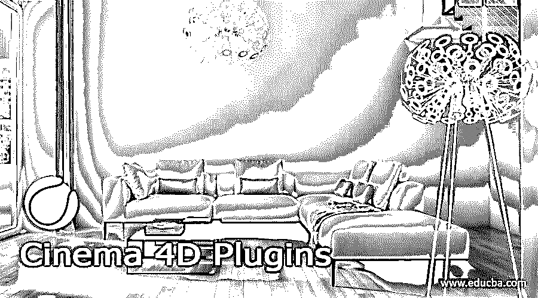

# 4D 电影院插件

> 原文：<https://www.educba.com/cinema-4d-plugins/>

## 4D 影院插件简介

Cinema 4d 插件可以理解为用于增强 Cinema 4d 功能的附加软件。换句话说，你可以说，通过使用 Cinema 4d 的其他软件，我们可以提高在 Cinema 4d 中进行的任何项目的 3d 建模质量，这种类型的软件可以调用它的插件。该插件可以是任何类型的软件，可以创建特定的模型，添加不同类型的效果，在不同的 3d 建模任务中提供平滑度。我会告诉你这个软件的一些流行插件和它们的特点。

### 流行影院 4D 插件

如果你去搜索的话，你可以在市场上找到很多 Cinema 4d 的插件，但今天会告诉你一些最常用的插件，这些是 Trypogen，X 粒子，TurbulenceFD，Light Kit Pro 3.0 等等。所以让我们逐一讨论。

<small>3D 动画、建模、仿真、游戏开发&其他</small>

#### 1.x 粒子

*   这是一个惊人的插件，通过使用它的一些标准功能来创建粒子效果和 VFX。通过使用这个插件，设计师可以在统一系统的帮助下在运动图形和 VFX 之间切换。
*   如果你想买它，那么你可以支付 799 美元。
*   它可以为不同类型的对象(如烟、火、布料和流体)创建刺激。你可以很容易地在 4D 影院中整合这些对象。
*   不仅是 VFX，它还可以创建抽象艺术品的医学可视化，全息图像，太阳系可视化，等等。它提供了多个选项，通过这些选项，我们可以组合发射器和修改器，这为我们提供了广泛的可能性。
*   您可以将它的 ExplosiaFX 导出为 VDB 体，这些渲染引擎可以读取 VDB 体数据。
*   通过使用它的液体和颗粒解算器，我们可以创建大规模和小规模的流体模拟，例如，我们可以创建美丽的海滩，海浪，还可以添加其他美丽的产品。
*   参观铟。ltd 获得了关于这个插件的更多细节。

#### 2.湍流 f

*   它是基于体素流体动力学模拟软件，通过使用该技术的不同类型的可调参数来产生烟和火。
*   它用于不同的领域，如电影、电视节目、视频游戏宣传片和其他多媒体平台。
*   它提供了不同类型的软件包，如果你想购买它，如单个用户，教育目的，以及其他一些。对于单个用户，你必须支付 489 美元，这个包包括一个永久许可证，维护更新，无限数量的渲染节点，这对 4D 电影院软件的未来更新仍然有效。
*   它提供了许多功能供他们使用，如高达 12 倍的 GPU 加速，一个基于物理的火焰着色器，多重散射也可以用它来做，曲线编辑着色，等等。
*   你可以有一个视频教程的一些任务，它可以创建或执行其官方网站是 jawset.com。

#### 3.轻型套件 Pro 3.0

*   它为不同类型的项目提供完全定制和可调的照明解决方案。它提供了许多灯、软盒、和面板。
*   它为用户提供 7 种类型的工作室灯，如软箱，伞，基诺 Flo，环，面板，或环境，LED 环，照明选项。
*   它提供了易于使用的系统，包括 120 个工作室介绍，还内置了对渲染器 Octane，Redshift 和 Arnold 的支持。
*   你将有 9 个不同的 cyc 对象，可以快速设置工作室，并且都可以根据项目最终结果的要求进行定制。
*   它允许您创建自己的工作室，并保存它们的自定义设置，这样您就可以根据您的要求反复使用它们，或者您也可以使用 Light Kit 浏览器浏览 120 个附带的工作室。
*   它与 4D 影院 R20+兼容，单个用户的文件大小为 500 MB。关于这个插件的更多细节，你可以访问 greyscalegorilla.com

#### 4.硝基胚

*   这是一个非常令人兴奋的工具，它可以自动粉碎物体，并使你能够借助 4D 电影公司的动力学将它们粉碎。
*   它支持在一个物体上使用多个碰撞器时的多重破碎，深度破碎意味着当你将任何物体破碎成许多碎片，然后它们在与另一个物体碰撞时自行破碎，翻转物体是它的另一个功能，它可以通过三种模式破碎它们来翻转原始物体。
*   您可以控制动态触发器将阶段更改为动态。
*   它提供了“烘焙法线”功能，可以在断开后从对象表面移除任何可见的伪像。
*   应用内部和外部材料到物体也可以用这个插件。使用亚多边形置换材料产生内表面。这不仅可以，而且更现实的切割也可以很容易地在它不平坦。
*   硝爆弹是它的一个附加工具，可以用来从弹着点自动击碎并引爆一个物体。它还可以对已经粉碎的物体进行毫不费力的爆炸。

#### 5.滚动变形器

*   它被设计为给不同的物体以滚动或扭曲的效果，例如创造卷纸的效果、地毯般的效果等等。
*   它与 Mac 和 Microsoft Windows 用户的 Cinema 4D R15 至 R21 兼容。
*   它提供了图层效果，可以控制变形器的脱落标签，以及我们在 4D 电影院创建的 Mograph 效果，以及它的许多其他功能。
*   你可以参观这只好奇的动物。关于这个插件的其他细节，也可以从这里下载。

现在 4D 电影外挂对你来说将不再是一个陌生的词。

### 结论

这些是 4D 电影院最重要和最常用的插件，我已经告诉你上面讨论的插件的所有特征。现在你可以有一个与 4D 电影院相关的问题的解决方案，并使用这些插件来增强与 4D 电影院相关的项目的任何任务的影响。

### 推荐文章

这是一个 4D 电影插件指南。在这里，我们还讨论了介绍和流行的影院 4d 插件及其特点。您也可以看看以下文章，了解更多信息–

1.  [Golang 并发](https://www.educba.com/golang-concurrency/)
2.  [货币对货币](https://www.educba.com/money-vs-currency/)
3.  [投资货币](https://www.educba.com/investing-in-currency/)
4.  [资产账户](https://www.educba.com/asset-account/)

