# Godot tilemap

> 原文：<https://www.educba.com/godot-tilemap/>

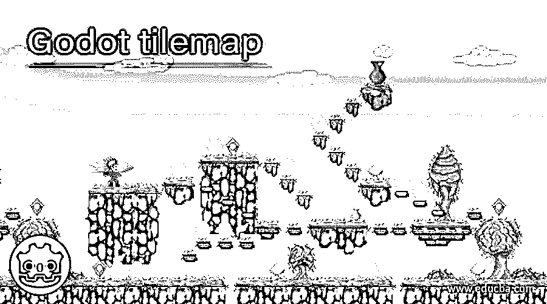

## Godot tilemap 简介

Godot 引擎中的 Tilemap 用于制作在 Godot 引擎中设计的任何游戏的布局或背景对象。为了创建该游戏的布局，您可以使用 tilemap 形式的许多图案、阴影和其他类型的背景对象。使用 tilemap，您可以比传统方式更快地创建节点，因为 tilemap 在网格上工作，这有助于在很大程度上非常快速地创建节点，以制作游戏布局。在 tilemap 中，您将拥有一些选项卡形式的选项，如碰撞、遮挡和导航，通过使用这些选项卡，您可以为 tilemap 功能添加更多功能。

在对 Godot 引擎的 tilemap 的介绍进行了精彩的讨论之后，你在想我们为什么要使用 tilemap？因此，让我们来回答你的问题，因为你可以通过阅读 eduCBA 文章来清除你心中的疑问，所以请与我们一起寻找快速而独特的解决方案。

<small>3D 动画、建模、仿真、游戏开发&其他</small>

### 为什么我们在戈多需要 TileMap？

与通过逐个放置节点的点来绘制节点相比，使用 tilemap 创建不同形状的节点变得容易。使用 tilemap 时，默认情况下会创建方形图块，但它也为您提供了为等轴测图块选择基于透视的等轴测模式的选项，或者您也可以通过使用 tilemap 的其他一些参数来创建自定义图块形状。使用 tilemap 还有一个好处，因为它还具有一些功能，通过这些功能可以更改单元格的大小，从而定义 tilemap 的行为。

现在让我们转到本文非常有趣的部分，在这一部分，我们将讨论如何在 Godot 引擎中使用 tilemap。

### 如何在 Godot 中使用 TileMap？

现在我们将一步一步地理解它。因此，首先单击“新建项目”按钮创建一个新项目。您可以在之前创建的项目上执行此操作。

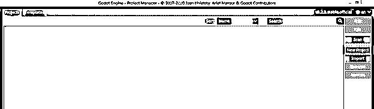

现在根据你的情况给它命名，并选择一个你想保存它的位置。要保存它的文件夹必须是空的。

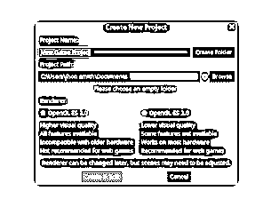

完成所有步骤后，您将看到这个屏幕。这是一个 3D 透视窗口屏幕。点击“2D 场景”按钮，该按钮位于 2D 窗口屏幕窗口的左侧。

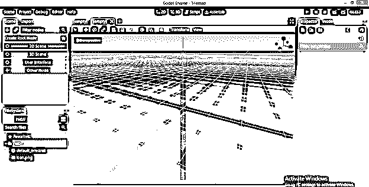

现在点击这个添加注释按钮来添加一个 2D 节点。

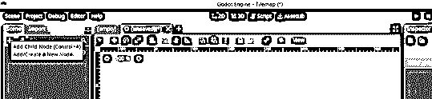

从这里选择 Node2D 选项，然后单击“创建”按钮。

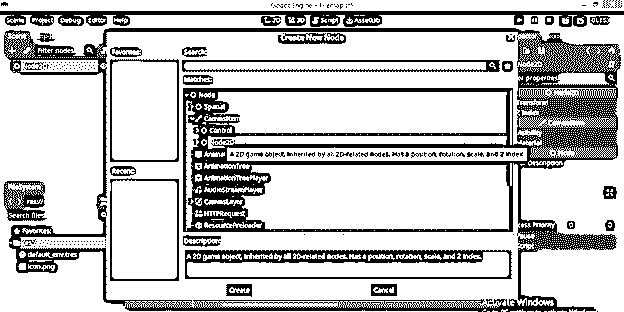

将其命名为 Scence1。

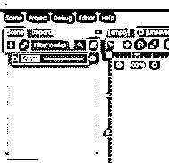

再次单击添加节点符号并在搜索框中搜索 tilemap，然后单击 TileMap 选项。

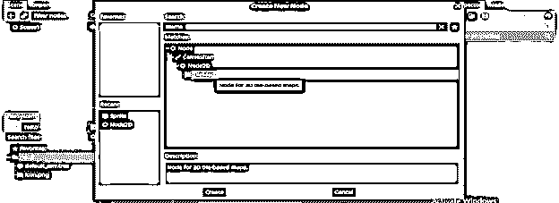

现在点击 Tilemap，你会在 2D 窗口屏幕的右侧看到 TileMap 属性面板。

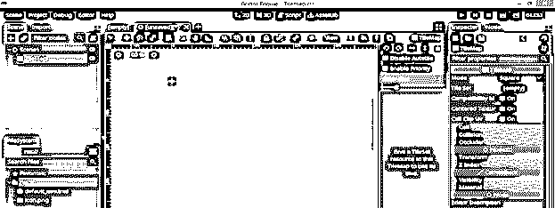

在属性面板中，点击这个面板的平铺设置选项的向下箭头键，并选择下拉列表中的“新建平铺设置”选项。选择之后，点击新的 TileSet 选项。

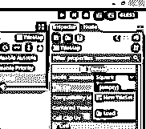

现在你将有这种类型的编辑窗口下面的 2D 窗口。

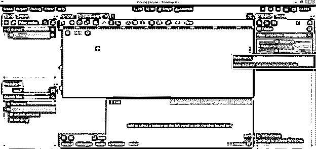

按键盘上的 Shift + F12 键，全屏显示该窗口。

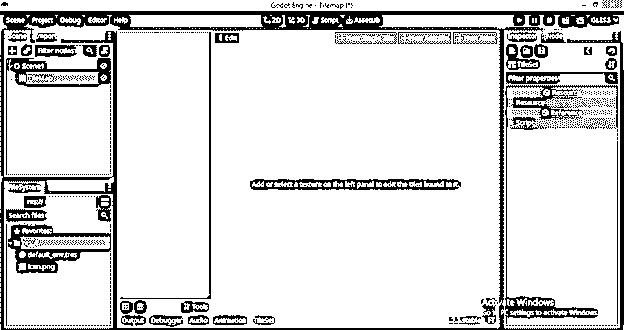

在这个编辑窗口的左下角，我们有一个为这个 TileSet 添加纹理的按钮。所以点击它。

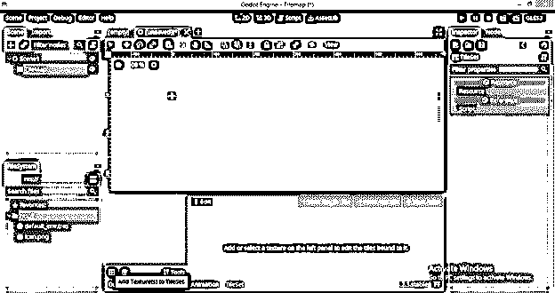

您可以从想要制作 tilemap 的导入文件夹中获取游戏布局的 png 或 jpg 文件。

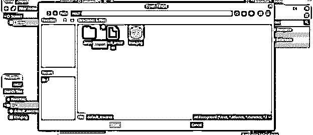

或者你可以直接将你想要的文件拖放到这个软件中。

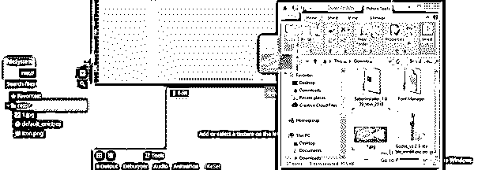

我们导入的文件将出现在添加纹理对话框中。我将选择它，并单击此对话框的“打开”按钮。

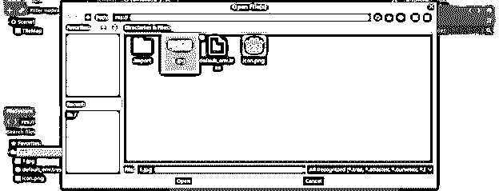

我们将在 tilemap 窗口中显示该文件。

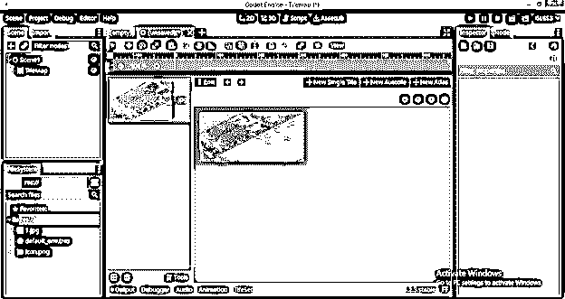

现在创建一个单幅图块地图，如果你想创建单幅图块图案，点击这个框的“新建单幅图块”按钮。

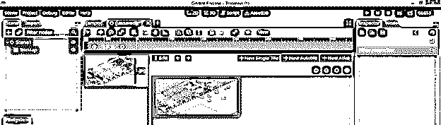

单击后，您可以通过按住鼠标左键来拖动鼠标，以选择此图像上的一个区域。

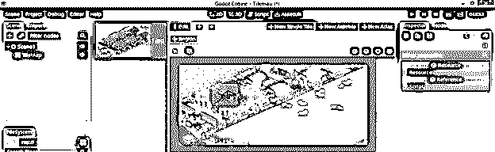

如果您想要在此图像上显示一个网格以便正确选择，那么您可以通过单击它来启用“显示网格”按钮，单击后，您将在工作区看到这种类型的网格。

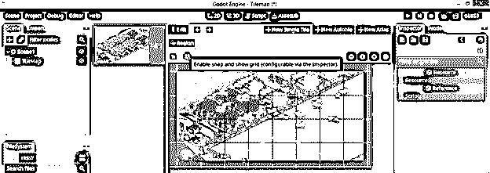

现在选择将一个接一个地移动这个网格，这是为创建 tilemap 做出正确选择的好方法。

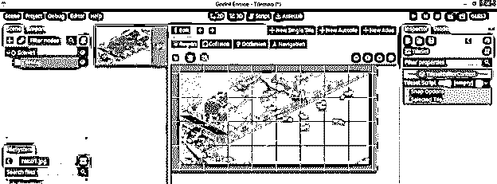

通过从 TileSet 的“属性”面板的“捕捉选项”选项卡中更改块的 x，y 值，可以减小网格块的面积。

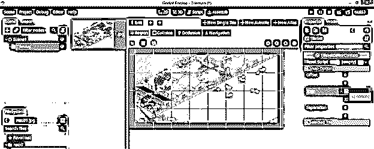

当您拖动鼠标选择图像上的一个区域时，那么该选择具有网格中的多个选定块，那么这个大的选择可以被认为是一个单元。您还可以调整单元格大小。

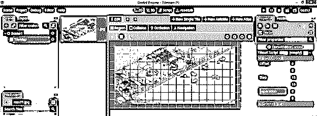

我们在这里有其他形状而不是正方形选择，如碰撞模式，遮挡模式和导航模式，它们为选择图像的复杂形状提供了不同的形状。

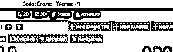

让我们来理解其中的一个，因为这三个都是以同样的方式工作的。点击碰撞模式，然后点击“创建新矩形”按钮。

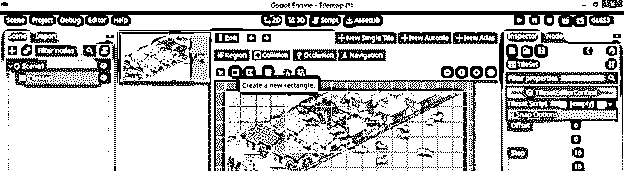

如果您单击该区域，您将在所选区域中拥有节点。节点来自矩形。你可以根据你来调整这些模式。

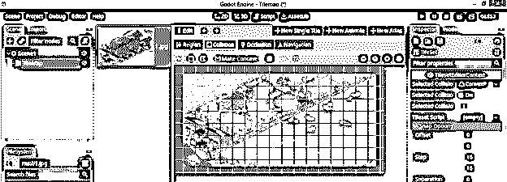

接下来是“创建一个新的多边形”，这意味着它给你更多的自由来使用选定区域的节点。

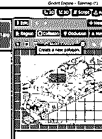

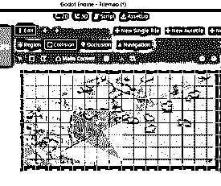

现在根据你的选择做一个选择。

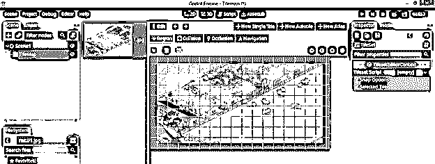

转到 TileMap，然后通过单击并拖动 tileset，将其从该窗口左侧的 TileMap 选项卡中拖动到 Scene1。

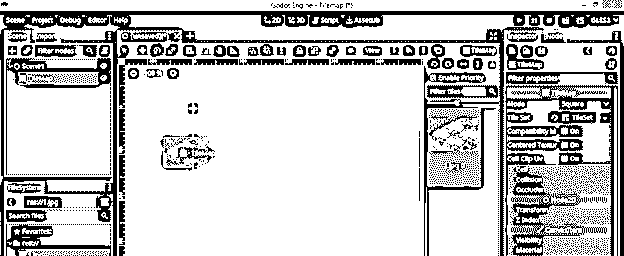

你可以把它放在场景中任何你想放的地方。

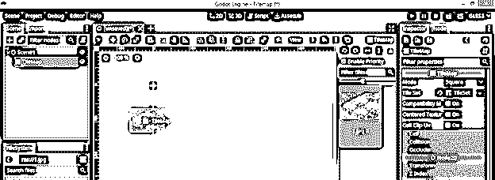

你可以多次点击这样的瓷砖数量。

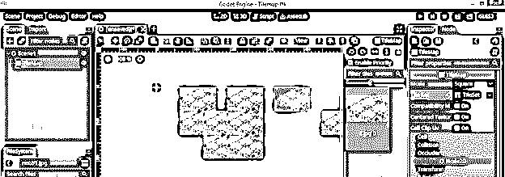

在 Godot 中有更多关于 TileMap 的信息，你必须知道这些信息，以便对 TileMap 的使用有更多的了解。这只是一个概述，让你了解我们如何使用 TileMap？

### 结论

我相信通过 eduCBA 学习 Godot 的 TileMap 是很有趣的，现在你可以开始在 Godot 中使用 TileMap 来为你的 2D 游戏布局添加越来越多的纹理。去分析它的所有其他参数，好好享受你的工作。

### 推荐文章

这是一个指南戈多 tilemap。在这里，我们讨论为什么我们需要它，以及如何在 Godot 和工作中使用 TileMap。您也可以看看以下文章，了解更多信息–

1.  [Java 中的 2D 图形](https://www.educba.com/2d-graphics-in-java/)
2.  [2D 特效动画后](https://www.educba.com/2d-after-effects-animation/)
3.  [2D 动画软件](https://www.educba.com/2d-animation-software/)
4.  [3ds Max 室内设计](https://www.educba.com/3ds-max-interior-design/)

