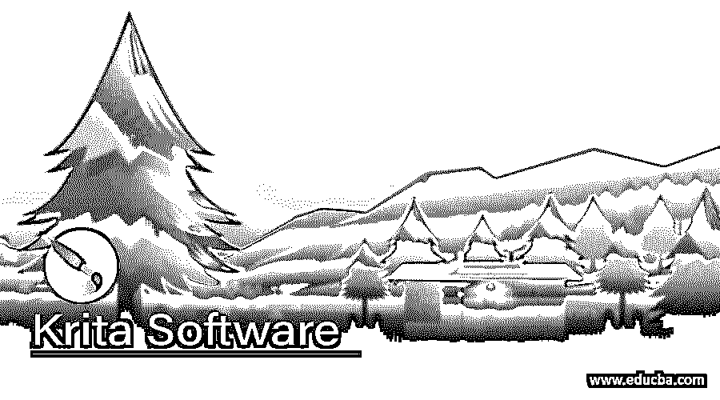

# Krita 软件

> 原文：<https://www.educba.com/krita-software/>

## Krita 软件介绍

Krita 是一种数字绘画和 2d 动画软件，也称为光栅图形编辑器。这是一个免费的开源程序，可以在不同的操作系统上运行，如微软 Windows、MacOS、Linux、Chrome OS 和 Android。它为高质量的数字绘画和光栅图形编辑提供了许多好的功能。它为您提供了 OpenGL 加速画布、高级画笔引擎、非破坏性图层管理、颜色校正等等。对于数字绘画，你会发现许多类型的画笔具有可编辑的参数，对于动画，它提供了洋葱皮功能，通过它你可以很好地控制时间轴。那么，你是否很想知道更多关于这款软件的信息，比如它的工作能力、特点等等？所以让我们来讨论一下。

### 为什么需要 Krita 软件？

正如我在这个软件的介绍中告诉你的，它在数字绘画和 2d 动画方面有自己的专业知识，所以它是为获得数字绘画和光栅图形动画的高功能结果而设计的，它是作为一个免费的开源程序推出的，让每个人都可以负担得起艺术工具。如果你想成长为一名艺术家，那么你可以使用这个软件，因为它为你提供了概念艺术，纹理以及物质画家的功能，插图，漫画设计，以及其他一些数字艺术相关的功能。还有一个原因是为什么你可以使用它，它是一个快速有效的工作流程，有一个容易处理的界面。

<small>3D 动画、建模、仿真、游戏开发&其他</small>

### Krita 软件是如何工作的？

为了完成它的工作，它使用了笔按钮，键盘的修改器，基于图标的 HUD 的组合，这确保了使用的功能可以通过更少的点击来访问。对于数字绘画，它使用图形输入板支持，9 种不同类型的画笔引擎，记住每个物理笔的设置，这样它就不需要一次又一次地设置您想要的设置。For animation 基于光栅图形的逐帧动画原理，使用时间轴控制来输出单个帧，还使用了洋葱皮这一新功能。此功能允许您一次看到几个帧，这有助于您决定如何绘制下一个帧。它还可以与实时动画播放控件一起工作。

### Krita 的优点和缺点

虽然它是一个非常流行的数字绘画软件，但在许多情况下它也有优点和缺点。所以让我们先来看看它的优势。

**优点:**

我们有几个使用这个软件的优势，但我会告诉你其中的一些，这样你就可以理解这个软件在数字绘画工作中的效率。

*   虽然它是一个光栅图形编辑器，但它也提供了矢量工具，因此我们可以在该软件中进行非破坏性编辑，这种非破坏性功能将在不损害原始光栅图形的情况下进行编辑。路径工具、选择工具、文本工具、填充和渐变工具以及矢量艺术工具是作为矢量编辑器参与编辑的工具。所有这些工具都有可调参数。
*   它为用户提供了一个工具，用户可以创建多层图层组，还可以为任何图层添加蒙版，以进行特定类型的编辑。
*   完全定制的面板也可以在这个软件中使用，这些面板可以被称为 Dockers。根据我们的适用性，这些码头工人可以灵活地在工作屏幕的任何一侧移动。
*   它支持许多设备，如 Web、iOS、Android 和桌面。

**缺点:**

这个软件有很多优点，但也有一些缺点，所以让我们也来讨论一下。

它不为您提供任何类型的客户服务和团队来支持其使用，以提供与此软件相关的问题的解决方案。要获得任何类型的帮助，你必须自己搜索，或者在社区论坛上询问与该软件或其工作相关的疑问。

这不是一个非常重要的缺点，但你必须知道，它不提供试用版。

### Krita 软件职业生涯

如果你想成为一名数码艺术设计师，那么选择 Krita 作为你的数码绘画软件是一个不错的选择。你可以用这个软件找到很多机会，因为它涉及到故事书绘画、书籍封面、不同的插图和许多其他处理数字艺术品的行业的项目工作。在掌握了该软件的全部知识和专业技能后，全职或自由职业的项目对你来说就变得很容易了。你应该有独特的创意来实现高水平的数字绘画艺术作品，这种创意与 Krita 软件将会给你很多机会来实现你的梦想。

### Krita 软件的使用

该软件完全专注于数字绘画和插图，因此被许多专业画家用于数字绘画的创作。为此，它使用了许多画笔，提供了画布画笔编辑器、颜色管理和许多其他功能。它还处理光栅图形的动画，这就是为什么不同的专业人士也使用它来制作动画。它也适用于照片或图像编辑，但具有有限的照片编辑能力，如我可以修图，可以应用过滤器进行不同类型的操作，可以进行裁剪，并使用图层排列来设置图层的顺序。为了对这个软件有更深的了解，这些是你应该知道的一些重要内容。

### 结论

我认为这是一篇关于 Krita 软件的好文章，因为我们已经讨论了该软件所有可能的事实和特性。现在，您可以分析这些信息，提取该软件的详细信息，这将有助于您了解该软件。作为一个免费的开源软件，你不用支付任何费用就可以开始使用它。

### 推荐文章

这是一个 Krita 软件的指南。这里我们讨论一下入门，Krita 软件是如何工作的？为什么需要 Krita 软件？，Krita 的优缺点。您也可以看看以下文章，了解更多信息–

1.  [粉笔 vs Photoshop](https://www.educba.com/krita-vs-photoshop/)
2.  [Krita vs Clip Studio](https://www.educba.com/krita-vs-clip-studio/)
3.  [3D 软件设计](https://www.educba.com/3d-software-design/)
4.  [软件设计](https://www.educba.com/software-design/)

