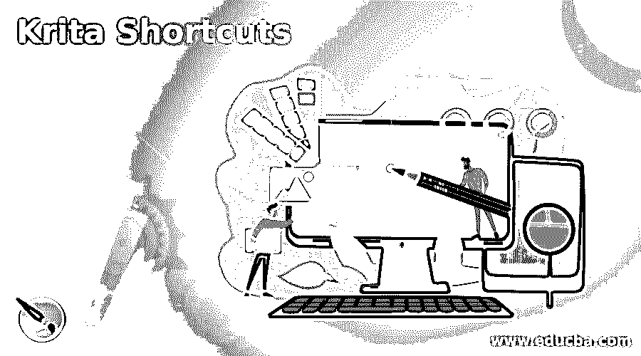

# Krita 捷径

> 原文：<https://www.educba.com/krita-shortcuts/>

## Krita 快捷方式介绍

Krita 快捷方式用于提高工作效率，为不同类型的项目工作节省工作时间。这些快捷键是键盘按键的组合，通过使用它们，我们可以非常快速地访问该软件的任何命令或选项，例如通过点击键盘的一个按键在前景颜色和背景颜色之间切换，或者放大或缩小等等。Krita 为参与数字绘画和光栅图形编辑工作的工具和菜单栏的不同选项提供了快捷方式。

### 不同的 Krita 快捷键

Krita 为不同类型的命令提供了多种快捷键，您可以根据自己的需求使用这些快捷键。

<small>3D 动画、建模、仿真、游戏开发&其他</small>

*   **默认前景色/背景色(D):** 默认前景色为黑色，默认背景色为白色，可以按键盘的 D 键。
*   **在 FG 到 BG 颜色之间切换(X):** 如果你想在前景色和背景色之间切换，那么你可以按键盘上的 X 键。
*   **设置橡皮擦模式(E):** 您可以设置橡皮擦模式来擦除艺术作品的任何元素或组件，为此，您可以按键盘上的 E 按钮。
*   **水平镜像工具(M):** 如果您想使用镜像工具来镜像任何对象，只需选择该对象并按下键盘上的 M 按钮。
*   **旋转画布(4/5/6):** 向左旋转画布 15 度，按 4(键盘数字键)，向右旋转画布 15 度，按 6，重置画布旋转，按 5。
*   **放大/缩小(+/):**按键盘+键放大，按键盘-键缩小。
*   **设置缩放比例(1/2/3):** 如果您想将缩放比例设置为画布的原始尺寸，即 100%尺寸，则按 1(键盘的数字键)，要使缩放比例适合页面尺寸，请按 2，要根据页面宽度调整缩放比例，请按 3。
*   **反转颜色(Ctrl +I):** 要反转您选择的图层或对象的颜色，您可以在选择该对象或图层后按 Ctrl +I 按钮，该图层的颜色将在色轮上变成相反的颜色。
*   **删除所有内容(Del):** 如果你想删除当前层的所有内容，那么选择所有内容并按下键盘上的 Delete 键。
*   **用背景色填充选择(退格):**如果您想用颜色框的背景色填充您选择的对象，请按键盘的退格键。
*   **用 FG 色填充选区(Shift +退格):**和背景色一样，你也可以用前景色填充你选中的对象，为此，在选中你的对象后，按键盘上的 Shift +退格键。
*   **显示常用颜色(U):** 按下键盘上的 U 键，可以在调色板的左侧看到常用颜色，这样可以快速选择颜色。
*   **How Color History (H):** 如果要查看当前图片中使用的颜色，可以按键盘上的 H 键。
*   **显示颜色选择器(I):** 按下键盘上的 I 按钮，您可以看到颜色选择器。

这是一些基本命令的快捷方式，提高了我们在使用该软件时的工作速度。

工具栏工具的一些快捷方式:

*   **手绘笔刷工具(B):** 您可以通过按键盘上的 B 键激活该工具。
*   **移动工具(T):** 按下键盘的 T 键，移动当前图层、选区或任何对象。
*   **变换(Ctrl + T):** 按 Ctrl + T 按钮变换任意图层或选区。
*   **裁剪工具(C):** 按下 C 键，裁剪工具被激活，您可以根据自己的需要裁剪任意图层
*   **渐变工具(G):** 按下键盘的 G 键，可以使用工具面板的渐变工具，可以使用 FG 和 BG 颜色之间的颜色。
*   **颜色选择工具(P):** 您可以按下 P 按钮进行颜色选择，这样您就可以从图像或物体的所需位置选择您想要的颜色。您也可以按住键盘上的 Ctrl 键进入拾色器模式。
*   **填充工具(F):** 如果你想用颜色框的前景色填充你的选区或当前图层，按键盘的 F 键激活它。
*   **矩形工具(R):** 它将帮助你制作一个矩形或正方形的形状，对于一些其他的工作，它被使用。你可以使用键盘的 R 键作为快捷键。
*   **椭圆选择工具(J):** 对于椭圆选择工具，可以按键盘上的 J 键。

这些是 Krita 软件工具的一些快捷方式；现在我们将看到图层面板的一些快捷方式，因为图层管理是这个软件最重要的功能之一。

*   **选择图层(向上翻页/向下翻页):**要选择图层面板中的下一个图层，请按键盘的向上翻页按钮，选择图层面板中的上一个图层，然后按键盘的向下翻页按钮。
*   **移入图层面板(Home/End):** 要进入图层面板的第一个图层，请按键盘的 Home 键，要进入图层面板的最后一个图层，请按键盘的 End 键。
*   **移动图层(Ctrl + Page Up/ Ctrl +Page Down):** 按键盘上的 Ctrl +Page Down 键可以将当前图层向下移动，按键盘上的 Ctrl + Page Up 键可以将选中的图层向上移动。
*   **将图层移动到组(G):** 当图层面板中有许多图层时，我们会根据自己的适合性将它们分成一组，您可以将任何图层移动到您想要的组中。只需选择该层，并按下键盘上的 Ctrl + G 按钮。

### 结论

现在你已经知道了足够多的 Krita 软件的快捷方式，这将有助于你在使用该软件的过程中提高工作效率。

### 推荐文章

这是一个克里塔捷径指南。为了更好的理解，我们在这里讨论介绍和不同的 Krita 快捷键。您也可以看看以下文章，了解更多信息–

1.  [Adobe Photoshop 替代品](https://www.educba.com/adobe-photoshop-alternatives/)
2.  [Adobe 编辑软件](https://www.educba.com/adobe-editing-softwares/)
3.  [土坯的种类](https://www.educba.com/types-of-adobe/)
4.  [Adobe Flash 中的动画](https://www.educba.com/animation-in-adobe-flash/)

