# 粉笔歼灭者

> 原文：<https://www.educba.com/krita-eraser/>

## Krita 橡皮擦简介

Krita 橡皮擦在这个软件中作为橡皮擦工具，按照我们的要求擦除任何图像的像素。像大多数其他光栅图形编辑器一样，Krita 不提供任何名为橡皮擦工具的工具，但它提供了许多从图像中擦除像素的技术。有很多方法可以做到这一点，或者有很多功能可以用作橡皮擦，我会在这篇文章中告诉你所有这些方法。你只需要管理不同工具的参数和这个软件的特性，就可以得到你想要的结果。所以让我们以一种非常有趣的方式来讨论这个方法。

### 克里塔怎么用橡皮擦？

在开始我们的学习之前，我要做的第一件事是在这个软件中有一个图像，我们将在其上学习橡皮擦，要打开任何图像，只需单击打开文件选项，这是 Krita 窗口屏幕上开始标签的第二个选项，或者您可以简单地按 Ctrl + O 作为快捷键。

<small>3D 动画、建模、仿真、游戏开发&其他</small>

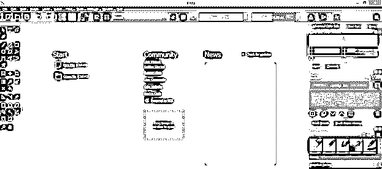

现在一个选择你的图像的对话框将会打开，从它的保存位置选择你想要的图像，然后点击这个对话框的打开按钮。为此，您可以拍摄任何图像。

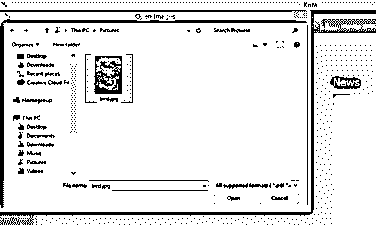

这是我们的图像，我们将使用擦除方法。

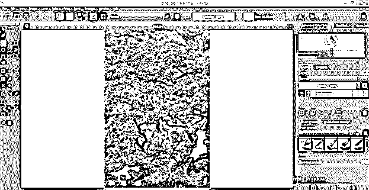

有很多方法可以做到这一点，我会一一告诉你。

#### 用手绘笔刷工具当橡皮擦？

对于这种方法，从工具面板中选择手绘画笔工具，或者按键盘上的 B 键作为快捷键。

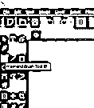

现在点击编辑笔刷设置标签，它在这个软件的工作界面顶部的第二个栏。

单击此图标后，将会打开一个编辑对话框。现在点击这个对话框的切换显示预设选项。

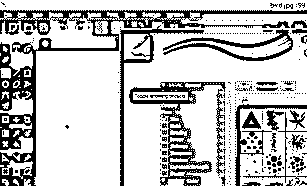

在此对话框的搜索框中(在预设面板的按钮处)，键入 Eraser，您将在此对话框的预设部分将笔刷预设为 Eraser。

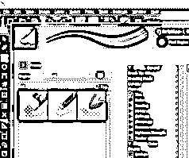

现在从笔刷预设中选择任意一个橡皮擦。

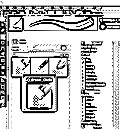

一旦你选择了它，你将拥有和我们在任何笔刷中一样的参数，因为它实际上是一种笔刷，你可以根据你的选择来设置它的参数。

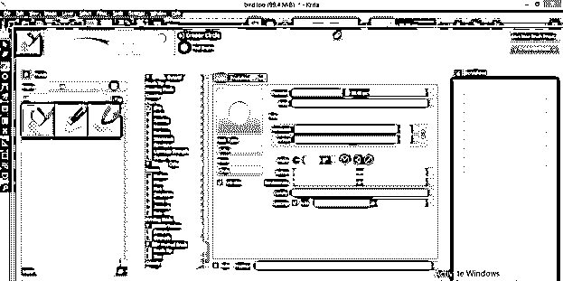

您可以通过按键盘上的[或]按钮来增大或减小画笔笔尖的大小。您还可以通过属性栏的大小选项来更改大小，属性栏是工作屏幕顶部的第二个栏。

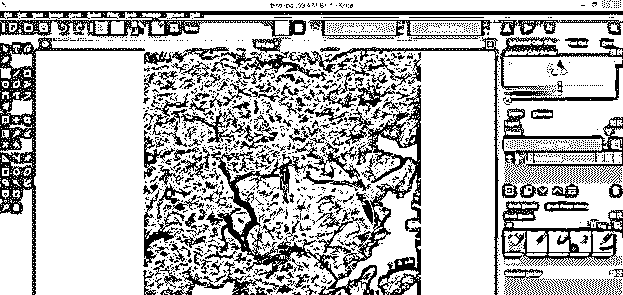

现在，当你按住移动按钮将画笔笔尖移动到你想要的图像区域时，它会像这样开始擦除图像的像素。当您擦除顶层的像素时，背景层会在擦除区域变得可见。在这里，我们只有这一层，所以你会看到透明的背景，当我删除这个图像的像素。

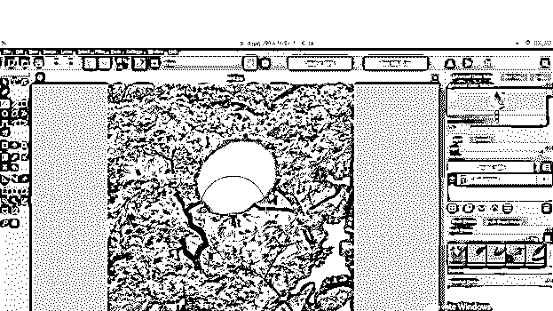

如果要将橡皮擦形状更改为方形，请再次打开“编辑画笔设置”对话框，并从该对话框的“形状”选项卡中选择“方形”选项。

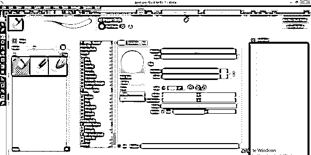

现在它将擦除像这样的正方形中的像素。

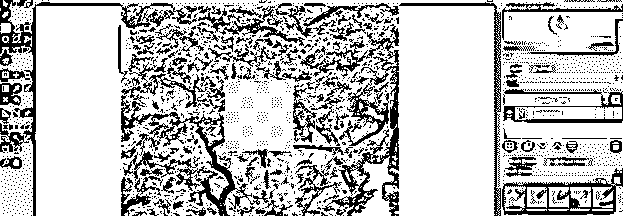

#### 使用任何笔刷预设作为橡皮擦。

在此方法中，您可以使用任何笔刷预设作为橡皮擦，为此，请从“编辑笔刷设置”对话框中选择任何笔刷。

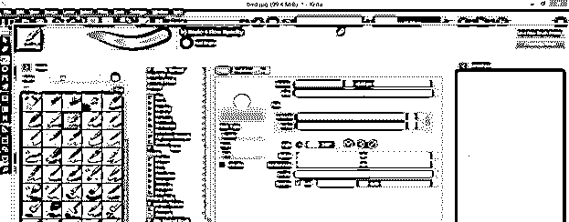

现在，当你用你选择的笔刷在你的图像上绘制时，它会像普通的笔刷一样绘制。

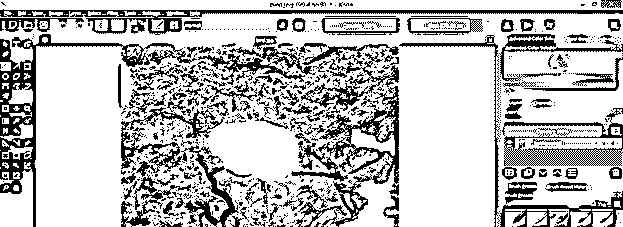

现在通过点击这个图标启用“设置橡皮擦模式”。您可以在属性栏中找到该选项。

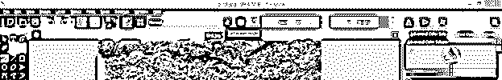

再次用这个笔刷绘制，这一次它将擦除像素来代替绘制像素，因为擦除模式是打开的。

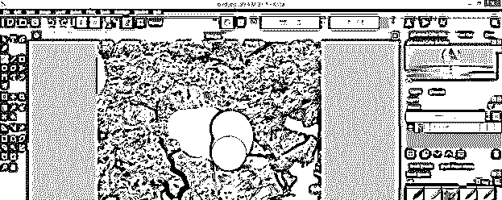

#### 使用任何形状工具作为橡皮擦

你可以使用任何形状工具作为橡皮擦；它只是启用橡皮擦模式，然后从工具面板中选择任何形状工具。我将从工具面板中点击矩形工具的图标。

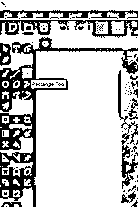

画一个像这样的矩形。当我用它的设置参数画一个形状时，那个形状将擦除像素，像素将适合那个形状的区域。

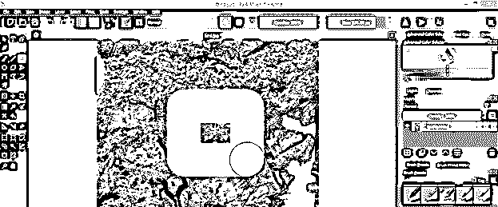

你也可以用线条工具做同样的事情。从工具面板中选择线条工具，像这样画一条线。被线覆盖的区域将被擦除。

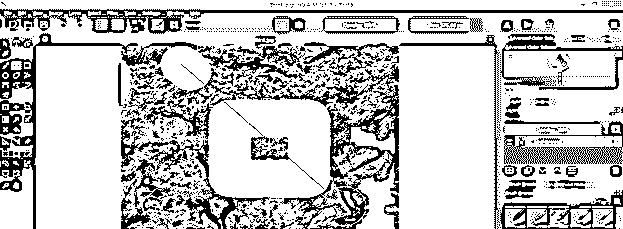

#### 将选择工具用作橡皮擦

选择工具也可以从图像的任何区域擦除像素。我举个例子给你看。从工具面板中选择矩形选择工具，或者按 Ctrl + R 作为快捷键。

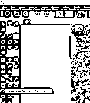

现在选择你想要的图像区域，按下键盘上的删除键。

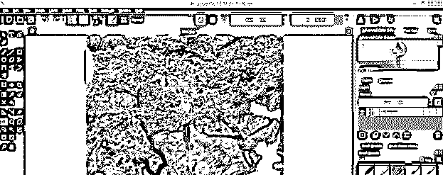

你选区内的像素会像这样被擦掉。您可以使用本软件的不同选择方法进行任何类型的选择。不需要启用橡皮擦模式。

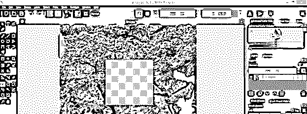

#### 使用橡皮擦等渐变工具。

你必须在这个软件中使用渐变工具，但这次你可以用它作为橡皮擦。只要确保橡皮擦模式是打开的，并从工具面板中选择渐变工具。

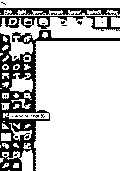

现在向你想要添加渐变的方向拖动鼠标指针，它将从渐变的起点开始擦除像素，正如我在这个例子中向你展示的那样。

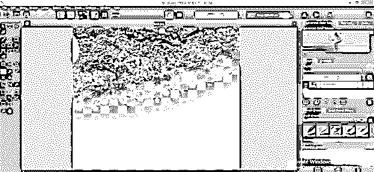

这些是你可以从任何图像中擦除像素的一些方法。使用这些方法时，您只需启用擦除模式。你应该记住，如果你是在橡皮擦画笔的帮助下擦除像素，那么就没有必要启用橡皮擦模式。

### 结论

你很容易理解如何使用各种方法在 Krita 中擦除像素，现在你可以很容易地处理不同工具的参数和用于擦除目的的技术。我们上面讨论的所有方法都可以用来以不同的方式擦除像素，你可以通过实践来了解这些方法。

### 推荐文章

这是 Krita 橡皮擦的使用指南。这里我们通过使用各种方法来讨论如何在 Krita 中使用 eraser pixel，现在你可以轻松地处理不同工具和技术的参数。您也可以看看以下文章，了解更多信息–

1.  [建筑设计类型](https://www.educba.com/architecture-design-types/)
2.  [Photoshop 中的橡皮擦工具](https://www.educba.com/eraser-tool-in-photoshop/)
3.  [SketchUp 旋转](https://www.educba.com/sketchup-rotate/)
4.  [什么是像素艺术？](https://www.educba.com/what-is-pixel-art/)

