# 克里塔刷子

> 原文：<https://www.educba.com/krita-brushes/>

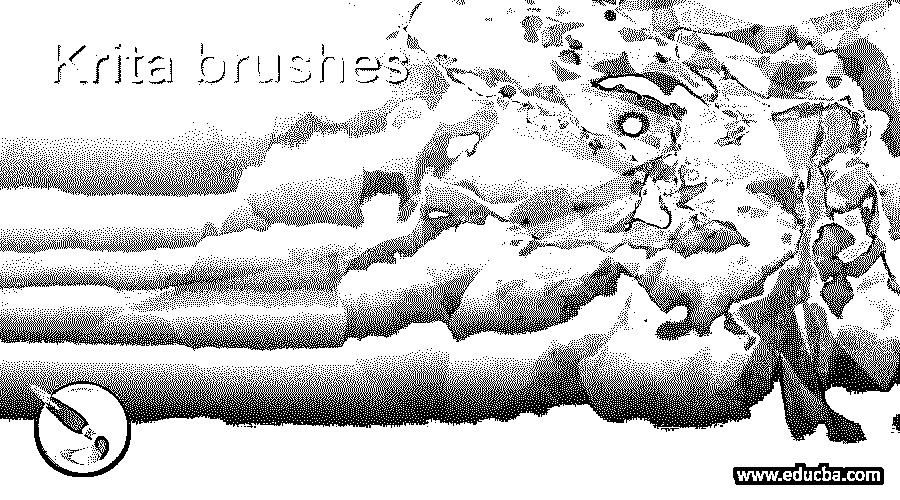

## Krita 笔刷简介

Krita 笔刷是这个软件的一个主要特点，因为它是一个数字绘画软件，这些笔刷在数字绘画中涉及很多。Krita 提供许多不同类型的参数可调的画笔，这意味着您可以更改特定类型画笔的参数，以在工作中获得您想要的结果。在这个软件中有许多预定义参数的笔刷预设，但是你可以根据自己的选择对它们进行修改。不仅使用这些预置，你也可以用你想要的设置创建你自己的笔刷并保存它以备将来使用。

### 在 Krita 中如何使用画笔？

让我先告诉你在这个软件的什么地方可以找到画笔。画笔实际上是工具，所以你会在这个软件的工具面板中找到它们，它在工作窗口的左侧。你会有带这个工具图标的画笔，为了激活它，你可以点击这个图标或者简单地按下键盘上的 B 键。

<small>3D 动画、建模、仿真、游戏开发&其他</small>

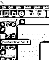

在工作屏幕顶部的第二个栏，你会发现画笔的编辑标签。从这个标签，你可以在你想要的笔刷参数中做不同类型的排列。

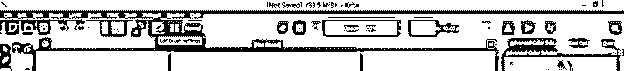

一旦你点击这个标签，你会在笔刷的编辑对话框中看到很多参数。现在让我们分析这些参数，以了解这个软件的画笔。

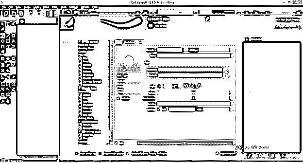

现在点击这个对话框的“切换显示预设”选项。

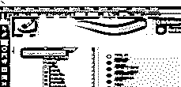

在“引擎”选项卡中，您可以根据您的工作要求选择笔刷类型的数量。我将选择所有选项，这样我就可以看到 Krita 提供的所有类型的笔刷的预设。

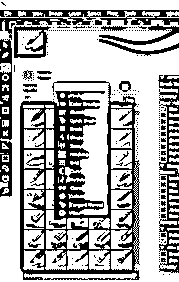

现在我将从这个列表中选择任何一个笔刷来解释我们如何使用任何笔刷的参数。

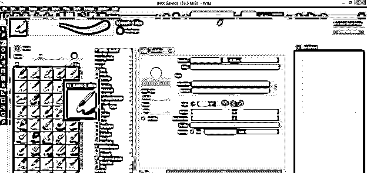

在“常规”选项卡中，有很多笔刷的参数，这些参数会根据笔刷的类型而变化。

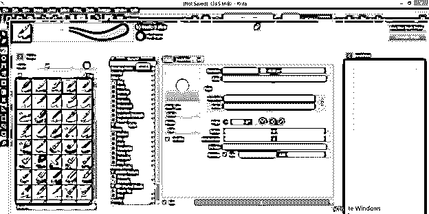

#### 画笔笔尖:

画笔的第一个参数是笔尖，这是任何类型的画笔的最基本的东西。通过操纵画笔笔尖不同选项的值，我们可以改变画笔笔尖的特性。

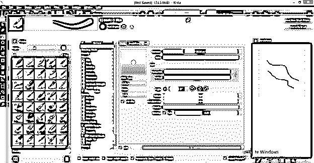

#### 刷子尖端的直径:

通过更改此参数的直径选项的值，我们可以更改画笔描边的粗细。如果直径值小于，鹳将变细，反之，如果直径大于，鹳将变粗。您可以通过在此对话框的白色区域中绘制任何内容来查看已更改参数的预览。

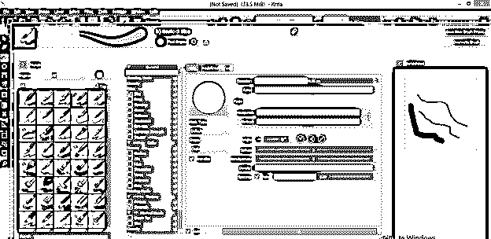

#### 画笔笔尖的比率:

下一个选项是 Ratio，你可以理解为画笔笔尖的高度和宽度。如果我改变它的值，那么你可以看到(在预览标签，这是上面的蒙版类型选项)画笔笔尖变成椭圆形。

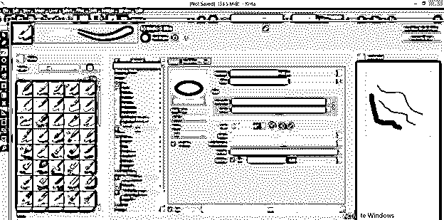

现在当你用它画任何东西时，这会给你书法的效果，你可以用它设计许多东西。

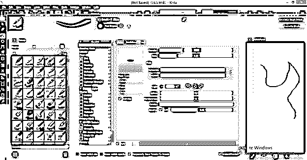

如果你想清除预览标签中的笔触，那么只需点击“重置区域为白色”按钮，它在这个对话框的白色区域部分的下面。

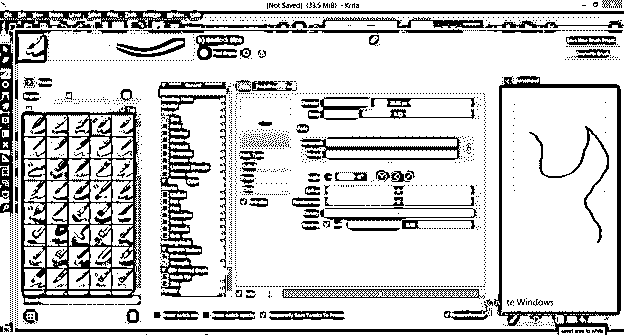

#### 水平/垂直值:

接下来是水平/垂直值选项，通过给它们赋予最小值，你可以使画笔笔尖变模糊。如果我通过移动滑块使这些值为零，那么画笔笔尖将变得像这样模糊。

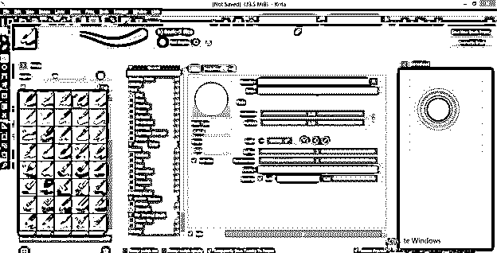

#### 画笔笔尖的角度:

如果有某个比值，你可以改变笔尖的倾斜度。对于改变角度，我们只需输入一个角度选项的角度收件箱的值。

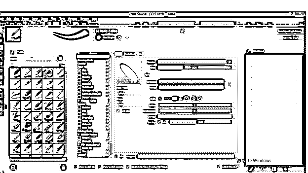

它会倾斜到你想要的角度。

#### 峰值:

如果你增加这个选项的值，它会像这样给画笔笔尖添加一条曲线。

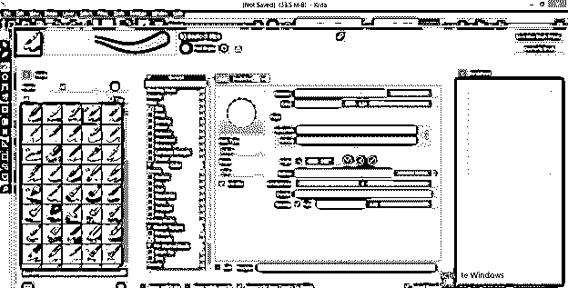

当你用它画东西的时候，这个形状会以笔触出现。

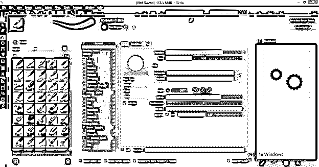

#### 画笔笔尖的密度:

密度帮助我们改变画笔笔尖内的像素值。如果我降低密度的值，那么像素将以特定的方式彼此不同。这就像你用海绵划了一下。

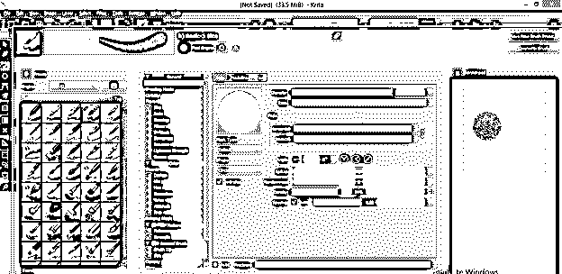

#### 随机性:

它的工作原理与密度相同。您可以更改其值来查看其效果。

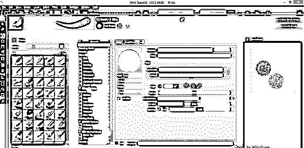

#### 间距:

在间距中，我们可以改变笔触中两种形状的笔尖之间的间距。如果我将间距的值更改为 10，那么在任何笔画中，两种形状的画笔笔尖之间都会有 10 个像素的间隙。

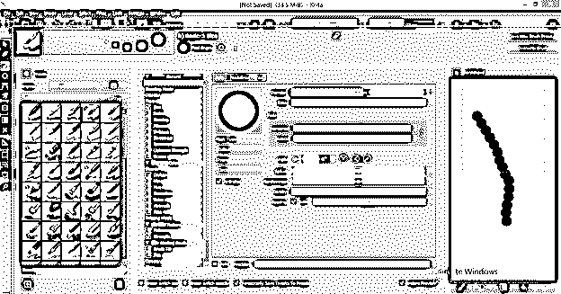

#### 画笔笔尖的柔软度:

如果将默认值更改为“柔和”选项，则可以更改画笔笔尖的柔和度值。

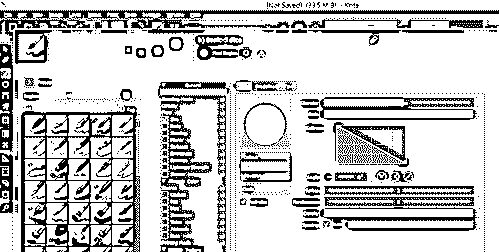

在软选项卡中，您将拥有与我们在默认选项卡中几乎相同的选项。在“柔化”选项卡中，您可以更改柔化选项的曲线以更改其值。

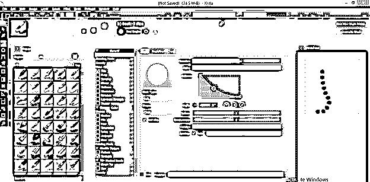

#### 笔尖的形状:

您也可以通过此选项更改笔尖的形状。笔尖有两种形状:圆形和方形。

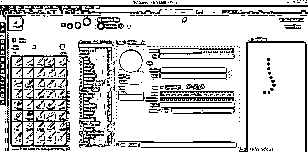

和这些参数一样，你可以根据自己的需要设置许多其他参数。如果你想保存你的笔刷和你设置的参数，你可以点击“保存新的笔刷设置”按钮，它在工作界面的右上角。

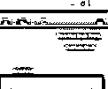

一旦你点击它，你会有一个对话框来定义你的画笔和其他东西的名称。完成设置后，点击“保存”按钮。

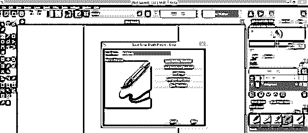

现在你可以在“编辑画笔”对话框的“预设”部分搜索你的画笔。

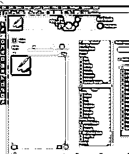

现在你可以在你的文档上使用画笔了。

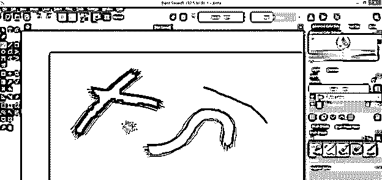

### 结论

我告诉你所有关于 Krita 软件的笔刷的知识，并有能力处理笔刷的所有参数，以在你的工作中获得想要的结果。您可以使用预设的画笔进行数字绘画，也可以制作自己的画笔。

### 推荐文章

这是一个指南 Krita 画笔。在这里，我们讨论了 Krita 软件的画笔，它可以给你一个很好的关于它们的知识，并可以有技巧地处理画笔的所有参数。您也可以看看以下文章，了解更多信息–

1.  [3ds Max 室内设计](https://www.educba.com/3ds-max-interior-design/)
2.  [UI 设计工具](https://www.educba.com/ui-design-tools/)
3.  [CorelDRAW 标志设计](https://www.educba.com/coreldraw-logo-design/)
4.  [面向功能的设计](https://www.educba.com/function-oriented-design/)

