# Krita 像素艺术

> 原文：<https://www.educba.com/krita-pixel-art/>

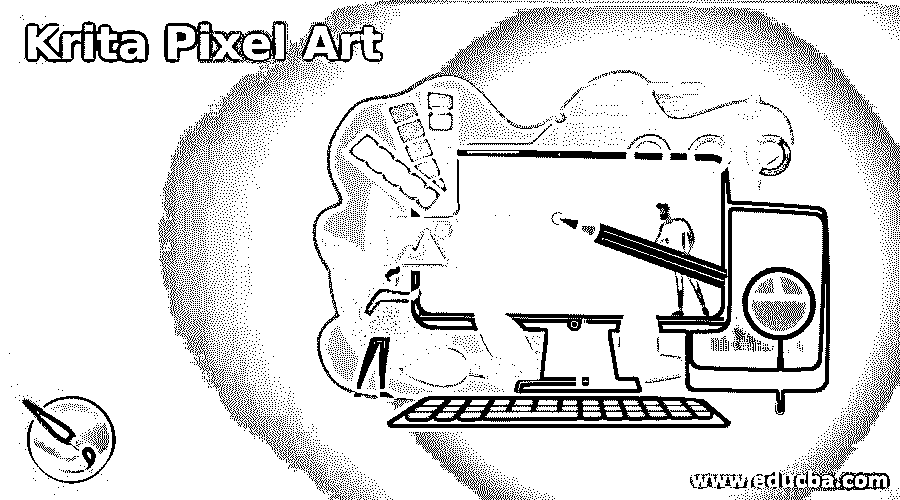

## Krita 像素艺术简介

Krita 像素艺术可以理解为使用预设的 1 或 2 像素画笔在 1 x 1 或 2 x 2 像素上设计任何艺术品。我们通常在 pixel art 中创建艺术作品、角色、对象和游戏组件，这些作品融合了 2D 游戏设计和其他 pixel 设计工作。为了在这个软件中创建像素艺术，我们必须调整不同类型的网格系统，然后我们可以通过使用工具面板的一些工具，包括手绘画笔工具，轻松地创建像素艺术。

### 如何在 Krita 中创建像素艺术？

在克里塔创作像素艺术并不是什么大事；你只需要做一些调整，并学习如何使用像素刷和其他工具。

<small>3D 动画、建模、仿真、游戏开发&其他</small>

让我们一步一步来看。

首先让我们有一个新的文档，为此，单击这个工作屏幕的开始标签的新文件选项，或者您可以按 Ctrl + N 按钮作为快捷键。

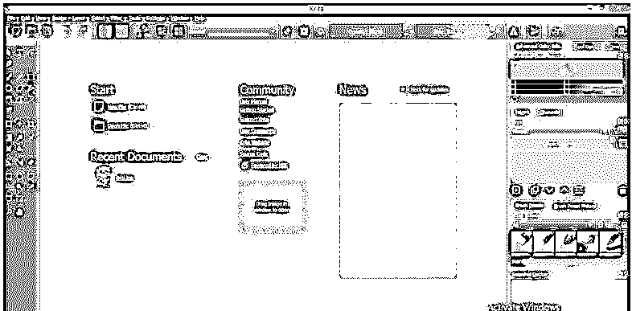

一旦你点击它，一个“创建新文件”对话框将会打开。这里把你的文档尺寸设为 64 x 64 或 32 x 32 像素，因为创建像素艺术，我们必须在 1 x 1 像素上工作，然后点击创建按钮。

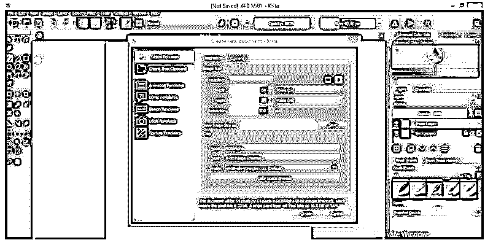

现在转到菜单栏，点击设置菜单。将打开该菜单的向下滚动。现在点击下拉列表中的“配置 Krita”选项。

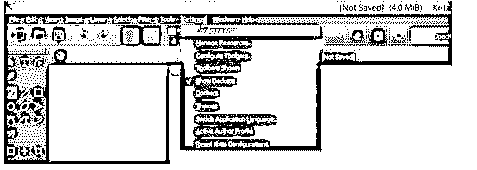

这里转到打开的对话框的显示选项，然后点击该选项的网格设置选项卡。

将“开始显示于”选项的值减少为 400%。

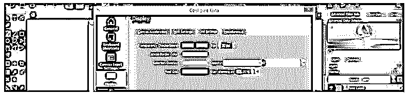

现在，如果您的文档颜色为浅色，请单击像素网格选项的颜色框，将颜色更改为任何深色代码。我将从色轮中选择这种颜色。

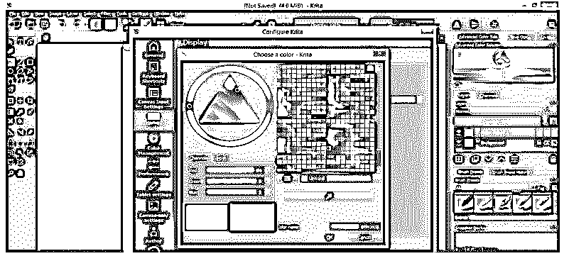

现在你的画布或文档上会有一个类似这样的网格。

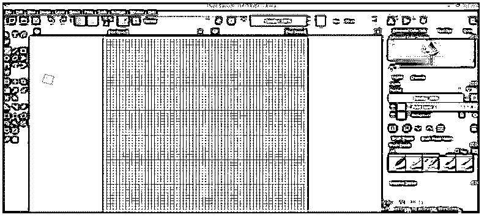

当你用任何笔刷预设绘制时，你的绘图不会有一个完美的艺术像素。

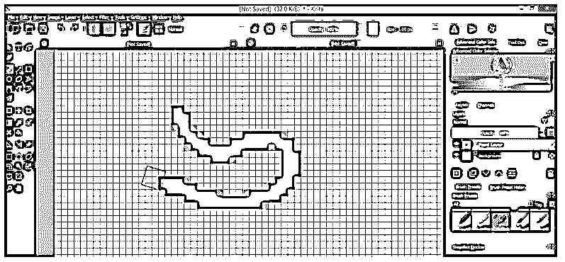

对于创建像素艺术，Krita 提供了画笔笔尖大小为 1 个像素的像素艺术画笔，对于像素艺术画笔，请在画笔预设面板中搜索像素艺术。您可以在工作屏幕的右侧找到此面板。

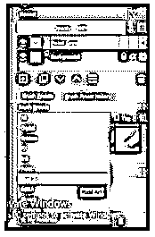

您也可以从属性栏(在工作屏幕的顶部)的“编辑画笔设置”对话框中获得这些画笔。

这里 Krita 在其笔刷预设中提供了三像素艺术笔刷。如果你愿意，可以从 Krita 官网下载更多。我们会选择这个笔刷。

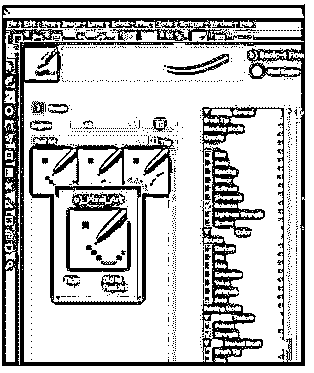

现在你用它画东西，它会这样一个像素一个像素的画。

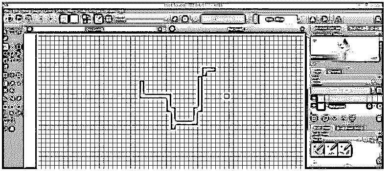

你也可以使用任何形状工具来绘制像素形状，而不是像素画笔。

例如，我们将从工具面板中选择矩形工具，绘制这两个矩形。

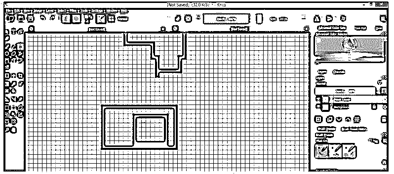

如果你想删除你的形状的任何像素，然后从笔刷预设中选择橡皮擦笔刷或者选择任何笔刷预设。

如果你有一个橡皮擦笔刷，你不需要做下一步，我会告诉你，或者如果你有任何笔刷，然后点击这个图标启用橡皮擦模式。

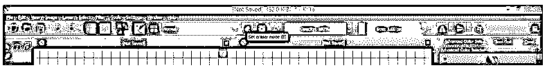

现在点击你想要删除的形状的像素，它会像这样删除。

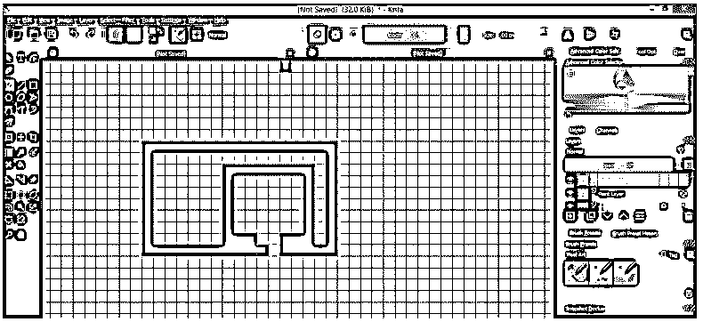

现在，如果你降低笔刷的不透明度。

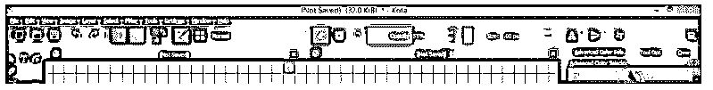

在橡皮擦模式下使用它不会完全移除像素，但会降低其不透明度作为您选择的不透明度值。

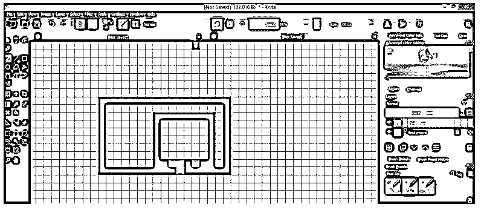

你也可以填充任何形状内部的颜色，如果它是一个封闭的形状，从工具面板中选择填充工具，或者按键盘上的 F 键。

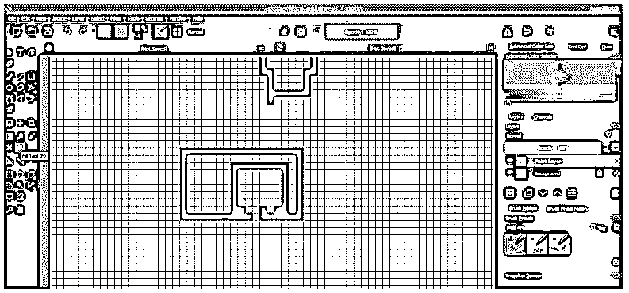

现在点击你想要填充颜色的地方，它会用你选择的颜色填充这个区域。

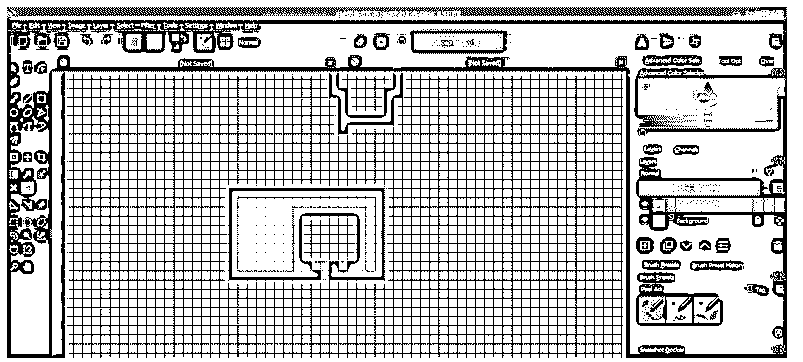

但是，如果你点击一个矩形内的正方形，那么颜色将蔓延到整个画布上，因为这是一个开放的形状，由于像素的擦除。

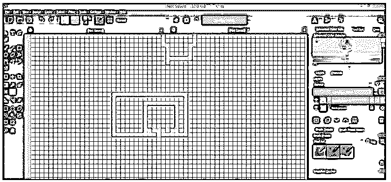

如果要单独选择任何绘制的对象，必须使用选择工具选择该对象。为此，我们将使用矩形选择工具。

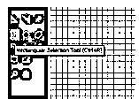

我们将围绕这样的顶部对象进行选择。您可以使用任何其他选择工具，但该工具应该逐个像素地进行选择。

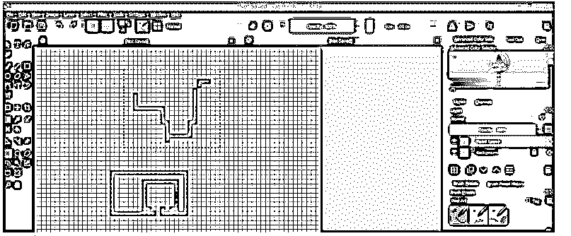

并按 Ctrl + T 变换框，你可以用它做变换操作，因为你可以移动它，旋转它等等。

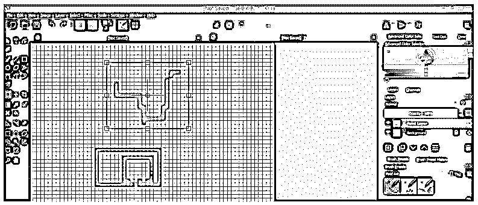

您也可以从菜单栏的图层菜单中进行变换。只要用你想要的选举工具选择你想要的对象。

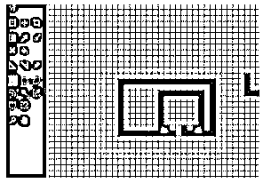

现在去图层菜单，点击它，然后去下拉列表的转换选项。接下来，从新建下拉列表中选择剪切层选项。

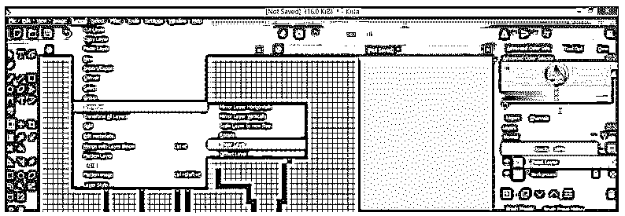

根据您对剪切该对象的要求，在此输入剪切角度。

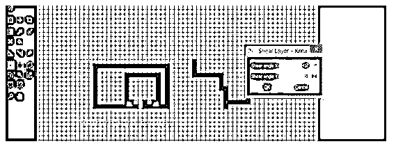

它会像这样剪切。

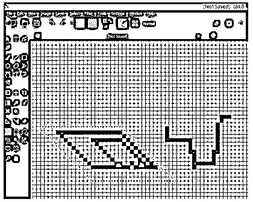

如果要像这样更改任何对象，可以使用工具面板的连续选择工具在对象周围进行选择。

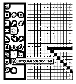

只需点击形状选择你想改变的颜色。

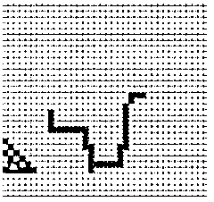

选择后，从工具面板中选择填充工具或按下键盘上的 F 键并点击所选区域。现在你选择的颜色将填充它。你可以看到它只会填充连续的像素。

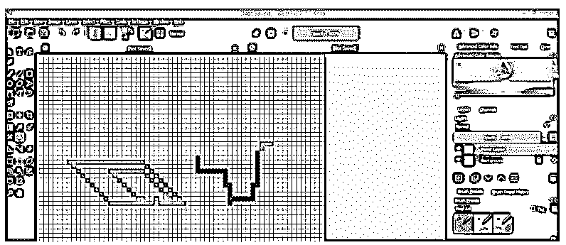

这些是一些参数和特性，你可以在这个软件中创建像素艺术。一旦你设置了这些参数，你就可以在这个软件上创建你对像素艺术的想象。

### 结论

像素艺术对你来说不再是一个陌生的词，你可以轻松地管理它的所有相关参数，以获得最佳的工作效果。只要开始在上面练习，探索新的想法，分析涉及创建像素艺术的工具的不同数据。

### 推荐文章

这是一个 Krita 像素艺术的指南，这里我们讨论一下入门以及如何在 Krita 中创建像素艺术？为了更好的理解。您也可以看看以下文章，了解更多信息–

1.  [Adobe Photoshop 替代品](https://www.educba.com/adobe-photoshop-alternatives/)
2.  [Adobe Premiere Pro 插件](https://www.educba.com/adobe-premiere-pro-plugins/)
3.  [什么是土坯前奏？](https://www.educba.com/what-is-adobe-prelude/)
4.  [Adobe After Effects 插件](https://www.educba.com/adobe-after-effects-plugins/)

