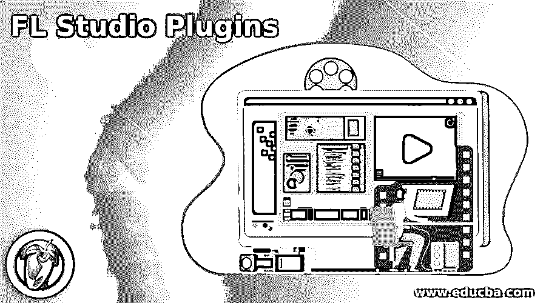

# FL Studio 插件

> 原文：<https://www.educba.com/fl-studio-plugins/>

## FL Studio 插件简介

FL Studio 插件可以理解为为了增强软件的工作能力和效率而安装的附加软件。它有大量的插件，帮助我们以更流畅的方式完成多种类型的工作，并给出高质量的结果。在这里，我们将看到该软件的一些插件，以便您了解如何在使用该软件的过程中轻松管理不同的任务。你会发现一些插件已经安装在这个软件中，如控制表面，补丁等等。

### 各种 FL Studio 插件

下面给出了各种 FL Studio 插件:

<small>3D 动画、建模、仿真、游戏开发&其他</small>

#### 1.控制表面效果插件

*   这个插件允许我们实时添加控件，这些控件可以与 FL Studio 或 Pitcher 中的插件链接。如果你曾经使用过果味仪表板插件，那么它是类似的。
*   它以这种方式工作，控制对象如旋钮、滑块等可以与 FL studio 目标的插件和接口链接，以便在一个位置组合控制，从而平滑地处理我们的控制工作。
*   这个插件有一个特性，允许我们添加尽可能多的控制表面，这是我们的项目所必需的，包括效果或通道槽。
*   设计好控件后，您可以将它们保存在。ilcontrol 格式文件复制到 FL Studio 安装文件夹中。

#### 2.修补程序插件

*   这个插件可以作为乐器或效果使用，换句话说，它将作为一个乐器或效果来加载，允许你将乐器和效果链接到一个可重用完整单元中，这意味着你也可以在其他项目中使用它。
*   它还允许您在单个通道或效果插槽中添加许多效果或乐器，并为您提供高质量的效果。
*   它有一个可调整大小的工作区，这意味着您可以根据需要调整工作区的大小，或者您可以将对象拖到工作区的边缘，以自动调整该对象的大小。
*   有自动排列模块来创建表示多线程处理逻辑的模块列。

#### 3.水果过滤器插件

*   正是这种类型的插件为我们提供了高级别的过滤效果，并针对自动化目的进行了优化。
*   我们可以用这个插件为低通或带通或高通滤波器设置截止频率。不仅仅是频率，它还可以提升一个接近截止水平的频带，这样我们就可以创造出一种特殊效果的锐化声音。
*   它执行过采样，可以改善输出质量，并通过降低相位失真和避免混叠来降低噪声。

#### 4.干扰插件

*   这是一种模块化插件，它从不同的元素(如 Harmor、Blood Overdrive、Soft Clipper、Fast Dist)获取失真，然后加上位并降低延迟 3 的速率，然后使用 FLEX 添加过滤器。
*   有许多控制按钮可以帮助我们方便地操作这个插件，比如顶部的开关可以使效果模块启用或禁用，添加或删除模块按钮等等。
*   这个插件使用经典和现代的技术来获得最好的效果。

#### 5.水果镶边插件

*   它是相位抵消的一种形式，由输入声音的多个或各种延迟副本的组合产生。
*   它有许多特点，如延迟最小化之间的侧翼语音的延迟，我们可以根据我们的要求设置其参数，深度控制调制的侧翼延迟等。
*   它的调制速率范围从 0 到 5，镶边调制将在此范围内工作，阻尼使用范围从 0 到 1。

#### 6.Picher 插件

*   它被用作一个实时的校正、协调和操作插件，在 MIDI 控制下进行校正和协调，并通过键盘或钢琴卷控制手柄。
*   利用输入音高检测指示器的功能，我们可以避免在音阶中音符之间的边界上演唱音高。不仅如此，我们还可以避免声音中过多的颤音。
*   它适用于你可以理解为单个音符的单音，但不适用于和弦和合唱。

#### 7.水果配方控制器插件

*   这是一个基于用户定义的公式生成自动化控制数据的插件，您可以在链接对话框的公式 Ctrl-Out 选项中找到它。
*   它使用 A，B，C 作为旋钮，作为公式的变量，你可以输入它们。
*   有了这个插件，你可以实时看到你输入的公式的输出。你应该记住的一件事是，许多公式不会显示在移动轨迹上，直到你点击 FL Studio 的传输面板的播放按钮。所以不要担心你的公式没有显示在移动轨迹上。

这些是这个软件的一些重要插件，你可以在这个软件中找到所有已经安装的插件。

### 结论

我们看到了一些已经安装的 FL Studio 插件，这些插件有一些很好的功能，可以很容易地增强该软件的工作能力和效率，所以我们建议您尝试在该软件中执行不同类型的任务。如果你愿意，你也可以使用外部插件，因为这个软件也有很多外部插件。

### 推荐文章

这是一个关于 FL Studio 插件的指南。为了更好的理解，我们在这里讨论介绍和各种 FL studio 插件。您也可以看看以下文章，了解更多信息–

1.  [Pro Tools 插件](https://www.educba.com/pro-tools-plugins/)
2.  [草图插件](https://www.educba.com/sketch-plugins/)
3.  [Figma 插件](https://www.educba.com/figma-plugins/)
4.  [AutoCAD 中的偏移](https://www.educba.com/offset-in-autocad/)

