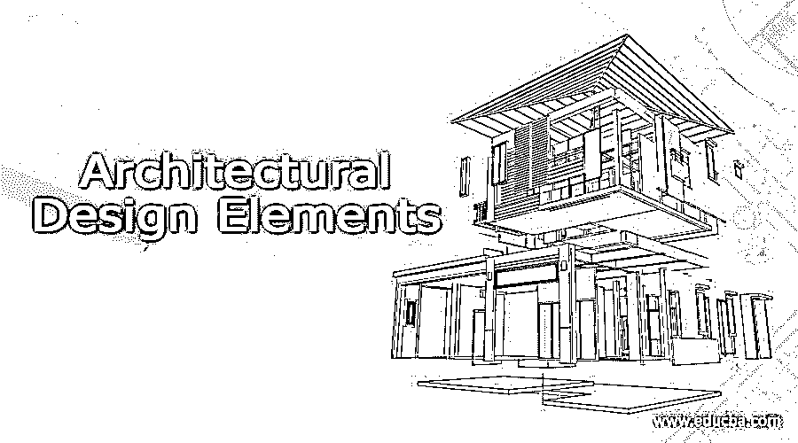

# 建筑设计元素

> 原文：<https://www.educba.com/architectural-design-elements/>

## 建筑设计元素介绍

元素是创建设计或艺术品时不可避免地需要的关键组件。每一个设计或创造都有一些基本原则或元素，它们定义了整个设计过程。对这些要素的适当了解可以帮助用户创建有吸引力且平衡的专业知识。建筑设计元素被室内和室外的建筑师、设计师、排字工人和艺术家所使用。恰当地使用这些元素将有助于艺术家将想法形象化并描绘成现实。

### 详细的建筑设计元素

任何平面设计的基本元素都是相似的，并且相互关联。此外，用户也应该在他们的知识中保留设计的原则。元素是设计的基本组成部分，而设计原则帮助我们监控元素及其正确使用。就像环境中有一些基本元素是人类生存所必需的一样，同样，也有一些不可避免的元素需要创造一个合适的和创造性的建筑设计。

<small>3D 动画、建模、仿真、游戏开发&其他</small>

以下是通过对每个细节的适当管理来创建平衡设计所需的要素。

#### 1.颜色

任何设计最重要的方面是在特定的设计中选择和使用配色方案。选择合适的配色方案可以创造出一些令人惊叹的建筑设计和室内设计。这种设计元素可以用来表现白天和黑夜、光明和黑暗、强度和结构强度之间的差异。色调和饱和度、色轮和配色方案都属于这一设计元素。

#### 2.光

除了色彩元素，光也是创造室内和室外建筑的最基本和最主要的元素之一。灯光可以是人工创造的，也可以是为设计而创造的环境。应用于特定构图的光和照明的选择可以切换整体设计的许多方面。放置窗户或门可以产生日光效果。在构图中使用自然光只会给观众带来惊人的效果。

#### 3.音调

在设计外部建筑时，色调在区分建筑的高低和它们的创作点方面起着重要的作用。发挥并充分利用色彩理论和配色方案决定了设计的基调。

#### 4.形状/形式

在创造一个具有创造力和远见的建筑设计中，形状是一个同样重要的因素。形状可以是几何的、抽象的或自然的。使用或创建这些形状的形式决定了元素的属性。可以在 2D 和 3D 表单中创建形状。用户可以通过使用不同的形状用于不同的结构或者使用相同的形状用于相似的物体来使用形状来传达和赋予设计深度。

#### 5.方向

建筑设计在垂直方向或水平方向都是内置的。这种设计元素与创建外部基础设施有关，如建筑、铁路或桥梁。创建墙、楼梯或屋顶等结构构件需要使用正确的方向元素。

#### 6.比例

设计室内建筑时，家具和整个空间之间的比例平衡是必要的。桌子、椅子和床的传统布局与整体布局不成比例。如果用户错过了这个元素，那么对于浏览者来说，设计会变得过于混乱或者过于简单。物体之间的明确空间可以对艺术品的造型产生重大影响。

#### 7.价值

同样，价值是设计师在室内设计中不同结构之间创造差异的数量。

例如，一面墙的颜色饱和度值较浅，而另一面墙的颜色饱和度值较高。价值元素用于在观看者的眼中产生错觉，以区分组件和对象。

#### 8.纹理/图案

建筑设计的这个元素是用来表现构图的外观的。纹理和图案负责在观看者的眼中创造一种感觉。结合不同的纹理和图案，可以让室内设计和家具有一个详细的概述。纹理也指序列中每个对象的适当排列。外部或内部设计中的每种材料都使用图案或纹理来区分设计和对象。

#### 9.线条

线条是建筑设计中最实用的元素。我们可以创造水平线和垂直线来赋予特定的物体或表面深度和意义。线条有助于连接对象，而不会让观众觉得太明显。线条的创作方式似乎与整体构图融为一体。我们可以在墙上画水平线，让墙壁更宽更深，或者在橱柜或门上画垂直线，让它们看起来更高。有些线条可以用作图案，如对角线或螺旋线。

### 结论

总结上面的文章，我们看到了建筑设计最重要和最基本的元素。考虑到这些因素的用户可以继续创作出令人印象深刻和难以置信的作品和艺术品。将这些元素融入到作品中，在客户的眼中确实产生了显著的不同。

### 推荐文章

这是建筑设计元素的指南。在这里，我们详细讨论介绍和架构设计元素。您也可以看看以下文章，了解更多信息–

1.  [建筑设计类型](https://www.educba.com/architecture-design-types/)
2.  [SketchUp 架构](https://www.educba.com/sketchup-architecture/)
3.  [建筑设计软件](https://www.educba.com/architectural-design-software/)
4.  [建筑设计工具](https://www.educba.com/architectural-design-tools/)

