# Inkscape 图层

> 原文：<https://www.educba.com/inkscape-layers/>

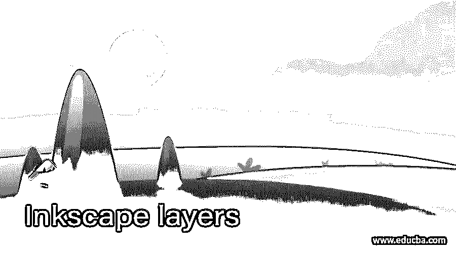

## Inkscape 图层简介

在使用该软件的过程中，Inkscape 层对于生成一个用户友好的环境起着非常重要的作用，换句话说，您可以完全控制您的插图对象，并根据您的要求安排它们的序列结构。你可以把它理解为面包片，如果你把某样东西放在最上面的面包片上，你首先会看到它，就像在 Inkscape 中一样，我们使用层来使不同层上的对象具有不同的属性，这样我们就可以管理它们，而不会干扰我们插图中的其他对象。

### 如何创建图层并在 Inkscape 中使用它们？

默认情况下，Inkspcae 软件的用户界面左侧会有图层面板。

<small>3D 动画、建模、仿真、游戏开发&其他</small>

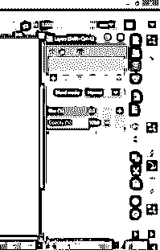

让我们结束这一切。

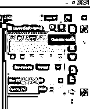

现在，您将从该列表中再次拥有该面板。你可以通过点击箭头键打开这个列表。

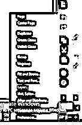

还有一个选项，通过它你可以打开图层面板，为此你必须去菜单栏的图层菜单。在向下滚动列表中，我们有层选项，点击它，你可以有层面板。

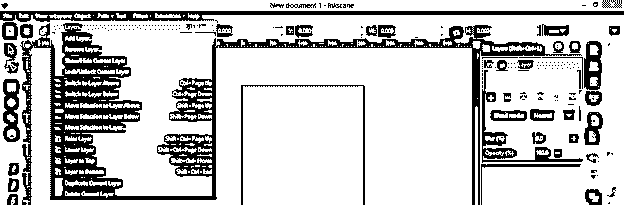

现在无论你创建什么，它都将在图层上创建，现在我们在图层面板中有一个图层，所以我的创建圆将在这个图层上。

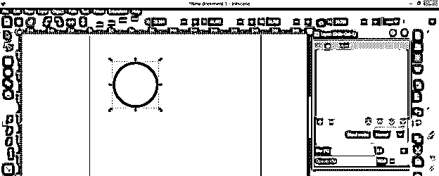

我们有眼睛按钮层面板中的层。

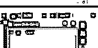

通过禁用它，我们可以隐藏该层的对象。

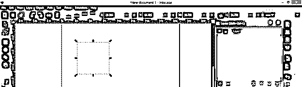

在眼睛按钮旁边，图层上有一个锁图标。

如果我点击它，那么它将锁定选定层的对象，现在我们不能在锁定层的对象中进行任何类型的编辑。

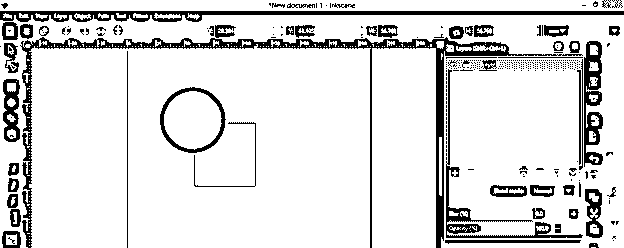

你可以根据自己的需要重命名图层，只需点击图层名称并输入你想要的图层名称。

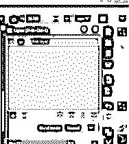

“图层”面板中可以有许多图层。让我们在图层面板中创建一个新图层，然后点击这个面板的“创建新图层”按钮。

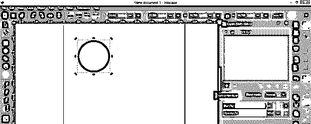

当你点击这个按钮时，一个对话框将会打开。在这里，您可以根据自己的选择再次命名该层。它将采取的名称在序列中已经有层，例如我有一个层的名称为“第一层”在图层面板中，现在你可以看到它建议我下一层的名称为第一层 1。

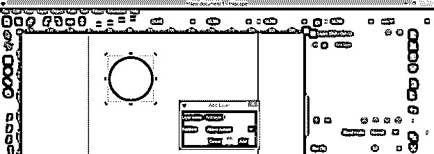

我将命名为第二层。这里，我们在框中有位置选项，这也意味着您可以添加新层到当前层的上面或下面，或者您也可以将其添加为选定层的子层。

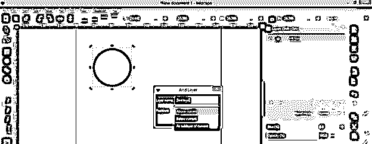

点击这个对话框的添加按钮后，你将在图层面板中有一个新的图层。

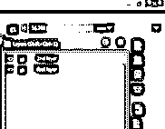

你可以通过用鼠标移动任何层来上下移动该层。

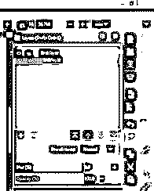

“将当前图层提升到顶部”选项将帮助您将所选图层放置在图层面板的所有图层的顶部。

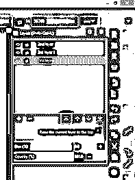

如果你想在层列表中上移一层，你可以选择“提升当前层”选项。

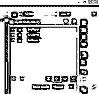

与上面的选项相同，我们有两个选项用于列表中的下一层。为此，您可以尝试这些选项。

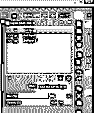

您在工作过程中创建的任何对象都将位于您选择的层上。例如，我将选择图层面板中的第二层，并使用工具面板中的矩形工具绘制一个矩形。

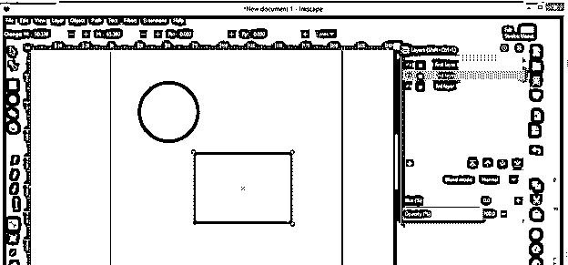

你可以看到，如果我隐藏第二层，那么只有矩形我们被隐藏，因为它是在这一层上创建的。所以在创建你的对象时，确保你在正确的图层上。有一点我也会用这个例子来解释，你可以理解图层面板的重要性，当我隐藏第二层的对象时，它不会干扰其他层的对象。因此，由于图层面板及其功能，您可以分别处理不同的对象。

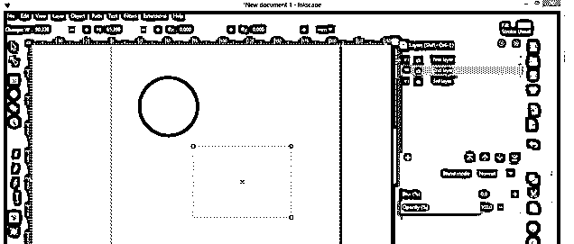

该对象将位于文档区域中其他对象的下方，该层位于其他层的下方。这里我有第二层低于第一层，所以第二层的矩形低于第一层的圆形。如果你想让它在上面画圈，你可以在图层面板里移动它的图层。

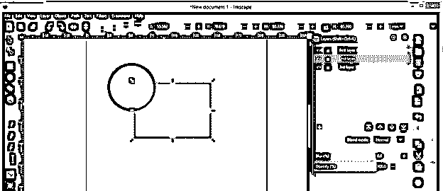

现在，当我选择圆形时，我会自动移动到图层面板的第一层。我可以从图层面板的不透明度选项中减少任何图层的不透明度。不透明度可以定义为任何对象的不透明度。

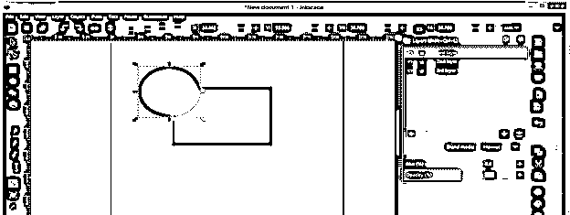

使用此面板的模糊选项，您还可以使图层中的任何对象变模糊。

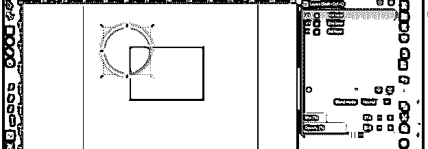

有一个混合模式选项，通过它你可以改变选中层的对象。例如，我选择了圆形，然后将其模式改为屏幕，你可以看到，由于两个对象的颜色混合，我们有其他颜色。

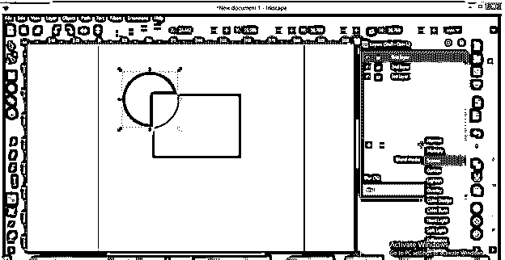

我们经常面对的一件事是，我们错误地在错误的图层上创建了对象，Inkscape 对此也有解决方案。这个蓝色的矩形在第一层，我想把它移到第二层。所以我会选择它。

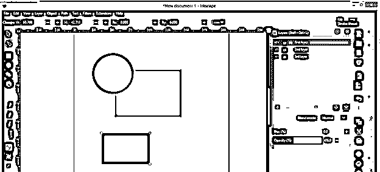

因此，去层菜单，并点击'移动选择层以下'的选项。

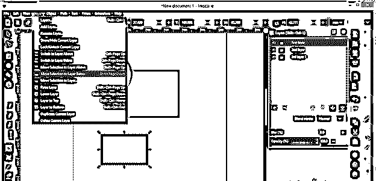

现在它在第二层。

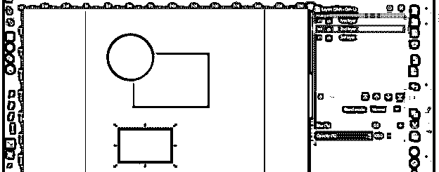

你可以记住“切换到层”选项的快捷键，这样你可以快速地从一层跳到另一层，或者你可以浏览这个菜单的这些选项。

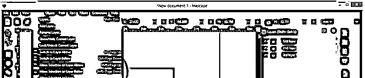

通过“复制当前图层”选项，您可以在图层面板中复制选定的图层。

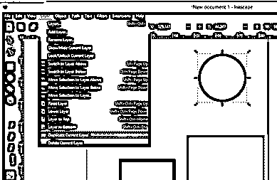

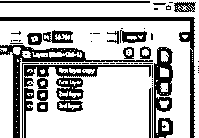

### 结论

我已经向你解释了图层面板的所有重要特性和事实，也告诉了你为什么图层面板很重要？现在，您可以通过在工作中添加图层面板来简化 Inkscape 软件的工作。

### 推荐文章

这是一个 Inkscape 层的指南。在这里，我们讨论如何创建图层，并在 Inkscape 中使用它们，以及图层面板的所有重要功能和事实。您也可以看看以下文章，了解更多信息–

1.  [喷墨替代](https://www.educba.com/inkscape-alternative/)
2.  什么是 Inkscape？
3.  [GIMP 字体](https://www.educba.com/gimp-fonts/)
4.  [GIMP 中的模糊效果](https://www.educba.com/blur-effect-in-gimp/)

