# 水墨作物

> 原文：<https://www.educba.com/inkscape-crop/>

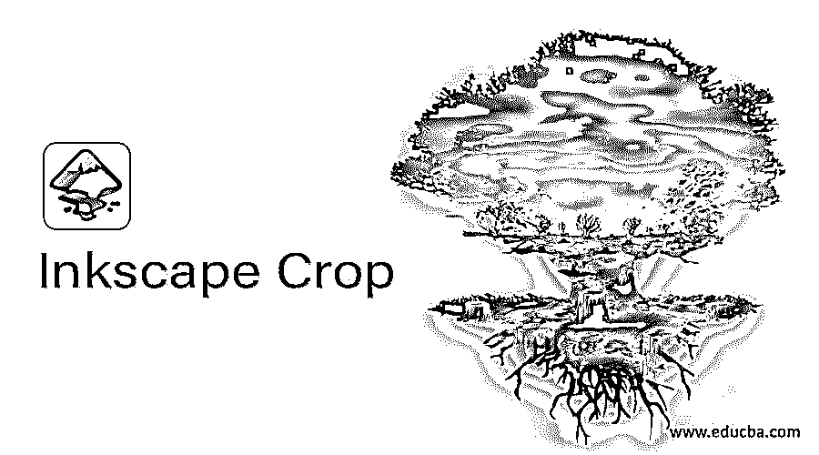

## 墨景作物简介

InkScape Crop 是一种方法，通过这种方法，我们可以根据我们的要求裁剪图像的任何部分，或者以不同的方式裁剪图像，以便对其进行有效的操作，为此，您必须管理这种技术的不同类型的参数。为了在这个软件中进行裁剪，我们将使用工具面板中的一些工具，并浏览菜单栏中的选项。因此，今天在 eduCBA 的文章中，我们将分析作物技术的不同方面，以便以更相关的方式学习。你对和我们一起学习这个话题感到兴奋吗？我想是的，让我们开始吧。

### 如何在 Inkscape 中进行裁剪？

我们只需遵循几个简单的步骤就可以做到这一点，但让我们先介绍一下 Inkscape 软件的用户界面，以便您能够理解我将在本文中用来解释每个步骤的术语。

<small>3D 动画、建模、仿真、游戏开发&其他</small>

在顶部，你会发现一个我们称之为菜单栏的栏，它有许多菜单，如文件、编辑、查看和其他。在此栏下面还有另一个栏，是活动工具或图像(您正在使用的)的属性栏，在用户屏幕上向下移动有三个部分，其中左侧是工具面板，中间是文档的显示窗口区域，右侧是一些导航工具。您可以根据自己的需要向该屏幕添加更多的面板或工具。

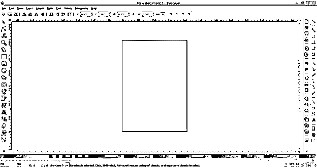

为了在 Inkscape 中完成这个任务，我们需要一个图像，因为我将通过一个图像的例子来展示裁剪，所以让我们有一个图像。你可以使用你自己的图片或者从网上下载。在这个软件中打开任何图像有很多方法，但是我们将进入菜单栏的文件菜单的打开选项，并点击这个选项。

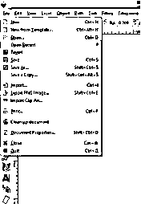

将会打开一个选择所需图像的对话框，从个人计算机的保存位置选择所需图像。我将选择此图像，您也可以在此框中看到所选图像的属性。现在点击这个对话框的打开按钮。

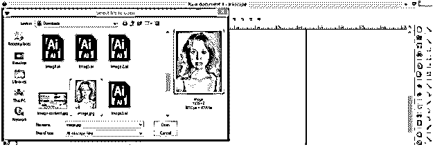

现在从工具面板中选择“矩形和正方形”工具，或者你可以按 F4 作为这个工具的快捷键。

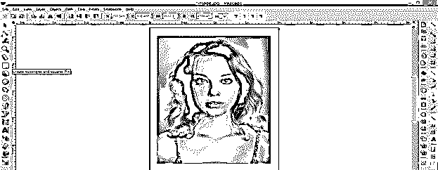

现在在你想要裁剪的区域或图像上画一个矩形或正方形。我会像这样画它。

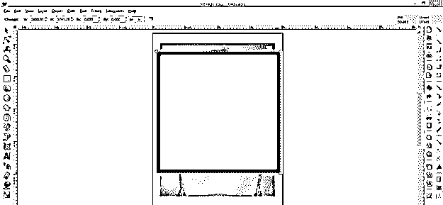

现在从工具面板中选择“选择和变换对象”工具，或者你可以按键盘上的 F1 键来快速访问这个工具。

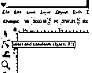

按住键盘的 shift 键，然后用该工具的光标逐个单击该矩形和图像，以便同时选择两者。

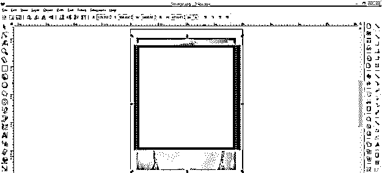

现在转到菜单栏的对象菜单，然后浏览下拉列表中的剪辑选项，然后点击该选项的设置子选项。

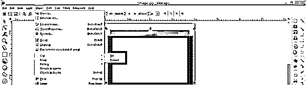

然后你的裁剪就按照你设置的矩形工具的参数做好了。

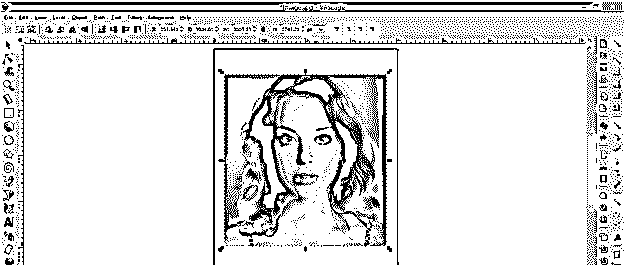

如果您发现裁剪区域不符合您的要求，那么您可以再次进入剪辑选项，这一次单击此选项的释放子选项来释放此剪辑。

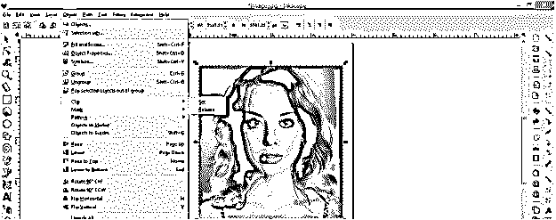

它将像以前一样发布。现在根据你做出调整。

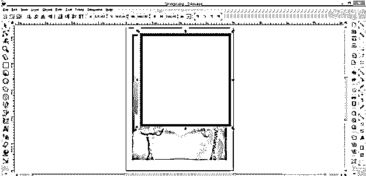

再次经历同样的选择来种植新的作物。您可以根据需要多次更改裁剪的对象。

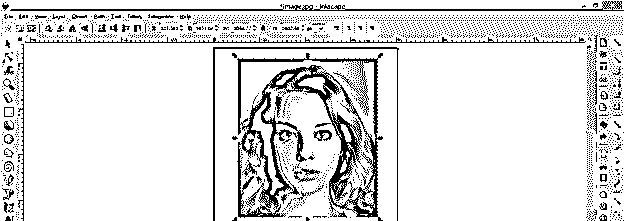

你也可以做一个圆形的裁剪，为此，你必须在工具面板上做一个圆形或椭圆形的工具，或者你可以按 F5 作为快捷键。

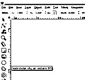

再次做同样的事情，这是一个圆形或椭圆形，根据你想裁剪你的图像。我会把它做成这样。

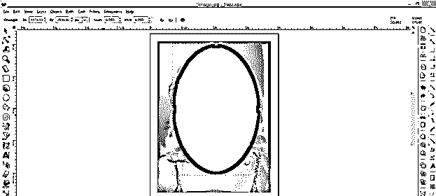

现在，让我们看看另一种方法来达到剪辑选项进行裁剪。通过选择工具选择图像和椭圆后，右键单击显示窗口区域的任意位置，然后单击下拉列表中的设置剪辑选项。

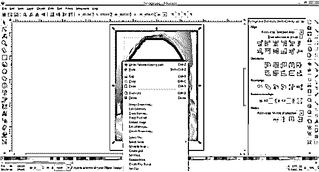

它将根据我们绘制的椭圆像这样裁剪。

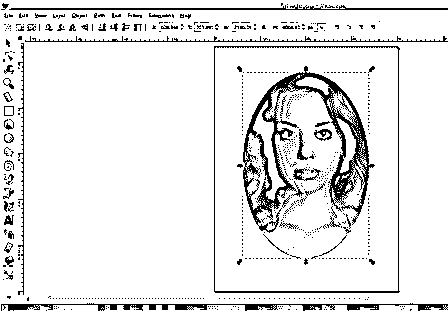

如果您想在此裁剪中进行任何更改，请再次右键单击图像区域，这次单击下拉列表中的“释放剪辑”选项。

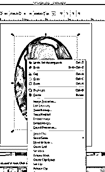

您可以使用贝塞尔工具制作随机形状，而不是通过几何形状进行裁剪。所以从工具面板中选择贝塞尔工具或者按 Shift + F6 作为快捷键。

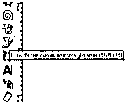

用贝塞尔工具画一个像这样的随机形状。如果 bezier 工具生成的路径没有关闭，它也会被裁剪。

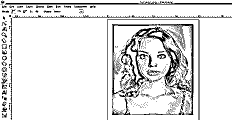

现在选择你用贝塞尔工具绘制的图像和随机形状。

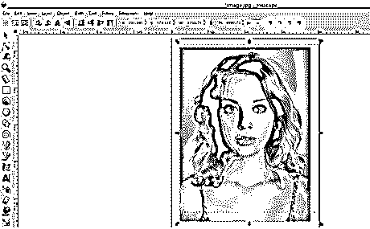

看看神奇的是，这是根据我们的随机形状裁剪的。

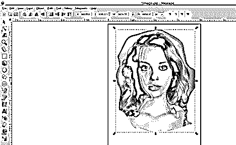

现在让我们做些不同的事情。再次使用工具面板中的椭圆工具，制作多个这样的椭圆，或者你可以制作一个椭圆，然后复制另一个椭圆，然后根据你的选择来管理它们的大小。我会用这些椭圆做这种排列。如果需要正确对齐，可以使用对齐面板的对齐选项来对齐这些椭圆。

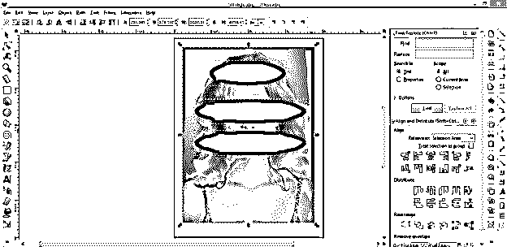

现在选择所有椭圆，并通过菜单栏对象菜单下拉列表中的分组选项将它们分组，或者您可以按 Ctrl + G 来完成此操作。

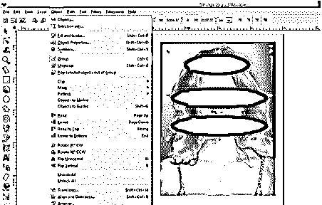

现在用我们上面讨论过的任何一种方法来选择裁剪选项，你将得到这种类型的裁剪图像。

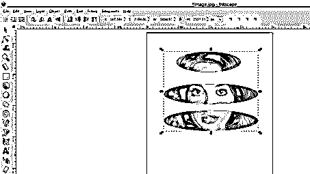

这些是在 Inkscape 软件中进行裁剪的一些有趣的步骤。

### 结论

我想我们已经解释了在这个软件中进行裁剪的很好的技术，你也学会了使用这个过程的全部参数，你可以控制这些参数以在你的工作中获得有效的结果。现在去用一些图片来试试 Inkscape 工具的这个功能，以便更好地掌握它。

### 推荐文章

这是一份水墨风景作物指南。这里我们讨论一下入门，如何在 Inkscape 中做裁剪？和在 Inkscape 软件中进行裁剪的步骤。您也可以看看以下文章，了解更多信息–

1.  [裁剪后的效果](https://www.educba.com/crop-in-after-effects/)
2.  [Photoshop 中的裁剪工具](https://www.educba.com/crop-tool-in-photoshop/)
3.  [在 Illustrator 中裁剪](https://www.educba.com/crop-in-illustrator/)
4.  [CorelDRAW 标志设计](https://www.educba.com/coreldraw-logo-design/)

