# Inkscape text

> 原文：<https://www.educba.com/inkscape-text/>

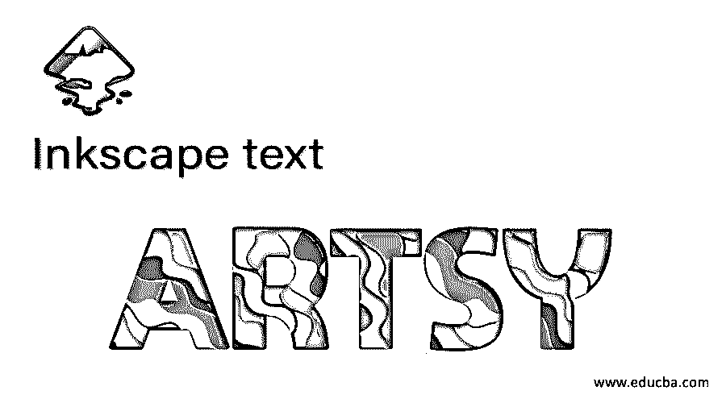

## Inkscape 文本简介

Inkscape 文本与其他设计软件的文本工具没有什么不同，但是你可以使用 Inkscape 的文本工具提供的功能做一些不同的事情。通过文本工具，你可以在这个软件中编写任何文本，在了解文本工具的不同方面和参数后，你可以将这些知识用于印刷工作。排版是为了设计的目的而将文本按不同的顺序排列。我们将从不同的角度讨论文本和文本工具，例如我们通过使用 Inkscape 的文本工具的不同功能来调整字体样式、大小间距以及文本的颜色。那么让我们找出这些特征。

在这个工具面板中，你可以找到带有这个图标的文本工具，这个工具的快捷键是键盘的 F8 功能键。

<small>3D 动画、建模、仿真、游戏开发&其他</small>

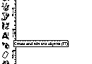

用鼠标指针在您想要开始输入文本的地方点击，然后输入您想要的文本。我会打 eduCBA。

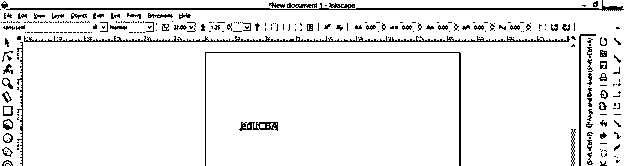

在用户界面的顶部，您可以看到一个属性栏，其中包含该文本工具的不同参数。您将在该属性栏上拥有活动刀具的参数。

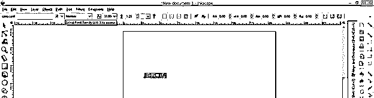

第一个是字体风格，这意味着我们有不同类型的风格，任何文字的信。你可以通过按键盘的上下箭头键来预览这个下拉列表的样式。

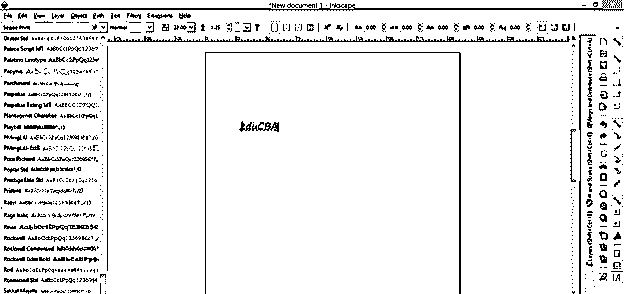

在文本参数的下一个选项卡中，您将根据字体样式找到文本字母的子样式。使用我们选择的字体样式，我们有两个子选项，一个是正常的文本厚度，另一个是粗体，它会稍微增加文本的厚度。

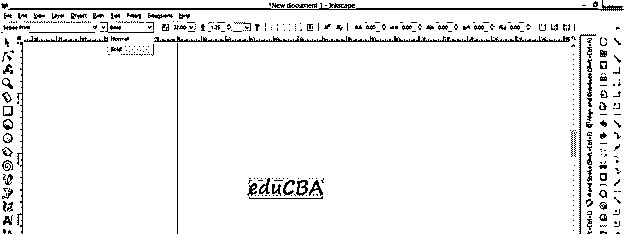

在此选项卡中，您可以增加文字的大小。要增加或减小文字大小，您必须选择文字，然后您可以从文字参数的“大小”选项卡的下拉列表中选择大小。

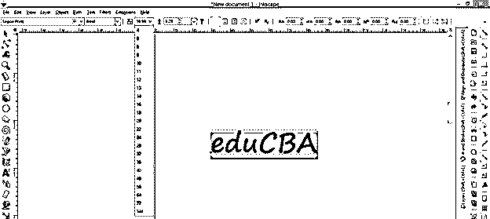

您也可以通过键盘输入来输入文本的大小值。

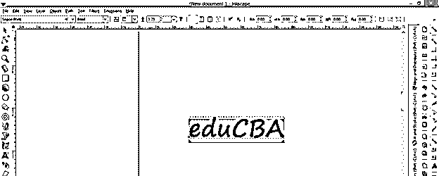

要输入下一行的文本，请按键盘上的回车键，然后输入下一行文本。现在，通过下一个选项，我们可以调整两行文字之间的距离。

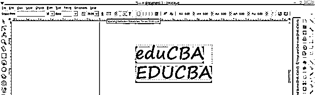

如果我们增加这个选项的值，那么文本行之间的间距将像这样在垂直方向上增加。

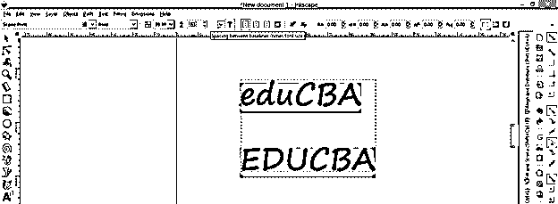

您可以通过此选项设置文本单位。

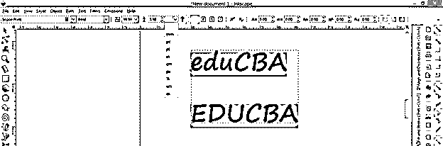

下一个选项是关于文本对齐。为此我会打出这样一个句子。现在用文本工具选择这个文本，点击文本工具参数栏的左对齐标签。

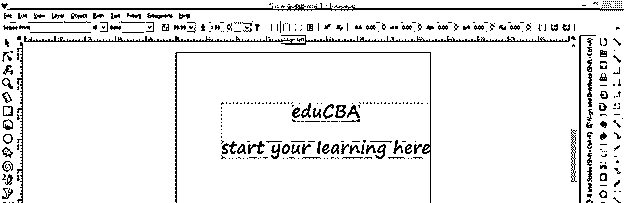

不同行中的所有文本将像这样与文档的左侧对齐。

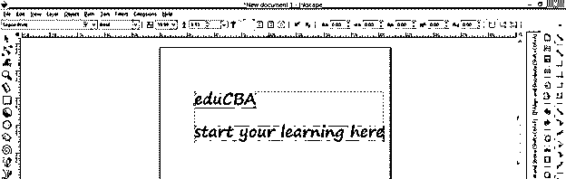

移动到下一个标签是居中对齐，它会将所有文本对齐到页面的中央。所以当你点击这个标签时，文本会像这样对齐。

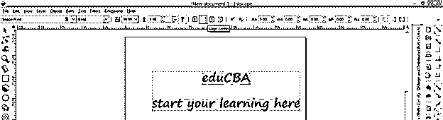

在这里，我们有右对齐选项卡，名称也是右对齐，所以单击它。确保选择了文本。

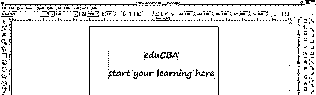

我们的文本会像这样在页面的左边对齐。

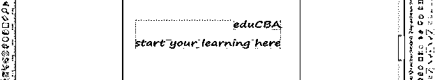

使用 next 选项，您可以将任何文本或字母设置为上标选项。因此，选择你想做上标的文字或字母，然后点击“参数”标签的“切换上标”选项。

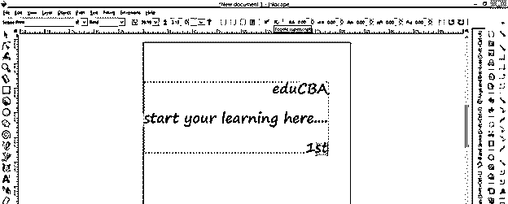

我们选择的文本将转换成这样的上标。

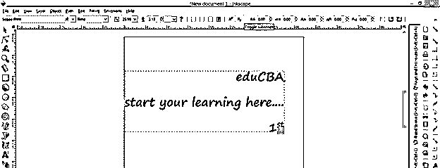

要在下标中包含任何文本或字母，您可以单击下标标签。

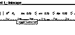

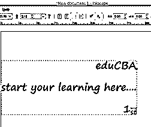

接下来，你可以调整文字的字母间距。因此，选择您的文本，并改变“字母间距”选项的值。

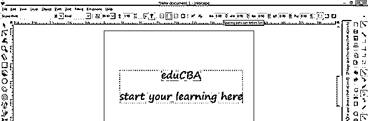

如果你增加它的值，那么间距将增加，或者如果你减少它的值，那么间距将减少。

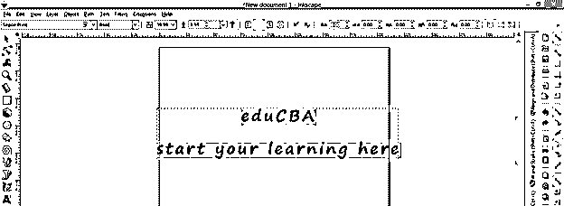

与调整字母间距相同，您可以调整单词间距。因此，我将在这里键入新的文本。

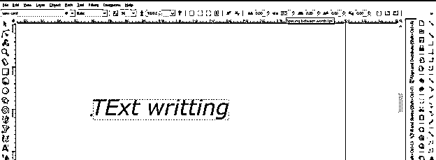

现在点击“单词间距”标签，增加它的值，间距将随着值的增加而增加。

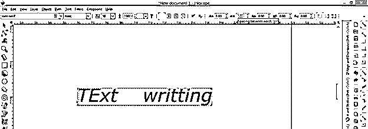

在这里，我为这段文字选择了不同的字体风格，你可以看到我们在斜体和粗斜体的子风格中有更多的选择。斜体文本会让你的文本稍微倾斜。

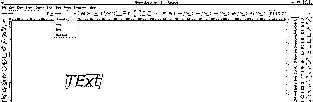

使用此栏的水平字距调整选项卡，您可以调整任何文本的每个字母在水平方向上的间距。这里我将选择这个单词的 t，并更改这个选项的值

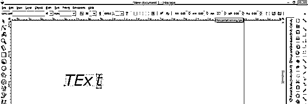

下一个标签是垂直移动，和水平选项一样，但是使用这个选项，你可以用不同的方式在垂直方向移动每个字母。你可以根据自己的选择向上或向下移动。

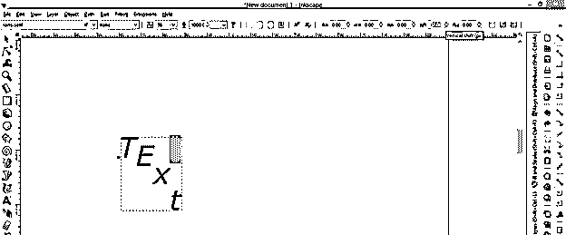

与'字符旋转'标签，您可以旋转任何文字的任何角度。我选择了这个单词的 X 字母，增加这个选项的值来旋转它。

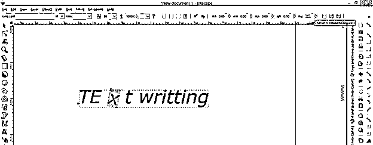

我们使用默认的书写文本设置在水平线中键入文本，但是使用垂直文本选项，您可以在垂直方向上键入文本。因此，通过单击启用该选项。

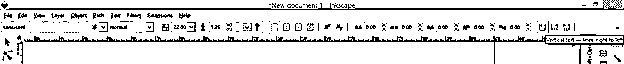

现在，当您键入文本时，它将像这样以垂直方向键入，而不是水平方向。

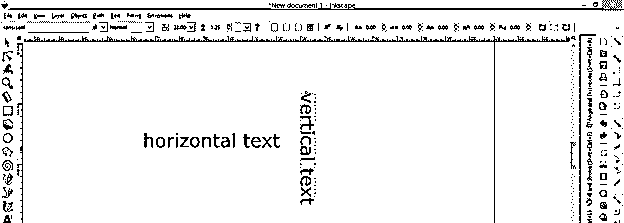

键入文本后，如果需要，您可以更改文本的大小写。因此，对于选择文本，然后转到菜单栏的扩展菜单，这是在工作屏幕的顶部，并点击它，然后转到向下滚动列表的文本选项，并导航到更改大小写选项，在此选项的弹出列表中，您将有不同的大小写文本。我将点击大写选项。你可以和名单上的任何人一起去。

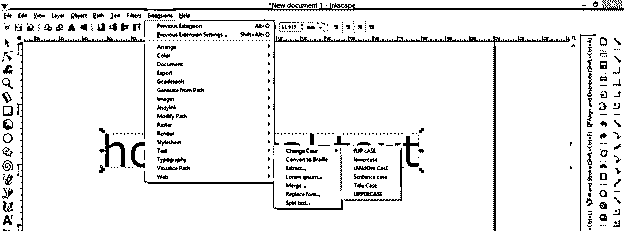

而且会有这样的变化。

### 结论

在这篇文章中，您对我学习 Inkscape 软件的文本和文本工具的体验如何？我认为这很好，你现在可以很容易地在 Inkscape 中为不同的设计目的处理文本，并在你的工作中获得最佳效果，也可以做排版。

### 推荐文章

这是一个 Inkscape 文本指南。在这里，我们讨论了文本和文本工具在不同的点，如我们调整字体风格，大小间距以及颜色的文本使用不同的功能。您也可以看看以下文章，了解更多信息–

1.  [喷墨替代](https://www.educba.com/inkscape-alternative/)
2.  什么是 Inkscape？
3.  [GIMP 工具箱](https://www.educba.com/gimp-toolbox/)
4.  [GIMP 字体](https://www.educba.com/gimp-fonts/)

