# Inkscape G 码

> 原文：<https://www.educba.com/inkscape-g-code/>

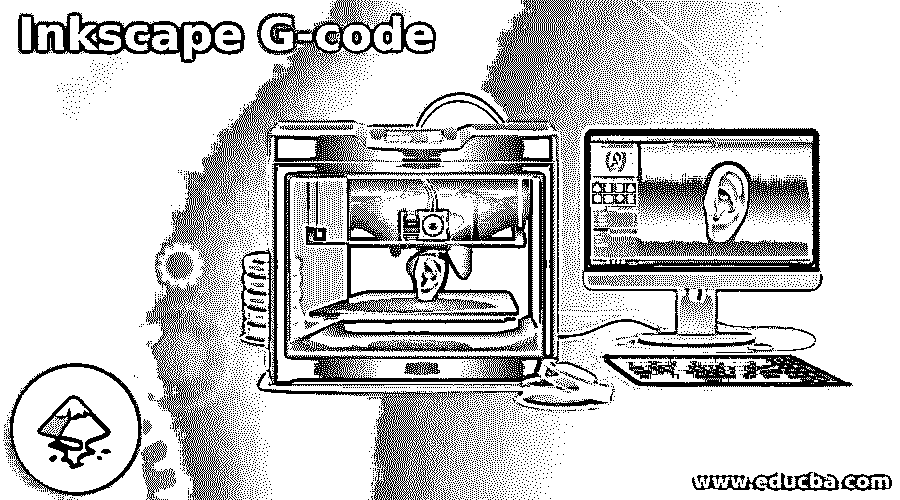

## Inkscape G 代码简介

g 代码是在机械和工业中使用的一种流行的数字计算机编程代码。3D 打印机、激光切割机、乙烯基打印机、切割机等机器以及工厂和工厂使用的机器都使用 g 代码。这些机器是计算机化的，使用 g 代码来识别材料的速度、变化和性质。Inkscape 是一个矢量程序，它有一个特殊的扩展来创建和准备 g 代码编程，具有最高的准确性。

### 如何在 Inkscape 中创建 g 代码？

主要地，g 代码被机器用来指定 X、Y 和 Z 位置的坐标或顶点。使用这种编程语言的主要目的是命令和指导工具，如记号笔、刀片、研磨机中的钻孔工具或绳索发射工具，以执行和创建所需的结果。

<small>3D 动画、建模、仿真、游戏开发&其他</small>

g 代码不是一个程序，而是一种专门由机器使用的代码语言。g 代码使用的文件由机器的预期项目和结果决定。比如说；3D 打印机仅支持 3D 文件，而文鼎或切割机需要 2D 文件。

用户可以通过两种方法用 Inkscape 文件创建 g 代码。

使用第一种第一种方法，用户可以用程序中已有的插件和扩展为 Inkscape 文件创建 g 代码。

而在第二种和方法中，用户将需要一个额外的程序来转换和查看 g 代码和输出。

#### 方法 1

因为我们都知道 Inkscape 不是一个 3d 程序。因此，要将 g 代码用于 3D 打印机，我们需要创建一个 3D 效果来获得想要的结果。这种技术很熟练，但是对于用户来说，有时可能是一个令人困惑或耗时的过程。尽管如此，在不使用任何外部程序的情况下，Inkscape 能够为机器创建 g 代码。

以下是在 Inkscape 中创建 g 代码的步骤

1.  启动 Inkscape

2.  创建新文件

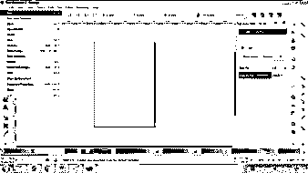

3.  创建一个新的层，通过去层>添加层

4.  在这个图层上创建任何形状

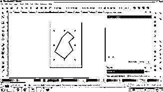

5.  再次添加一层，并复制相同的形状在这一层

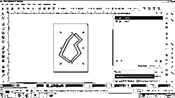

6.  应该以这样的方式调整形状，使得它们看起来像具有硬边的 3D 形状。

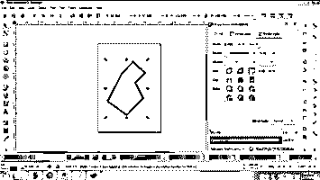

7.  现在，进入扩展>g 代码工具并选择工具库

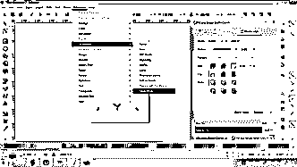

8.  将出现一个对话框。这些是提供给用户的选项，用于选择他们想要的切割方式的工具。从对话框中选择“圆锥体”,然后单击“应用”。这个方法必须一个接一个地对每个单独的层进行。

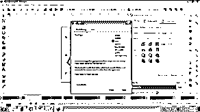

9.  第 1 st 层将出现一个绿色框，指定 g 代码的首选项。如果需要，用户可以点击该框并在那里编辑设置。

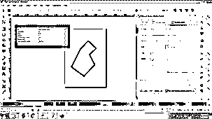

10.  类似地，不同的盒子也将与其他层一起创建。用户可以从框中修改设置。

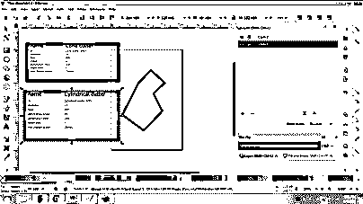

11.  接下来，我们需要在 3D 打印机中输入要切割的形状的方向源和点。为此，转到扩展>g 代码工具>方向点。设置需要创建的拉伸的方向源和性质。

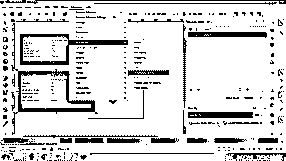

12.  最后，输入所有设置后，进入扩展>g 代码工具>g 代码路径。设置首选项，然后单击确定继续。

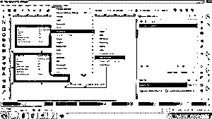

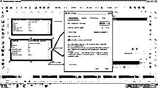

13.  等待这个过程完成，你会得到一个 3D 打印机打印你的设计的程序。

#### 方法 2

在这个方法中，我们将在 Inkscape 上创建一个 2D 矢量形状，并将文件保存为 SVG 格式。然后，我们下载一个名为 Slic3r 的额外开源程序，将我们的文件转换成 g 代码程序，以便打印。

以下是创建 g 代码文件的步骤:

1.  启动 Inkscape 并创建一个新文件。

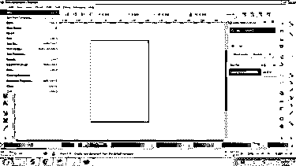

2.  点击多边形并在画布上创建一个多边形

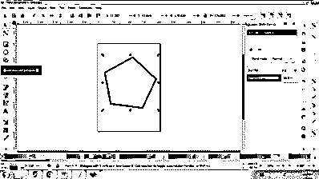

3.  将文件保存在中。svg 文件格式

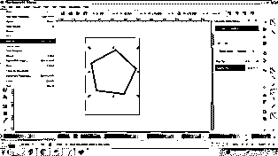

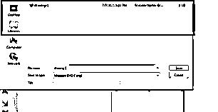

4.  现在，因为我们需要一个三维形状，我们去 www.tinkercad.com

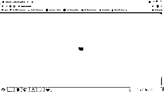

5.  这是一个在线网站。SVG 文件转换为三维形状。STL 格式。

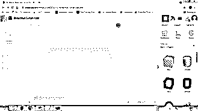

6.  导入。SVG 文件，编辑形状的深度，并将其导出到。STL 文件格式。

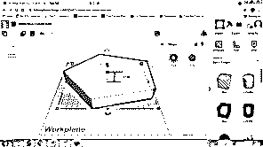

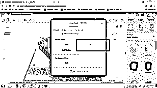

7.  接下来，下载一个第三方开源程序 Slic3r。

8.  导入。程序中的 STL 文件

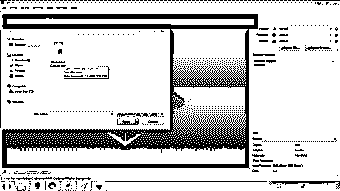

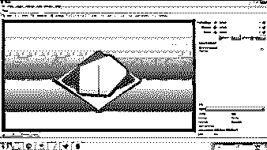

9.  现在，点击导出 g 代码，如下所示。

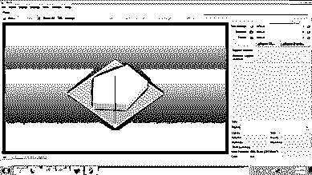

10.  出于打印目的，该文件将以 g 代码格式导出。

### 结论

如果没有系统地执行所有步骤，并且顺序不正确，那么使用 g 代码语言创建程序和代码可能是一个难题。与其他矢量程序非常不同，Inkscape 为用户提供了一个无障碍的平台来生成用于 3D 机器打印的 g 代码。总的来说，Inkscape 是一个完善的程序，具有多种功能和工具用于各种目的。

### 推荐文章

这是一个 Inkscape G 代码的指南。这里我们讨论如何在 Inkscape 中创建 g 代码，以及用户创建代码的两种方法。您也可以看看以下文章，了解更多信息–

1.  [甲骨文解码](https://www.educba.com/oracle-decode/)
2.  [代码审查工具](https://www.educba.com/code-review-tools/)
3.  [MySQL encode()](https://www.educba.com/mysql-encode/)
4.  [PHP json_decode](https://www.educba.com/php-json_decode/)

