# 墨景镜

> 原文：<https://www.educba.com/inkscape-mirror/>

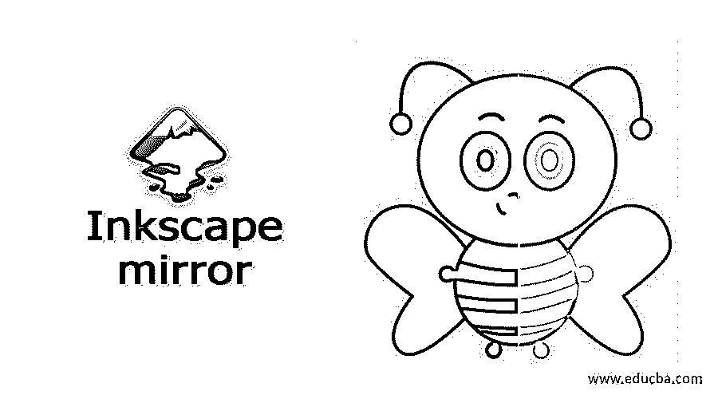

## Inkscape mirror 简介

在 Inkscape 中创建插图时，Inkscape 镜像是一个非常有用的功能。它帮助我们非常容易地制作对称的物体，为此，我们只需创建物体的一面，然后通过使用镜像功能，我们可以在几秒钟内创建另一面。如果您不再需要该部分，可以移除源对象。没有名为 with Mirror 的特定工具，但是我们可以通过几种方式镜像对象，今天我们将讨论所有这些方式，以便更好地理解用于不同类型目的的镜像对象。让我们开始讨论吧。

### 如何在 Inkscape 中使用 Mirror？

我们在这个软件中为不同类型的目的做了一个对象的镜像，它也使复杂的设计变得容易，并且节省了我们的时间。在开始讨论这个话题之前，我将使用贝塞尔工具创建一个简单的设计。您也可以按 B 作为该工具的快捷键。

<small>3D 动画、建模、仿真、游戏开发&其他</small>

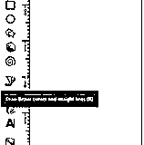

我用这个工具画了这个像锅一样的形状来解释这个话题。这是罐子的一半形状，我希望它的左边也是同样的形状，这样罐子的两边就对称了。我们也可以用贝塞尔工具来做这个，但是有可能我们不能在另一边得到和这个罐子的第一边一样的曲线，这需要时间来精确地匹配两边，这就是为什么我们要镜像这个物体的这一半。

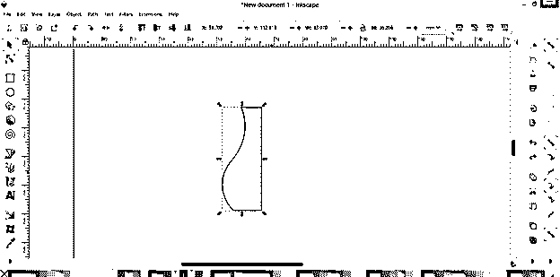

我想在这个绘制的形状的另一边有相同的形状，所以首先，我将复制这一半。要复制该对象，首先选择该对象并右键单击它。然后选择复制选项，或者你可以在选中这半个对象后简单的按下键盘的 Ctrl + d 键，它就会在同一个地方复制这个对象。

现在让我告诉你第一种方法，通过它你可以镜像这一半。现在转到对象并单击它，然后从下拉列表中选择水平翻转选项，或者您可以按键盘的 H 键作为快捷键。

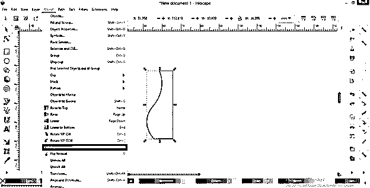

一旦你点击这个选项，它会像这样在它的位置上翻转这个半对象的副本。

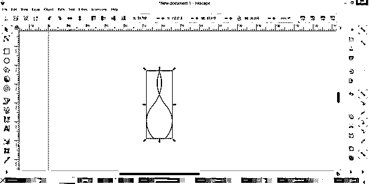

现在，您可以通过按住该键的 Ctrl 键将它向源对象的相反方向拖动，它将捕捉到源对象的端点。

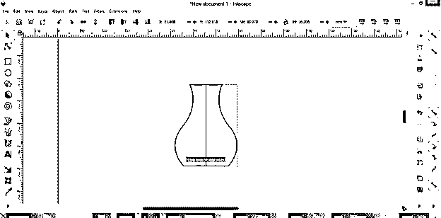

如果您不想让源对象保持在原来的位置，则没有必要复制源对象。例如，您可以选择一个源对象，然后再次选择“水平翻转”选项。

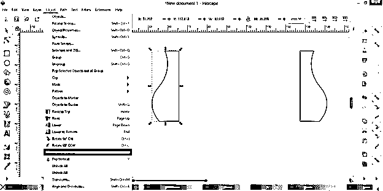

它会在一个地方水平翻转，这意味着你会在同一个地方得到它的镜像。

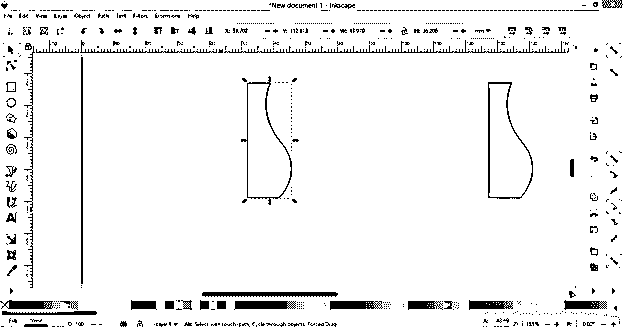

与沿水平线翻转对象相同，您也可以沿垂直线翻转对象，为此，请选择所需的对象，然后从同一对象菜单中选择“垂直翻转”选项。

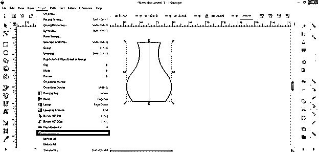

你会在垂直线的同一位置得到所选物体的镜像形状。

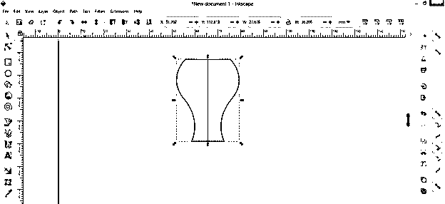

现在让我们讨论另一种方法，通过这种方法，你可以做一个物体的镜像。我将选择这两个对象并转到菜单栏的路径菜单，然后单击它。在下拉列表中，选择路径效果选项。您也可以按下键盘上的 Ctrl + &按钮来使用此选项。

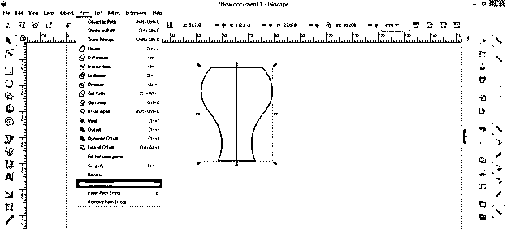

一旦你点击这个选项，你会在工作窗口的右边找到路径效果面板，但是你可以看到在这个面板的按钮上有一个信息，这个面板的选项只有在选择了一个项目的情况下才起作用。

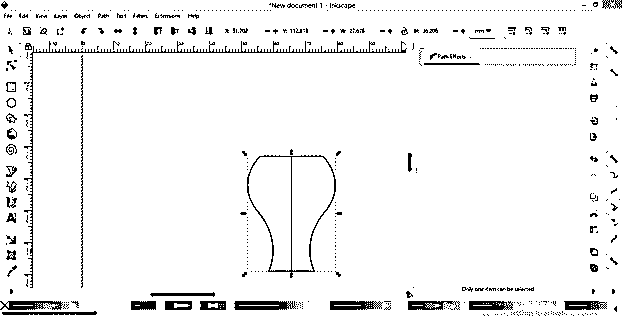

所以我们必须首先只选择一个对象。所以我将把左边的部分放在一边，然后只选择右边的部分。现在你可以看到添加路径效果按钮在这里变得活跃。

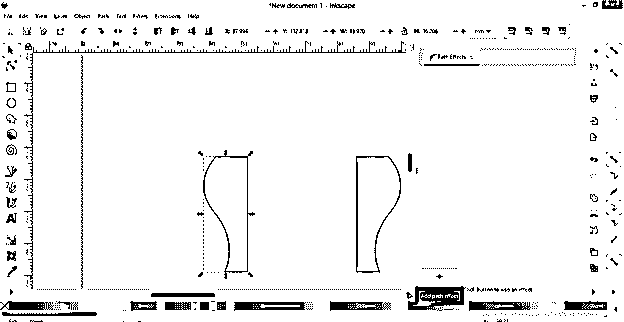

一旦你点击添加按钮，实时路径效果选择框将被打开。

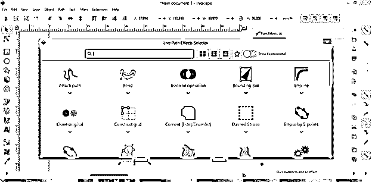

在此对话框中向下滚动，会在列表中找到镜像对称效果，也可以直接在此对话框的搜索框中搜索。现在点击它，让它出现在路径效果面板上。

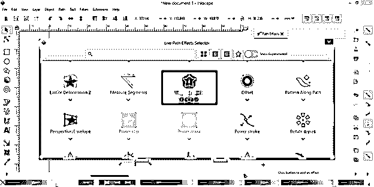

你可以看到它是我们所选对象的一面镜子。

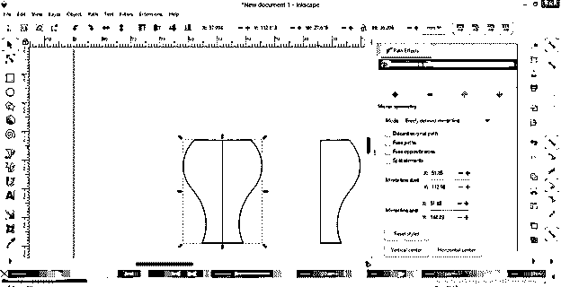

这个框中有一些参数，您可以使用它们在镜像对象中进行不同类型的更改。第一个是模式，模式里有一些选项。如果您从列表中选择“水平页面居中”选项。

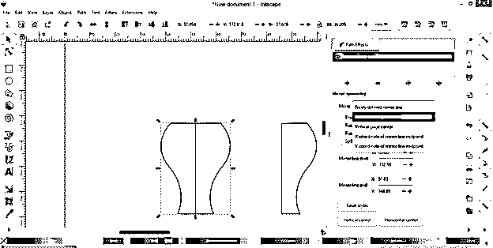

然后，它将沿文档页面水平排列源对象和镜像对象。

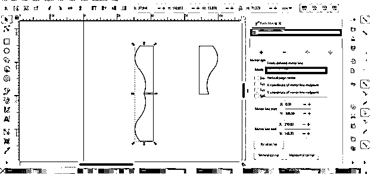

如果您选择“垂直页面居中”，那么它会将它们排列在文档页面的垂直轴上，并且与页面中心的距离相等。

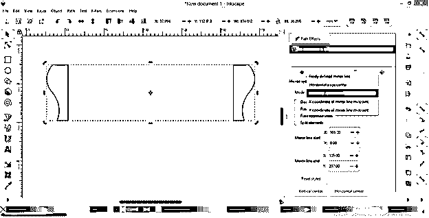

如果镜像后不想要源对象，则可以启用“镜像对称”选项卡中的“放弃原始路径”选项。

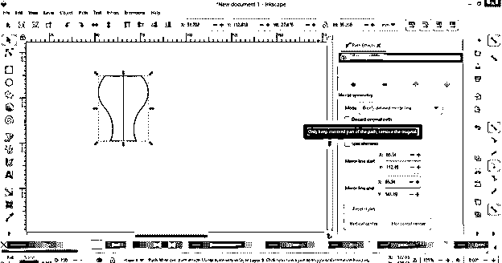

它会像这样删除源对象。

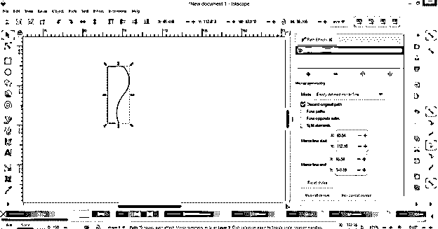

如果您从“镜像对称”对话框中启用“融合路径”选项，那么它将删除源对象和镜像对象之间的镜像线。

如果您愿意，您可以通过更改此对话框“镜像线起点”选项上的 x 或 y 轴值来更改镜像线的起点，它会像这样更改。

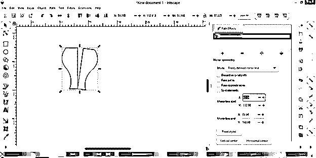

您可以从“镜像线端点”选项对镜像线的端点进行同样的操作。

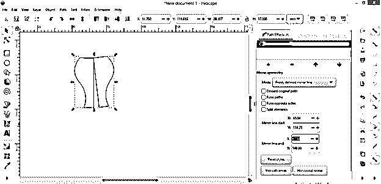

在这个镜像效果中有更多的选项，你可以使用它们来获得不同的效果。

### 结论

现在，在这篇文章之后，你有两种方法在 Inkscape 中为不同的目的镜像任何对象。我建议你在镜像对称效果的每一个参数上做一些变化，这样就可以有更多的命令来镜像物体，一旦你有了命令，你就可以非常容易地创建许多复杂的形状。

### 推荐文章

这是一个关于墨景镜的指南。这里我们讨论在 Inkscape 中为不同目的镜像任何对象的两种方法。您也可以看看以下文章，了解更多信息–

1.  [印花布影](https://www.educba.com/inkscape-shadow/)
2.  [Inkscape 与网格对齐](https://www.educba.com/inkscape-snap-to-grid/)
3.  [水墨渐变](https://www.educba.com/inkscape-gradient/)
4.  [油墨层](https://www.educba.com/inkscape-layers/)

