# Inkscape 圆角矩形

> 原文：<https://www.educba.com/inkscape-rounded-rectangle/>

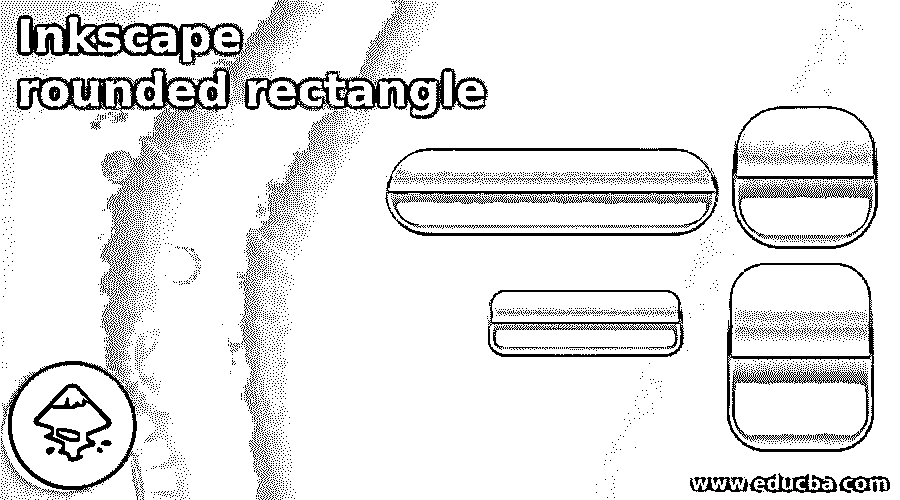

## Inkscape 圆角矩形简介

以下文章提供了 Inkscape 圆角矩形的轮廓。在这篇文章中，我们将学习在基于矢量的软件 Inkscape 中创建、修改和渲染形状。具体来说，针对矩形和基本形状，我们将学习使用不同的方法来创建和修改形状，使用节点和过滤器。

Inkscape 是一个免费的矢量程序，它有多个动作过程来完成一项任务。我们将学习在节点和路径选择工具的帮助下创建圆形的所有方法。

<small>3D 动画、建模、仿真、游戏开发&其他</small>

### 如何在 Inkscape 中创建圆角矩形？

如上所述，用户可以通过三种方式编辑现有节点，并使它们的角变圆或圆角(如程序中所调用的)。就表演和应用效果而言，所有的技术都是相互独立的。

**方法一:**

这是在 Inkscape 中创建圆角矩形的最简单的方法。但是，使用这种方法，用户可以编辑整个矩形的节点，而不是选择要编辑的单个节点，然后修改圆角矩形。

尽管这可能是用户关心的一个问题，但有时它展示了创建圆角矩形的最快和最简单的技术。

以下是步骤:-

1.  启动 Inkscape 并创建一个新文件

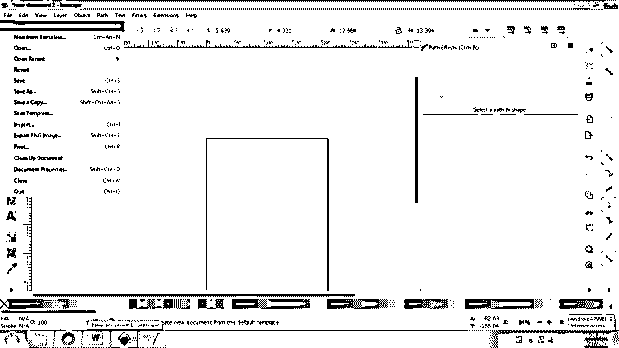

2.  创建一个矩形，如下图所示

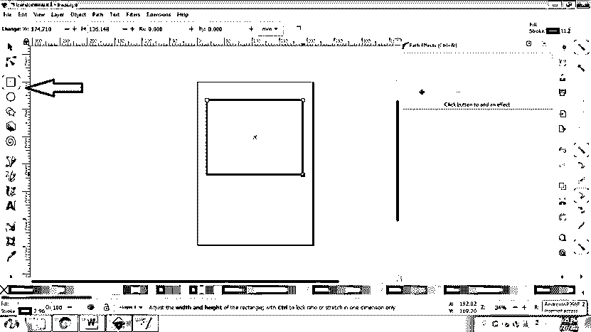

3.  从工具箱中选择*编辑节点路径工具*，或者从键盘上按 N 键

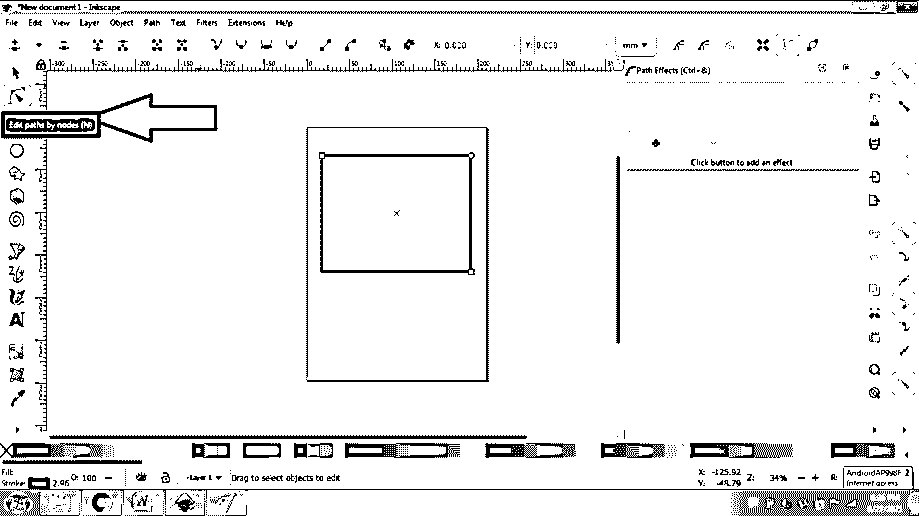

4.  从选项面板中选择*制作所选线段曲线*，如下图所示

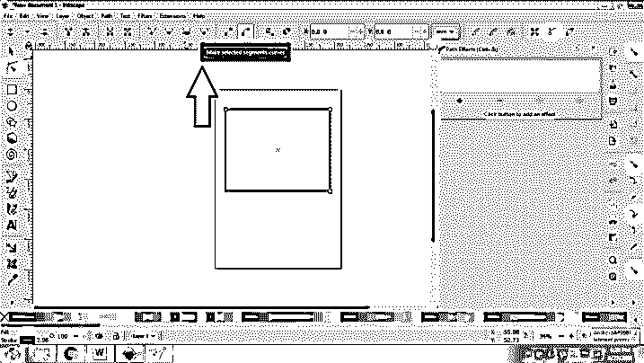

5.  在这种方法中，我们一次只能修改一个节点，并编辑对象的形状。
6.  向内拖动节点以使矩形变圆。

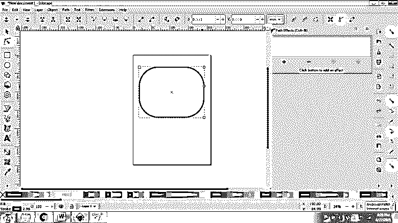

7.  我们可以在命令面板中看到 X 和 Y 轴的值，以及当我们向内拖动节点时它们是如何修改的。

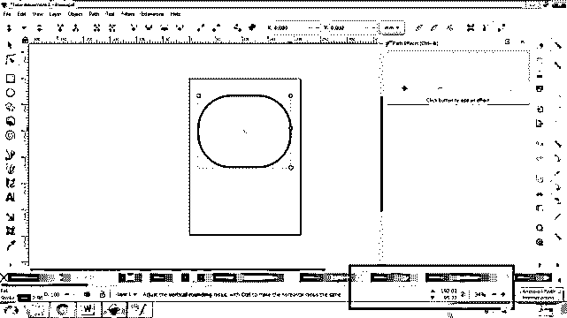

8.  此外，我们可以再次向外拖动节点，像以前一样拉直矩形。

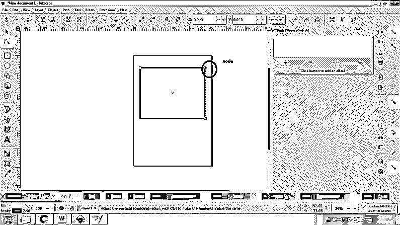

**方法二:**

在这种方法中，我们将根据需要使用路径过滤器来编辑形状。这个工具或过滤器的好处是，用户可以通过选择单个节点来编辑矩形。路径滤镜有许多效果，不仅可以应用于基本形状，还可以应用于绘图和复杂的艺术作品。

这是修改对象的最有效的方法，具有完美的准确性和良好的效果。

以下是用这种方法创建圆角矩形的步骤:–

1.  启动 Inkscape 并创建一个新文件

2.  创建一个矩形，如下图所示。

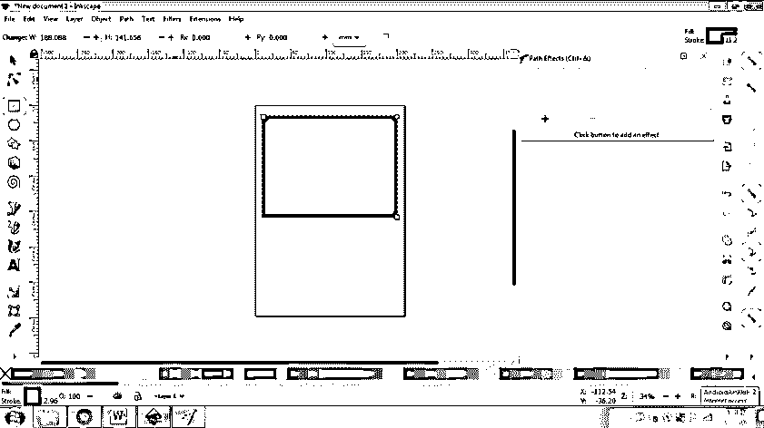

3.  转到路径>路径效果(Ctrl+&)

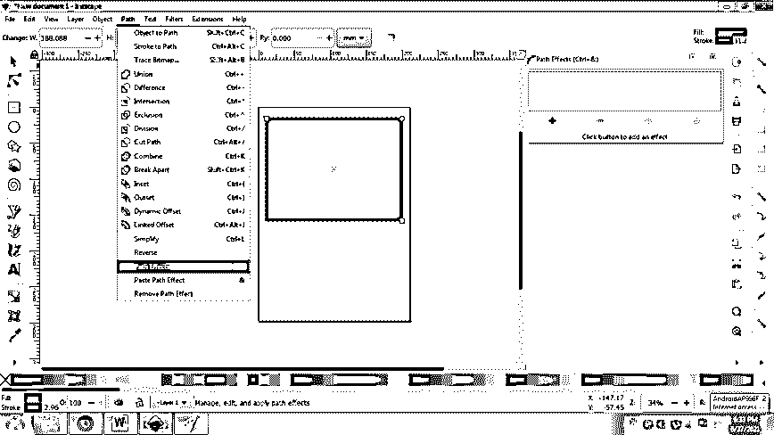

4.  将打开一个不同的选项卡来添加/删除路径效果。

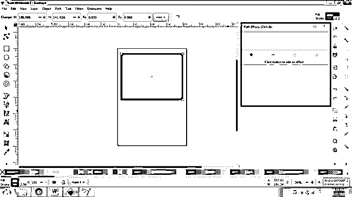

5.  在该选项卡中，点击 **+** 符号，为对象添加路径效果，如下图所示。

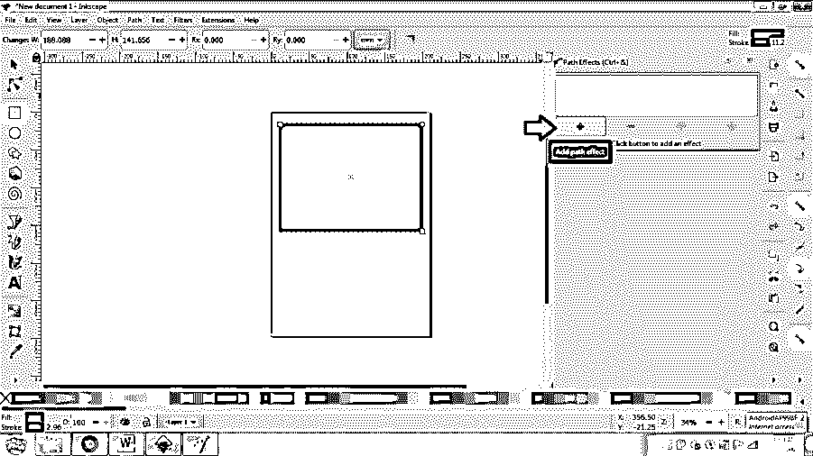

6.  双击角(圆角/倒角)选项

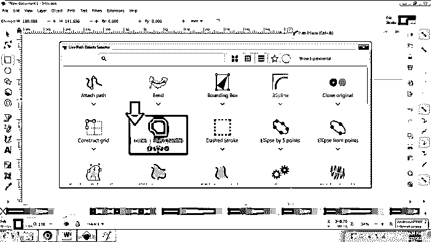

7.  该效果将应用于如图所示的形状

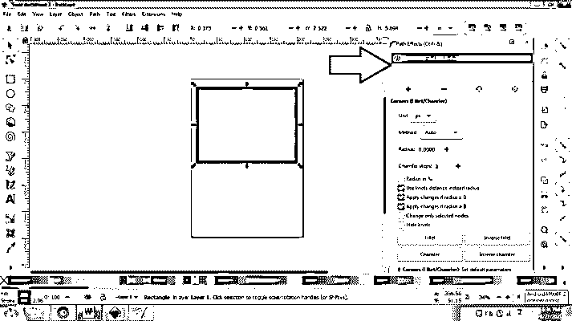

8.  但是，现在还看不到。要创建效果，请在“半径”选项中选择一个特定值

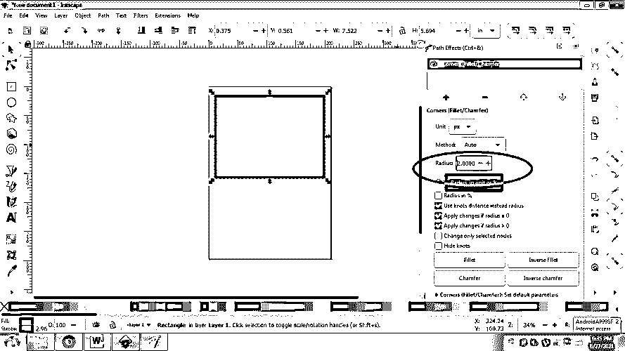

9.  之后，点击圆角选项

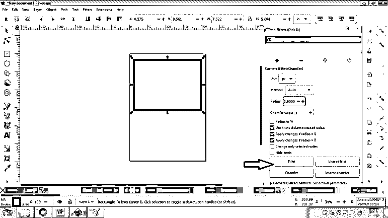

10.  您将看到形状周围有多个节点。

*   现在，点击工具箱中的路径选择工具

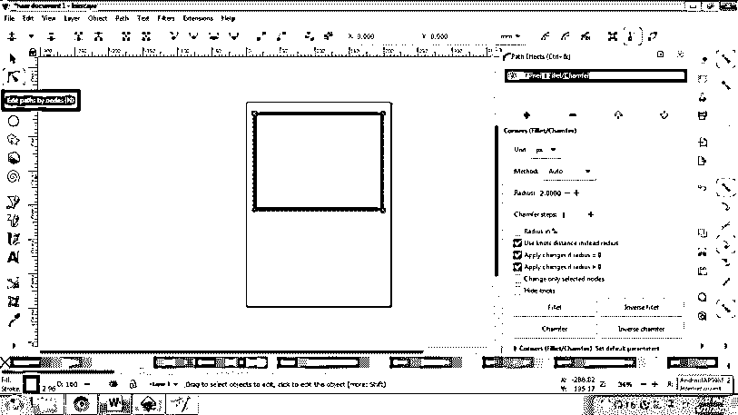

*   分别拖动节点，对矩形的各个角进行圆角处理。

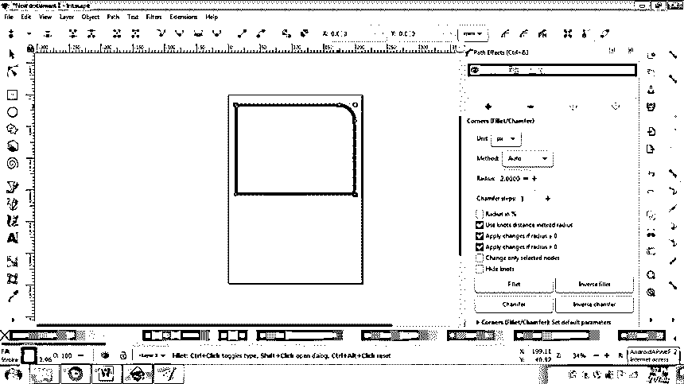

*   我们可以从圆角、倒圆角、倒角和倒倒角中选择选项。

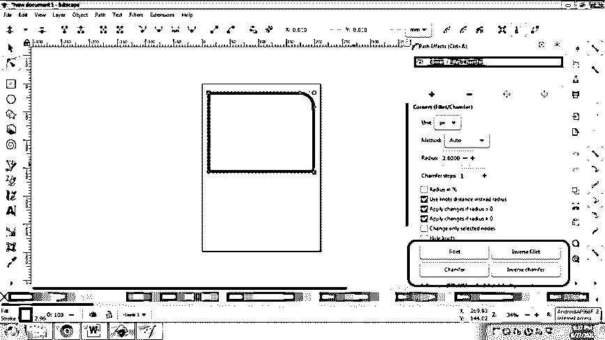

14.  通过应用这个效果，我们还可以编辑半径、角测量和顶点。
15.  用户也可以轻松快速地删除效果，如下图所示。

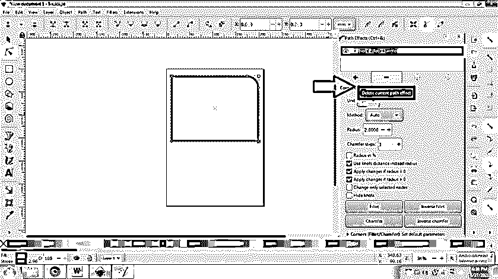

16.  同样，用户可以使用 Inkscape 中的路径过滤器工具创建不同的形状。

**方法三:**

这是一种在形状和对象上应用圆角效果的简单方法。我们所要做的就是将对象转换成路径。这种技术将在整个对象上工作，而不是在独立的节点上执行操作。以下是用这种方法创建圆角矩形的步骤

1.  启动 Inkscape 并创建一个新文件

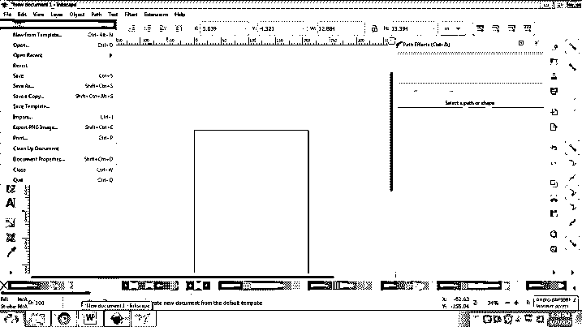

2.  创建一个矩形，如下图所示

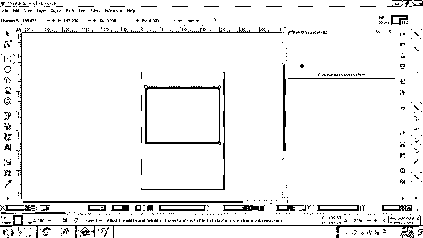

3.  转到路径并选择对象到路径(Shift +Ctrl+ C)选项

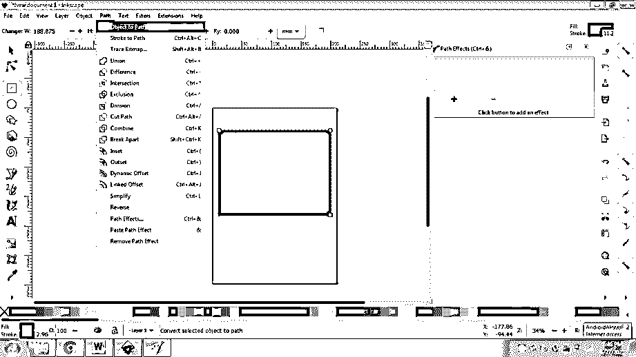

4.  现在，点击动态偏移(CTRL+J)选项

5.  该选项将创建一个节点，用户可以向外拖动该节点以在对象上创建圆形效果。如下图所示

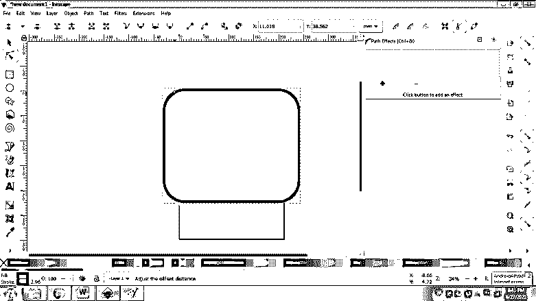

6.  矩形是圆形的，没有任何复杂的动作。

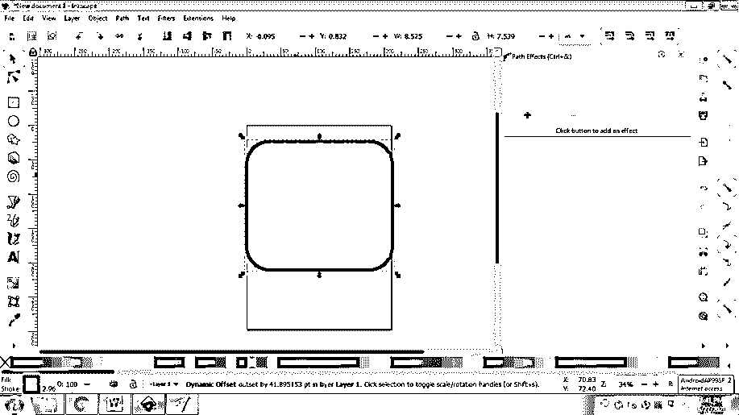

### 结论 Inkscape 圆角矩形

总结本文，这是用户在 Inkscape 中创建圆角矩形的三种主要方法。此外，用户还可以使用其他路径效果，如交集、并集、差集和许多其他效果，通过混合多个对象来创建特殊的设计。

在 Inkscape 中创建圆角矩形教给用户许多值得注意的工具和函数，它们可以在整个程序中使用。

### 推荐文章

这是一个关于 Inkscape 圆角矩形的指南。这里我们讨论三种方式，用户可以通过它们编辑现有的节点，并使它们的角变圆或圆角。您也可以看看以下文章，了解更多信息–

1.  [Inkscape 插件](https://www.educba.com/inkscape-plugins/)
2.  [印花布影](https://www.educba.com/inkscape-shadow/)
3.  [墨迹图案](https://www.educba.com/inkscape-pattern/)
4.  [墨景矢量](https://www.educba.com/inkscape-vector/)

