# Inkscape EPS

> 原文：<https://www.educba.com/inkscape-eps/>

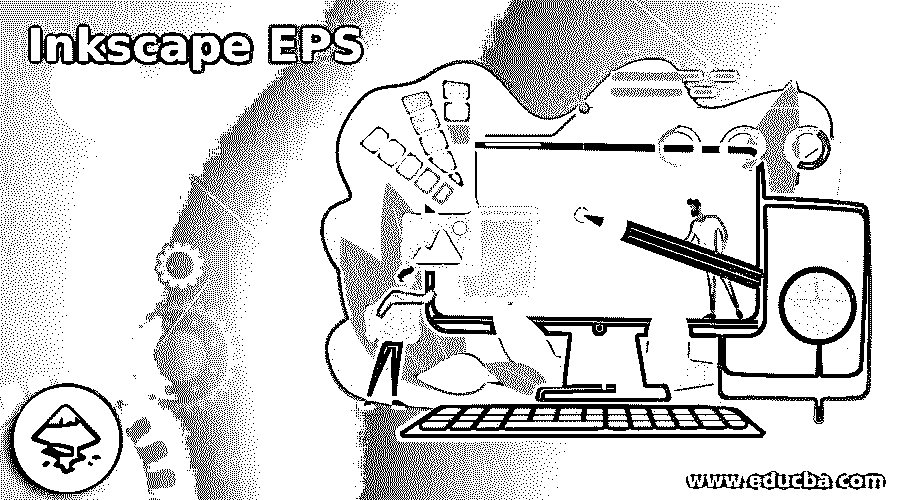

## Inkscape EPS 简介

Inkscape EPS 是一种代表封装 PostScript 的文件格式，我们可以在。eps 文件格式非常容易，但是没有具体的导入方法。eps 文件格式在里面。我们在 Inkscape 中导入是出于不同类型的目的，比如我们可以通过这种文件格式有矢量形状，背景透明，但是在 Inkscape 中，我们不能直接导入一个. eps 文件格式；事实上，为了打开这个文件，我们必须做一些调整。首先，我们必须下载 Ghostscript，使 Inkscape 可以访问这种文件格式；然后，我们检查一些个人电脑设置。

### 如何在 Inkscape 中使用 EPS？

您可以在 Inkscape 中使用 eps，与矢量文件格式相同，但您必须首先将其导入到该软件中，因此让我们来看看您需要了解这些步骤。

<small>3D 动画、建模、仿真、游戏开发&其他</small>

让我先告诉你，如果你试图将一个 eps 文件导入这个软件会发生什么。所以打开 Inkscape 软件。

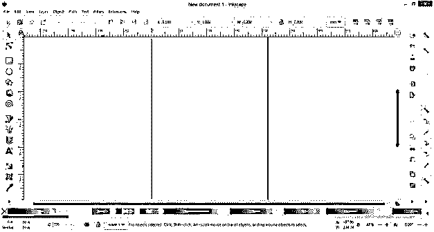

我只需在该软件中拖放我想要的 eps 文件，为此，我将转到我想要的文件夹，选择 eps 文件并将其放入 Inkscape。

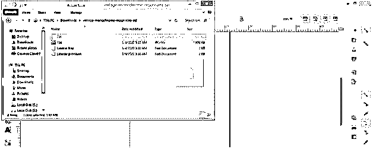

您可以看到它向我显示了一个用于导入该文件的消息框，因此单击该对话框中的“ok”按钮。

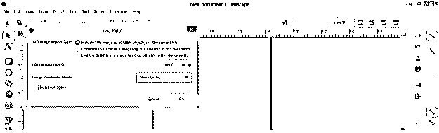

它会显示一条 Inkscape 无法打开的消息。

因此，让我们找到解决这个问题的办法，我们如何解决它。去任何一个浏览器搜索 Ghostscript，打开第一个链接。

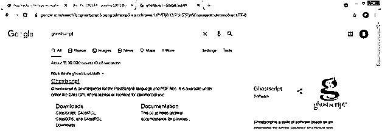

在 Ghostscript 的主页上，请找到下载页面链接并点击它。

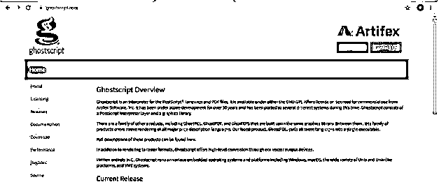

点击下一个打开页面上的 PDF 解释器/渲染链接。

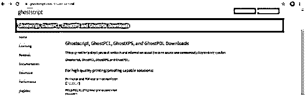

根据您的系统容量下载此 Ghostscript。比如我会根据我的系统下载 64 位。

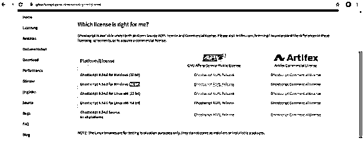

现在转到您下载该 Ghostscript 的位置。我已经将它下载到下载文件夹中，这样我就可以点击它的这个文件了。

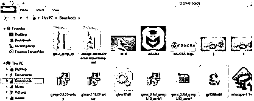

并使用默认设置位置安装它。

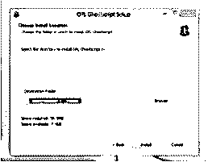

它安装在我的 c 盘上，所以我会转到 Ghostscript 的 gs 文件夹。但是，首先，我将进入 c 盘的程序文件。

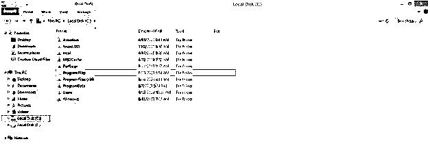

找到 Ghostscript 文件的 gs 文件夹。

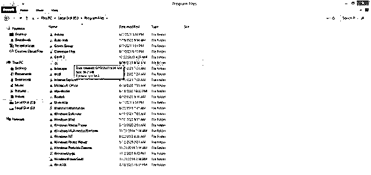

打开它，然后再次点击它的 gs 9.54.0 文件夹。

在这个 Ghostscript 文件夹中有 bin 和 lib 文件夹，我们将在系统中为这两个文件夹创建一个路径，以便解决我们的问题。

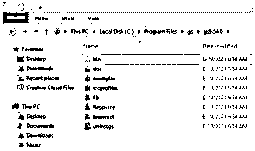

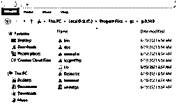

现在在你的计算机的开始按钮的搜索框中，搜索环境变量并且点击它打开它。

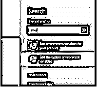

一旦你点击它，你就会在你的窗口屏幕上看到系统属性对话框。在此对话框中，从选项卡列表中选择高级选项卡。在这个标签的按钮，你会发现环境变量按钮，所以点击它。

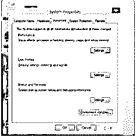

一旦你点击它，一个环境变量的对话框将会打开。这个对话框有两个部分:转到系统变量部分，搜索路径选项。然后，通过单击选择该路径选项。

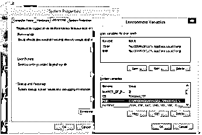

然后，单击此部分的“新建”按钮，为 Ghostscript 的 bin 和 lib 文件夹添加新路径。

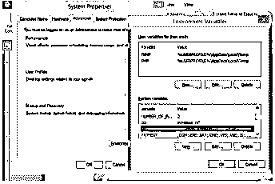

打开 Ghostscript 的 gs 文件夹中的 bin 文件夹，然后在地址栏上单击鼠标右键复制其地址。一旦你点击右键，一个向下滚动的列表将会像这样打开。单击此列表中的“将地址复制为文本”选项。

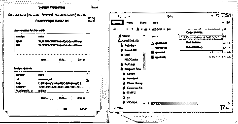

再次转到环境变量对话框，然后经过新系统变量对话框的变量值框中的这个复制位置。我将把这个路径命名为 bin，方法是在同一个对话框的变量名框中键入 bin，然后单击 Ok 按钮。

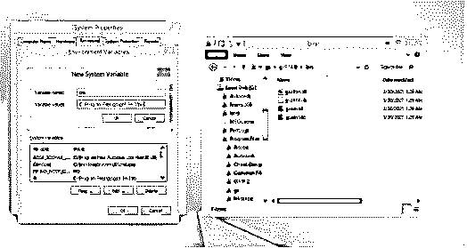

现在打开 Ghostscript 的 gs 文件夹的 Lib 文件夹，用我们复制 bin 文件夹地址的方法复制它的地址。

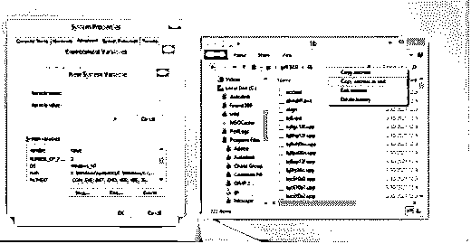

将这个地址位置粘贴到新建系统变量对话框的变量值框中，我在变量名框中将其命名为 lib，然后点击确定按钮。

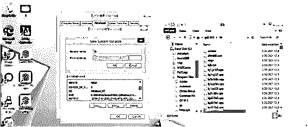

然后单击“环境变量”对话框中的“确定”按钮，应用其中的更改。

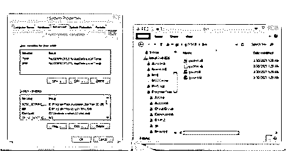

也单击系统属性对话框中的确定按钮来完成此过程。

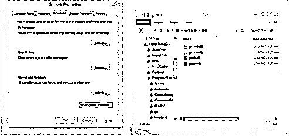

现在，再次回到保存 eps 文件的文件夹，拖动它，然后放到 Inkscape 中。

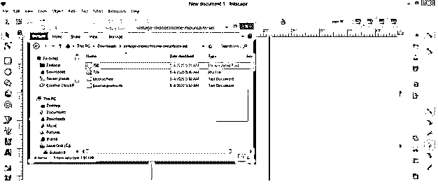

或者你可以去菜单栏的文件菜单，点击它。然后从下拉列表中选择导入按钮。

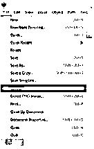

将会打开一个导入对话框，从您计算机上的保存位置选择您想要的文件，然后单击该对话框的打开按钮。

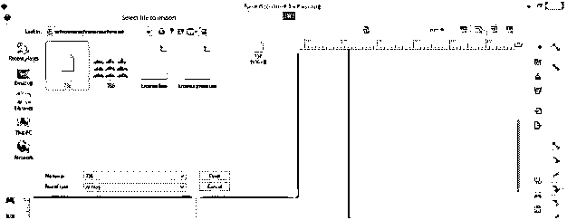

现在它会在几秒钟内打开一个 eps 文件到 Inkscape，就像这样。

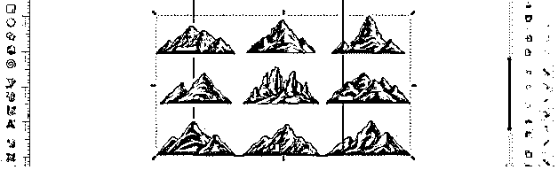

如果此文件仍未在您的软件中打开，您可以在“环境”对话框的“系统变量列表”部分上移 bin 和 lib 路径，然后重试。

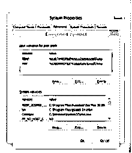

现在让我告诉你如何从这个软件中导出 eps 文件，所以对于这一点，我已经画了这个简单的矩形，我将它保存为. eps。

所以转到菜单栏的文件菜单，点击它，然后点击另存为选项下拉列表。

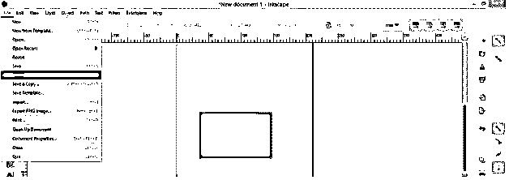

此时将打开一个另存为对话框。转到文件类型并选择。eps 文件格式列表。

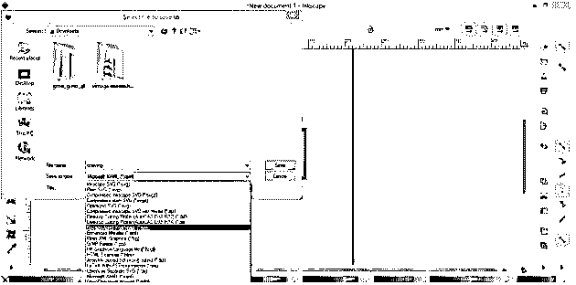

然后点击保存按钮。

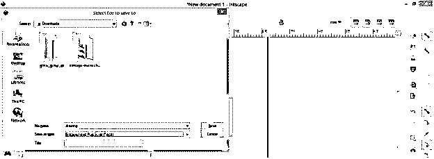

另外，单击“封装的 PostScript”对话框中的“确定”按钮。

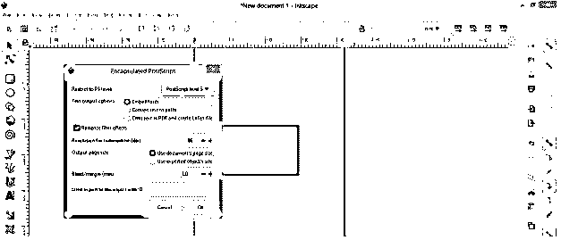

您的文件将另存为。蓄电池

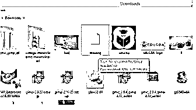

### 结论

现在，您可以了解如何在 Inkscape 中处理 eps 文件，以及如何在其中打开它。你只需要按照上面讨论的步骤，然后你会很容易得到你想要的结果。我还告诉你如何以 eps 文件格式导出 Inkscape 的任何作品。

### 推荐文章

这是一份 Inkscape EPS 指南。在这里，我们将详细讨论如何在 Inkscape 中处理 eps 文件，以及如何一步一步地打开它。您也可以看看以下文章，了解更多信息–

1.  [印花布影](https://www.educba.com/inkscape-shadow/)
2.  [水墨渐变](https://www.educba.com/inkscape-gradient/)
3.  [墨景圆角](https://www.educba.com/inkscape-round-corners/)
4.  [Inkscape 文本](https://www.educba.com/inkscape-text/)

