# Inkscape 图像到矢量

> 原文：<https://www.educba.com/inkscape-image-to-vector/>

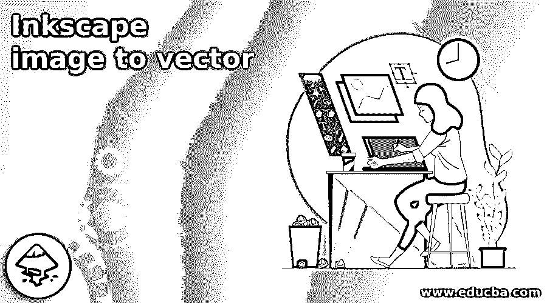

## Inkscape 图像转矢量简介

Inkscape Image to Vector 是 Inkscape 的一项非常有用的技术，通过使用这项技术，我们可以将任何图像格式转换成矢量图像。图像可能是 png 或 jpeg 文件格式。在 Inkscape 中，我们可以通过使用菜单栏的路径菜单的跟踪位图功能将任何图像转换为矢量格式，并且我们还必须对该功能的参数进行一些设置，以获得我们想要的矢量图像结果。有了追踪图像的矢量格式后，我们可以借助工具面板的节点编辑工具对其进行编辑。所以让我告诉你这个过程的步骤。

### 如何在 Inkscape 中将图像转换成矢量？

Inkscape 有一个功能，通过它我们可以在几秒钟内将图像转换成矢量，所以让我们试试这个软件的这个功能。为此，我将首先在这个软件的工作界面中放置一个图像。所以转到菜单栏的文件菜单，点击下拉列表的打开选项。

<small>3D 动画、建模、仿真、游戏开发&其他</small>

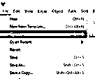

我将用这张熊猫图像来解释我们如何追踪黑白图像？

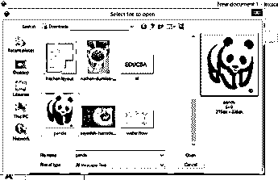

现在点击导入对话框的 Ok 按钮。

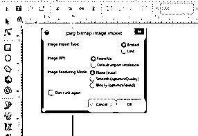

你可以看到，如果我放大这个图像，它会像素化，因为它是一个光栅图像。所以现在，我将把它转换成矢量图像。

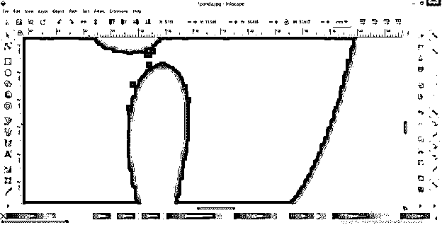

现在选择你想要的图像，进入路径菜单，然后点击下拉列表中的跟踪位图选项。我将用这个熊猫图像来做这件事。

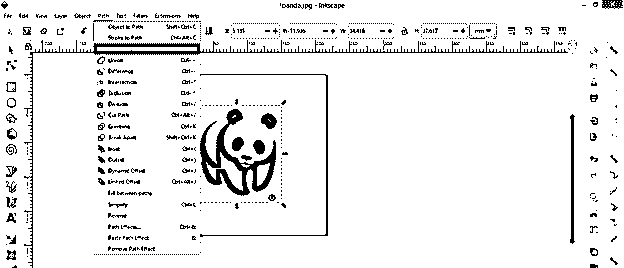

将在工作窗口的右侧打开一个跟踪位图对话框。

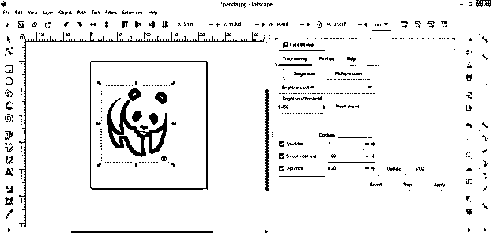

在此对话框中，我们有不同类型的参数，通过对它们进行更改，我们可以获得不同的矢量图像跟踪结果。有一个“单次扫描”按钮，通过它我们可以开始跟踪选定的图像。所以我会点击它。

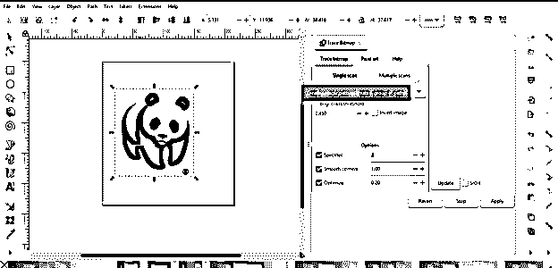

在“亮度阈值”选项中，您可以在描摹过程中控制图像中像素的密度值。所以根据需要我们可以增加或减少它。

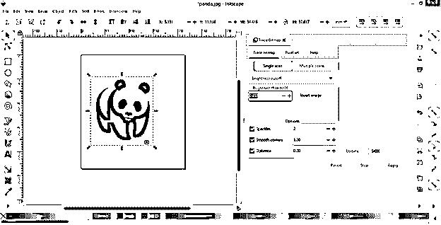

一旦你完成了设置，然后点击这个对话框中的预览部分的更新按钮，它会显示一个带有所选参数设置的描摹图像的预览。

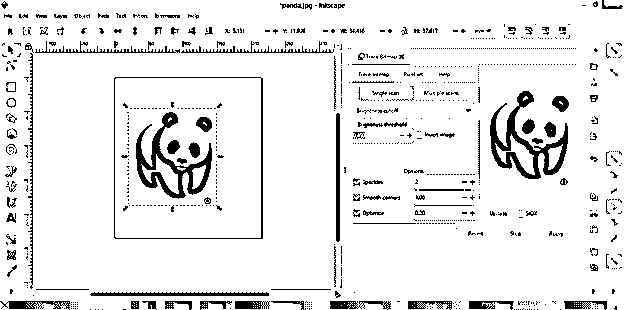

获得所需的跟踪结果后，单击此对话框的应用按钮。现在，我们将在不同的图层中的源图像上描摹图像。您可以通过从源图像移动它来查看它。

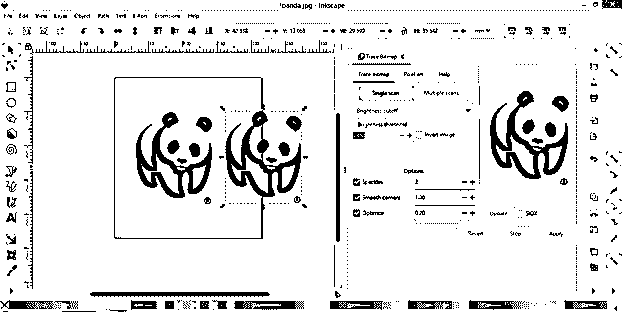

你可以看到追踪层是矢量格式，因为我从来没有像素缩放。

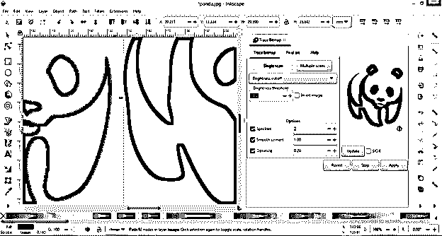

如果需要，您可以反转跟踪的图像，为此，您必须在此对话框中通过单击反转图像选项的复选框来启用反转图像选项。

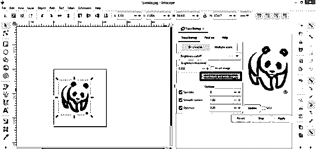

然后点击更新按钮，你将得到你所选择的图像的反转轨迹，你可以在你的插图工作中使用不同的目的。

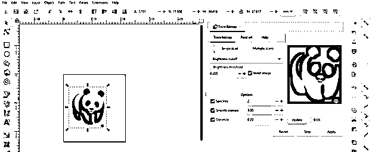

现在让我们将一幅彩色图像转换成一个矢量，为此，我拍摄了这幅美丽的树叶图像。

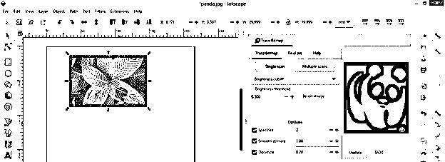

首先，单击跟踪位图对话框的单次扫描按钮。

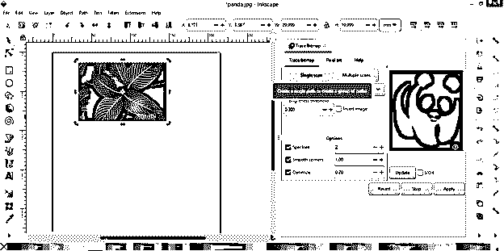

一旦我们点击更新按钮，它会给你这个美丽的图像跟踪结果。

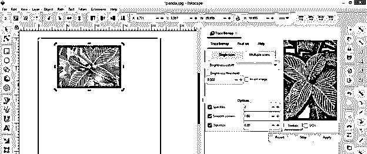

应用这个跟踪结果后，你会发现这个彩色图像的黑白矢量形式。

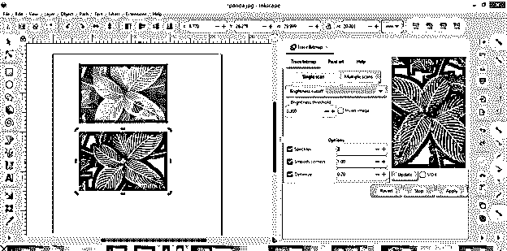

您可以调整阈值，使跟踪的图像有变化。

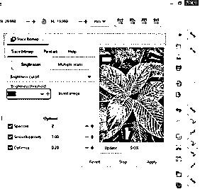

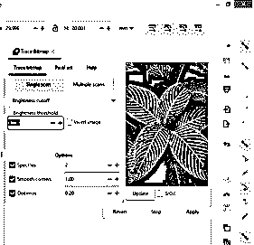

您可以使用这些参数来获得更精确的结果。

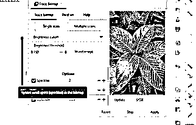

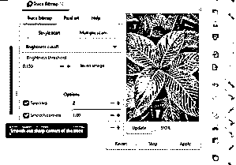

有一个边缘检测选项，通过它我们可以只扫描图像的边缘，并获得这些边缘的矢量形式。因此，我将选择此选项，然后单击“单次扫描”按钮。

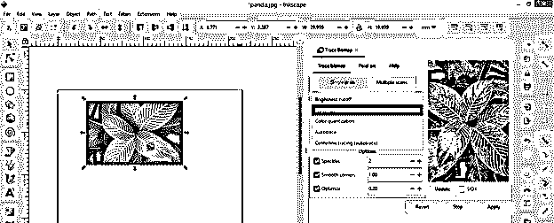

你可以看到它给了我们这个图像边缘追踪的结果。

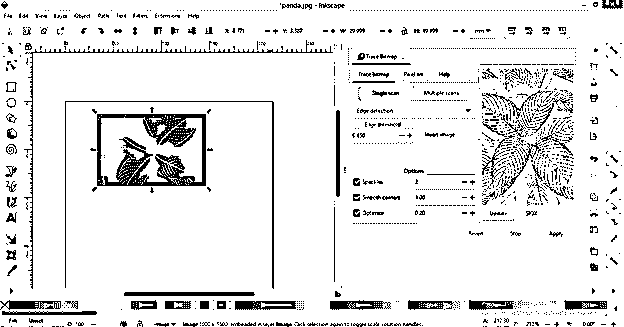

您还可以改变边缘阈值，以获得更精确的结果。

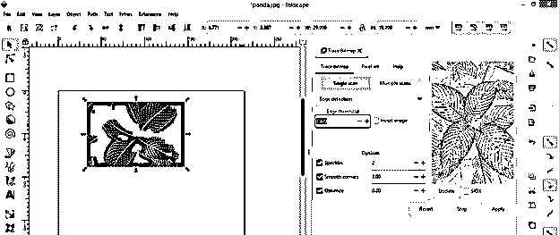

看，这是一个非常好的边缘追踪结果。

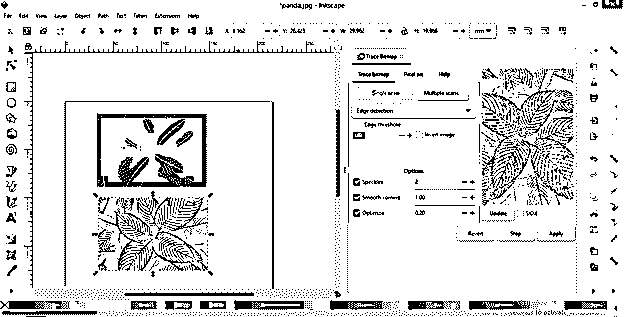

还有自动跟踪选项，它会跟踪你的图像。所以点击它。

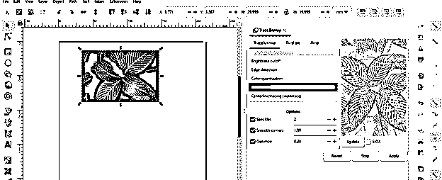

点击更新按钮后，我们将得到彩色跟踪图像，因为这是彩色图像。

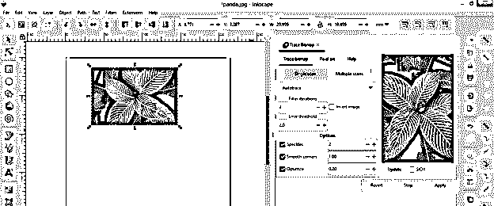

如果您对这种颜色跟踪不满意，那么您可以选择“多次扫描”选项。

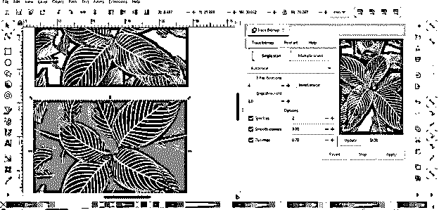

现在点击“多重扫描”按钮。

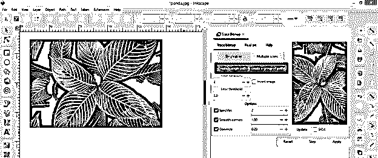

在单击“多次扫描”按钮之前，您可以通过增加和减少扫描框中的扫描值来管理扫描值。这意味着，如果扫描值为 8，那么它将跟踪您选择的图像 8 次，并为您提供图像中的 8 层不同深浅的颜色。

如果您增加扫描次数，那么您将获得更精确的结果，但是根据您的计算机系统的容量，它可能会花费时间或使您的计算机更慢。

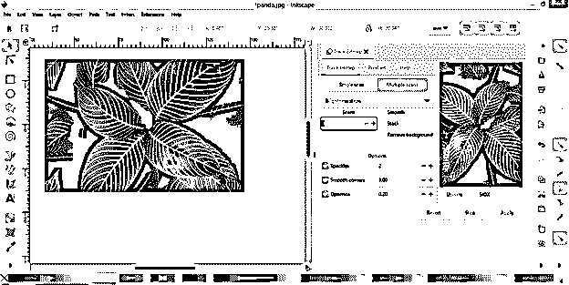

现在，在“多次扫描”中，我们在亮度等级选项的下拉列表中有颜色选项。所以我会选择颜色选项。

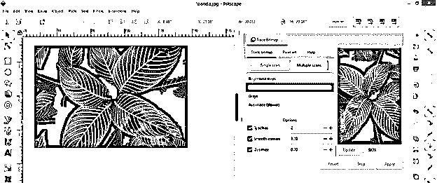

启用平滑选项以平滑跟踪图像的路径。

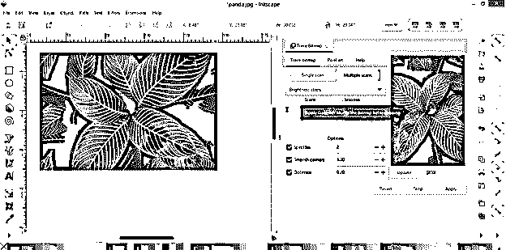

如果您想要移除跟踪图像的背景，可以启用此移除背景按钮。

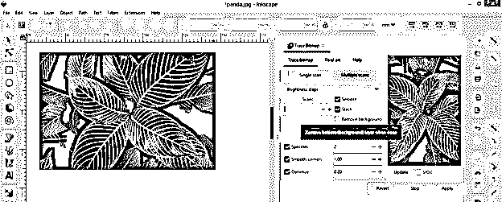

现在点击更新按钮，它会给你跟踪彩色图像预览。

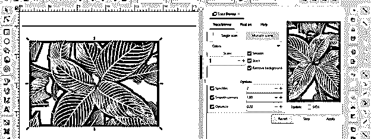

点击应用按钮，你可以看到这是最准确的图像转换成矢量格式的跟踪。

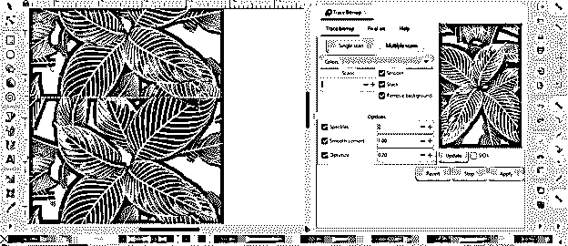

现在选择这张图片，进入菜单栏的对象菜单，然后点击下拉列表中的“取消分组”选项。

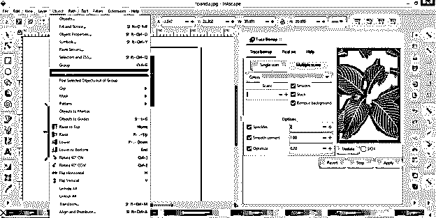

现在，您可以分离每个扫描层，每个扫描层都有不同的颜色。您也可以根据自己的需要单独使用它们。

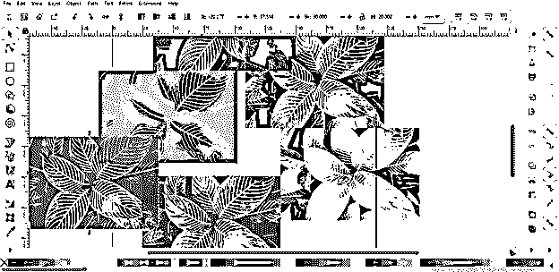

这都是关于在 Inkscape 中将图像转换成矢量的。

### 结论

它告诉你这个软件非常好的功能，通过它你可以将光栅图像转换成矢量图像格式，还可以编辑它的节点，因为它在跟踪后将是一个可编辑的节点。但是，如果您研究了该软件的跟踪位图功能的其他参数，将有助于获得更多关于图像跟踪的命令，并将它们转换为矢量格式。

### 推荐文章

这是一个将 Inkscape 图像转换为矢量图像的指南。这里我们一步一步详细讨论如何在 Inkscape 中将图像转换成矢量。您也可以看看以下文章，了解更多信息–

1.  [印花布影](https://www.educba.com/inkscape-shadow/)
2.  [水墨渐变](https://www.educba.com/inkscape-gradient/)
3.  [印迹位图](https://www.educba.com/inkscape-trace-bitmap/)
4.  [喷墨式箭](https://www.educba.com/inkscape-arrow/)

