# Inkscape 解锁

> 原文：<https://www.educba.com/inkscape-unlock/>

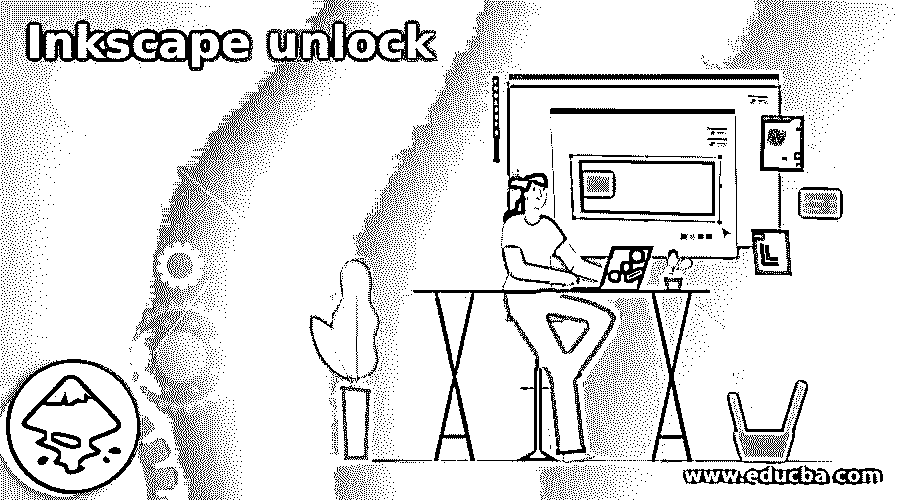

## Inkscape 解锁简介

在此分析中，我们将深入研究在 Inkscape 中对对象和层应用锁定和解锁的各种方法。Inkscape 有一个友好的用户界面和工具集，帮助用户设计大量的艺术矢量设计和艺术品。无论图像的性质和格式如何，Inkscape 都具有对象和图层的重要属性。诸如锁定/解锁、隐藏/取消隐藏、复制/粘贴、分组/取消分组、删除、全选和其他必要功能的工具有助于在单个文件文档中正确管理图像和矢量形状。

### 如何在 Inkscape 中使用 Unlock？

即使 Inkscape 是开源免费软件，它仍然拥有在一个无障碍环境中执行和创建设计所需的所有基本功能。当用户创建复杂的设计和组合时，锁定/解锁功能非常有用。同样，隐藏和取消隐藏以及组合和取消组合也是对象或层整体设置的一部分。

<small>3D 动画、建模、仿真、游戏开发&其他</small>

就像任何其他矢量图像编辑程序一样，Inkscape 也提供了一个适当的、设计良好的用户界面，具有基本的对象和图层属性。这些小而具体的功能非常有用，如果没有这些功能，每项任务都变得棘手和令人困惑。

当用户需要锁定和解锁单个对象时，他们选择该特定对象，而锁定和解锁整个层将对该层上存在的所有对象起作用。

我们还可以一次锁定和解锁文档中的所有图层。这使得用户的工作节奏更快。这些快捷选项对用户来说非常方便，用户只需动动手指就能轻松使用。

就应用和更改对象和层的设置而言，在 Inkscape 上执行锁定和解锁功能与其他矢量编辑程序略有不同。

当我们锁定一个对象或层时，该特定元素不能移动、缩放和旋转。它成为一个“锁定”对象，除非用户解锁该特定元素，否则无法修改。

### 如何对单个对象或选定对象应用锁定/解锁？

1.  启动 Inkscape。
2.  打开一个新文件，如下图所示。

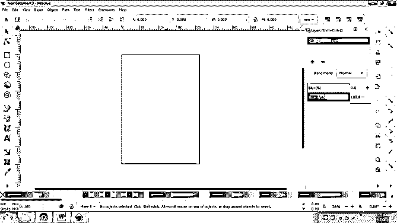

3.  如下所示创建一个对象。

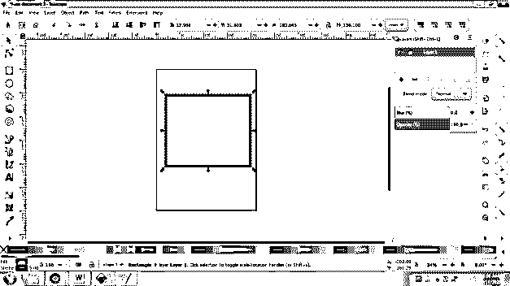

4.  现在，创建另一个不同于前一个的对象。

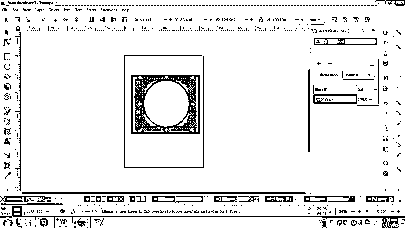

5.  右击第一个和第一个对象，并点击锁定所选对象。

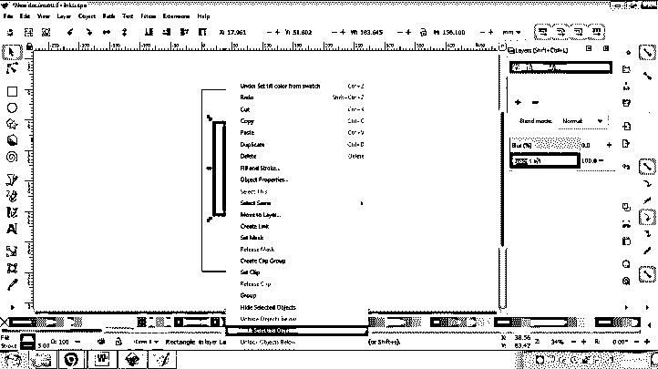

6.  锁定对象的另一种方法是转到对象>对象属性。

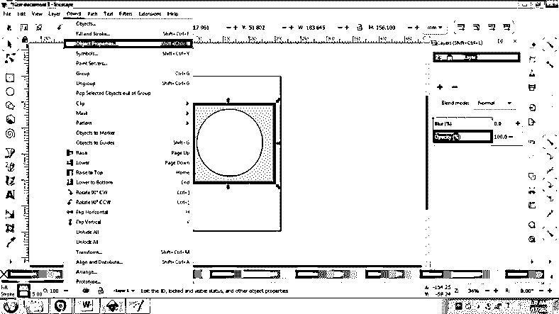

7.  您将在右侧面板上看到一个对象属性窗口。

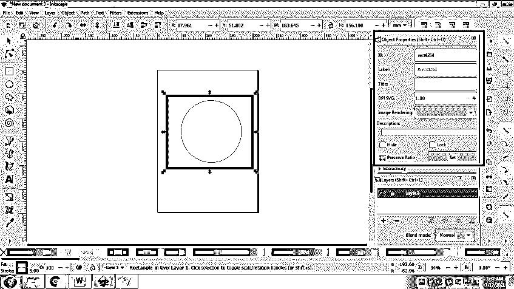

8.  接下来，选择对象并单击锁定，然后单击设置锁定对象。

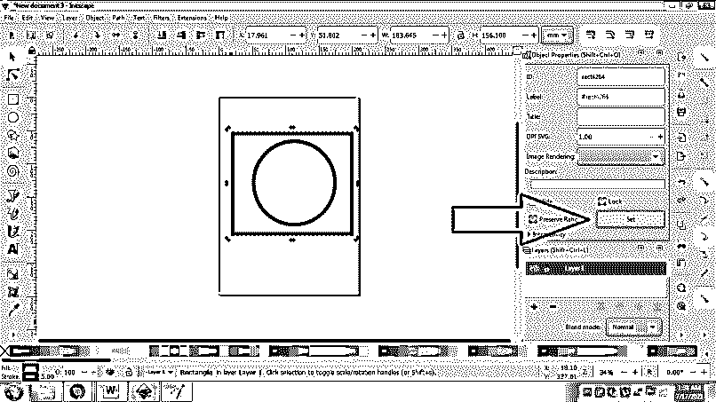

9.  您也可以选择这两个对象，右键单击并选择“锁定选定对象”来同时锁定这两个对象。

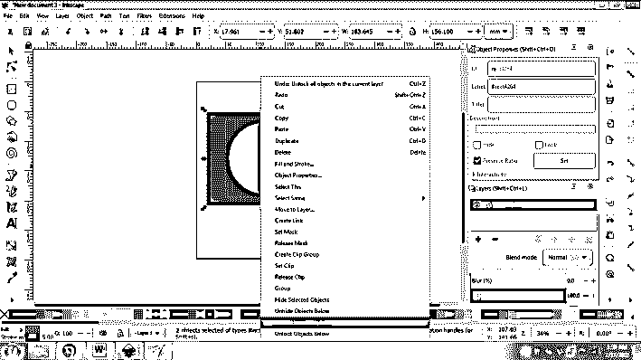

10.  要解锁对象，请转到对象 **>** 解锁所有对象。

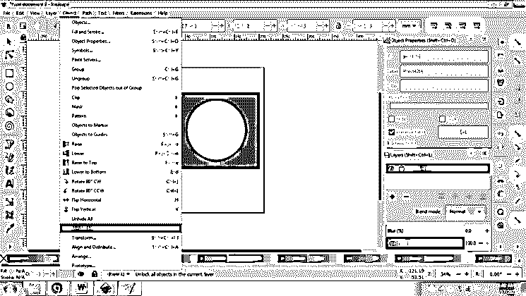

11.  用户也可以点击对象面板上的锁定/解锁按钮来锁定和解锁对象。下面给出的是这样做的技术。

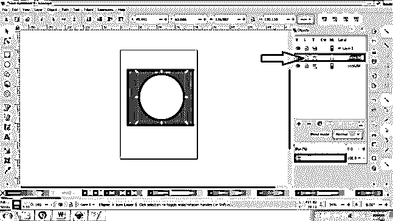

### 如何一次锁定/解锁单个图层或所有图层？

1.  启动 Inkscape。
2.  打开一个新文件。

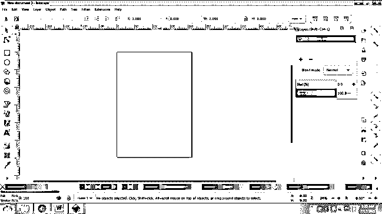

3.  现在，添加一个新层，如下图所示。

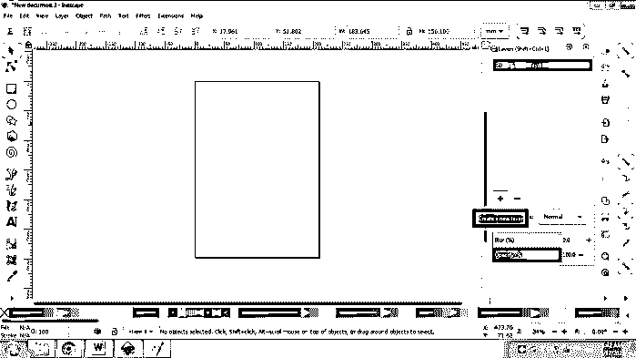

4.  在图层 1 上创建一个对象，如下图所示。

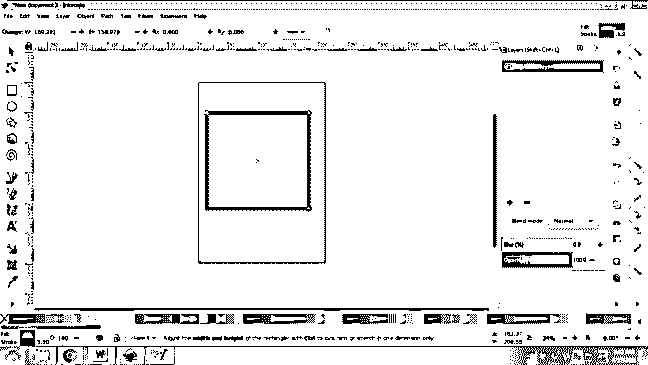

5.  接下来，添加另一层，并添加一个对象层 2 如下所示。

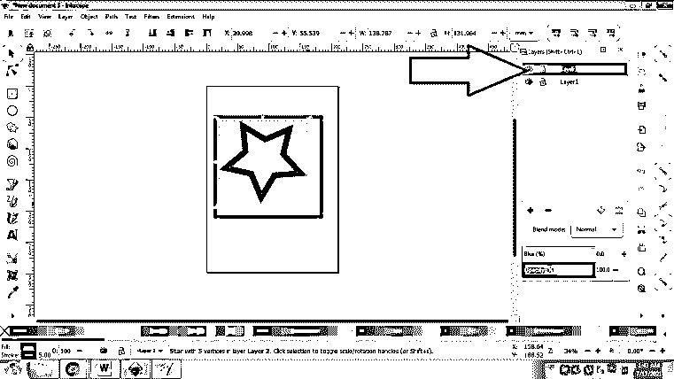

6.  要锁定/解锁图层 1，请转到图层并选择锁定/解锁当前图层。

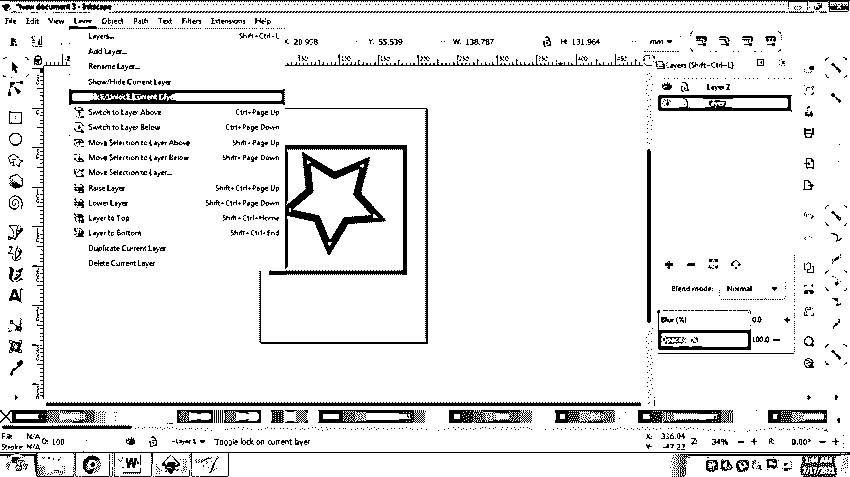

7.  要锁定/解锁两层，右键单击该层并选择锁定所有层/解锁所有层。

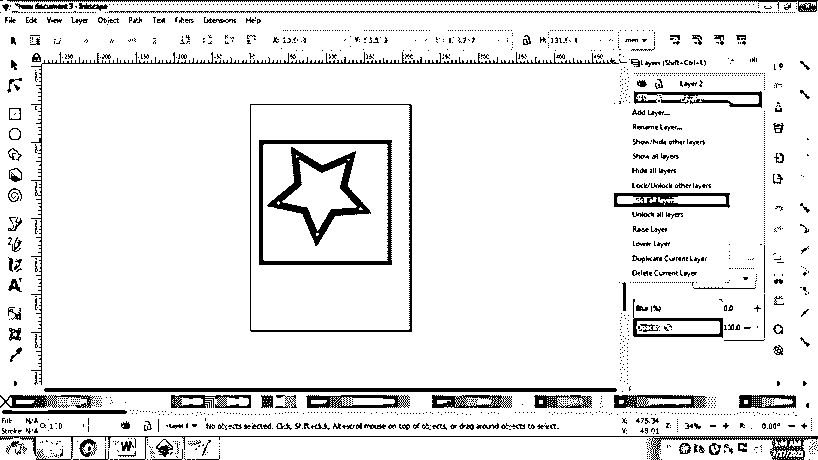

8.  另一种锁定/解锁层的方法是单击层上的锁定图标。

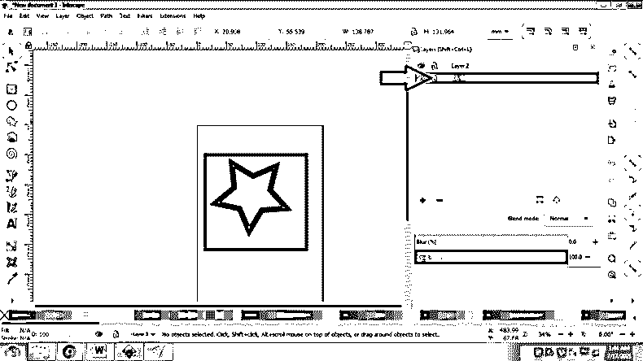

很多时候，一些用户在单个层上创建多个对象，而没有根据项目的需要创建或添加新的层。在这种情况下，与不使用这些功能相比，锁定和解锁、隐藏和取消隐藏、分组和取消分组功能通过使工作量更容易和更快而为用户提供了巨大的帮助。

这些 Inkscape 功能还可以保持文档和文件的组织性和良好的维护性，帮助用户设计出整洁、标准化和管理良好的艺术品和创作。

在 Inkscape 中创建图层并应用锁定和解锁属性有其自身的优点和舒适性。用户甚至不能选择锁定的对象，只能在锁定的对象被专门解锁后才能使用它们。Inkscape 为对象和层提供的这一显著特征是异常的和有吸引力的。

### 结论

总结上述文章，可以肯定的是，Inkscape 不仅是一个具有矢量软件几乎所有功能的微型矢量程序，而且是一个用户可以免费使用和维护的程序。在 Inkscape 中,“锁定和解锁”是一项关于学习主要而简单的工具的研究，这些工具可以对大量工作和任务产生重大影响。用户一定要学习和掌握这些工具，在 Inkscape 上创造奇妙的作品。

### 推荐文章

这是一个 Inkscape 解锁指南。这里我们讨论如何在 Inkscape 中使用解锁，以及如何对单个对象或选定对象应用锁定/解锁。您也可以看看以下文章，了解更多信息–

1.  [喷墨艺术](https://www.educba.com/inkscape-art/)
2.  [Inkscape 与网格对齐](https://www.educba.com/inkscape-snap-to-grid/)
3.  [墨景矢量](https://www.educba.com/inkscape-vector/)
4.  [墨景圆角](https://www.educba.com/inkscape-round-corners/)

