# Inkscape 弯曲文本

> 原文：<https://www.educba.com/inkscape-curved-text/>

## Inkscape 弯曲文本简介

Inkscape curved text 是一种样式，通过该样式，您可以将任何文本设置在曲线路径上，以便用它进行有效的排印安排，并且为了获得曲线文本，我们将使用 Inkscape 软件的许多工具和功能，我们将在该工具的用户界面上找到这些工具和功能。我们还可以编辑曲线文本来改变曲线路径形状。因此，今天我们将通过两种方式来解释 Inkscpace 软件的这一技术，并根据我们的需要进行编辑。所以让我们开始讨论这个话题。

### 如何在 Inkscape 中创建弯曲文本？

在 Inkscape 中创建弯曲的文本并不是什么大不了的事情，我们只是很好地掌握了正确的方法。你要做的第一件事是从用户界面左侧的工具面板中选择一个圆或椭圆工具，来制作一个圆，作为文本的曲线路径。您可以按 F5 作为该工具的快捷键，或者通过单击其图标直接从工具面板中取出。

<small>3D 动画、建模、仿真、游戏开发&其他</small>

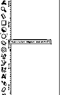

现在按住 shift 和 Ctrl 键来画一个圆，就像这样。你可以画一个椭圆，让你的文字有弯曲的路径。这完全取决于你想走哪条路。

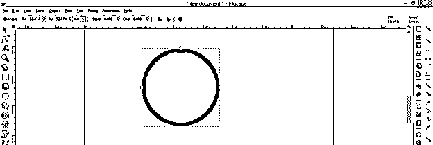

现在再次导航到工具面板，从工具列表中选择文本工具，或者点击键盘上的 F8 激活这个工具。

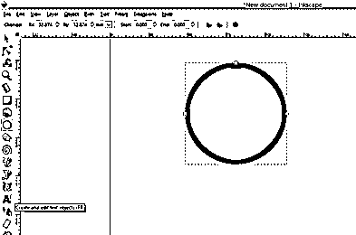

现在为你的文本选择文本样式，然后在菜单栏下面的文本工具的属性面板中设置文本的大小。我将输入 eduCBA 作为我的文本，这是我们的正式名称。您可以键入任何其他文本。

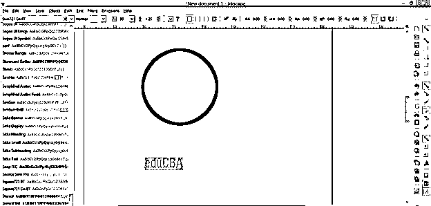

现在从工具面板中选择工具，或者按键盘上的 F1 键快速切换到这个工具。

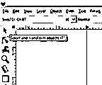

按住键盘的 Shift 键，然后通过逐个点击来选择文本和圆。现在转到菜单栏的文本菜单，它位于该工具用户界面的顶部，单击它。点击此菜单下拉列表中的“放入路径”选项。

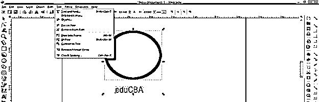

现在你选择的文字会像这样环绕这个圆。

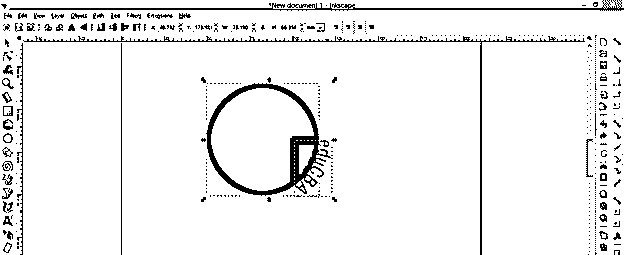

点击这个选择，你将有围绕这个选择的结合框旋转手柄。按住鼠标点击丁波盒子的旋转箭头。

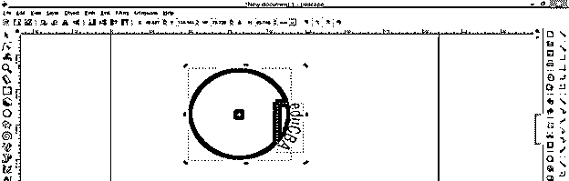

然后旋转此选项，将文本在圆形路径上移动到您想要的位置。如果你想删除这种扭曲的文本，然后再次进入文本菜单，点击“删除”从路径选项的滚动列表。

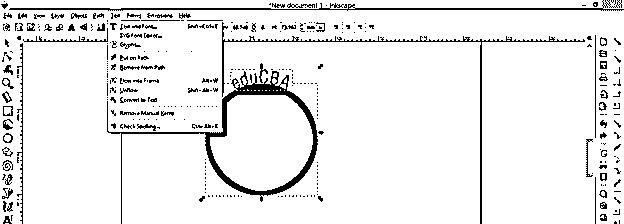

文本将通过在其位置上留下圆形路径来恢复其原始形状。

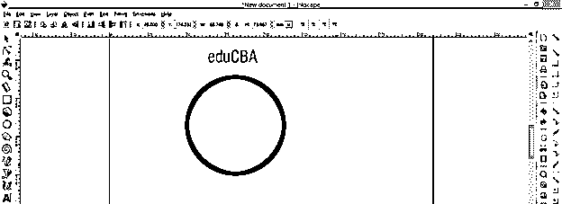

或者你可以用选择工具选择这个圆，然后按键盘上的删除键来释放扭曲。

现在让我们移除这个圆的填充，为了理解弯曲文本的下一步，进入菜单栏的对象菜单，然后点击向下滚动列表的填充和描边选项。

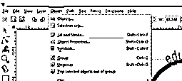

填充和描边面板将在用户界面的右侧打开。现在选择填充表格，点击十字按钮来移除这个圆的填充，然后点击描边标签，选择平面颜色作为这个圆的描边。

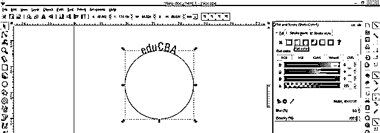

用和上面步骤一样的方法选择文字和圆圈。

在选择工具的帮助下，旋转这个圆底部的文本。

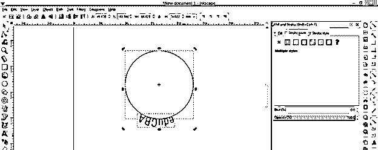

现在点击属性栏的“水平翻转所选对象”选项或按 H 作为快捷键。

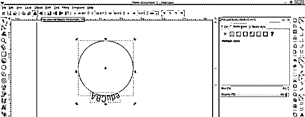

我们的文本将进入这个圆圈。

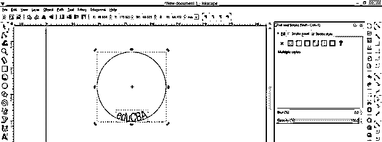

现在转到菜单栏的路径菜单，点击“对象到路径”选项，向下滚动列表。

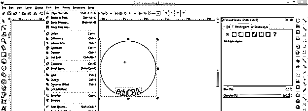

现在你可以把你的文字从这个圆圈中分离出来了。

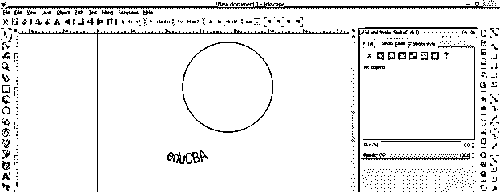

而你的弯文就这样准备好了。

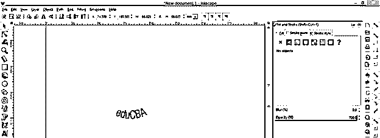

现在让我们看看做这件事的另一种方法。对于这种方法，从工具面板中选择贝塞尔工具，画出你想要的曲线路径。我会画一条像这样的曲线路径。

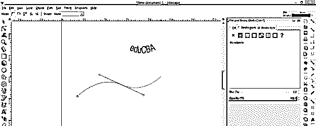

现在再次采取文字工具，键入一个文本。这次我将键入一个句子，并通过选择工具选择文本和路径。

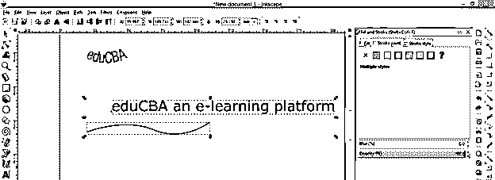

并通过相同的选项，为这个文本分配路径，我们使用了上述弯曲的文本。

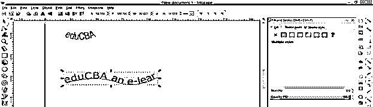

你可以看到我们的文本不适合这个路径。您可以增加绑定框的面积，以容纳您的全文，因此，为此，单击此绑定框的箭头，并拖动它以增加框的大小。在可以看到整个文本的地方增加文本框的大小。

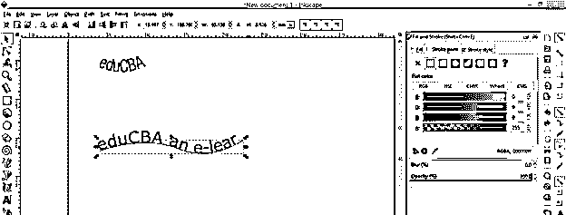

您也可以通过旋转此绑定框来旋转此文本。

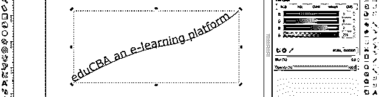

你也可以编辑这个弯曲的路径，从工具面板中选择编辑路径工具或者按 F2 作为快捷键。

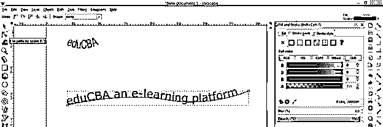

并从这条曲线路径的锚点编辑它。

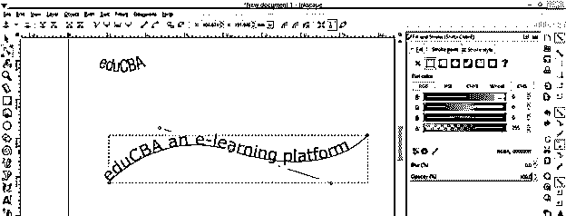

现在选择文本和曲线路径，然后进入路径菜单，点击下拉列表中的“对象到路径”选项，或者你可以使用快捷键 Shift + Ctrl + C。

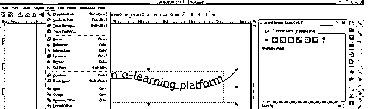

现在通过移动将文本从路径中分离出来。

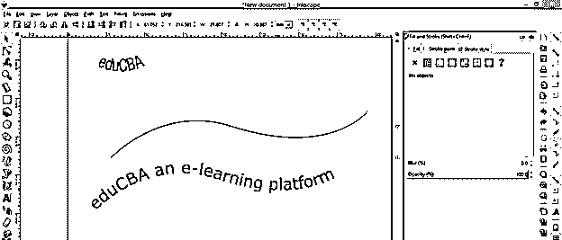

现在你可以删除这个路径，我们的两个完整的弯曲文本就准备好了。你可以在你的任何一个设计作品中使用它们。

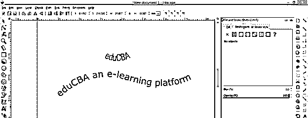

这是在 Inkscape 中创建曲线路径的两种方法。

### 结论

这是一个很好的讨论，关于我们如何在这个软件中使用不同的弯曲路径来弯曲文本，这些路径是我们通过使用工具面板的工具创建的。现在你可以用你自己的想法创建你自己的弯曲文本，只要按照我在这篇文章中解释的步骤，你就会很好地掌握这个功能。

### 推荐文章

这是一个 Inkscape 弯曲文本的指南。这里我们讨论如何在 Inkscape 中创建弯曲文本，你可以用自己的想法创建自己的弯曲文本。您也可以看看以下文章，了解更多信息–

1.  [喷墨替代](https://www.educba.com/inkscape-alternative/)
2.  什么是 Inkscape？
3.  [插画替代方案](https://www.educba.com/illustrator-alternatives/)
4.  [Illustrator 中的平滑工具](https://www.educba.com/smooth-tool-in-illustrator/)

