# Inkscape 激光切割

> 原文：<https://www.educba.com/inkscape-laser-cutting/>

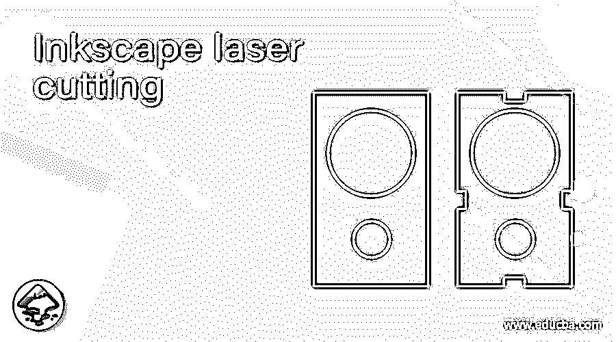

## Inkscape 激光切割简介

Inksacpe 激光切割代表为 CNC 或激光切割机设置 g 代码，以切割您想要的形状、文字或任何标志。您可以在 Inkscape 中设置参数，使您想要的对象为激光切割操作做好准备。在这篇文章中，我们将了解一个文本和一个标志是如何为激光切割做准备的。为了得到我们的结果，我们将使用 Inkscape 菜单栏的一些重要选项和菜单功能。那么让我们来分析一下如何才能创建 g 代码来切割你绘制的对象呢？

### 使用 Inkscape 进行激光切割

你要做的第一件事就是将文件的尺寸设置为与激光切割机床的切割材料相同。为此，请转到文件菜单栏并单击它。将打开一个下拉列表，从列表中选择“文档属性”选项，或者按 Shift + Ctrl + D 作为键盘输入，这是一个快捷键。

<small>3D 动画、建模、仿真、游戏开发&其他</small>

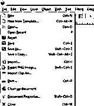

单击此选项后，将会打开一个文档属性设置对话框。在此框中，根据您绘制的对象的单位选择显示单位。我就设为 mm。

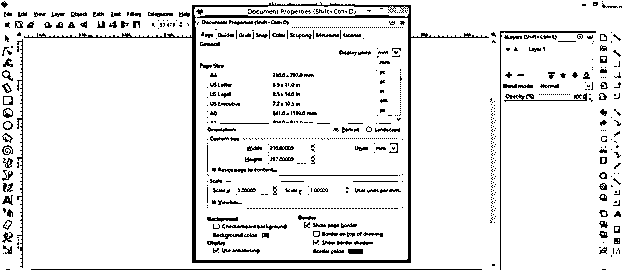

现在，在此对话框的“自定义大小”面板中设置文档的高度和宽度。我将设置为 200 x 200 毫米。

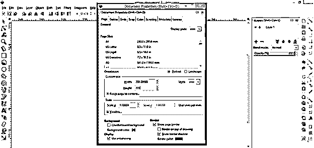

确保文件尺寸的单位应与显示单位相同，以便正确管理。

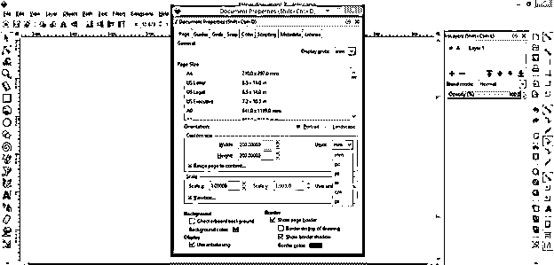

这是我们想要的文件尺寸。

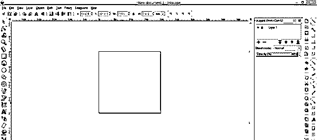

现在从工作屏幕左侧的工具面板中选择文本工具，或者你可以按键盘的 F8 功能键。

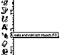

现在从字体样式列表中选择你想要的字体样式。我将输入 EDU 作为我的文本，这是你的正式名称 eduCBA 的前三个字母。

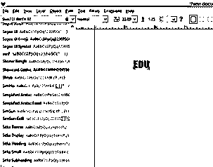

现在从工具面板中选择工具并锁定这个图标，这样当我们调整这个文本的大小时，文本的宽度和高度的比例保持不变。

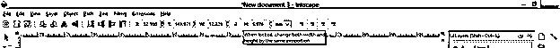

现在根据你的要求调整它的大小。我会像这样调整它的大小。

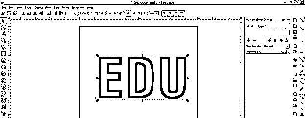

让我们把这篇文章放在这一页的中间。因此，我们需要对齐制表符。现在转到工作屏幕顶部菜单栏的对象菜单，点击它。将会打开一个下拉列表，在该列表的底部，您会发现“对齐和分布”选项卡。所以点击这个选项。

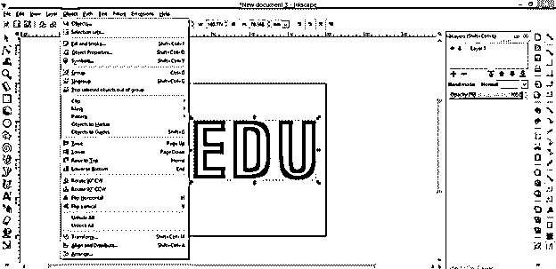

在“对齐”选项卡面板的“相对于”选项中选择页面选项，以便我们的选择与页面对齐。

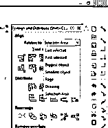

现在点击“在垂直轴上居中”选项将其垂直对齐，然后点击“在水平轴上居中”选项将其水平对齐。

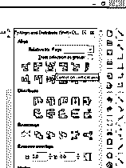

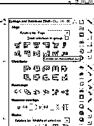

它会像这样在页面中央对齐。

现在转到菜单栏的路径菜单，点击它，然后点击“对象路径”选项，将文本转换成路径。为此，您也可以按 Shift + Ctrl + C。

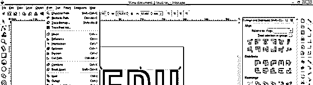

现在让我们生成 g 代码。为此，请转到菜单栏的扩展菜单并单击它。转到下拉列表的 Gcodetools 选项，然后单击新下拉列表的“Gcode 路径”选项。

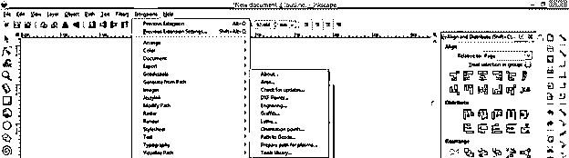

在这里，一个新的标签将会像这样打开，在这个新标签的首选项标签中，您可以根据自己的选择命名您的文件。我将把它命名为 edu 激光切割。

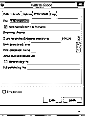

现在进入该对话框的“Gcode 路径”选项卡，点击该对话框按钮上的应用选项卡。

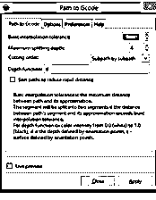

现在，一个弹出窗口将像这样打开，使点击这个窗口的确定按钮。

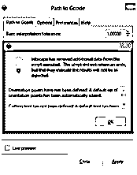

这样你可以为激光切割机床创建 g 代码。Inkscape 自动生成此代码，其中包含激光开关选项代码。

现在让我们告诉你如何使用标志来达到这个目的。转到填充菜单的打开选项或按 Ctrl + O 作为快捷键。

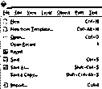

并选择 Png 或 Jpeg 文件的你想要的标志，从其保存的位置。我会选择这个。

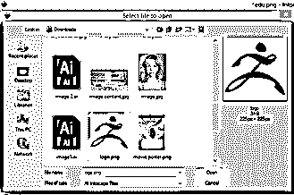

这是 PNG 文件，但不是透明的。

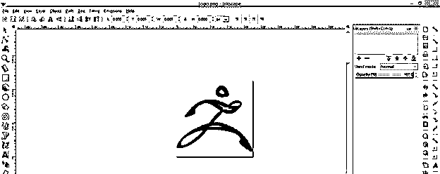

现在我们将它转换成矢量文件格式，因为它是光栅化格式。所以选择这个标志，进入菜单栏的路径菜单，点击跟踪位图选项或按 Shift + Alt + B 快捷键。

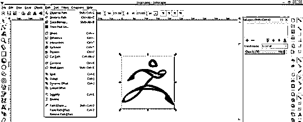

启用'删除背景'选项，使我们的跟踪对象有透明的背景。

您可以通过单击此对话框中的“确定”按钮或“实时预览”按钮来查看预览或跟踪对象。在此框中，根据您希望被跟踪对象的精度设置阈值，一旦您满意，单击此对话框的确定按钮并关闭此对话框。

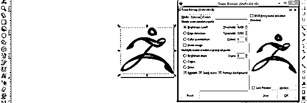

您可以移动 traces 对象来查看两幅图像之间的差异。

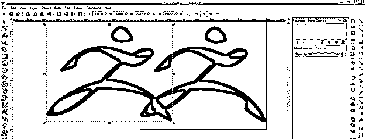

当你缩小它，你可以理解光栅和矢量对象的区别。矢量对象不会像素化，光栅会像素化。

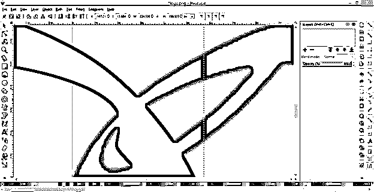

现在有了矢量对象，并根据激光切割机切割的材料设置文件大小。

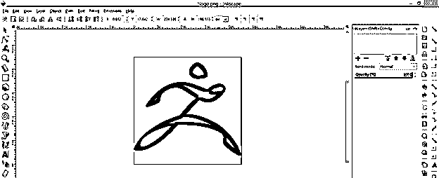

在这之后，按照我们在文本案例中所做的那样，完成获取 g 代码的所有步骤。

这样，您可以创建一个对象、标志或文本，为激光切割做准备。确保物体的黑白颜色会给你最好的效果。如果您知道决定激光开关位置的编码，您也可以更改生成的 g 代码。

### 结论

我们尽最大努力向您提供了大量关于 Inkscape 中激光切割的信息，您可以通过 Inkscape 创建钥匙链、不同用途的雕刻文本等对象。现在你可以在自己的作品中尝试一下，看看切割你想要的物体的效果。

### 推荐文章

这是 Inkscape 激光切割指南。在这里，我们讨论 Inkscape 中的激光切割，通过它您可以创建不同用途的对象，如钥匙链、雕刻文本。您也可以看看以下文章，了解更多信息–

1.  [喷墨替代](https://www.educba.com/inkscape-alternative/)
2.  什么是 Inkscape？
3.  [插画替代方案](https://www.educba.com/illustrator-alternatives/)
4.  [Illustrator 中的平滑工具](https://www.educba.com/smooth-tool-in-illustrator/)

