# 红宝石箭

> 原文：<https://www.educba.com/inkscape-arrow/>

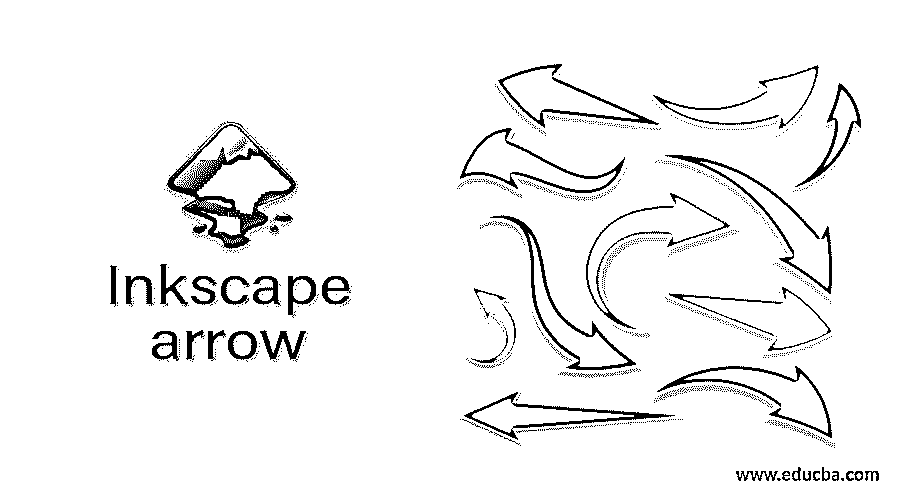

## Inkscape 箭头简介

Inkscape arrow 不是什么特别的东西，它与其他设计软件的箭头一样，但我们在 Inkscape 中以不同的方式使用它，我们在不同类型的指示工作以及许多不同的艺术工作中使用箭头，所以今天的文章我们将学习不同的方法，通过这些方法我们将在这个软件中创建箭头，这些方法将包括工具面板的工具，以及我们将通过菜单栏的菜单获得我们的最终结果。我还会告诉你如何在箭头和箭头上有两种不同的颜色。那么学习这些方法你兴奋吗？让我们这样做吧。

### 如何在 Inkscape 中创建和使用箭头？

我们有两种方法可以让你在 Inkscape 中创建 arrow，但是你可以在自己的基础上找到更多的方法。第一种方法是使用任何路径的笔画样式。

<small>3D 动画、建模、仿真、游戏开发&其他</small>

#### 使用笔画样式创建箭头

为了学习这种方法，我们需要一条线，这条线应该是直的，或者是倾斜的，但不是弯曲的。我们将在本文后面讨论曲线箭头。因此，从工具面板中选择贝塞尔工具，或者按键盘上的 Shift + F6 键。

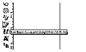

现在按住键盘的 Ctrl 键像这样画一条直线。

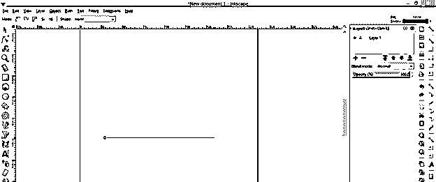

一旦你画好线，进入工具面板，选择工具或者简单的按键盘的 F1 功能键来切换这个工具。

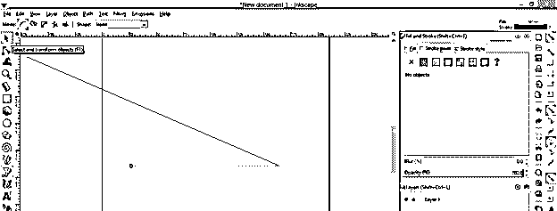

现在转到用户屏幕顶部菜单栏的对象菜单，然后点击填充和描边选项或按键盘的 Shift + Ctrl + F 键。

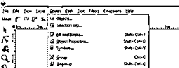

在填充和描边面板中，点击描边样式标签，我将增加我们绘制路径的描边宽度，这样我可以清楚地显示箭头。这个宽度可以根据你的工作需要而定。我采取这个宽度只是为了解释它。所以我将 3 作为笔画宽度的值。

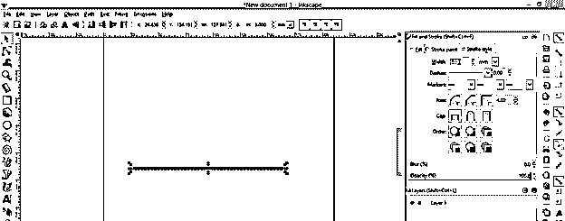

现在点击这个标签的标记选项的向下箭头按钮，在这里你填写查找箭头的数量。你可以和你喜欢的任何一个一起去。

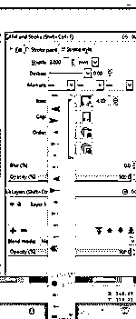

我将选择这个箭头，它将与这条线的起点相连。

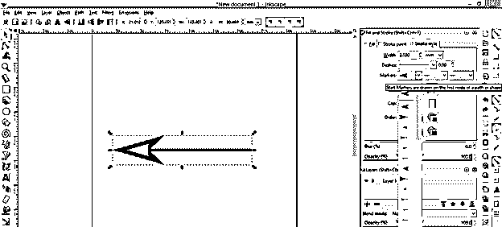

在标记选项的第三个选项卡中，您将有相同的箭头，但这些箭头将像这样连接在线的端点。

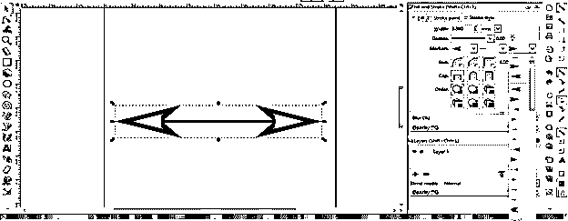

您可以使用此选项在任何其他节点或线的中间添加箭头。

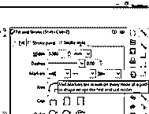

您也可以通过这些选项更改箭头的线条样式，这意味着您可以将线条更改为虚线或此列表中的任何其他线条。

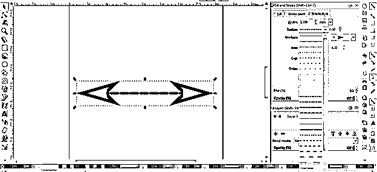

现在让我们深入分析一下，进入菜单栏的查看菜单，导航显示模式选项，然后点击新下拉列表的轮廓选项。

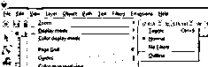

现在你可以看到这个箭头是一条简单的线。

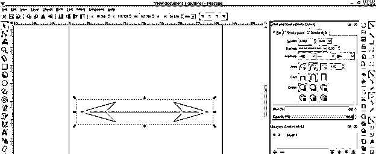

因此，让我们把它转换成形状，并为去路径菜单的菜单栏，并点击'中风的路径'选项，或者你可以按下 Ctrl + Alt + C 键的键盘为这个选项。

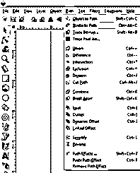

你会看到这个箭头的形状像这样。

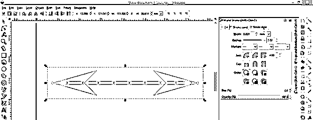

现在，通过点击对象菜单的取消分组选项或按键盘的 Shift + Ctrl + G 键来取消分组。

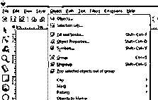

现在你可以单独移动箭头。

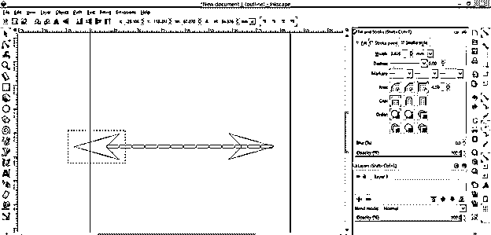

为了正确对齐，您可以通过对齐面板。

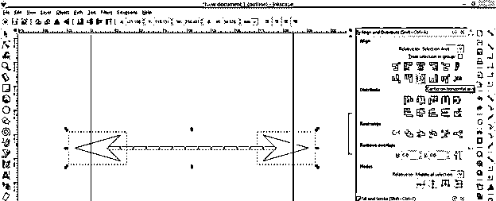

将显示模式从轮廓模式更改为正常模式。

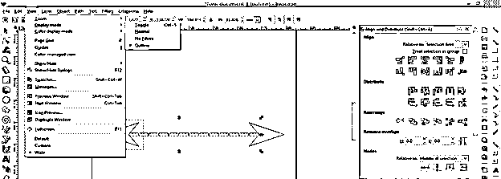

你可以分别改变线条和箭头的颜色。这里我们有箭头笔画。

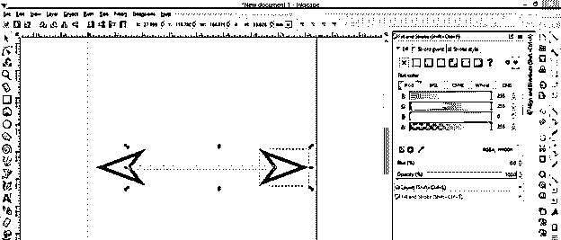

如果你愿意，你也可以删除箭头的线条，或者给箭头的线条添加线条。

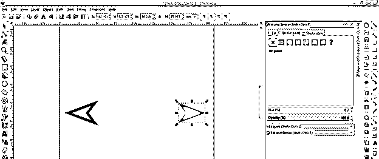

您还可以从标记列表中添加带有箭头终点或起点的不同形状。只是我在这里。

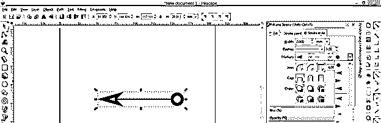

下一个方法，我们可以通过使用形状工具来创建一个箭头。

#### 使用 Inkscape 的形状工具创建箭头

首先从工具面板中选择矩形工具，或者按下键盘的 F4 功能键。

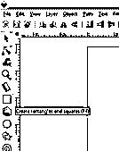

像这样画一个矩形，然后从工具面板中选择“开始或多边形”工具，或者按键盘上的*键。

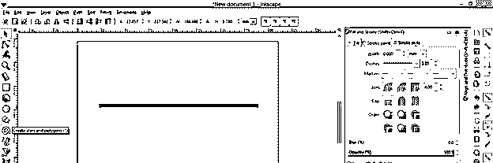

现在在这个工具的参数栏的角选项中给多边形的角值 3。

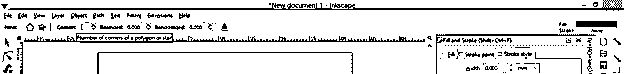

现在画这种类型的三角形。

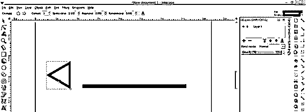

使用“对齐”面板的“对齐”选项卡，像这样对齐这两个形状。

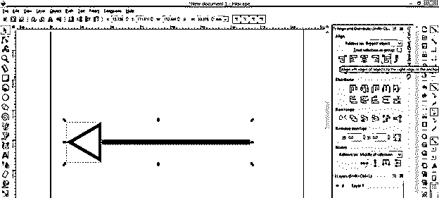

现在我将它做成一个形状，然后点击下拉列表中的联合选项。

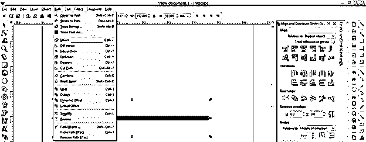

现在你看，如果我选择它，将只有一个选择框，这意味着它是一个对象。

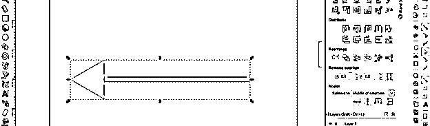

你也可以画曲线箭头，这样画一条曲线。

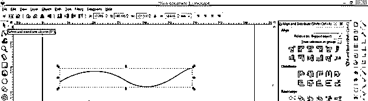

将箭头应用于线条样式选项中曲线的任何一点。你可以看到这不是曲线的正确方向。

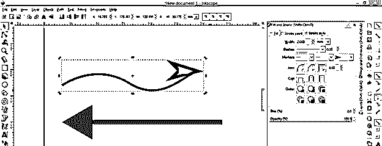

只要按照我们在直线的情况下做的相同的步骤，在取消组合两个形状后，你可以根据曲线设置箭头的角度。

你也可以用 shape 方法来做这个，我们在上面的步骤中为矩形创建了箭头，然后通过旋转来调整三角形的角度。

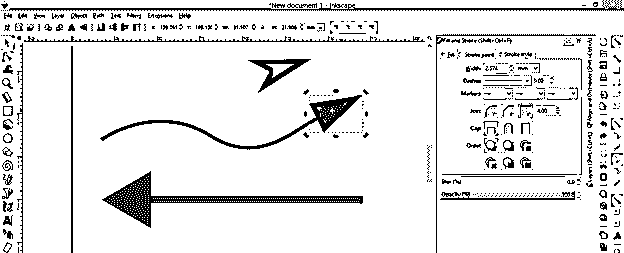

我在这里向你解释了在 Inkscape 中创建箭头的两种方法。现在你可以和他们中的任何一个一起去。

**结论:**

我相信你现在对 Inkscape 的箭头主题有疑问，在阅读完这篇文章后，你会很容易在 Inkscape 中处理箭头。你可以探索更多的方法让它只是在上面练习，你会发展你自己的箭的想法。

### 推荐文章

这是一个墨景箭头指南。这里我们讨论如何在 Inkscape 中创建和使用箭头，阅读完这篇文章后，你在 Inkscape 中处理箭头将会很容易。您也可以看看以下文章，了解更多信息–

1.  [喷墨替代](https://www.educba.com/inkscape-alternative/)
2.  什么是 Inkscape？
3.  [UI 设计工具](https://www.educba.com/ui-design-tools/)
4.  [CorelDRAW 标志设计](https://www.educba.com/coreldraw-logo-design/)

