# Inkscape vector

> 原文：<https://www.educba.com/inkscape-vector/>

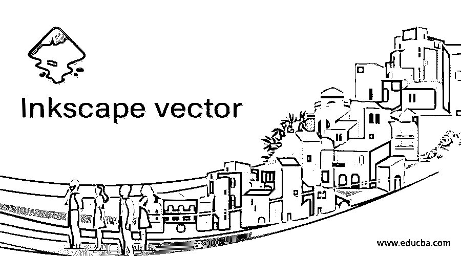

## Inkscape vector 简介

Inkscape Vector 代表艺术作品或图形对象的设计，在放大或缩小过程中不会像素化，在 Inkscape 中，我们可以很容易地做到这一点，这意味着您可以进行自己的矢量设计，因为 Inkscape 是矢量图形编辑和创建软件。我们使用形状工具以及贝塞尔工具来设计矢量对象，这个软件的一些其他功能也包括在设计中，为我们提供了一些技术，通过这些技术我们可以以一种非常快速和简单的方式来完成它。你也可以从图像中制作一个矢量设计，但今天我将通过在这个软件中创建一个对象来解释矢量形状的要点。

### 如何在 Inkscape 中创建矢量艺术或对象？

我将使用工具和这个软件菜单栏的选项来制作泰迪的脸。我将使用椭圆工具创建一个圆，这样定位工具面板就在用户界面的左侧，单击圆工具或按 E 快捷键。

<small>3D 动画、建模、仿真、游戏开发&其他</small>

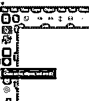

现在按住键盘的 Ctrl 键画一个圆。

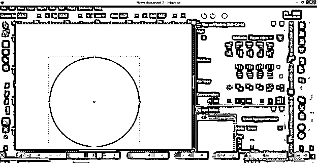

现在点击用户屏幕上的标尺，然后你可以将指引线拖动到文档区域。我会逐一设定这些准则。你可以通过测量来设定指导方针。我徒手画的。

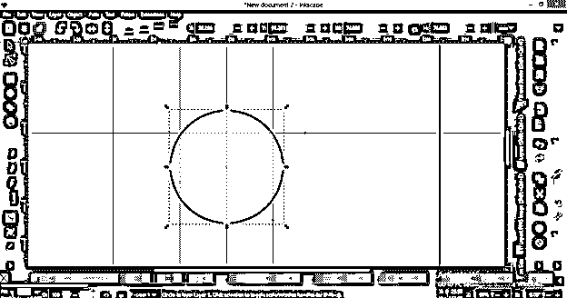

现在我会在这两条准则的交叉点做一个小圆。如果您启用了捕捉选项，那么它会自动将鼠标光标捕捉到基准线的交叉点。

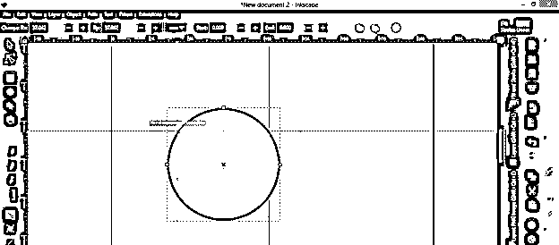

我将像这样画一个圆，然后按键盘上的 Ctrl + d 键复制一个。

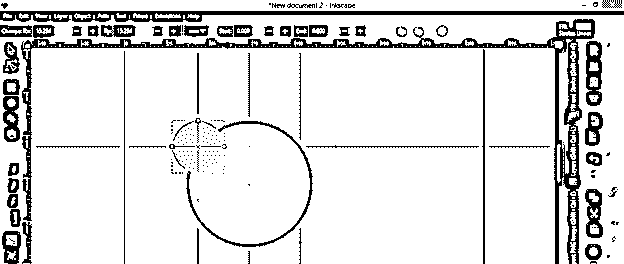

并在选择工具的帮助下将其拖动到另两条指引线的下一个交叉点。

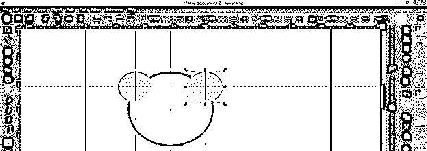

然后再复制一个这个小圆，然后按住键盘上的 shift 键用选择工具选择一个小圆和一个大圆。

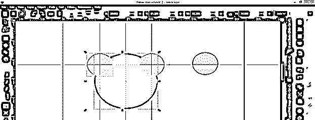

然后进入路径菜单，点击下拉列表中的差异选项或按键盘上的 Ctrl+–键。

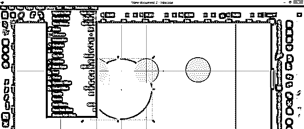

小圆会从大圆上切下来。

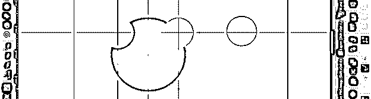

对另一个圆做同样的操作，这意味着选择小圆和大圆，然后点击路径菜单中的差异选项。

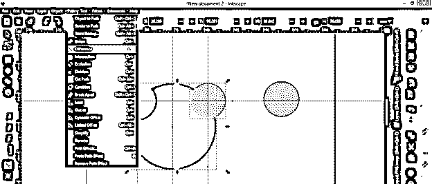

现在，我将复制这个额外的圆，选择它，然后按下键盘上的 Ctrl + d 键，然后制作一个比这个圆小的圆，再次进入路径菜单，单击下拉列表中的插入选项或按下 Ctrl +(。

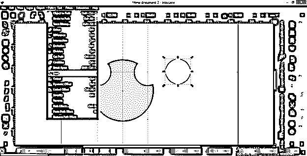

反复按“Ctrl +”(在这个大圆的中心有一个较小的圆，然后使用路径菜单下拉列表中的差异选项从外圆切割一个中心圆。

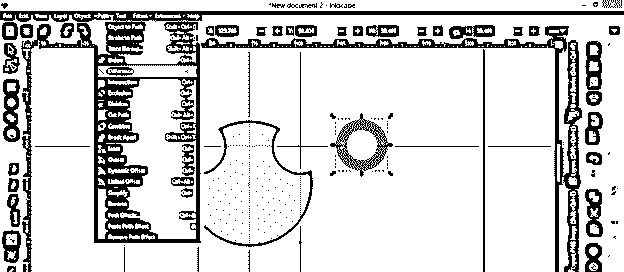

而且会变成这样。

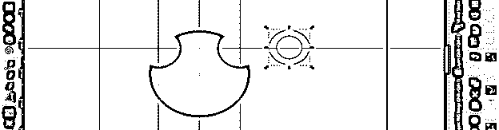

现在复制一份，然后像这样把它们放在一起。

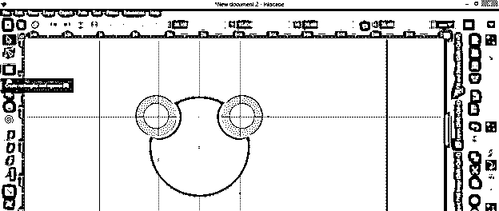

现在我将使用矩形工具，或者你可以按下 R 键来制作一个矩形。你可以看到这个矩形的角上有一个点。这些点表明它是一个矢量形状，因为矢量形状有节点，通过这些节点，您可以从该节点编辑该形状。

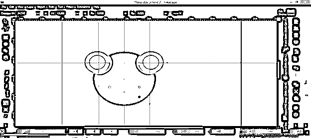

从工具面板中选择编辑节点工具，然后点击矩形的圆形节点，然后按住它向外拖动，使矩形的边缘变圆。您只能对矢量图形执行此操作。

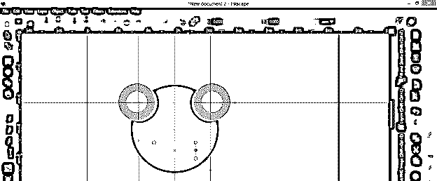

你也可以添加一个矢量形状的曲线，因此，我将选择这个矩形，然后点击路径菜单的“对象到路径”选项，这将添加曲线节点到这个圆角矩形。

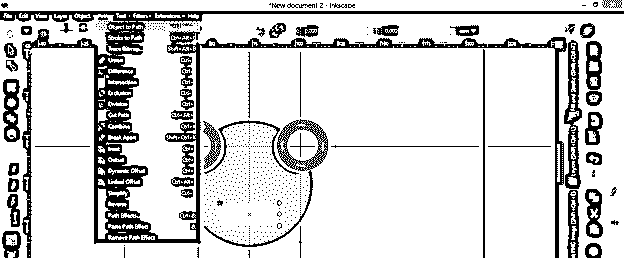

在这里，我将再次使用编辑节点工具，然后单击角节点之间的线，并将其向下拖动，您可以看到有曲线手柄。

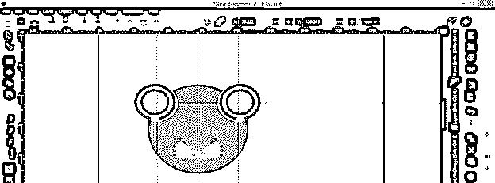

我将使用这些曲线手柄来增加曲线的深度。您也可以移动这些节点来制作不同的形状。

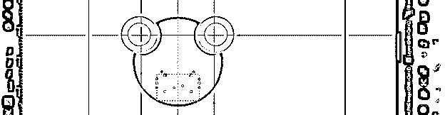

你可以看到我移动了节点，用曲线手柄改变了曲线，得到了这个形状。一件重要的事情是，我要告诉你，在制作泰迪脸的嘴形时，没有损坏像素，这个形状也没有像素化，因为这是由矢量形状制作的，我们已经编辑了矢量形状。

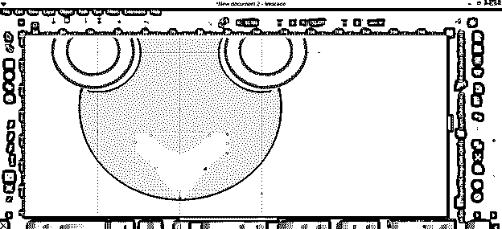

现在我将通过点击路径菜单的差异选项从一个大圆中剪切它。在剪辑之前，我会复制一份。

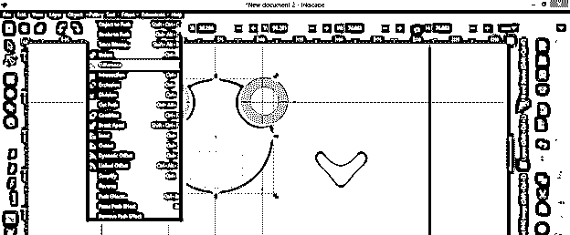

我将复制的形状设置在空心形状的中心。在图形设计的语言中，这种中空的形状被称为负形。你可以发现，在所有的过程中，嘴的形状没有任何损伤，这是矢量形状的主要特征。

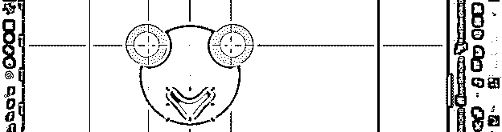

我添加了更多的形状，让物体看起来像泰迪熊的脸，并为脸的各个部分选择不同的颜色。这可以称为平面矢量艺术。

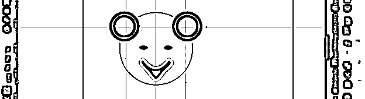

现在你可以在泰迪熊的脸部使用渐变来雕刻这个物体的细节。我将使用渐变工具，或者你可以按 G 作为快捷键。在使用渐变工具之前，选择要应用渐变的部分。我将选择一个大圆，然后点击它的中心，然后像这样拖动鼠标指针。

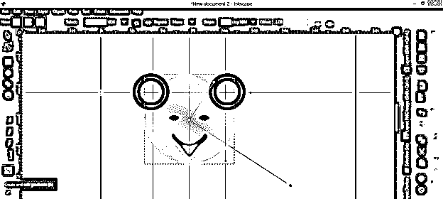

要改变渐变的颜色，点击渐变手柄的端点，然后从调色板中选择一种颜色，它会像这样改变。您可以更改两个手柄的颜色。

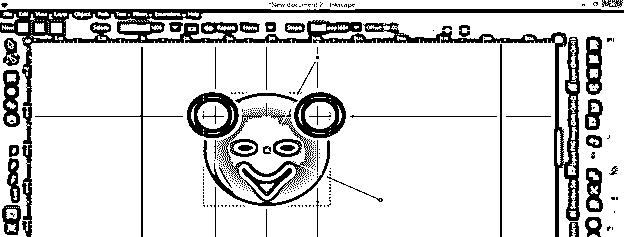

我会这样做的所有部分，我们的矢量作品准备就绪。

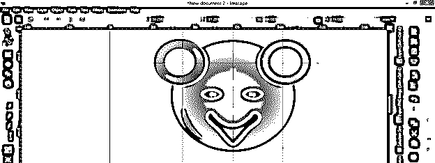

你可以注意到当我放大它的时候，它没有像素化。

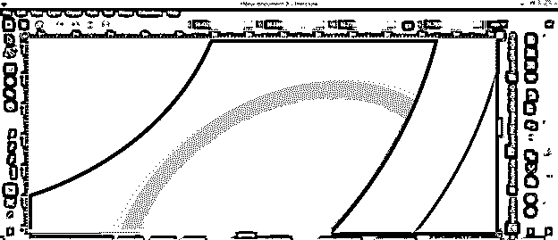

### 结论

这是一个简单的设计，向你解释了矢量图形的所有重要点，你必须知道在使用它的过程中。你可以通过应用你的想法来制作你自己的矢量图形，你只需要掌握这个软件的工具和功能来玩矢量艺术。

### 推荐文章

这是一个 Inkscape 矢量指南。这里我们讨论如何在 Inkscape 中创建矢量艺术或对象，并通过创建对象来解释矢量形状的要点。您也可以看看以下文章，了解更多信息–

1.  [喷墨替代](https://www.educba.com/inkscape-alternative/)
2.  什么是 Inkscape？
3.  [GIMP 工具箱](https://www.educba.com/gimp-toolbox/)
4.  [GIMP 字体](https://www.educba.com/gimp-fonts/)

