# Inkscape SVG

> 原文：<https://www.educba.com/inkscape-svg/>

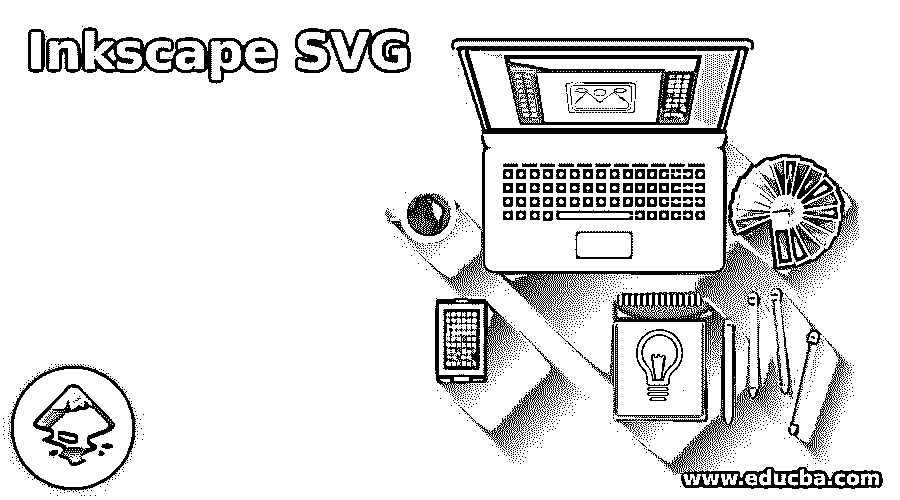

## SVG 墨水匣简介

以下文章提供了 Inkscape SVG 的概要。Inkscape SVG 是一种文件格式，这种 SVG 代表可缩放矢量图形，这意味着您可以编辑该文件的对象，以改变它们的大小和属性，而不会损失其质量。

### 过程

在这篇文章中，我们将看到如何将 Jpeg 或光栅图像转换成矢量文件，并保存该矢量文件，以便在其他设计平台上使用。这个过程包括参数调整位图描摹的特点，该软件的菜单栏，我们也经历了一些其他参数。

<small>3D 动画、建模、仿真、游戏开发&其他</small>

因此，让我们深入研究这些特性，以获得我们想要的结果。

为了开始我们的过程，我们需要一个光栅图像。所以在网上搜索一下。我们将通过搜索“卡通人物剪贴画”关键字来搜索卡通形象，然后选择这个卡通人物。

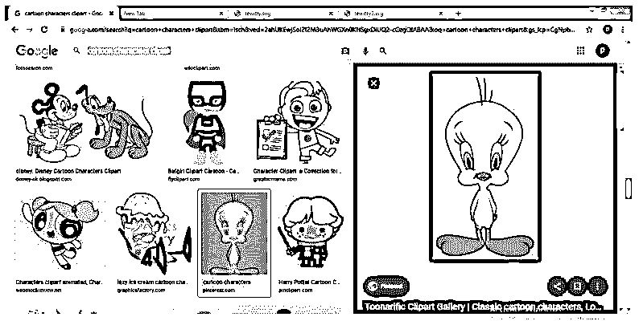

现在切换到 Inkscape 软件，要打开它，请单击文件菜单，然后选择打开选项，向下滚动列表，或者您可以按 Ctrl + O 作为快捷键。

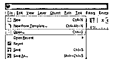

我们将在保存的文件夹中导航我的图像，然后选择它。现在点击这个对话框的打开按钮。

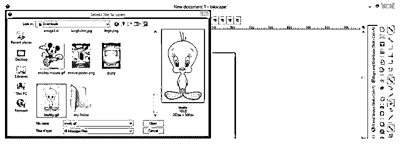

现在选择这张图片，我们将跟踪它。所以为了追踪它，去菜单栏的路径菜单然后点击它。点击此菜单下拉列表中的描摹位图选项，或者使用快捷键 Shift + Alt + B。

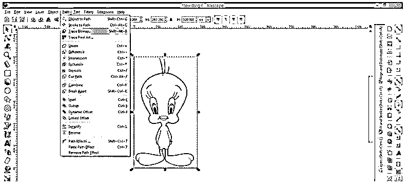

或者，您可以右键单击，然后从弹出列表中选择描摹位图选项。

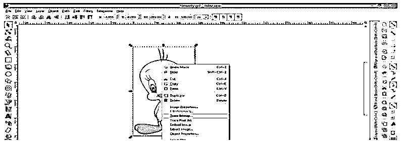

这是用于跟踪图像的对话框。这里我们有许多方法来跟踪位图(如果你想知道这个对话框中跟踪位图的每一种方法，那么你可以搜索我的文章“Inkscape 跟踪位图”),但是我们将使用第一种方法，即亮度截止。

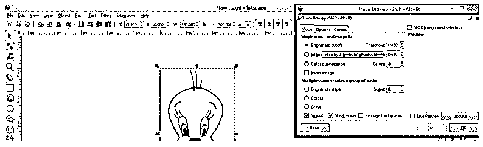

此选项有阈值限制，通过更改其值，您可以在位图跟踪中获得不同的结果。

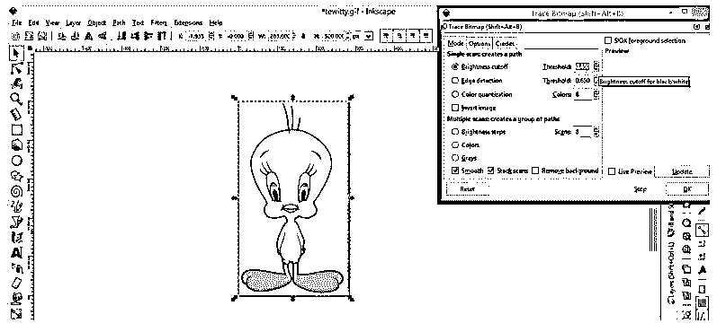

单击此对话框的更新按钮，查看跟踪结果的预览。

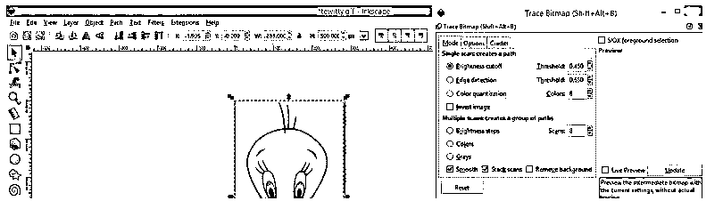

在这个框的预览部分，你可以看到结果，但我们只是想跟踪这个字符的轮廓，所以我们将调整跟踪只是轮廓的阈值限制。

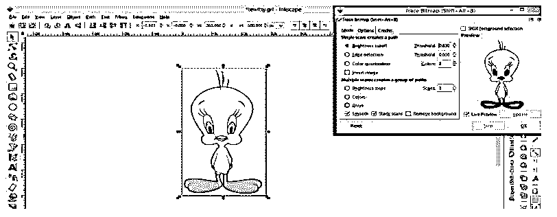

对于图像阈值将是这样的。现在点击确定按钮来追踪它。

你可以移动你的跟踪图像到原始图像旁边，这个跟踪图像将会是矢量格式。

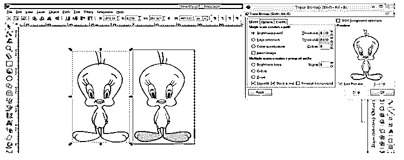

现在，我们将填充颜色到这个跟踪的图像，并在用户界面的底部点击箭头按钮。一旦你点击箭头按钮，你会有一个弹出列表，从这个列表中选择滴管。

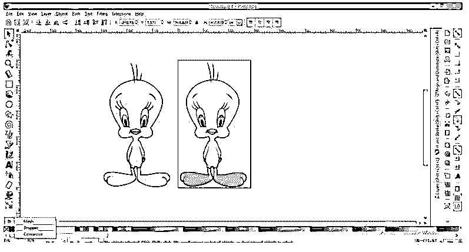

在使用滴管之前，请确保我们的文档区域没有被选中。然后将光标移动到你想追踪的颜色上。我们将移动滴管工具光标在这个卡通人物的肤色是黄色。

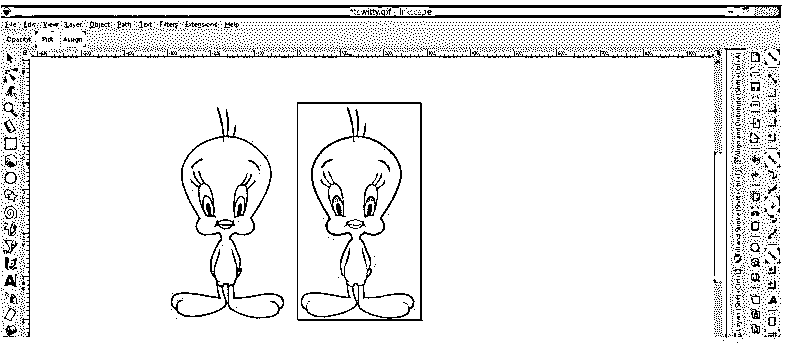

然后从工具面板中选择“填充有界区域”工具，将我们选择的颜色放入我们想要的描摹图像区域。您也可以按 Shift + 7 来使用此工具。

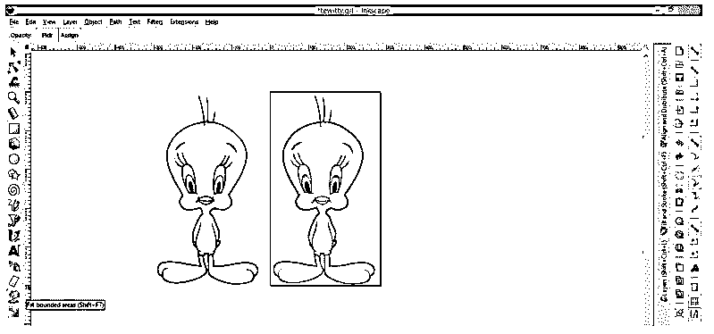

用这个工具的光标点击描摹图像的皮肤，它就会这样填充。

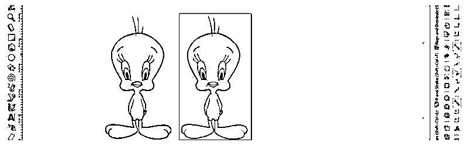

为了选择下一种颜色，取消选择描摹图像的前一部分，否则在您下一次选择新颜色时，将会像这样替换前一部分的填充颜色。

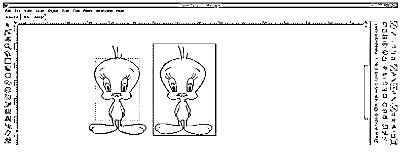

重复上面的步骤，填充这个角色的所有部分。

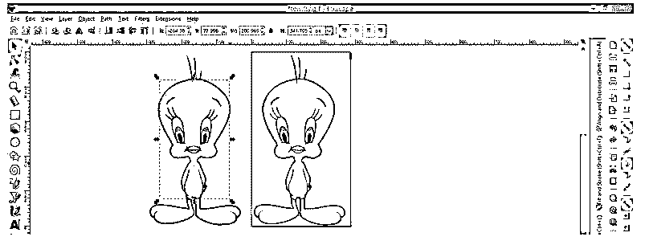

现在你可以看到我们角色的皮肤已经准备好了。

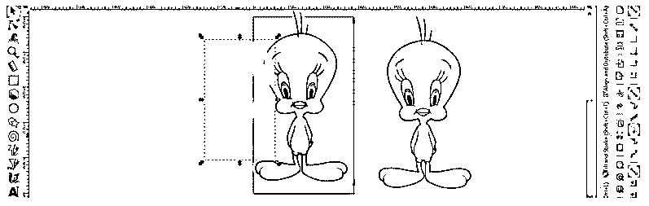

我们将画一个深色的矩形来解释你在填写时应该记住的事情。

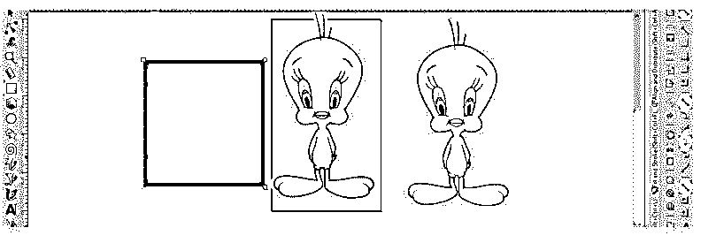

现在这是这个字符的白色区域，你也应该填充它，因为你可能会因为我们的背景是白色而误将其留空。如果有一部分是黑色的，对黑色也做同样的操作。简而言之，你必须用颜色填充所有部分，不管是白色还是黑色，或者和你的背景颜色一样。

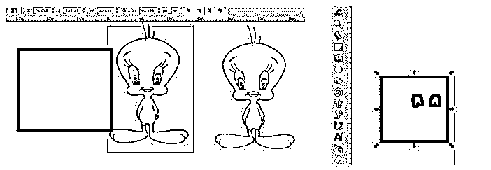

现在我们将统一这个角色的相同部分。因此，选择这个唇部分，然后进入路径菜单，点击下拉列表中的联合选项，或按 Ctrl +快捷键。

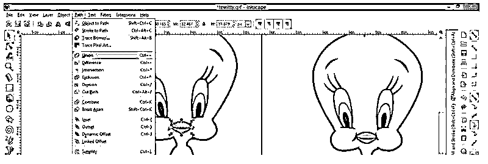

你可以看到它现在是一部分。

对你想做成一个零件的所有零件做同样的操作。

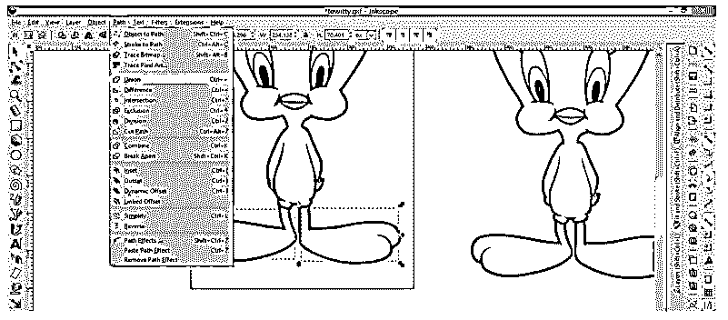

你应该分析所有零件，这样就不会留下任何零件。

例如，你可以注意到这是它皮肤的一小部分，与全身皮肤是分开的，所以我将它与全身皮肤结合在一起。

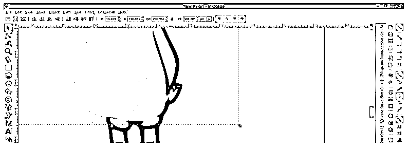

现在这个角色的所有部分都像这样准备好了。每个部分都在不同的层上。

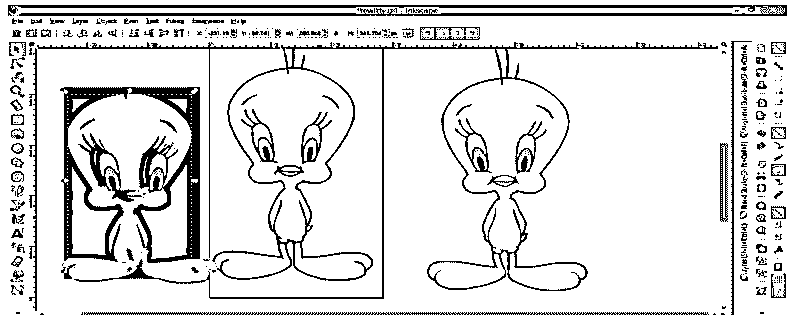

现在选择这个字符的轮廓，并按下键盘上的 Ctrl + d 键复制它，以便在你未来的工作中使用。

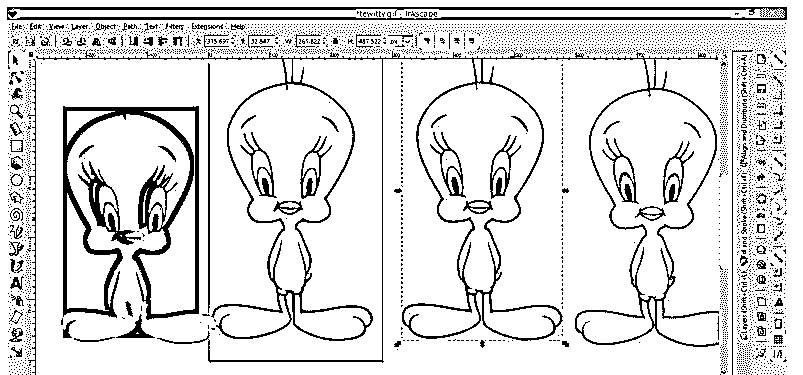

你可以改变轮廓的颜色以及你的选择

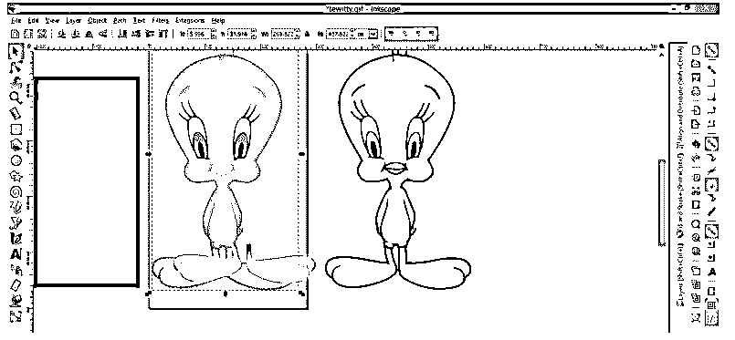

现在，我们将保存为 SVG 文件，所以去文件菜单，并点击下拉列表中的另存为选项。

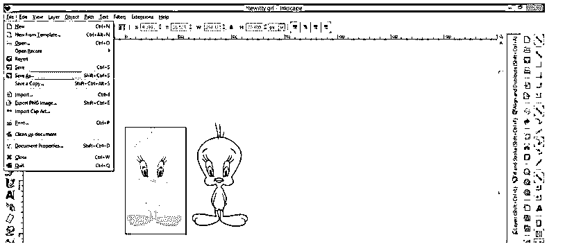

在文件扩展名列表中选择普通 SVG 选项，并选择你想保存它的位置，然后点击保存按钮。

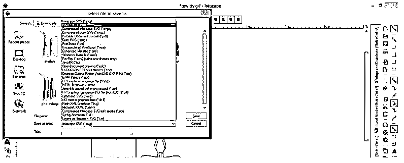

并且我们的 SVG 文件可以在其他设计软件中使用。

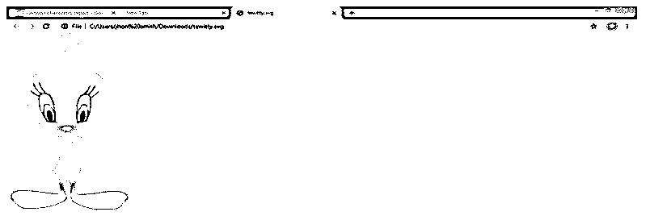

您会注意到我们的轮廓字符没有保存，因为它超出了您的文档区域。所以要确保 SVG 文件中的任何内容都应该在文档区域内。

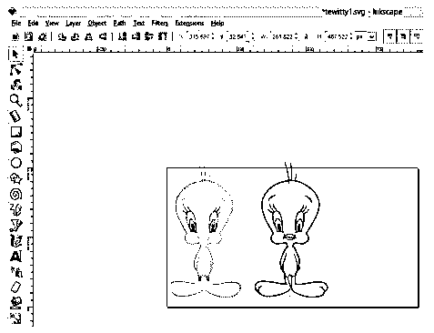

保存后就准备好了。

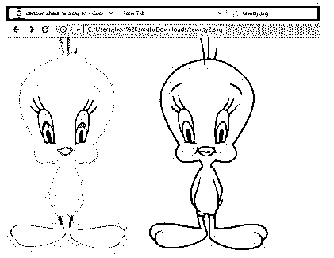

### 结论 svg 墨水匣

读完这篇文章后，你可以为你的项目制作大量的 SVG 文件，并在不损失质量的情况下对该文件的对象进行修改，因为你知道 SVG 是矢量文件格式。尝试不同的对象，并设置对象的 SVG 层，以便在 Inkscape 中拥有 SVG 文件。

### 推荐文章

这是一个 Inkscape SVG 的指南。为了更好地理解，我们在这里讨论 Inkscape SVG 的介绍和过程。您也可以看看以下文章，了解更多信息–

1.  [喷墨替代](https://www.educba.com/inkscape-alternative/)
2.  什么是 Inkscape？
3.  [矢量图形编辑器](https://www.educba.com/vector-graphics-editor/)
4.  [GIMP 替代方案](https://www.educba.com/gimp-alternatives/)

