# Inkscape 黑色主题

> 原文：<https://www.educba.com/inkscape-dark-theme/>

## Inkscape 黑暗主题介绍

Inkscape 深色主题可以定义为将该软件的用户界面呈现给用户一个黑暗的工作环境，这意味着您可以将用户界面屏幕调整为深色，这样您的眼睛在使用该软件时会感到舒适，因为在我们的工作中，有时需要花费很多时间来完成工作，所以在我看来，用户界面应该是对眼睛友好的，与其他主题相比，我最喜欢深色主题。使用屏幕颜色，您还可以控制工具面板中工具的图标颜色和图标大小，以及用户界面的其他功能。

### 如何进行黑暗主题的创作和工作？

今天我们将好好讨论一下用户界面的各个方面，以便更好地了解它，并学习如何改变到黑暗主题。Inkscape 的这些功能在它的旧版本中是不可用的，所以一定要使用这个主题，你应该有最新的版本。

<small>3D 动画、建模、仿真、游戏开发&其他</small>

我有这个软件的 1.0 版本。

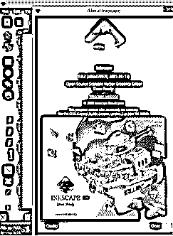

这是 Inkscape 的默认用户界面，是一个普通的主题。让我告诉你这个界面的所有部分，这样你就可以对我将在这篇文章中使用的术语有一个概念，并且对你来说与我的文字联系起来变得容易。该软件的第一栏是菜单栏，它位于 Inkscape 图标的下方。这个菜单栏有不同的菜单，如文件菜单，编辑菜单，层菜单，以及其他一些。这些菜单有助于我们对该软件的功能进行不同类型的更改，也有助于我们在设计工作中浏览该菜单。在此栏下面的行为控制面板中，您将拥有活动工具或对象的参数。在此面板旁边，您会看到用户界面分为三个部分，在左侧，我们有一个垂直列的工具面板，在中间，我们有一个文档区域，在右侧，有一些其他工具，帮助工具面板的工具工作。在按钮处，有一个颜色面板和一些其他部分。

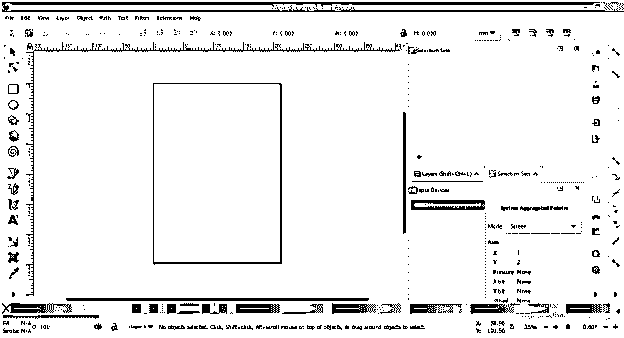

现在，让我们将这个主题更改为深色主题，为此，我们必须导航到“编辑”菜单，您知道在哪里可以找到此菜单，您将在菜单栏中看到此菜单，因此单击它。在这个菜单的下拉列表的底部，你会找到首选项选项，它的快捷键是键盘的 Shift + Ctrl + P 键。

单击此选项后，将会打开一个对话框，即“首选项”对话框，这里有许多关于更改用户界面和其他重要设置的参数。

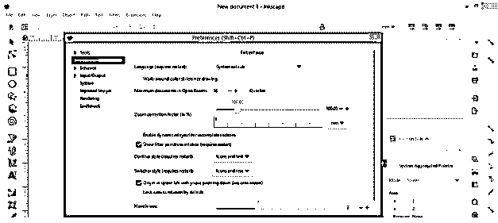

现在点击该框界面选项的箭头键，将会打开一个下拉列表。

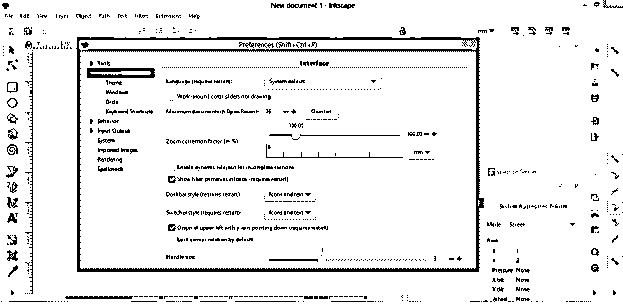

单击下拉列表中的主题选项，我们将在此首选项对话框中看到主题的参数框。

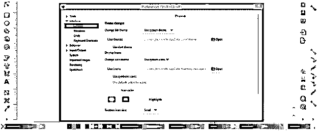

对于深色主题，通过点击该选项的复选框，启用主题框的深色主题选项。

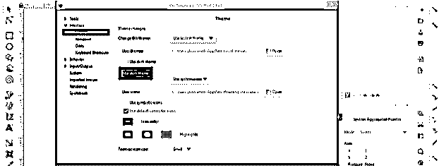

而一旦你点击它，这个主题就会变成这样的深色。

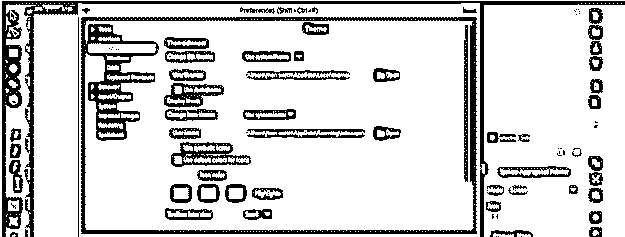

我们有一个选择，那就是 Gtk 主题的名字。您可以从列表中选择任何一个选项来改变界面颜色。有些选项与深色主题不兼容，所以根据你的要求选择。如果我选择高对比度，那么背景色和图标色之间会有更多的对比。

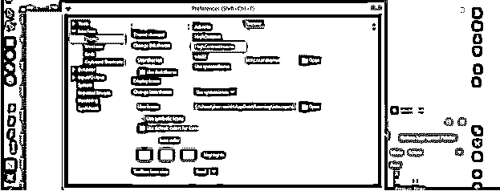

我们的黑暗主题准备好了。

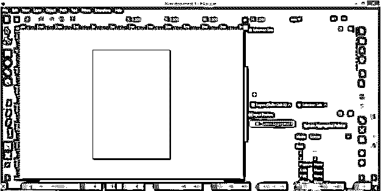

现在你可以调整工具图标的功能，使它们更适合深色主题。再次打开 Preferences 选项卡，方法和上面一样。在此对话框的“更改图标主题”选项中，我们有以下选项和“使用系统图标”选项，它将使用默认设置设置工具图标。

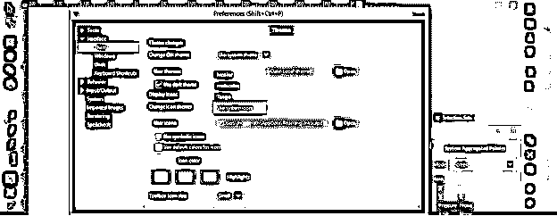

但是如果我点击列表中的“多色”选项。

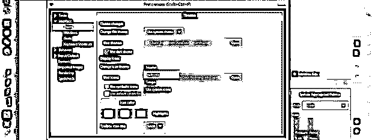

然后工具图标会改变成这种颜色。

在这个框中我们还有一个选项，通过它我们可以将工具的图标变成一个符号图标。因此，要将这些图标转换为符号图标，请点击该选项的复选框，启用“使用符号图标”选项。

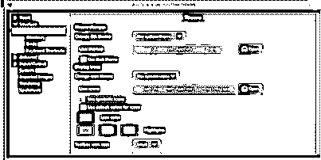

工具面板中的工具图标会像一个符号一样变化，代表每个工具的工作情况。

您还可以通过从这些颜色框中更改图标的颜色来调整图标的颜色。这些盒子是白色盒子，它是图标的基本颜色，绿色盒子，橙色盒子和红色盒子。

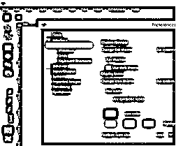

您也可以根据自己的选择更改图标的大小，并从“控制栏图标大小”的向下滚动选项列表中选择大小。我将单击此列表的大选项以获得一个大图标，但您可以看到图标没有变化，因为它会在重新启动 Inkscape 后更新。

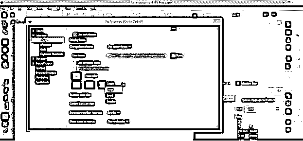

我会将所有选项都改为大，以便向您显示结果。

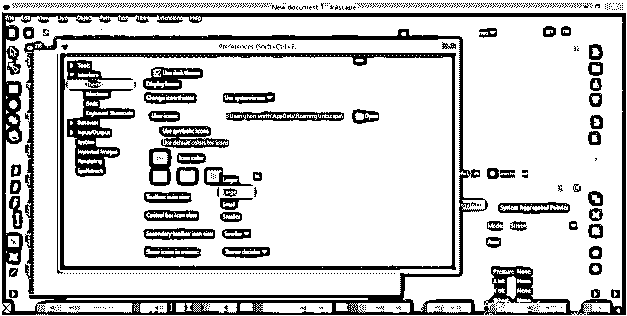

现在我又开始了我的水墨风景。你可以看到我的用户界面的图标已经根据我在该软件的首选项选项卡中所做的设置进行了更改。您可以通过在“首选项”选项卡中再次更改图标，随时切换到较小的图标。

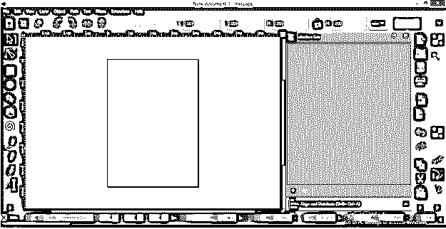

在这里，我已经带你通过这个软件的用户界面，也告诉你用户界面的所有部分，你可以根据你的黑暗主题的适用性做出改变。

### 结论

现在我确信黑暗主题对你来说不再是什么大不了的事情，你可以用你的软件在工作中轻松地做到这一点。现在你也知道了如何根据你的需求来操作图标的外观、颜色以及大小，这样在你的工作中操作它们就变得容易了。

### 推荐文章

这是一个黑暗主题的指导。这里我们讨论一下入门，如何用黑暗主题进行创作和工作？.您也可以看看以下文章，了解更多信息–

1.  [色拉酱](https://www.educba.com/inkscape-crop/)
2.  [喷墨替代](https://www.educba.com/inkscape-alternative/)
3.  什么是 Inkscape？
4.  [Inkscape vs GIMP](https://www.educba.com/inkscape-vs-gimp/)

