# 墨水匣追踪点阵图

> 原文：<https://www.educba.com/inkscape-trace-bitmap/>

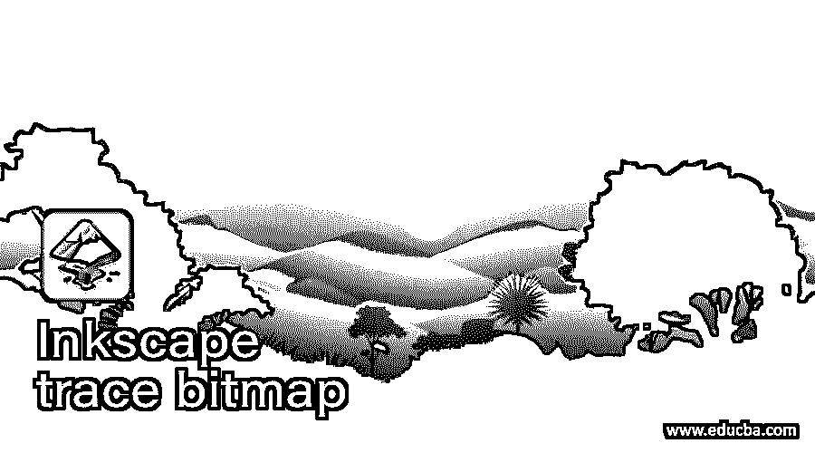

## Inkscape 跟踪位图简介

Inkscape 位图跟踪是 Inkscape 软件菜单栏的路径菜单的选项之一，通过它，您可以跟踪 Jpeg 和 PNG 位图图像，以便将它们转换为矢量文件，并且在转换该图像后，我们可以通过编辑其路径的节点来进行更改。有几种跟踪位图的方法，这意味着你可以用灰度或者用位图的颜色或边缘来跟踪。在这篇位图跟踪的文章中，我将解释跟踪位图的不同方法，并告诉你如何处理它的参数以获得最精确的结果。

### 如何在 Inkscape 中跟踪位图？

你可以跟踪任何位图，通过这个过程将其转换为矢量形状，所以我将使用一个图像。现在转到菜单栏的文件菜单，点击它。在下拉列表中单击导入选项或按下键盘上的 Ctrl + I 键选择该选项。

<small>3D 动画、建模、仿真、游戏开发&其他</small>

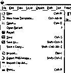

现在，我将通过从保存的位置导航来选择这张美丽的翠鸟图像，然后单击此对话框的打开按钮。你可以用你自己的位图。

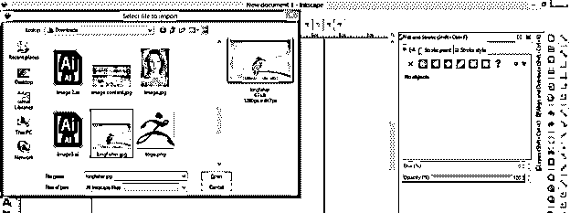

这里有我们的图像。

现在，让我们跟踪此图像，选择此图像，然后转到 Inkscape 用户屏幕顶部菜单栏的路径菜单，并单击它。这里我们有下拉列表中的跟踪位图选项。你可以记住它的快捷键是 Shift + Alt + B 或者点击这个选项。

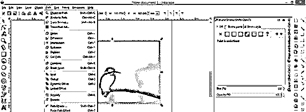

这是跟踪位图对话框，它有一些参数，我们将使用这些参数来得到我们想要的结果。

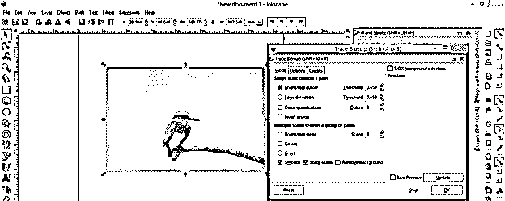

在这个框中，第一个选项是亮度截断，它将根据位图中高亮显示的像素来跟踪我们的图像。因此，如果选择了任何其他选项，请单击该选项的单选按钮进行选择。

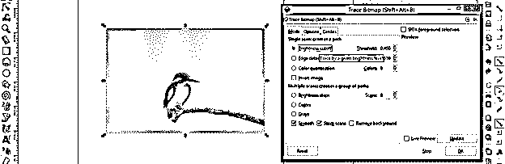

您可以更改此选项的阈值，以获得跟踪图像结果的变化。

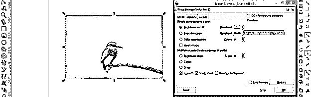

我将选中实时预览选项(位于此对话框的右下角)上的勾号，这样我就可以看到图像描摹的预览。你可以看到它会像这样追踪一幅图像。

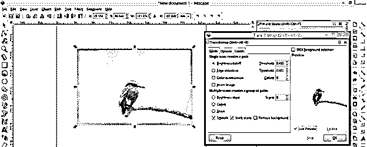

现在点击这个对话框的 Ok 按钮。

根据位图图像的复杂程度，我们的跟踪可以在几秒钟内完成。你将有原始图像上的跟踪图像。

我将它移动到文档区域，你可以看到它是否很酷。

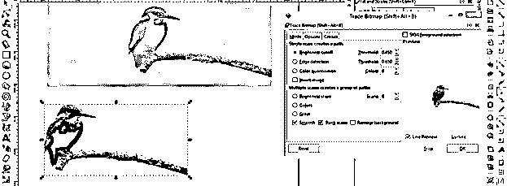

如果您给这个选项的阈值的最大值，那么它将更准确地跟踪。你可以比较这两个结果，并分析其中的差异。

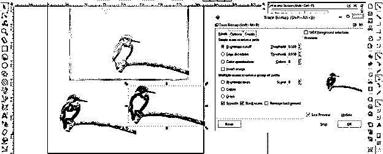

您可以像这样更改描摹图像的颜色。只需选择它，然后在颜色面板中单击您想要的颜色，它可能是您的插图工作的一部分。

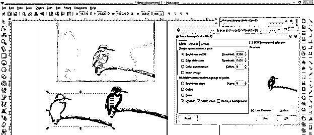

第二个选项，通过它你可以跟踪位图是边缘检测，它将跟踪图像的基础边缘。这对于追踪图像中任何有边缘的物体都非常有用。

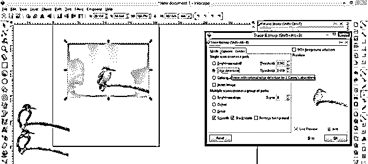

在此设置该选项的阈值，并点击该对话框的确定按钮。如果你给出它的最小值，那么它会很好地跟踪。

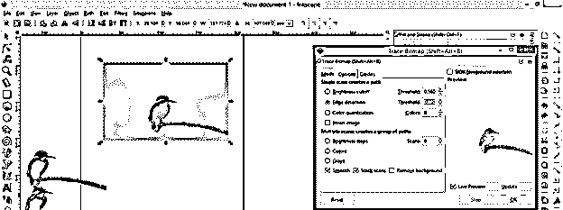

这是用边缘检测方法跟踪图像的结果。

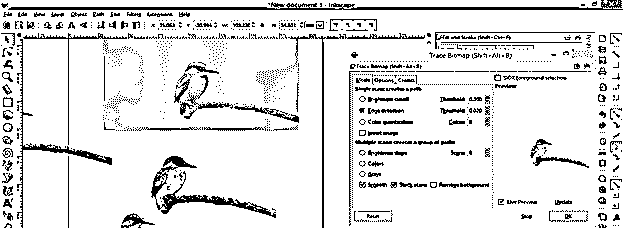

下一个是颜色量化选项，根据颜色跟踪位图。你可以在这个图像的预览部分看到它的痕迹，所以增加和减少这个选项的值来查看它的效果。

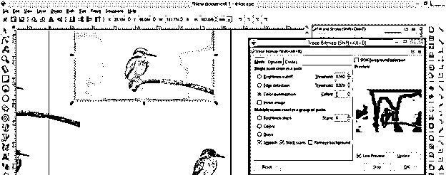

如果你也想用颜色跟踪任何位图，那么你可以使用这个框的多重扫描选项中的颜色选项。您可以根据您想要跟踪的位图给出颜色值，这意味着如果您给 8 作为扫描选项的值，那么它将通过扫描该图像的 8 种颜色来跟踪位图。为了获得更好的效果，最好采用最少数量的颜色。现在，单击此框中的“确定”按钮即可获得结果。

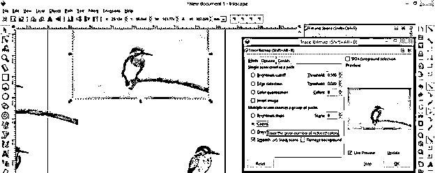

这是我们的彩色痕迹。

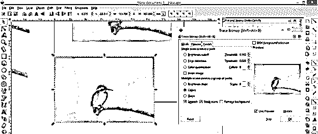

您可以取消组合它，因为它有许多不同颜色的层。因此，要取消分组，请转到菜单栏的对象菜单，然后单击下拉列表中的取消分组选项或按键盘上的 Shift + Ctrl + G 键。

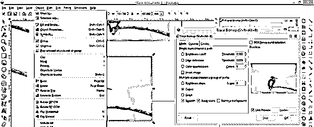

现在我将移动未分组的图层，向你展示它是如何用颜色描绘图像的。你可以看到不同的颜色层是这样描绘的。

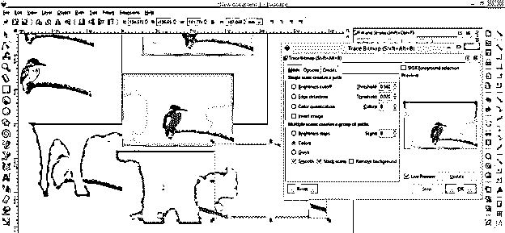

你可以删除不需要的层，我们将有这个跟踪彩色鸟。

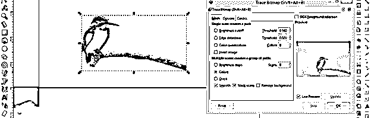

我在上面告诉过你，我们使用位图来将 jpeg 或 png 转换成矢量图像，所以在这里你可以看到，当我们使用节点工具选择这个跟踪的图像时，它会向你显示这个跟踪的图像具有的一些节点，这意味着它被转换成矢量。

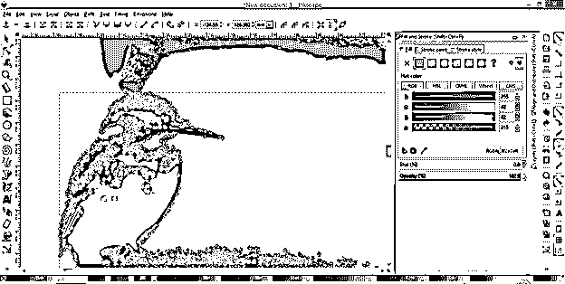

您可以编辑这些节点，以便根据您的要求更改跟踪位图的形状。

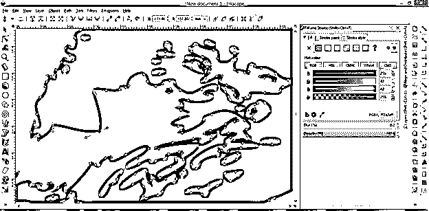

您可以像这样选择节点。

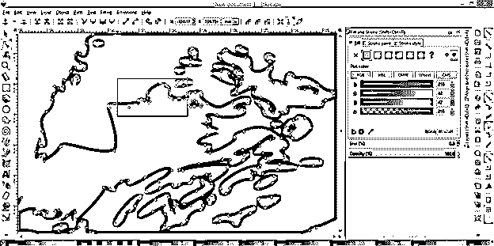

点击键盘上的删除键来删除它们，然后你可以用节点工具来处理这些节点。

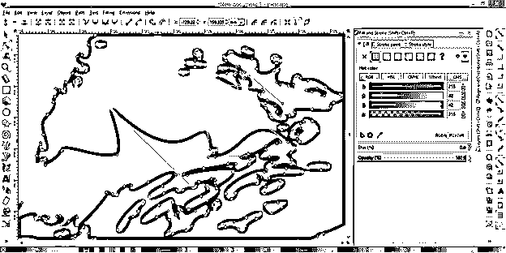

在这里，我试图向你解释所有选项的跟踪位图对话框，使你可以有一个想法，如何跟踪位图工程，你可以得到你想要的结果？

### 结论

我想读完这篇文章后，你现在能够理解位图的描摹和描摹后你会得到什么，你也知道使用 Inkscape 软件的这个功能的目的是什么。你可以很好地掌握 Inkscape 的这一特性，将它用于不同类型的位图，我指的是高分辨率和低分辨率。所以在这两种情况下都试试吧，看看效果如何。

### 推荐文章

这是一个 Inkscape 跟踪位图的指南。在这里，我们讨论在跟踪之后你会得到什么，以及你知道使用 Inkscape 跟踪位图的目的是什么。您也可以看看以下文章，了解更多信息–

1.  [喷墨替代](https://www.educba.com/inkscape-alternative/)
2.  什么是 Inkscape？
3.  [Oracle 位图索引](https://www.educba.com/oracle-bitmap-index/)
4.  [CSS 标题设计](https://www.educba.com/css-header-design/)

