# Inkscape 希腊字母

> 原文：<https://www.educba.com/inkscape-greek-letters/>

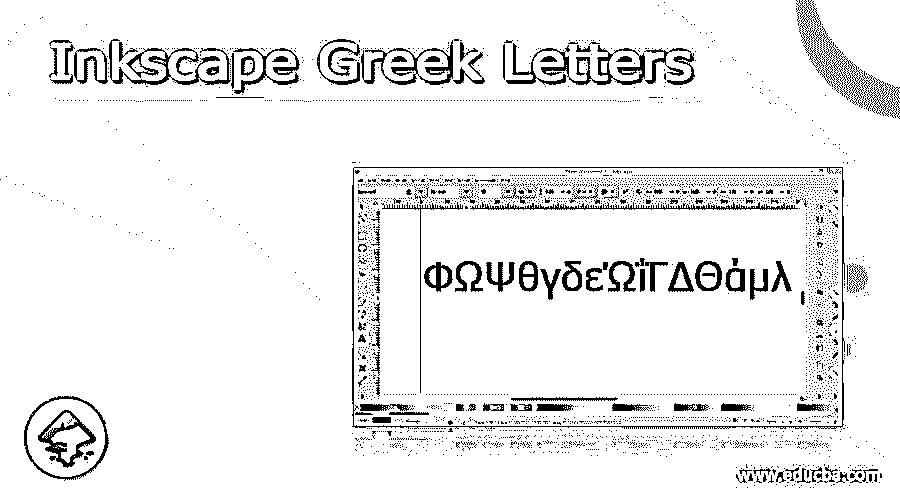

## Inkscape 希腊字母介绍

Inkscape 希腊字母通常在特定类型的文档工作中用作符号字母，有时我们在 Inkscape 中绘制任何工作时也需要这些字母，例如，如果我们想在绘图中指出一些数学步骤或指示，那么我们可能需要使用希腊字母。为此，我们可以通过使用该软件的 Unicode 字符功能在 Inkscape 中使用希腊字母。在这里，我将告诉你如何在你的艺术作品中使用这些字母，以及这些字母的快捷键。因此，让我们开始这篇关于这个问题的内容丰富的文章吧。

### 如何在 Inkscape 中使用希腊字母？

在这个软件中使用希腊字母没什么大不了的。你只是知道获得你想要的结果的正确和具体的步骤。所以我会告诉你这些步骤，通过这些步骤，你可以在你的文档区找到你想要的希腊字母。

<small>3D 动画、建模、仿真、游戏开发&其他</small>

你要做的第一件事就是去工具面板，从那里选择“创建和编辑文本对象”工具。也可以按键盘的 T 字母键作为该工具的快捷键。如果你愿意，你也可以按键盘上的 F8 功能键来打开文本模式。

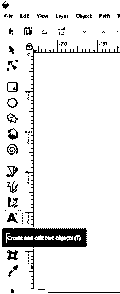

打开文本模式后，点击你想要的文档区域，鼠标光标会在你点击的点上闪烁。你可以在这里输入你想要的文本，但我们希望这里有希腊字母。

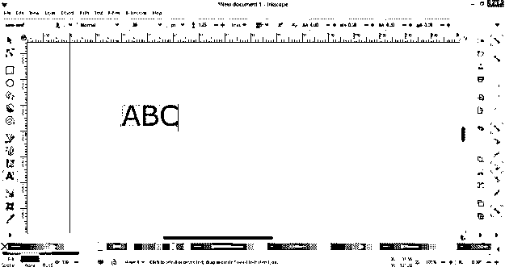

进入菜单栏，点击文本菜单。一旦你点击它，一个下拉列表将被打开。在列表中点击 Unicode 字符选项。

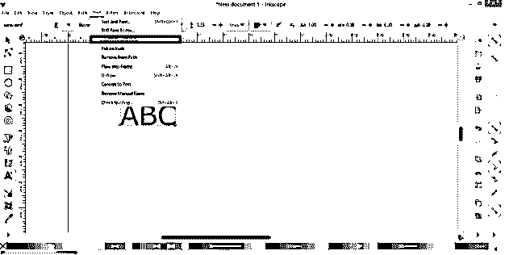

一旦你点击这个选项，你会在工作窗口的左边发现一个 Unicode 对话框。

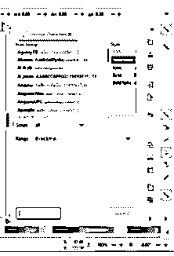

在此框中，您可以从字体系列列表中选择字体类型。目前，它是选定的无衬线字体系列。

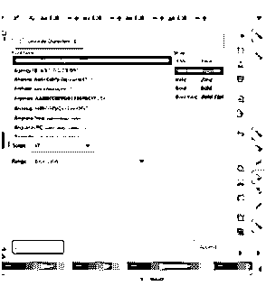

在样式框中，你可以选择不同类型的字体，比如粗体、斜体等等。

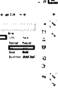

现在点击这个对话框的脚本选项的下拉箭头按钮。

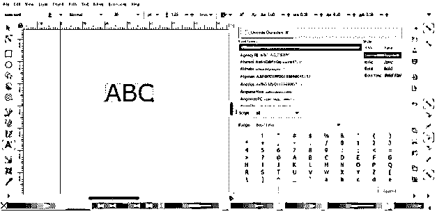

一旦你点击它，一个不同的脚本列表将被打开，这意味着不同的打字语言的列表将被打开。

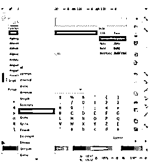

在此列表中，通过向下滚动列表来搜索希腊文，并单击它来选择它。

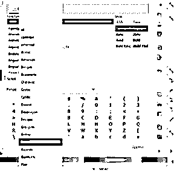

然后转到范围选项，并点击其标签的下拉箭头。

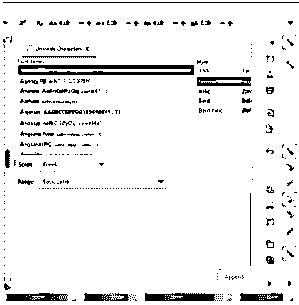

并从打开向下滚动列表中选择所有选项。

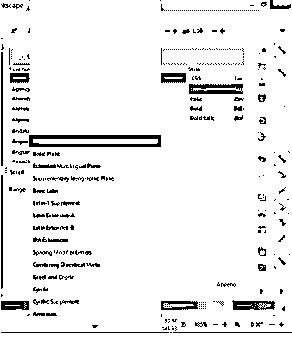

或者，如果你不想遵循这些步骤，你可以再做一件事。只需进入范围选项，然后从下拉列表中选择希腊语和科普特语选项。

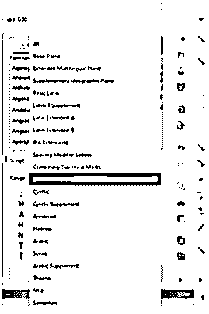

在 Unicode 对话框的这一部分，您会看到希腊字母，如 alpha、Beta 等。

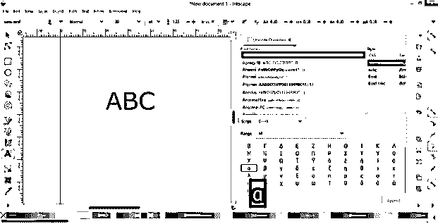

双击要插入文档区域的字母。

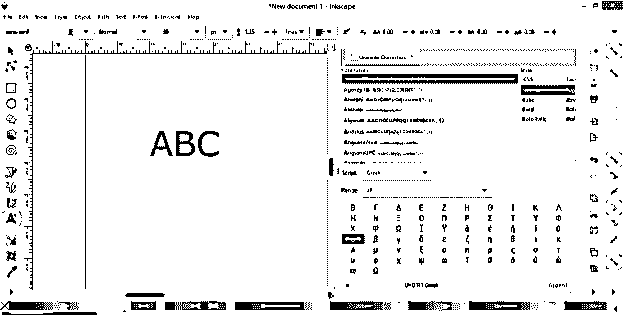

一旦你点击它，你选择的字母将出现在 Unicode 对话框的文本框中。您可以在此对话框的按钮处找到此文本框。

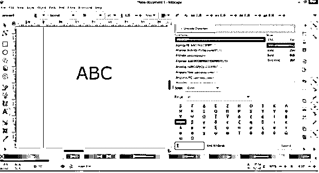

只需在文本框中选择这封信，然后按下键盘上的 Ctrl + C 键进行复制。现在去文件区，用文本工具点击你想要的地方，然后按 Ctrl + V 按钮粘贴到那里。

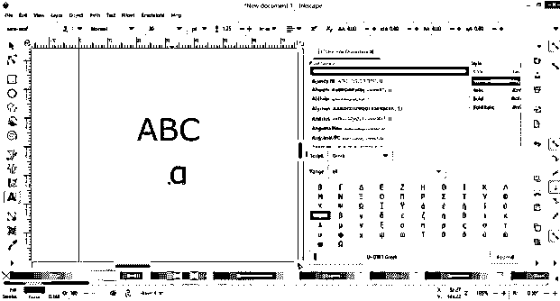

一旦你在文件区域经过一个希腊字母，Unicode 对话框的附加按钮将会被激活，这意味着现在你可以点击这个按钮在文件区域插入你选择的希腊字母。

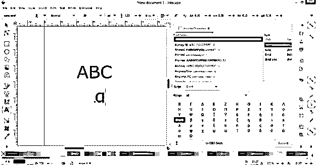

现在让我来告诉你怎么做。只需从列表中选择你想要的希腊字母，双击一个接一个。

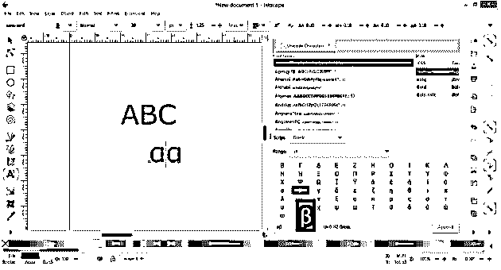

您选择的所有字母都将出现在文本框中。

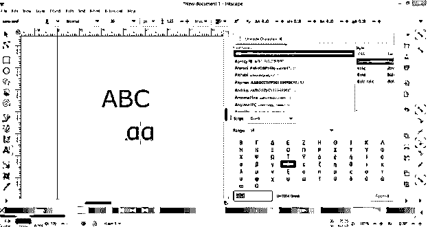

现在只需点击 Unicode 对话框的追加按钮。你可以在这个对话框的按钮右上角找到这个按钮，一旦你点击这个按钮，这个对话框的文本框中的所有字母都会像这样插入到文档区域。

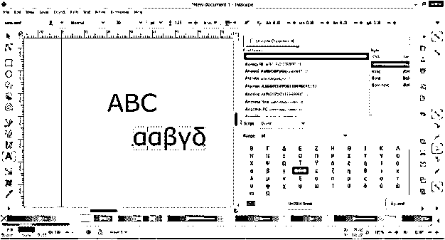

现在让我告诉你其他方法，通过这些方法你可以直接在文档区域插入你想要的希腊单词。对于这种文字工具，拖动鼠标光标，使段落或文本框像这样。

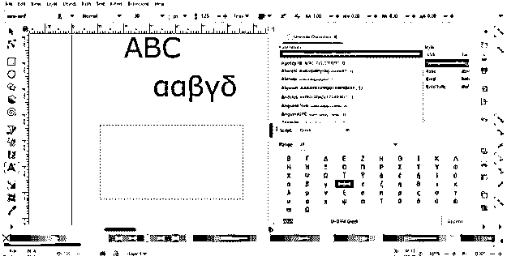

现在，当您进入 Unicode 对话框时,“追加”按钮将自动激活，这次只需选择您想要的字母，当它们进入 Unicode 对话框的文本框时，只需单击“追加”按钮。

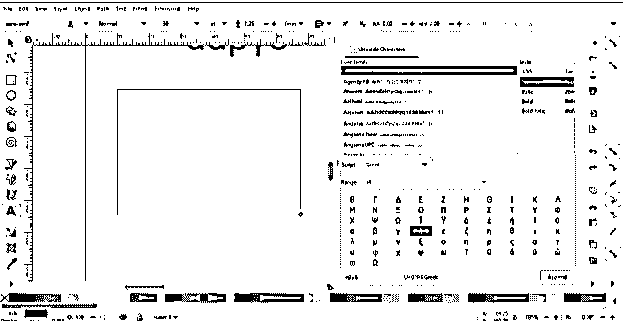

它将出现在文档部分的文本工具的文本框区域。你也可以用同样的方法根据你的选择只插入一个希腊单词的字母。例如，我想插入这个阿尔法只，所以我会选择它，并重复插入过程，它将插入在文件区像这样。

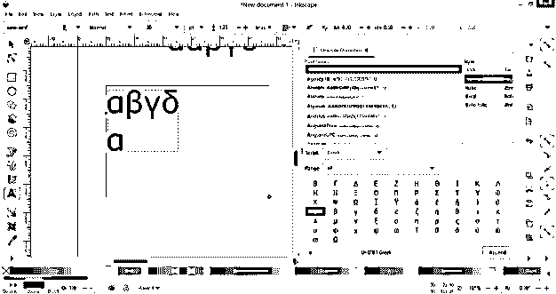

您也可以通过按下它们 Unicode 来键入这些希腊字母。你可以在它们的文本框旁边的 Unicode 对话框中看到它们的代码。例如，alpha 的 Unicode 是 U+03B1，要应用它，首先按下键盘的 Ctrl + U 按钮，当你按下它时，它将转换为 Unicode 模式。

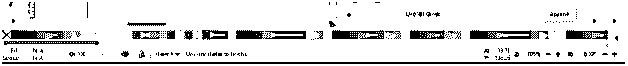

现在按下这封信的代码 03B1

并按下键盘的回车键。它会像这样在你的文档区域打字。确保在应用代码之前，已经使用文本工具点击了文档区域。

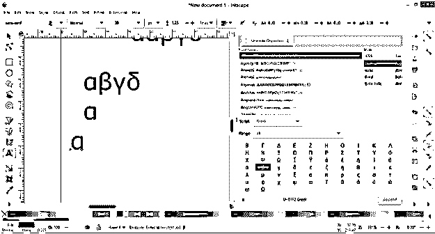

你也可以在网上找到这些代码。

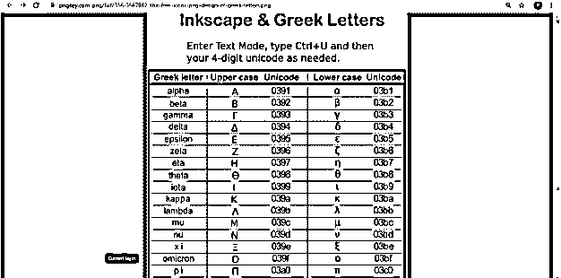

### 结论

我告诉了你希腊字母的所有方面，现在你知道了在任何插图工作中，在 Inkscape 的文档区域中使用这些字母的几种方法。你可以用这些字母 Unicode 来快速访问它们，只需学习它们的代码并应用它们。

### 推荐文章

这是一份希腊字母指南。这里我们讨论一下入门，如何在 Inkscape 中使用希腊字母？.您也可以看看以下文章，了解更多信息–

1.  [Inkscape 插件](https://www.educba.com/inkscape-plugins/)
2.  [Inkscape 与网格对齐](https://www.educba.com/inkscape-snap-to-grid/)
3.  [印花布影](https://www.educba.com/inkscape-shadow/)
4.  [Inkscape 透明背景](https://www.educba.com/inkscape-transparent-background/)

