# Inkscape 与网格对齐

> 原文：<https://www.educba.com/inkscape-snap-to-grid/>

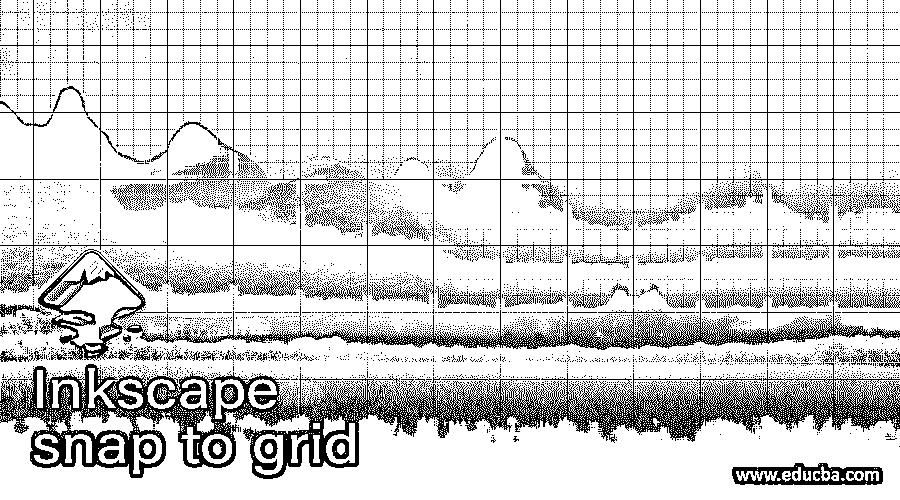

## Inkscape 与网格对齐简介

Inkscape snap to grid 是 Inkscape 的一个非常有用的功能，它在我们在这个软件中进行设计工作时帮助了我们很多，你可以理解它就像一个磁铁，如果它靠近磁铁，这意味着如果你将光标指针移动到网格的点附近，那么光标指针将自动与该点对齐，我们将在艺术板上获得准确的点。所以今天你将学习这个软件的网格和网格捕捉功能，这对你将来的设计工作非常有用。因此，让我们深入研究这个话题，以获得关于它的准确知识。

### 如何在 Inkscape 中使用“对齐网格”?

我们将在这个软件中浏览选项和子选项的数量，以便了解这个主题，所以在我们开始之前，我想我应该告诉你这个软件的用户界面的一些重要部分，以便你能理解我在这篇文章中所说的话。

<small>3D 动画、建模、仿真、游戏开发&其他</small>

从顶部开始，我们在这里有菜单栏，其中包含一些菜单，如文件，编辑，查看和其他一些。在此下方是活动工具的属性栏，通过它您可以更改该工具的参数。在用户界面上向下移动，您将看到三个部分，其中左侧是工具面板，中间是我们工作的显示窗口，右侧是一些其他最常用的工具，用户界面底部是调色板。您可以将本软件的任何部分(可移动)放置在您想要的用户界面区域。

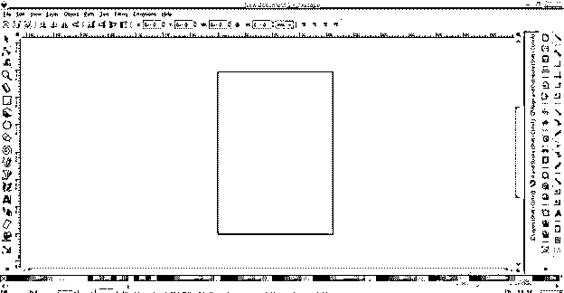

现在为网格去文件菜单的菜单栏，并点击它。一旦你点击它，一个向下滚动的列表将被打开。在此列表中，单击文档属性选项，或者您可以使用键盘上的 Shift + Ctrl + D 键，这是它的快捷键。

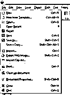

这是文档属性对话框，单击此对话框的网格选项卡。

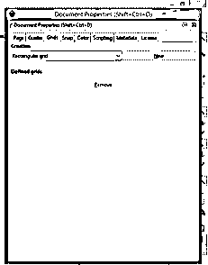

我们这里有两种网格，第一种是矩形网格，第二种是轴测网格

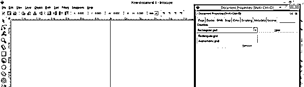

我将向您解释矩形网格的捕捉功能，因此单击此选项卡的“新建”按钮以获得网格，您将在文档窗口中获得网格。

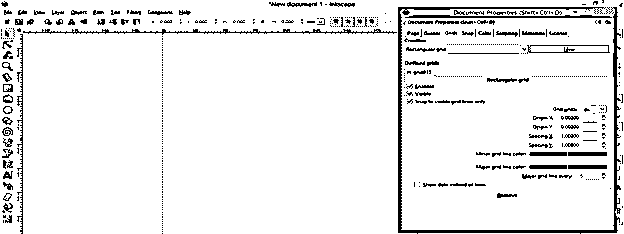

这个格子由横线和竖线组成，它由许多块组成。根据这个框的当前设置，一个网格块构成 1 x 1 像素。可以根据你来改。

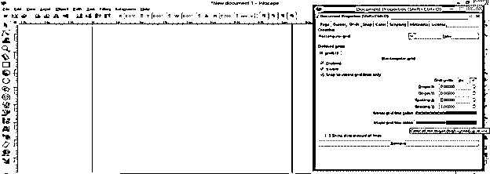

我将给出 10 X 10 的值，您可以看到网格前后的差异

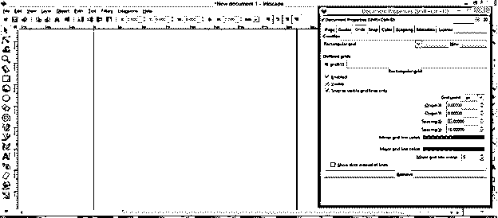

网格中不一定要有方块。你可以通过不同地改变 X 和 Y 方向的间距值来改变方块的形状，而不是正方形。

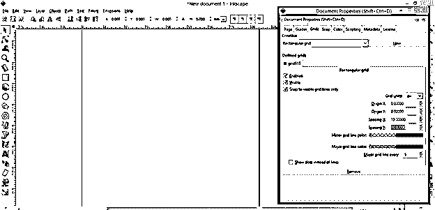

您还可以更改次要或主要网格的颜色。主网格在列和行中有 5 条次网格线。你可以看到我把主要线条的颜色改成了红色，这在文档区域很明显。

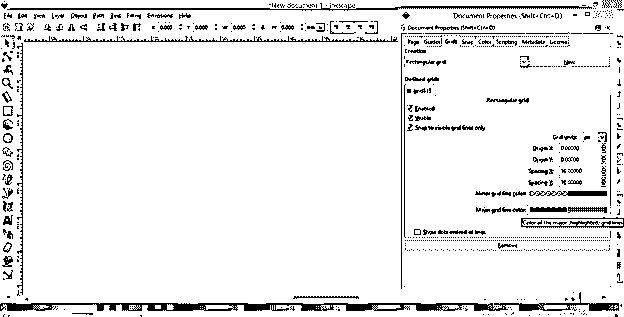

您可以通过此选项更改主网格中的次网格编号。现在是 5，这就是为什么我们有 5 个小网格。

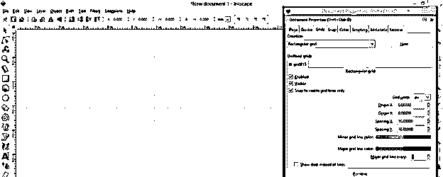

如果我把它改为 7，那么在主网格中将有 7 列和 7 行。

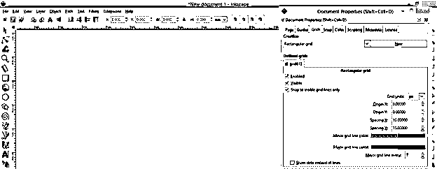

现在让我们学习如何在这个网格上使用捕捉选项。在用户屏幕的右侧，您会发现带有此图标的“对齐网格”选项。仅当启用此选项时，对齐网格才有效。您可以通过单击它来启用它。如果它的图标有蓝色，这意味着它是活跃的。

现在，我已经从工具面板中选择了矩形工具，你可以看到网格正在向我显示这个网格的方块角上的捕捉点。我将从这一点开始，单击它来绘制一个矩形。

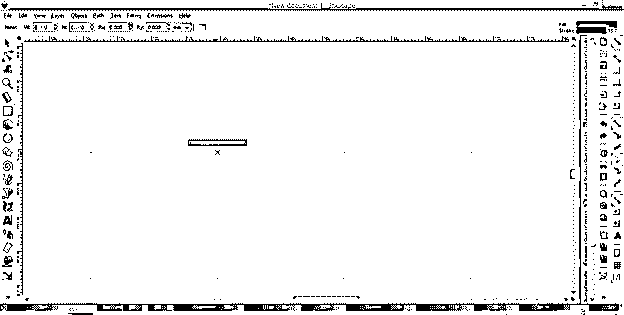

现在拖动鼠标光标画矩形，你会注意到神奇的事情发生了。这是什么魔法？这个魔术是你的光标会自动捕捉块的角点，你可以画一个正方形，而不需要按住键盘的 Ctrl 和 Shift 键。

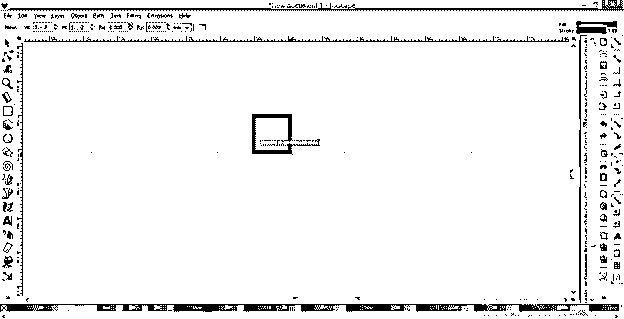

当您通过用鼠标光标拖动所绘制的对象来调整其大小时，这种对齐方式也将起作用。

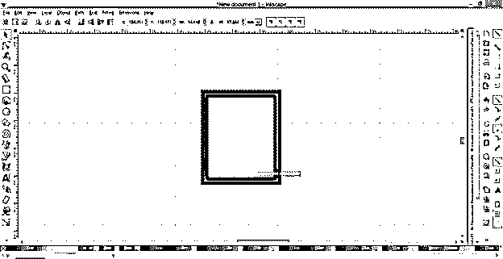

使用贝塞尔工具时，您也可以享受此捕捉功能。所以我将从工具面板中选择贝塞尔工具，从这个网格的任意捕捉点开始。当我移动到下一个点时，它会像这样与方块的角点对齐。因此，如果启用了网格对齐选项，使用贝塞尔工具也变得很容易。

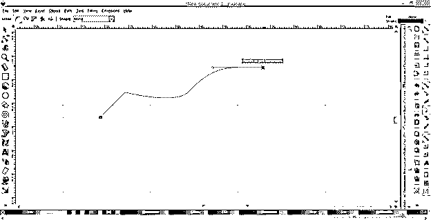

您可能有一个疑问，如果您不希望网格线出现在您的文档区域，同时还希望捕捉功能处于活动状态。所以我会告诉你这是可能的。您只需在文档属性框中启用“网格”选项卡的“可见”选项，就可以像我们处理上面的网格一样使用“对齐”功能。

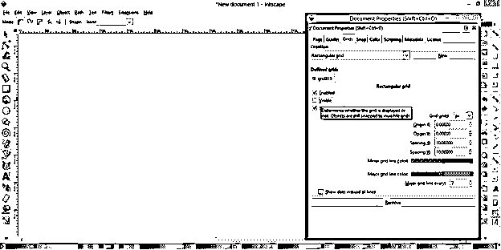

你可以看到它向你展示了捕捉点，即使我们看不到网格线。

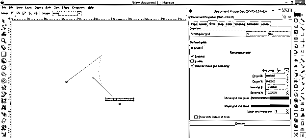

通过从同一个对话框中添加新网格，可以有多个这样的网格。我已经改变了新网格线的颜色，这样你就可以区分两个网格。

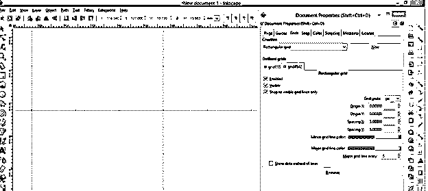

如果您想交替使用两个网格，可以禁用“仅对齐可见网格线”,禁用此选项后，使您不想使用的网格不可见。您可以用其他网格重复它。

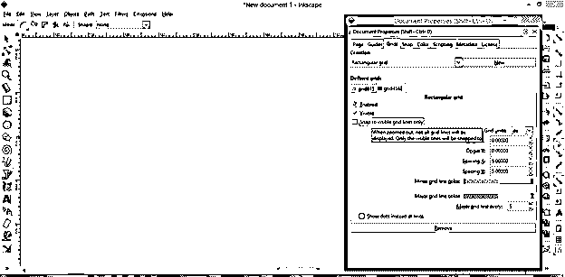

### 结论

现在，了解这个软件的网格捕捉功能对你来说很容易，你可以在你的项目工作中使用它来提高你工作的准确性，你也可以通过这个功能提高你在艺术作品中的指挥技能。试着这样做，这样你就可以非常舒适地处理抓拍。

### 推荐文章

这是一个 Inkscape 网格对齐指南。在这里，我们将讨论如何在 Inkscape 中使用“对齐网格”,以及如何在项目工作中使用它来提高工作的准确性。您也可以看看以下文章，了解更多信息–

1.  [喷墨替代](https://www.educba.com/inkscape-alternative/)
2.  什么是 Inkscape？
3.  [3ds Max 室内设计](https://www.educba.com/3ds-max-interior-design/)
4.  [UI 设计工具](https://www.educba.com/ui-design-tools/)

