# Inkscape Fonts

> 原文：<https://www.educba.com/inkscape-fonts/>

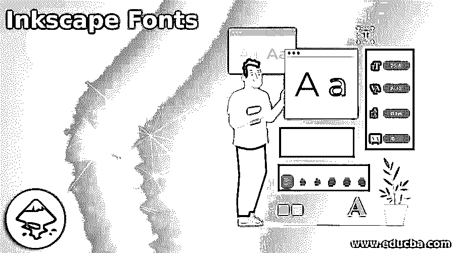

## Inkscape 字体的定义

字体是特别设计的字体，用于增强艺术作品的创造性和外观。用户使用各种风格的字体来提升他们的设计。Inkscape 字体与其他程序字体没有什么不同。字体特别安装在操作系统中，是现有操作系统的一部分。因此，用户将理解安装在包括 Inkscape 在内的计算机上的每个程序中的同一组字体。但是，用户可以从互联网上下载字体并安装在 Inkscape 中。

### 字体在 Inkscape 中如何工作？

字体不适用于单独的软件。字体是文本的特征，包括数字、字母和特殊字符。在 Inkscape 中，用户可以找到操作系统中安装的所有字体。此外，用户可以下载和安装字体，并将字体文件分别放在操作系统的字体文件夹中。

<small>3D 动画、建模、仿真、游戏开发&其他</small>

要在 Inkscape 中使用字体，有两种方法可以根据用户的需求安装和创建自定义字体。Inkscape 字体的界面对用户友好，对用户反应迅速。用户也可以从网上下载衬线字体、无衬线字体和单色字体。或者他们也可以在 Inkscape 中创建自定义字体。字体在本质上是通用的。任何在 Linux 上使用的字体也可以在 Windows 或 Mac 操作系统上使用，反之亦然。

#### 方法 1:

在这种方法中，用户将学习从互联网下载字体，并在 Inkscape 中安装和创建具有该特定字体的文本。以下是执行相同操作的步骤:

1.在网上搜索可免费下载的字体

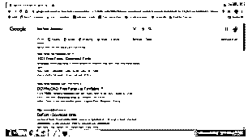

2.你可以去 www.1001freeFonts.com

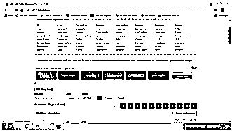

3.从网站下载任何字体。

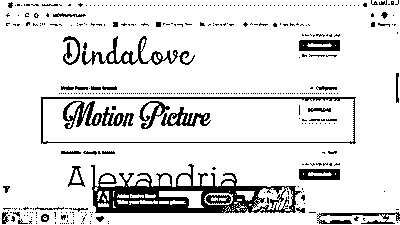

4.你会得到一个 zip 文件夹，解压文件夹，双击字体文件。

5.字体在的扩展中创建。OTF 和. TTF。要安装字体，双击安装按钮。

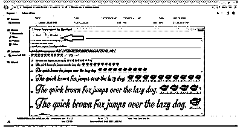

6.重新启动或启动 Inkscape。

7.创建新文件

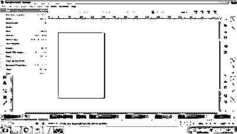

8.转到文本工具

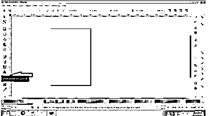

9.键入文本。

10.你会在顶部的命令面板上看到字体样式，或者你可以进入文本>文本和字体。这将打开一个对话框，用户可以在其中编辑文本。

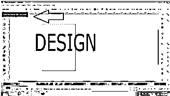

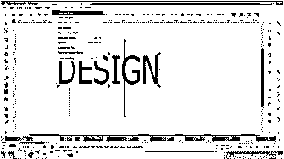

11.通过滚动列表或键入字体名称来搜索您已下载的字体。

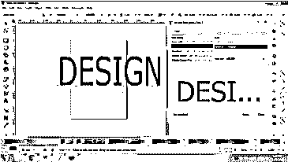

12.点选字体，然后点选套用

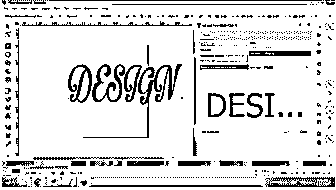

13.您将看到下载的字体已经应用于文本。

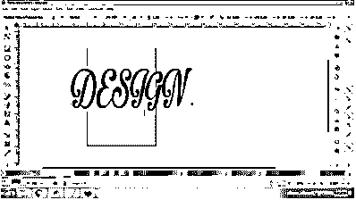

**重点:**

有时，用户下载的字体不会出现在程序的字体列表中。对于此问题，请确保在分别安装字体时，为所有用户单击“安装”选项。

#### 方法 2

通过这种方法，用户将学习如何在 Inkscape 程序上创建自定义字体，以及如何在其他平台上使用这些字体。在软件上创建的字体位于。SVG 格式。借助以下步骤，用户可以使用字体转换器将字体转换为其他格式:

1.启动 Inkscape

2.转到文件>从模板新建

3.将出现一个对话框，从列表中选择印刷画布。

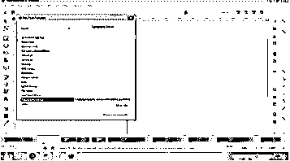

4.将出现一个艺术板来创建自定义文本

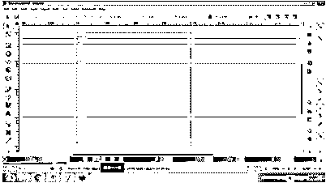

5.接下来，点击菜单栏中的 Text 并进入 SVG 编辑器

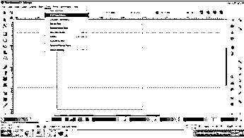

6.您将看到一个名为“字体”的栏。单击新建或双击列本身。

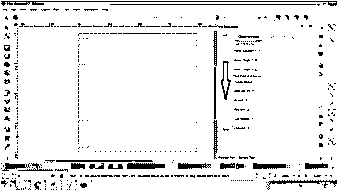

7.接下来，从菜单栏转到图层，点击图层查看图层面板。

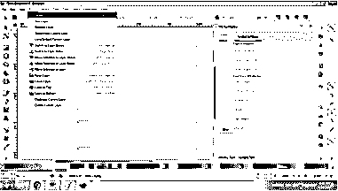

8.接下来，通过点击+(添加层选项)符号创建一个新层。

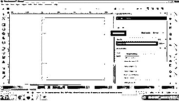

9.现在，借助贝塞尔工具创建一个字母

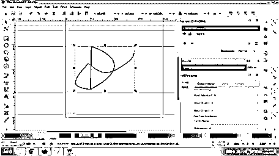

10.创建字母后，选择从选区获取曲线。

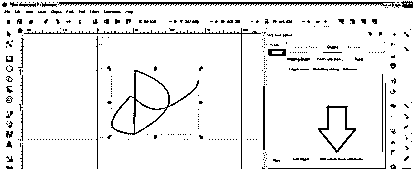

11.如果您看不到文本，请单击如下图所示的“从选择中”。

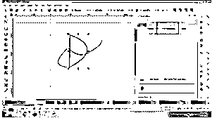

12.您也可以从预览文本选项中查看示例文本。

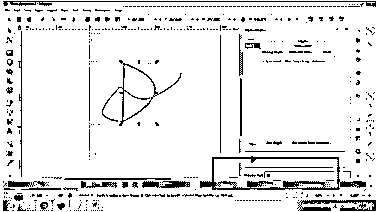

13.一旦创建了字体，就可以将文件保存在。SVG Inkscape 格式。

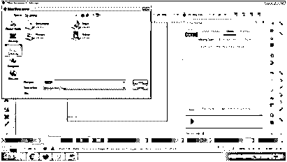

14.将文件转换成。ttf 格式，使用在线文本字体转换器，如 convertor。

15.转换并安装字体，以便在其他平台上使用自定义字体。

### 结论

总结这篇文章，用户将学习所有关于字体的知识，以及如何在 Inkscape 中下载和构造特殊字体。尽管制作字体的过程可能会令人困惑，但一旦学会，它可以在很大程度上使用户受益。

字体将永远是设计创意和创新艺术品的一个主要属性。因此，了解它们的用途和属性将有助于用户在未来的努力。

### 推荐文章

这是一个 Inkscape 字体指南。这里我们讨论定义，如何在 Inkscape 中使用字体？以及相应的方法。您也可以看看以下文章，了解更多信息–

1.  [Inkscape 插件](https://www.educba.com/inkscape-plugins/)
2.  [Inkscape 与网格对齐](https://www.educba.com/inkscape-snap-to-grid/)
3.  [印花布影](https://www.educba.com/inkscape-shadow/)
4.  [Inkscape 透明背景](https://www.educba.com/inkscape-transparent-background/)

