# Inkscape 扩展

> 原文：<https://www.educba.com/inkscape-extensions/>

## Inkscape 扩展简介

Inkscape 扩展是帮助 Inkscape 执行特定操作的附加脚本或插件类型，这些操作不是在开发过程中内置的。Inkscape 中已经有一些扩展，您可以使用它们来增强该软件的工作能力，这些扩展使我们的工作变得简单，我们可以顺利地执行复杂的操作。如果你愿意，你可以在 Inkscape 中安装任何外部扩展并使用该外部扩展，就像我们可以使用它的内置扩展一样。在这篇文章中，我将告诉你在哪里可以找到在 Inkscape 中使用它们的扩展，以及如何安装外部扩展？

### 如何在 Inkscape 中使用扩展？

我们可以使用 Inkscape 的内置扩展在其中执行多种类型的工作。你会在这个软件的菜单栏的扩展菜单里找到很多不错的扩展。所以让我们开始讨论吧。

<small>3D 动画、建模、仿真、游戏开发&其他</small>

要在 Inkscape 中导航任何扩展，请转到菜单栏的扩展菜单，它位于工作屏幕的顶部。一旦你点击这个菜单，会有一个扩展列表，你可以选择你想要的。有调整颜色的扩展、修改路径的扩展、文档设置的扩展等等。这取决于您想要使用哪种类型的扩展来执行您的任务。

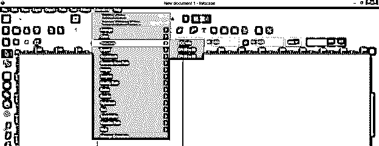

让我告诉你如何使用它们。每个扩展都有不同的使用方式。所以你可以通过练习来学习所有重要的扩展。我将告诉你其中一个扩展，并向你解释如何执行这个扩展？

为此，我将使用工具面板的文本工具键入文本。我将输入 EDU 作为我的文本。

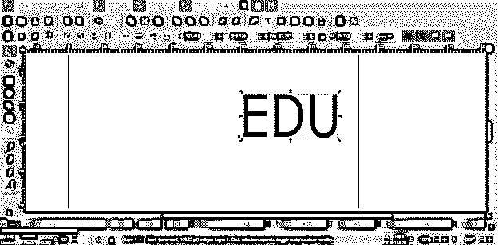

然后我将从工具面板中选择贝塞尔工具。

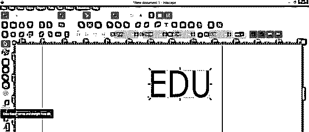

创建一条这样的路径。您可以使用本软件的其他工具创建任何路径；也就是说，您可以创建一个矩形路径，然后根据您的选择进行编辑，或者使用椭圆工具创建一个圆形路径等等。我们要把这篇课文的视图改成透视图。

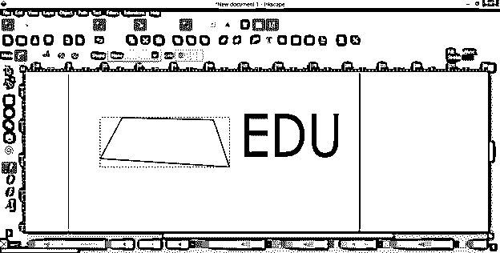

创建这个路径后，我将同时选择路径和文本。要同时选择路径和文本，请先选择任意对象，然后按住键盘的 shift 键，再单击其他对象。

现在，在选择了两者之后，进入菜单栏的扩展菜单并点击它。转到下拉列表的修改路径选项。这实际上是一种以多种方式修改路径的扩展。在新的修改路径下拉列表中，选择透视选项并点击它。

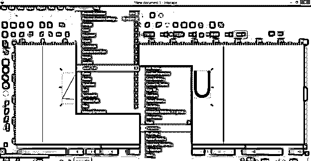

一旦你点击它，然后如果有一些申请扩展的错误，那么它会显示一条消息给你。在我的例子中，选择的对象应该是路径，但是我们的文本不是路径；这就是为什么它显示第二个对象不是一个路径，所以它不能应用这个扩展到我选择的对象。

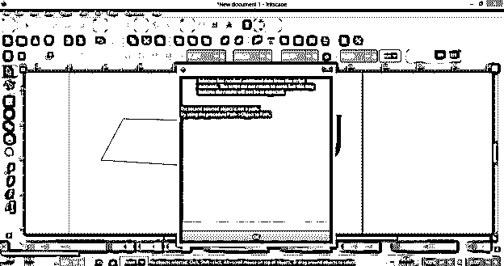

所以在申请这个扩展之前，我将把这个文本转换成路径，为了转换它，我将首先选择它，然后转到菜单栏的路径菜单，点击“对象到路径”选项，或者你可以在选择文本后简单地按 Shift + Ctrl + C。

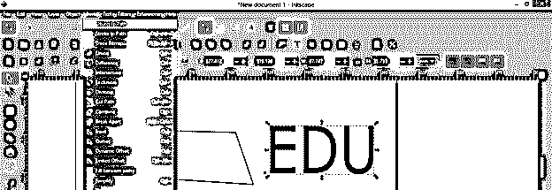

现在这两个对象都是路径，所以我将重复相同的过程，并再次进入修改路径扩展的透视选项。

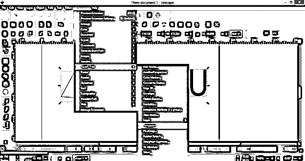

你可以看到它根据另一个选择路径的角度改变了我的文本的视图。

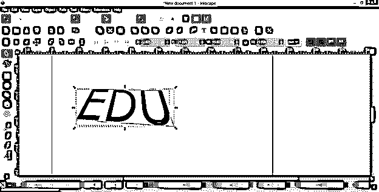

另一个路径仍然是一个单独的路径，你可以对它进行修改，使它成为这个文本的一个很好的背景或其他创意，或者你可以删除它，它也不会影响文本路径了。

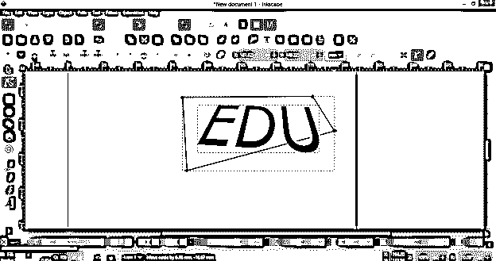

因此，以同样的方式，您可以使用菜单栏的扩展菜单的其他扩展来实现不同类型的目的。

现在让我们看看，如果我们想使用任何不在这个软件中的外部扩展，我们必须做什么。

### 如何在 Inkscape 中安装扩展？

要在 Inkscape 中安装所需的扩展，首先，导航至所需的扩展并找到其下载链接。例如，我想在我的 Inkscape 程序中使用这个扩展。所以我会从它的下载链接下载它的 Zip 文件。

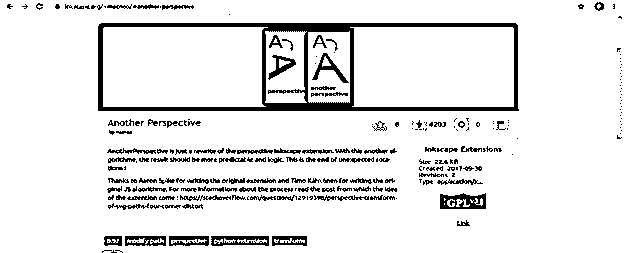

现在下载了它的 zip 文件后，解压它。

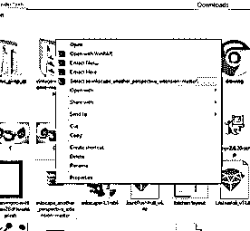

提取后，打开它的文件夹，复制文件夹中的所有文件。我将通过按下键盘的 Ctrl + A 按钮和键盘的 Ctrl + C 按钮来选择全部。

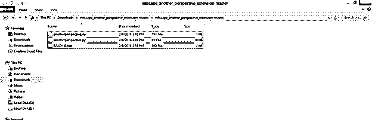

现在转到你电脑的 c 盘，然后打开程序文件夹。

在程序文件列表文件夹中找到 Inkscape 文件夹并打开它。

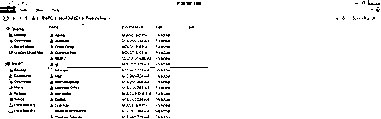

现在，在 Inkscape 文件夹中，您会发现一个名为 Share 的文件夹，所以双击它打开它。

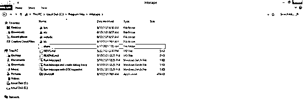

话说回来，有一个 Inkscape 文件夹，所以也打开它。

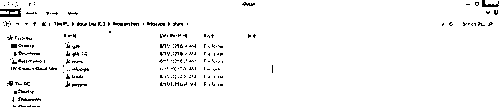

现在在这个文件夹中，你会发现扩展文件夹，所以打开它。

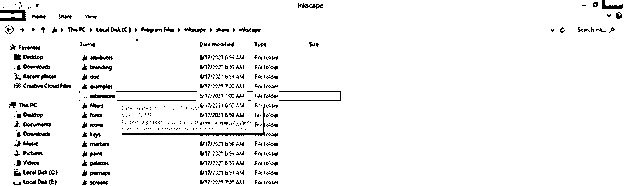

并通过按键盘的 Ctrl + V 键将复制的扩展名文件粘贴到这里。

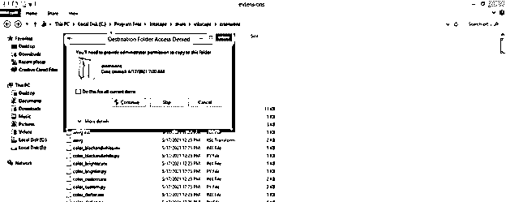

我们会把所有拷贝的文件都放在这里。完成此过程后，如果 Inkscape 已打开，您可以重新启动它，您将在菜单栏的同一扩展菜单中找到您安装的扩展。

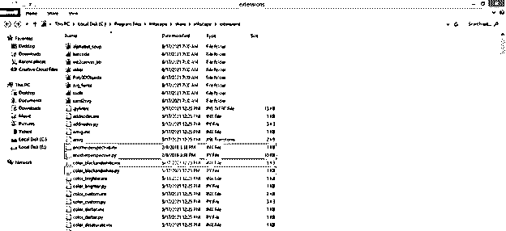

通过这种方式，你可以在 Inkscape 中使用一个扩展，也可以根据我们的选择使用我们想要的扩展。

### 结论

现在，使用扩展对您来说不再是一项未知的任务，您还会发现在使用几种类型的扩展来完成特定工作时，它非常有用。Inkscape 的优点是它提供了许多内置的扩展，你也可以从外部资源添加你喜欢的扩展。

### 推荐文章

这是一个 Inkscape 扩展指南。这里我们讨论如何在 Inkscape 中使用扩展，以及如何在 Inkscape 中安装扩展。您也可以看看以下文章，了解更多信息–

1.  [印花布影](https://www.educba.com/inkscape-shadow/)
2.  [墨迹图案](https://www.educba.com/inkscape-pattern/)
3.  [喷墨箭](https://www.educba.com/inkscape-arrow/)
4.  [暗礁主题](https://www.educba.com/inkscape-dark-theme/)

