# 水墨艺术

> 原文：<https://www.educba.com/inkscape-art/>

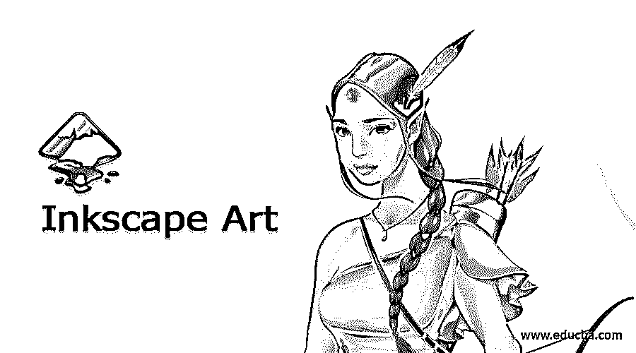

## 水墨艺术概论

对于设计师来说，在 Inkscape 上创作艺术品是简单而高效的工作。Inkscape 是一个矢量图形软件，用于创建矢量艺术品和设计。通过 Inkscape 中可用的工具和功能，设计师可以创建真实可信的设计。Inkscape Art 是使用所有主要工具的过程，例如分别使用绘图、文本、矢量和画笔。在这篇文章中，我们将学习如何在 Inkscape 上设计艺术品。

### 如何在 Inkscape 中进行艺术创作？

Inkscape 提供了许多用于创建徽标、横幅、网络图形、图表、海报甚至小册子的工具。手绘、贝塞尔工具、画笔工具、形状工具和路径工具等工具可帮助设计人员在 Inkscape 上创建内容。

<small>3D 动画、建模、仿真、游戏开发&其他</small>

在 Inkscape 中，矢量图形由节点和路径组成，可借助按节点编辑路径工具进行自定义和编辑。

为了在 Inkscape 中创建艺术品，我们将通过示例详细讨论绘图工具及其功能。

#### 贝塞尔工具

此工具有助于创建带有节点或顶点的曲线和直线路径。可以对这些节点进行编辑和整形。它最适合用于在 Inkscape 上创建艺术画。

**举例:**

1.启动 Inkscape

2.创建新文件

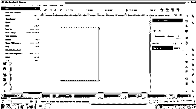

3.从互联网上下载一个随机图像

4.转到文件>导入(CTRL+I)

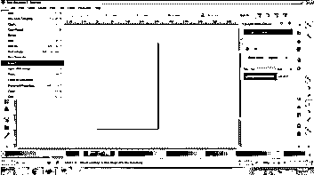

5.在 Inkscape 上导入下载的图像，如下图所示。

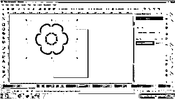

6.点击贝塞尔工具创建图像的矢量图。

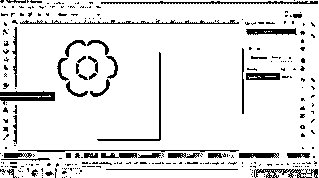

7.首先添加节点和曲线，并赋予图形形状。

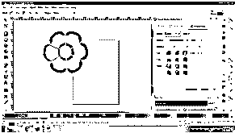

8.完成后，我们可以使用“按节点编辑路径”工具编辑绘图。

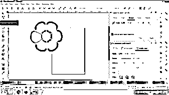

9.在绘图中填充颜色。

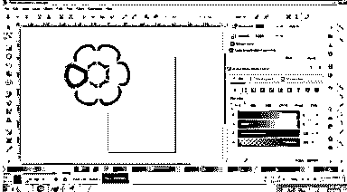

#### 手绘工具

顾名思义，徒手画就是用来自由、直接地创作任何东西和一切事物，没有任何复杂的规范。就像我们在颜料上画画一样，我们用手绘工具画画。

**举例:**

1.启动 Inkscape

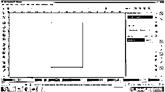

2.创建新文件

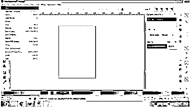

3.转到绘制手绘线工具，如下图所示。

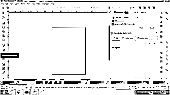

4.如下图所示创建一个草图。

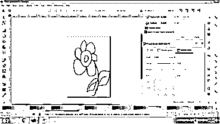

5.填充颜色并向草图添加笔画

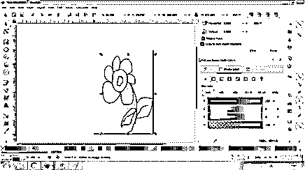

6.我们也可以根据需要，在“按节点编辑路径”工具的帮助下编辑草图。

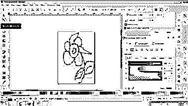

#### 画笔工具

此工具用于创建艺术和书法笔画和艺术品。画笔工具也是数码画家和艺术家常用的手绘工具。

**例子**

1.启动 Inkscape

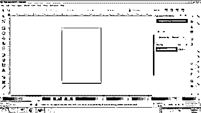

2.创建新文件

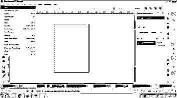

3.转到画书法或笔画，如下图所示。

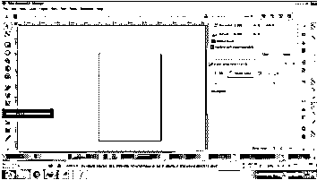

4.使用该工具创建一个绘图，如下所示。

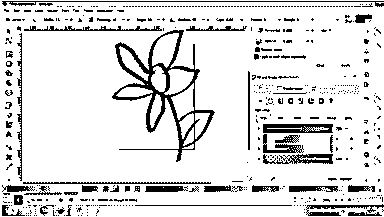

5.填充颜色并增加笔画宽度，如下所示。

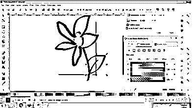

6.我们也可以根据需要使用“按节点编辑路径”工具来编辑草图。

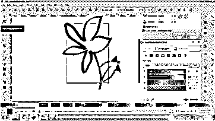

#### 形状工具(矩形、正方形、圆形、星形、多边形和螺旋形)

这是迄今为止最方便的工具，用于创建基本的艺术作品，如标志或网页。使用简单的形状，如圆形、弧形、多边形和矩形，用户可以创建一个可观的和实质性的工艺。形状的组合也可以用来设计建设性的模式和符号。

**举例:**

1.启动 Inkscape

2.创建新文件

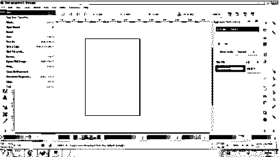

3.在这里，我们将学习在形状工具的帮助下重新创建一个著名的品牌标志。

4.下载徽标的图像

5.通过文件>导入在 Inkscape 上导入图像

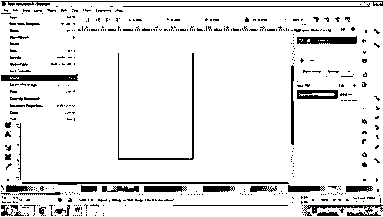

6.创建两个圆，如下图所示

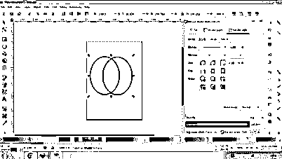

7.在 Shift 命令的帮助下选择两个圆，然后转到“路径”>“交叉点”。

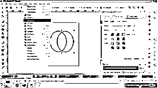

8.你会得到一个叶子的图像。复制图像，如下图所示。

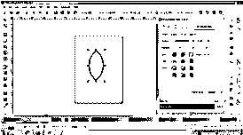

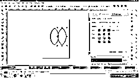

9.转到对象>变换>旋转。

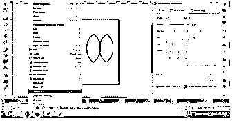

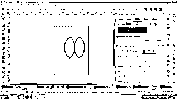

10.将图像旋转 45 度角，如下图所示。

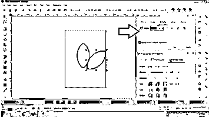

11.现在，复制并粘贴原来的叶子，并将它旋转 135 度。

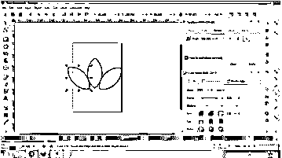

12.调整所有三个叶片，以创建标志的设计。把三片叶子都涂成黑色。

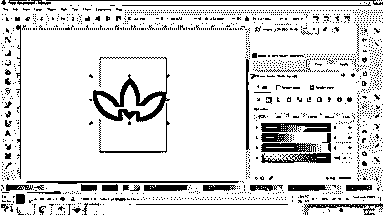

13.现在，创建一个没有任何笔画的白色矩形。如下图所示。

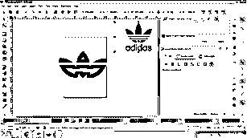

14.复制并粘贴另外两个矩形，并相应地放置它们。

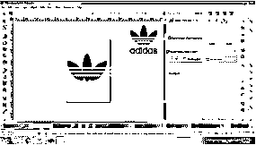

15.在徽标下方写下文字以完成设计

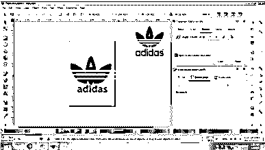

16.选择所有形状，右键单击>组合

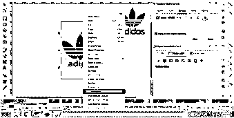

17.Logo 已经完成，准备好了。

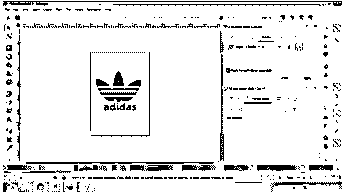

除了这些工具，我们还可以使用复杂的光栅图像，并在工具 Trace Bitmap 的帮助下将它们自动转换为矢量图像。以下是步骤:

1.启动 Inkscape

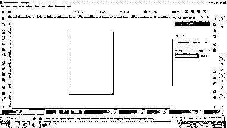

2.创建新文件

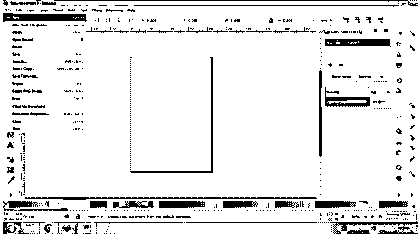

3.从互联网下载任何光栅图像

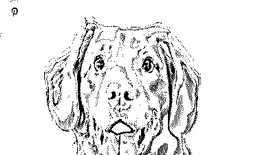

4.在 Inkscape 上导入文件。文件>导入

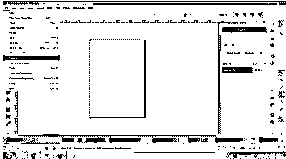

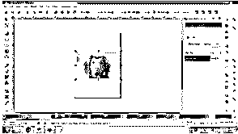

5.转到路径>跟踪位图

6.从对话框中调整标准，然后单击确定。光栅图像将被转换为矢量图形。

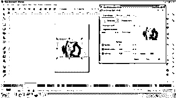

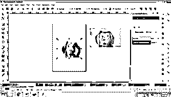

### 结论

在 Inkscape 上创建设计和艺术品既简单又容易。设计师可以以最小的混乱制作微妙的艺术和图画。用户应该对工具集进行实际的实验，以专业地理解用户界面和主要工具。

有了免费版的 Inkscape 程序，创建和设计插图的能力是无限的。

### 推荐文章

这是一个 Inkscape 艺术指南，这里我们讨论定义，如何在 Inkscape 中创作艺术？例子。您也可以看看以下文章，了解更多信息–

1.  [Inkscape 插件](https://www.educba.com/inkscape-plugins/)
2.  [Inkscape 与网格对齐](https://www.educba.com/inkscape-snap-to-grid/)
3.  [印花布影](https://www.educba.com/inkscape-shadow/)
4.  [墨迹图案](https://www.educba.com/inkscape-pattern/)

