# Inkscape 透明背景

> 原文：<https://www.educba.com/inkscape-transparent-background/>

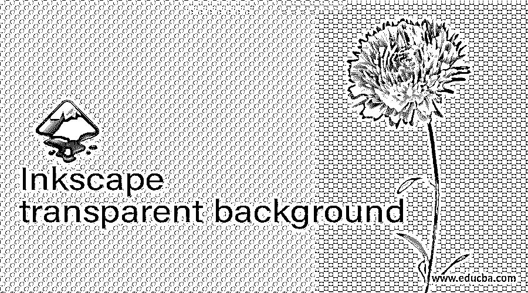

## Inkscape 透明背景介绍

在这篇文章中，我们将学习如何在 Inkscape 中制作透明背景。有很多原因你需要使背景透明。如果你想把一个主题或标志放在另一张图片上，或者你想把它用作水印。或者你可能是在一个绿色的屏幕背景上拍摄的，这个背景必然会被你想要描绘的场景所取代。因此，即使图像是相同的，当你使背景透明时，不同的背景会有不同的效果。所以，不管是什么用例，我们都可以从在 Inkscape 中使用多种技术去除背景开始。

### Inkscape 透明背景的步骤

下面是下面提到的步骤

<small>3D 动画、建模、仿真、游戏开发&其他</small>

**步骤 1:** 当你打开 Inkscape 应用程序时，你会看到一张空白的 A4 纸。出于我们的目的，我们将首先从文件菜单转到文档属性，或者您可以按 Shift + Ctrl + D。

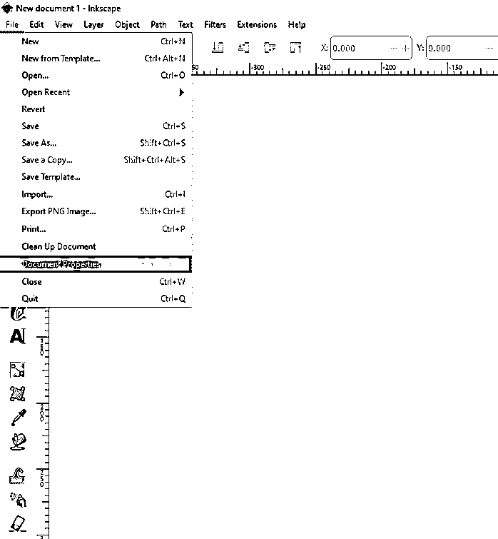

**步骤 2:** 在此取消勾选显示页面边框，这将删除显示的页面预览，并将其他选项保留为默认值。

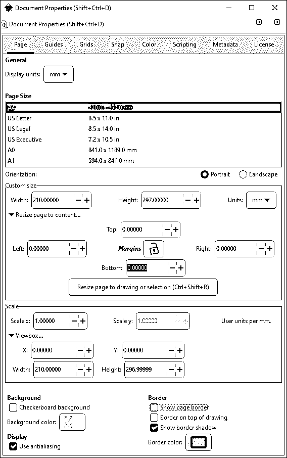

步骤 3: 现在，因为我们需要从图像中移除背景，或者换句话说，使其透明，我们首先从文件菜单中导入文件，或者按 Ctrl + I

**步骤 4:** 然后导航到文件所在的位置，在我们的例子中是 athletics.jpg，我们从对话窗口打开它。

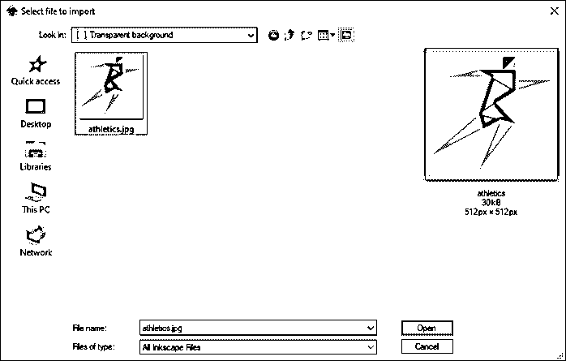

第五步:然后我们会看到一个 jpg 位图图像导入对话框，我们保留所有的默认设置并点击 OK。如果您总是使用默认值，那么还有一个选项“不再询问”,您可以勾选该选项。

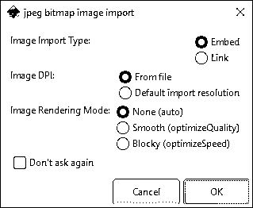

**第六步:**现在我们要用的第一种方法是位图描摹，可以从路径- >描摹位图或者按 Shift + Alt + B。顾名思义，位图描摹是通过重画图像从位图制作矢量的过程。

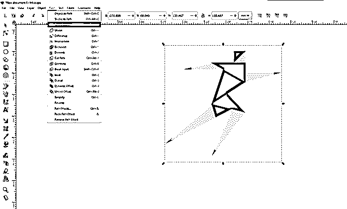

**步骤 7:** 在描摹位图选项卡中选择多次扫描选项卡，在该选项卡中取消选中平滑，并选中堆叠和移除背景，同时取消选中平滑角，然后单击确定，然后关闭描摹位图对话框

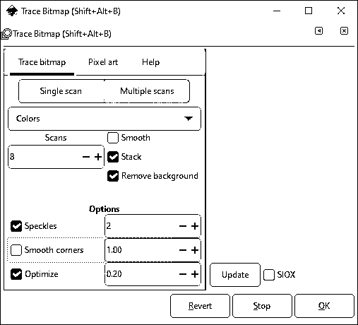

**第 8 步:**描摹的图像将在原始图像上，如图所示

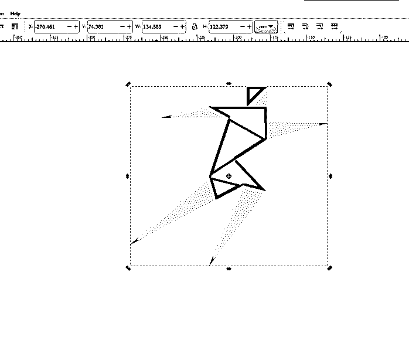

**第九步:**可以将描摹的图像拖动到侧面看原图。

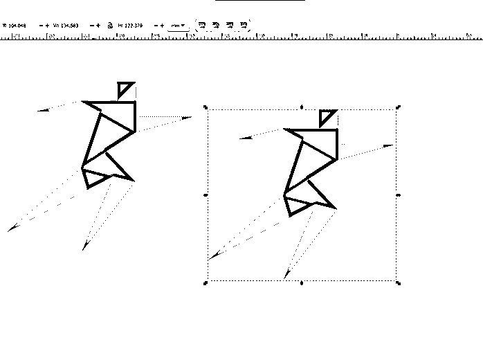

**步骤 10:** 当我们放大并仔细观察时，我们观察到原始图像有锯齿状边缘，因为它是位图，而跟踪的图像是平滑的，因为它在图像跟踪后被转换为矢量。

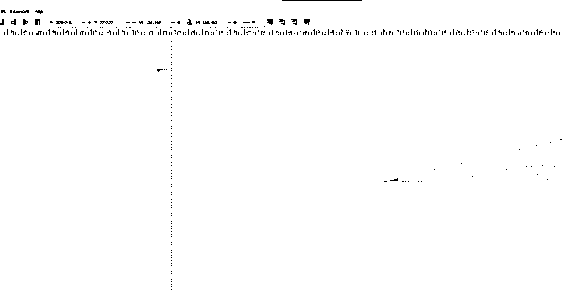

**步骤 11:** 接下来我们转到文件，然后导出 PNG 图像或按 Shift + Ctrl + E 来验证背景是否已移除。

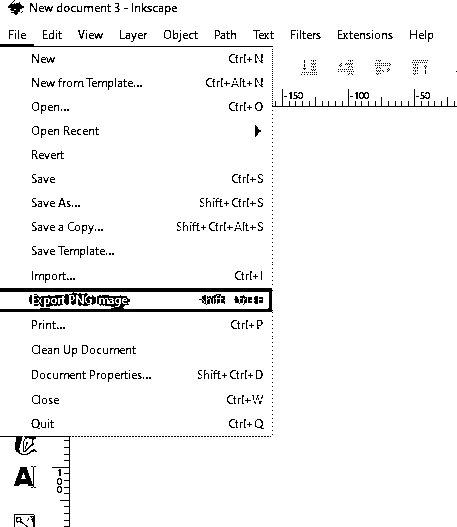

**步骤 12:** 首先我们选择原始图像，然后选择目标文件夹，并确保选择了导出选择，然后单击导出。

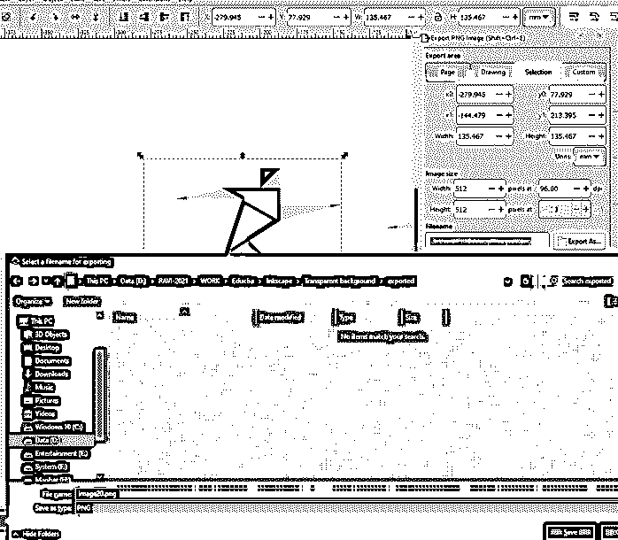

**步骤 13:** 然后我们选择被跟踪的图像，然后选择目标文件夹，并确保选择了导出选择，然后单击导出。

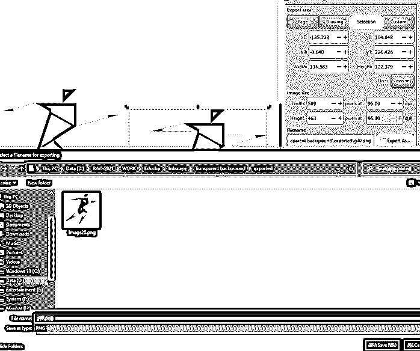

**第 14 步:**在 explorer 中我们可以看到，一张图片有透明背景，另一张仍然有白色背景。

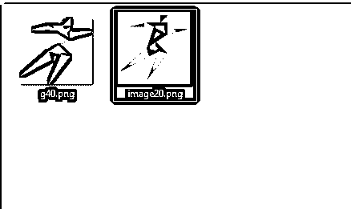

步骤 15: 现在我们从文件菜单或按 Ctrl + W 关闭这个文档。Inkscape 的一个特点是新文档是在新窗口中创建的，而不是在单独的选项卡中创建的。因此，当您关闭文档时，会自动创建一个新文档。

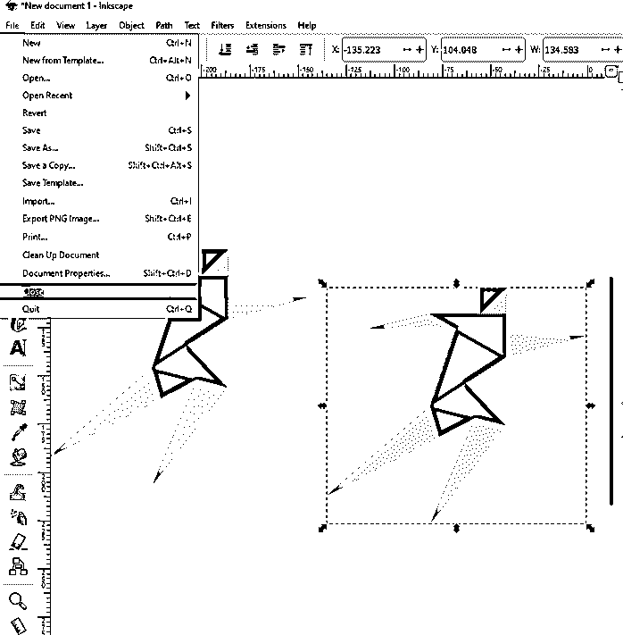

第 16 步:接下来在一个新文档中，我们创建一个矩形，并在状态栏上方的底部用颜色选择器填充。

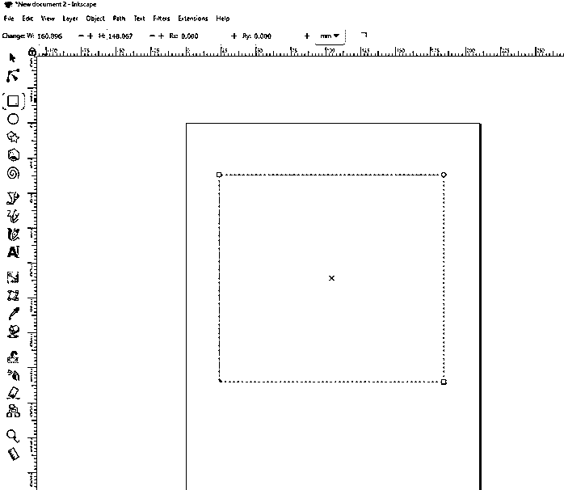

**步骤 17:** 然后我们从文件菜单导入透明背景图片。

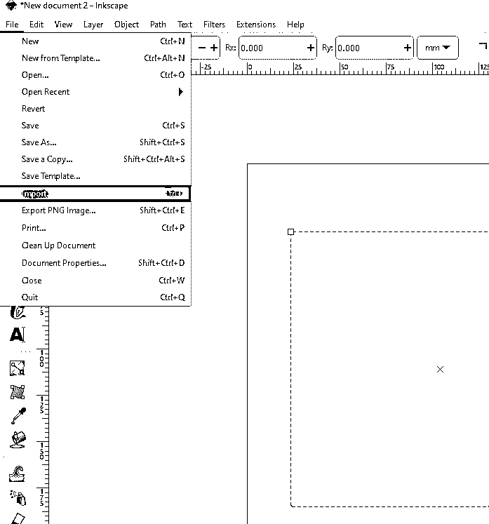

**步骤 18:** 导航到透明背景文件，点击打开。

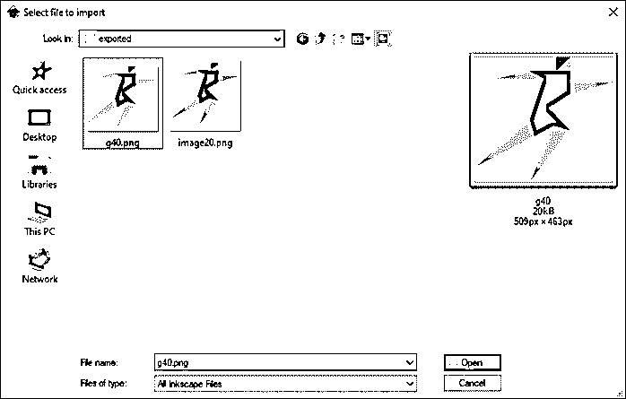

**第 19 步:**然后从 png 位图图像导入对话框保持所有默认设置并点击确定。

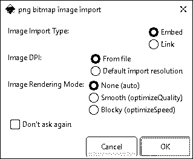

**步骤 20:** 调整矩形上的图像，可以看到背景完全透明。

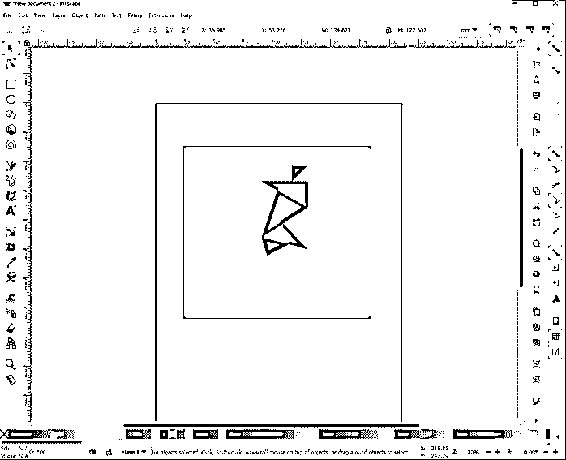

现在我们来看看另一种使背景透明的方法，那就是使用选择方法。在一个新文档中导入有背景的文件。

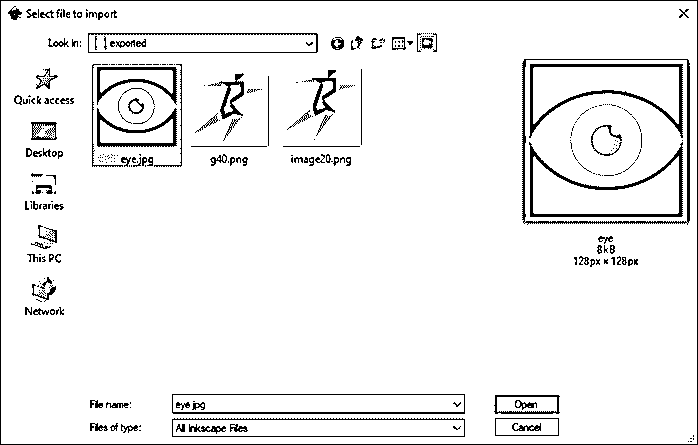

步骤 22: 现在我们将使用绘制贝塞尔曲线和直线来选择眼睛。

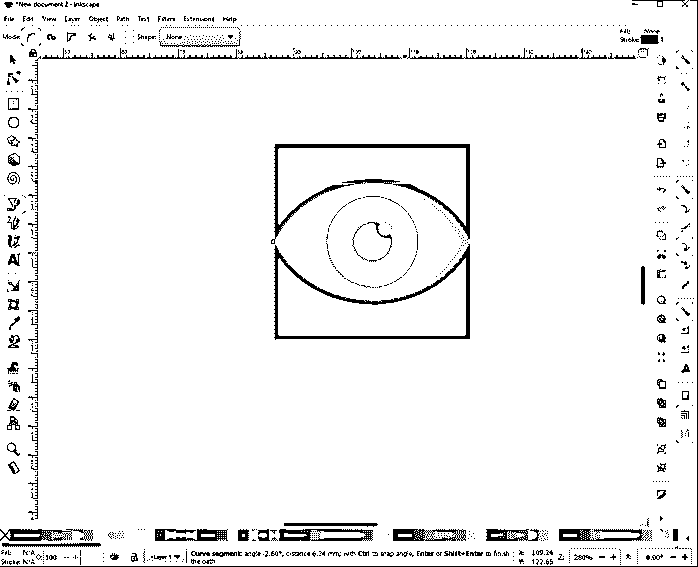

**步骤 23:** 一旦做出选择，然后选择曲线和图像，然后转到对象- >剪辑- >设置，这将剪辑曲线外的所有区域。

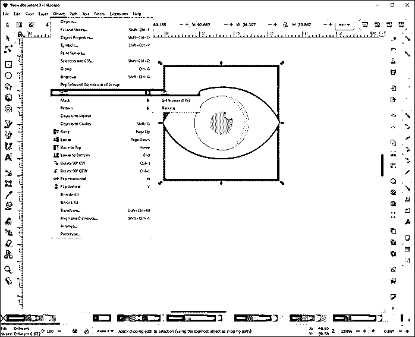

**第 24 步:**正如我们看到的，曲线外的区域被剪切了，但我们仍然可以对其进行微调

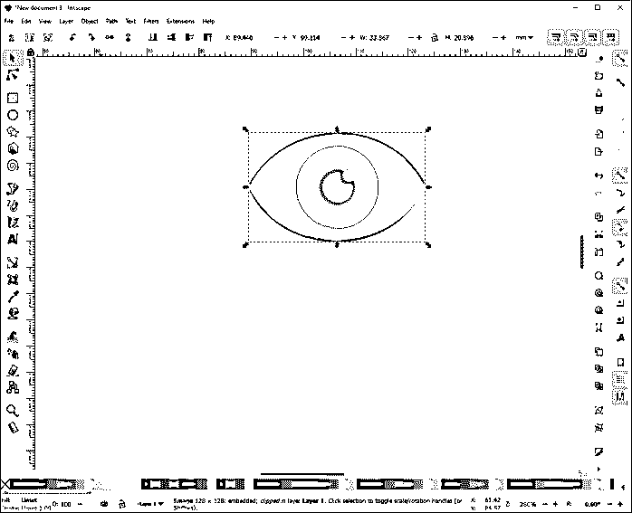

第 25 步:我们可以再次使用贝塞尔曲线工具进行选择。

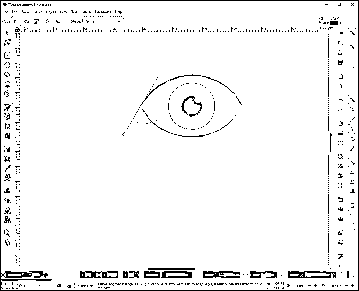

第 26 步:我们将调整曲线，以便得到我们想要的面积。

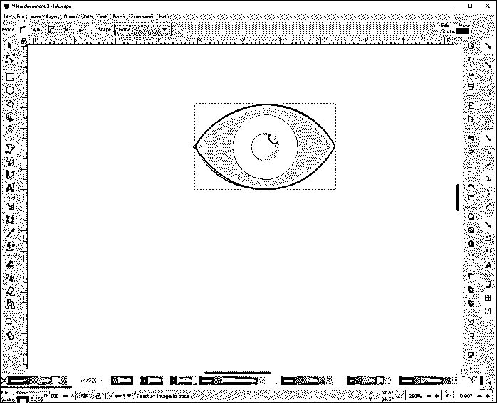

步骤 27: 我们将再次选择路径和图像，并使用对象菜单中的剪辑- >设置。

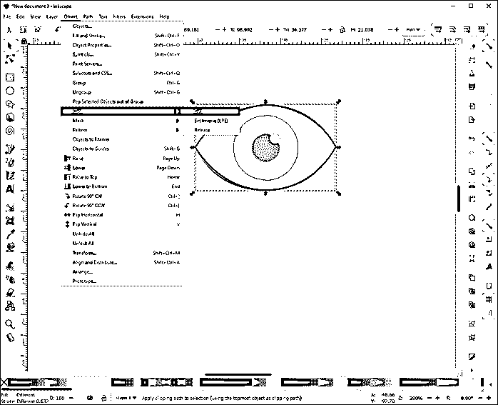

步骤 28: 作为以上步骤的结果，我们使用 Inkscape 制作了透明背景。

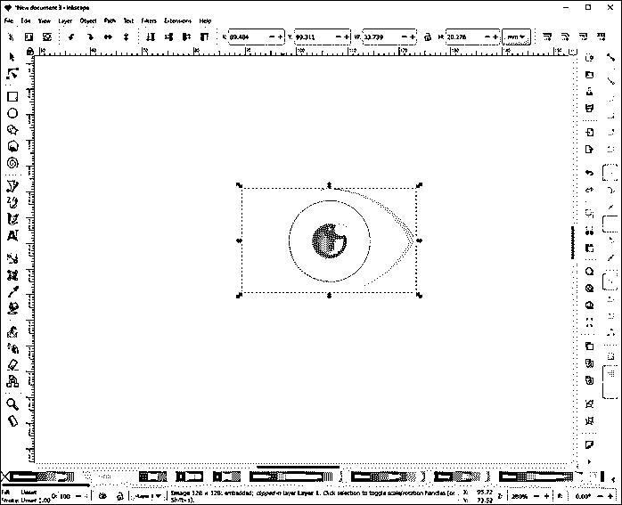

步骤 29: 我们也可以从黑白图像中去除背景。首先，我们将在新文档中导入图像。

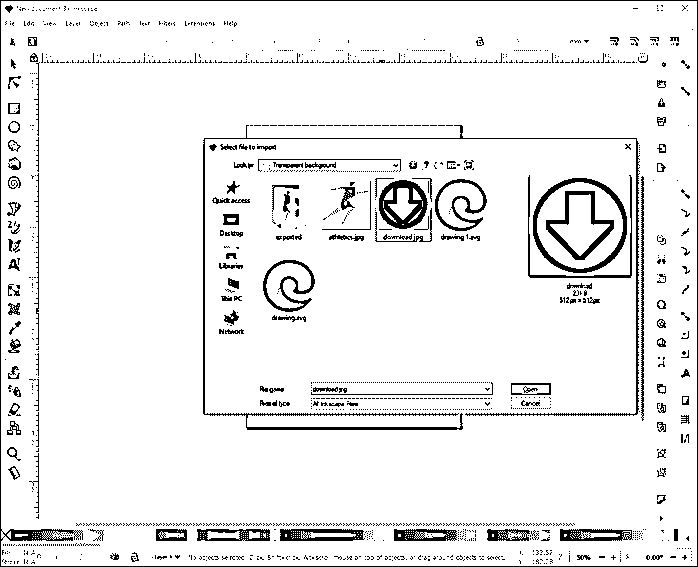

**步骤 30:** 然后我们就可以像往常一样从路径菜单中描摹位图了。

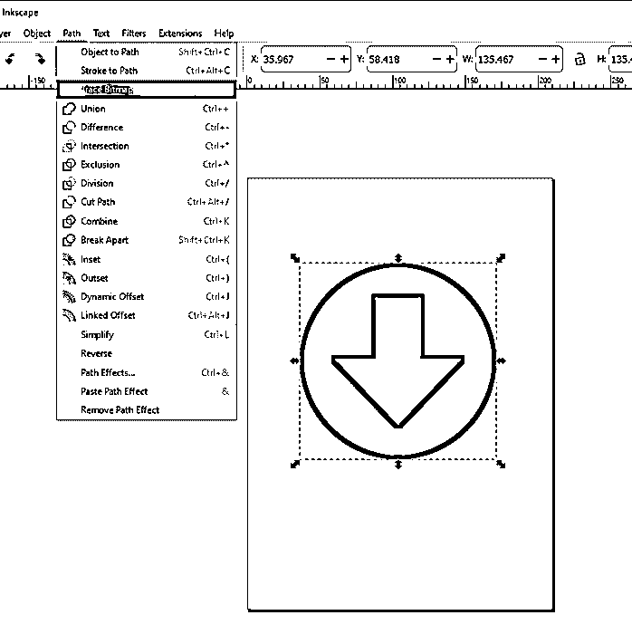

**步骤 31:** 然后，在“多次扫描”选项卡中，我们从下拉列表中选择灰色，因为没有颜色，并将扫描次数设置为 2，因为只有黑白颜色，取消选中“平滑”并选中“堆叠”并移除背景。也取消选中平滑拐角。

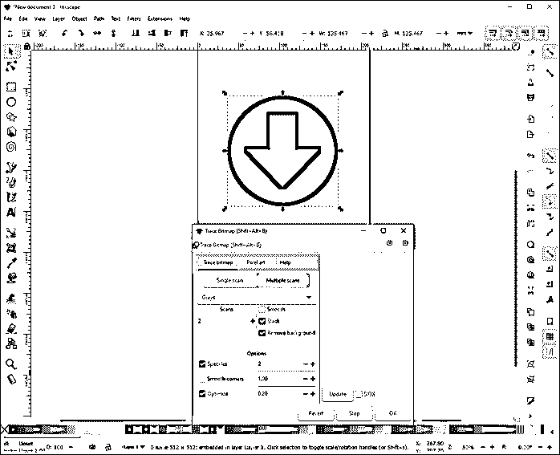

**步骤 32:** 再次，当我们并排对比两张图片时，可以看到我们已经将图片背景做了透明处理。

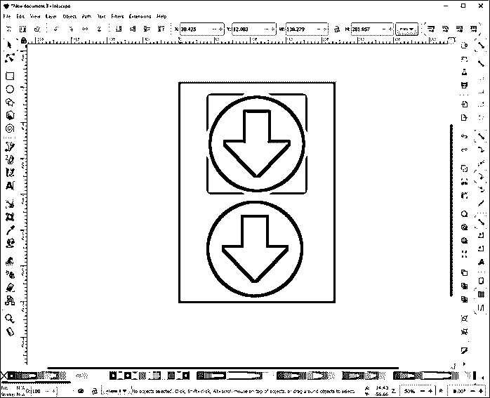

### 结论

在这篇文章中，我们看到了如何在 Inkscape 中制作透明背景。首先，我们从使用图像跟踪去除白色背景开始。然后，我们看了其他技术，使用贝塞尔曲线，然后剪切外部区域，只显示曲线的内部。因此，我们现在已经成功地删除了背景，可以用于任何应用程序，如我们和更多。

### 推荐文章

这是一个关于 Inkscape 透明背景的指南。在这里我们讨论如何在 Inkscape 中制作透明背景，以及制作步骤。您也可以看看以下文章，了解更多信息–

1.  [喷墨替代](https://www.educba.com/inkscape-alternative/)
2.  什么是 Inkscape？
3.  [Wrike 替代方案](https://www.educba.com/wrike-alternatives/)
4.  [3ds Max 室内设计](https://www.educba.com/3ds-max-interior-design/)

