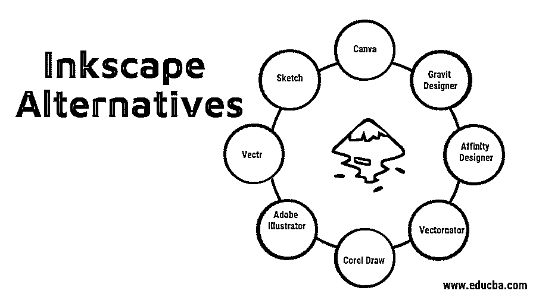

# 喷墨打印纸

> 原文：<https://www.educba.com/inkscape-alternative/>

## Inkscape 替代方案简介

在图形设计的世界里，设计师实际上被选择宠坏了，因为有如此多的智能和同等竞争的软件和工具用于每个功能，至于什么时候使用哪个软件是设计师的决定。Inkscape 是基于矢量的[图形设计软件](https://www.educba.com/best-graphic-design-software/)。虽然它有简单的用户界面和易于理解的工具，但没有多少业余爱好者或专业人士认为这是他们设计的重点。许多复杂的设计、草图和构造需要许多其他复杂的工具；因此，使用[替代软件](https://www.educba.com/alternative-for-lightroom/)进行 Inkscape 的想法浮出水面。

### 流行的 Inkscape 替代方案

让我们看看一些流行的替代软件选项，并了解它们的重要性。

<small>3D 动画、建模、仿真、游戏开发&其他</small>

#### 1.Adobe Illustrator 中

它提供了一套惊人的工具和矢量图形预设，以及一个非常酷的用户界面，几乎所有的矢量图形都可以通过一个定义的工作流程无缝地执行。换句话说，这个软件让矢量设计和素描变得有趣。如果我们把价格放在一边，这对于 Inkscape 来说是一个非常好的选择；它支持所有文件格式。它有助于转换成光栅图形。它与许多操作系统平台兼容，而且网上有大量的教程可以轻松学习这个软件。

#### 2.Corel 拉伸

Coral Corporation 最流行的基于矢量图形的软件 Corel Draw 被誉为 Inkscape 的近乎理想的替代品。它有一套用于绘图、制作广告印刷品、建筑布局的工具，学习起来又快又容易，并且可以在所有操作系统平台上运行。我同意这很贵，但是 Inkscape 更多的是在低层次上工作，有限的工具本身是一个免费的开源软件，而 Corel Draw 更多的是在设计师的层次上工作。它提供实时帮助，根据市场趋势不断更新自身，并简化设计工作。

#### 3.向量机

像实时共享，布尔运算，混合模式，甚至手机应用程序的效果，以及自动跟踪，屏蔽等方法。实际上，Vectornator 比 Inkscape 拥有更多的功能，而且可能也更加用户友好。他们网站上的标语是“所有的设计”，事实上这是真的。最近，他们也有一个新的更新工作在 Mac 卡塔利娜。绘图工具和文件格式共享在很多方面与 Corel Draw 相似。但是，正如我所说的，设计师们有太多的选择了。

#### 4.亲和力设计者

亲和力设计师是设计专业人士的最爱。通过多年来的不断更新和快速响应的用户界面，这款设计软件具有突破性的性能，并结合了 Adobe Photoshop 和 Corel Draw 的许多亮点和效果。这给了设计师一个单一的平台来执行图形设计。此外，文件共享和转换可以很容易地实现。Inkscape 将首先关注绘图和草图绘制部分，并使用主要为此提供的工具。但这个软件将提供编辑和功能，使设计看起来 100%专业。

#### 5.重力设计师

这是 Inkscape 的一个惊人的替代方案。这是一个基于桌面和基于浏览器的应用软件。它功能丰富，涵盖了 Inkscape 提供的所有工具、预设和配色方案。它是无广告的，这非常令人耳目一新，尤其是因为它是免费的。以下这些显著的特性可能会比 Inkscape 更好。它支持网站线框，光栅图形编辑。就软件大小而言，SVG 文件编辑是轻量级的。它有一个全局调色板和颜色选择器。画布的大小是巨大的和无限的。

#### 6.帆布

Canva 准备使用一个应用专业，将这个星球上的每个人作为他们的目标受众。是外行人的软件。很好学，几乎谁都会设计。它非常轻，主要用作电话应用。因此，它的功能有限，但有足够的功能，人们会喜欢使用它，它有一个伟大的实时共享资源。许多业余摄影师用它来进行描摹和编辑。因此，所有这些即时脸书和 Instagram 传单可以很容易地制作和出口成功。

#### 7.素描

这种选择是为 MAC 用户准备的。它不是免费的。其主要目标受众是设计网站、logos 等的屏幕设计师。他们也可以使用实时预览进行设计。这个软件对于那些分享他们的工作空间来为一个合作产品设计多个原型的公司或一组设计师来说也是令人惊奇的。用户界面易于理解，工具简单直接。它还附带了各种工具包和软件插件，最终甚至可以在 Sketch 中轻松创建动画。

#### 8.Vectr

像 Gravit Designer 一样，这个软件也幻想成为一个跨平台软件，这意味着它可以在线使用，也可以作为桌面应用程序下载。它最好玩的功能是实时预览和分享。一个人可以在线设计，如果另一个团队已经合作，其他人可以实际见证设计并立即在彼此之间分享。它再次涵盖了矢量图形的所有重要和基本的功能。它是自由软件。它也是便携式的，这意味着它不会占用计算机空间。所有工作都实时保存，并同步到一个私有云帐户，这又是一个免费使用的空间。对于经常出差的设计师来说，这简直是救星。尽管这也意味着互联网连接始终至关重要。

#### 9.剪辑工作室绘画

有人听说过漫画家吗？这是一个强大的素描软件，专门为漫画漫画的漫画设计师。日本制造，它是如此的著名，以至于他们让日本漫画闻名全球。漫画速写从来没有乐趣可言。

### 结论

Inkscape 是一个非常棒的矢量设计软件，对于初学者来说，这是一个非常容易学习和设计的途径。但全球越来越多的设计师正变得我称之为“功能饥渴”。因此，了解替代品是必须的。

### 推荐文章

这是一个 Inkscape 替代品的指南。在这里，我们讨论介绍和一些流行的替代软件惊人的布局和插图。您也可以浏览我们的其他相关文章，了解更多信息——

1.  【Adobe Indesign 软件的最佳替代品
2.  [灯箱替代方案指南](https://www.educba.com/alternative-for-lightroom/)
3.  [3Ds Max 有哪些替代品？](https://www.educba.com/3ds-max-alternatives/)
4.  [Autodesk Maya 的最佳替代品](https://www.educba.com/maya-alternatives/)

