# Inkscape 删除背景

> 原文：<https://www.educba.com/inkscape-remove-background/>

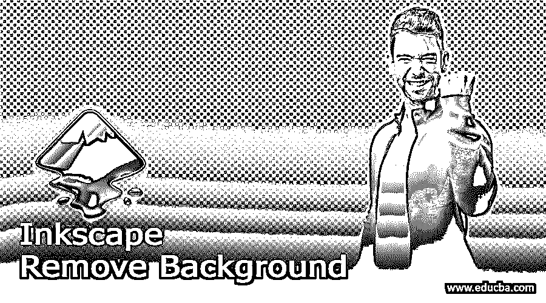

## Inkscape 删除背景

Inkscape Remove Background 是该软件的一个功能，通过它我们可以删除我们想要的图像的背景，而在图像中留下主要对象或我们需要的对象。在这个软件中没有专门的工具来去除背景，但是我们可以用不同的方法来做，为了得到最终的结果，我们必须经历一些必要的步骤。今天我将告诉你用两种方法去除背景，第一种是使用路径菜单中的跟踪位图选项，第二种是在任何图像中我们想要的对象周围进行选择。因此，让我们找到我们如何能够做到这一点。

### 如何在 Inkscape 中去除背景？

我们可以用一种非常简单的方式在 Ink scape 中完成这项任务，你只需要按照下面讨论的步骤，所以首先我将拍摄一张黑白图像，并快速移除它的白色背景。我会拍 eduCBA 的 logo 图像。

<small>3D 动画、建模、仿真、游戏开发&其他</small>

要在 Inkscape 中导入图像，请在您的个人计算机中打开保存该图像的文件夹，然后从该文件夹中选择图像并将其放入 Inkscape 的文档区域。我会用 eduCBA 的 logo 图像做同样的事情。

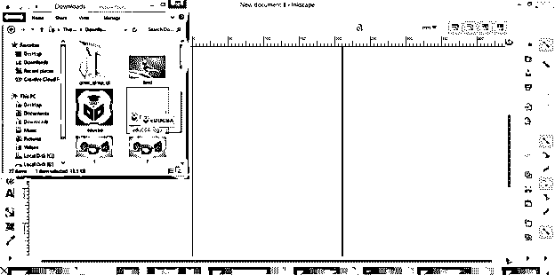

它将向您显示一个导入对话框，用于导入您选择的图像，因此请单击此对话框中的“确定”按钮。

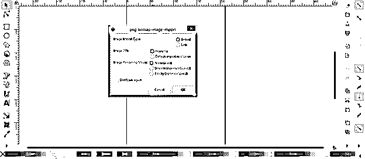

它会像这样导入。我用矩形工具画了一个矩形，显示导入的徽标图像有一个白色背景，我将删除它。

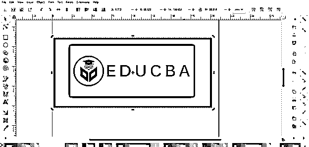

现在选择图像并转到该软件用户屏幕顶部的菜单栏，然后单击路径菜单。一旦你点击这个菜单，一个下拉列表将被打开，所以从列表中选择跟踪位图选项，或者你可以简单地按下键盘上的 Shift + Alt + B 键。

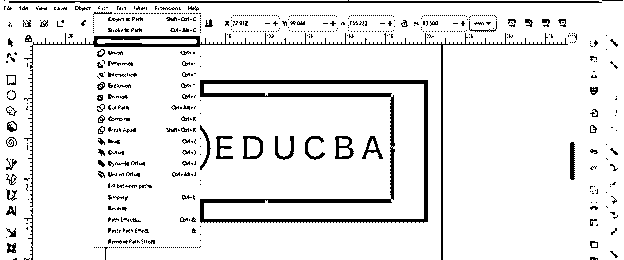

并且在工作窗口的右侧，会打开一个跟踪位图对话框。点击此对话框的单次扫描按钮来追踪此图像。

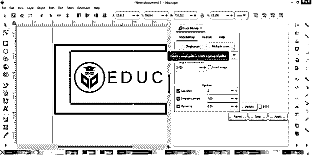

并单击预览区域的更新按钮。您可以在“描摹位图”对话框的右上角找到该按钮。一旦你点击更新按钮，你可以看到跟踪图像的预览。

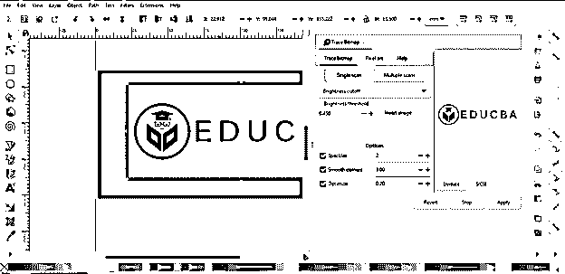

现在，您还可以选择多次扫描选项来代替单次扫描，以获得更好的跟踪结果。所以我会点击它。

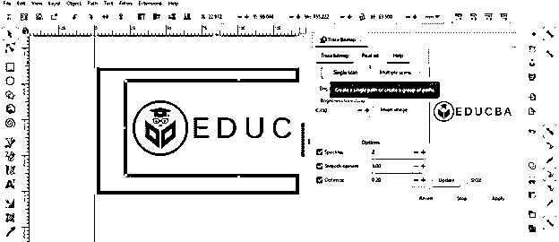

并通过点击其复选框来启用平滑选项。

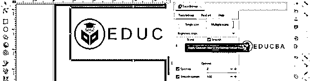

启用移除背景选项，也可通过点击其复选框移除背景，并点击该跟踪位图对话框的应用按钮。现在，如果我移动描摹的图像，你可以看到它后面是白色背景。所以用这种方法，你可以很容易地描绘出黑白图像。

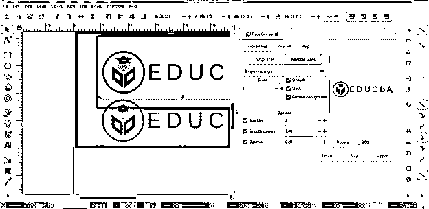

现在让我们用一幅彩色图像来做这件事，看看会发生什么。出于这个目的，我将采取同样的方式，我们已经在前面的步骤中导入的标志图像，这个鸟的形象。

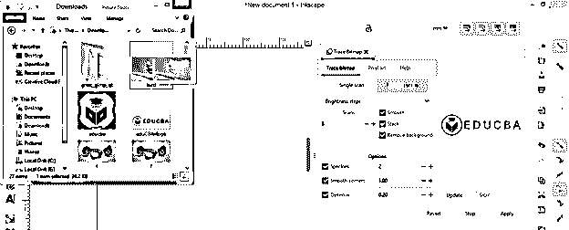

现在点击单次扫描按钮，你可以看到它将跟踪黑白色阶的图像。

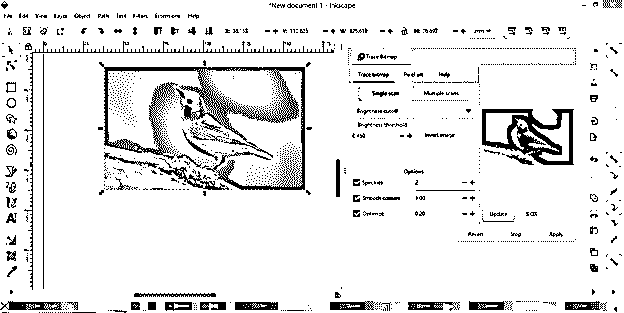

现在点击多重扫描按钮。

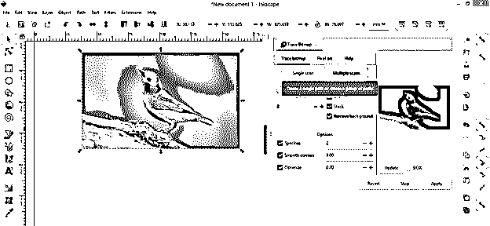

然后点击亮度步骤选项的向下箭头按钮，并从列表中选择颜色选项，用颜色扫描此图像。

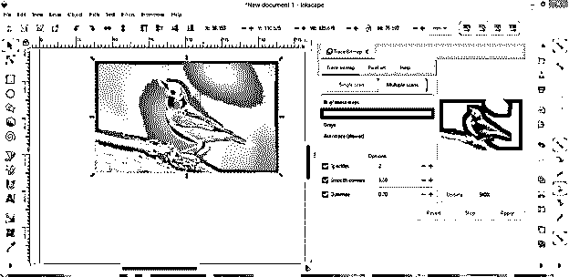

再次点击更新按钮，它会给你一个这样的结果。你可以看到背景不是很清晰。因此很难用跟踪图像的方法去除这类图像的背景。

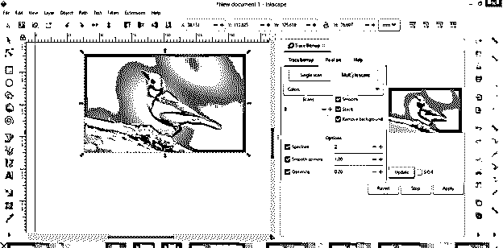

现在让我们通过另一种方式，通过这种方式我们可以消除背景。在这种方法中，我们首先用贝塞尔工具跟踪我们想要保留在图像中的对象。在这张图片中，我将使用贝塞尔工具在这只鸟周围画一条路径。所以从工具面板中选择这个工具。

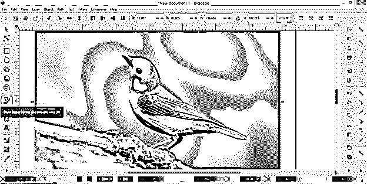

开始像这样选择。如果您的对象周围没有完美的选择，请不要担心，因为我们稍后也可以解决这个问题。

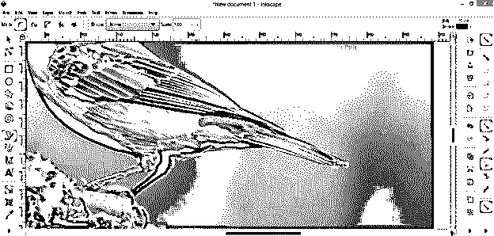

我会把这条路径的最后一点和同一条路径的起点连接起来。

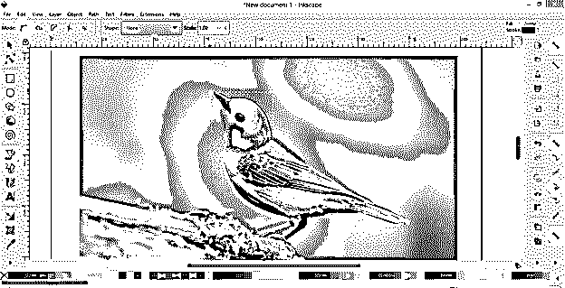

而围绕这种鸟会成为很好的选择路径。为了解释这个方法，我做了一个粗略的选择。

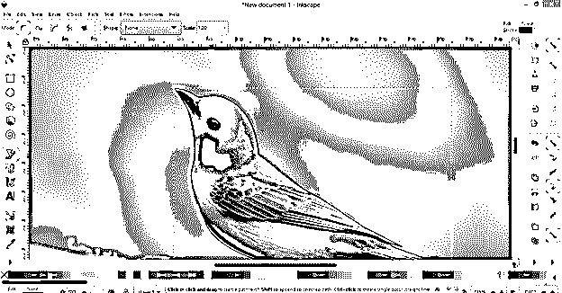

如果选择不完美，你可以现在就做，然后从工具面板中选择编辑路径节点工具。

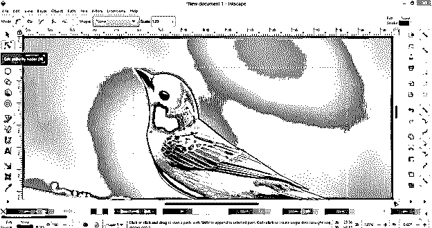

你可以通过像这样的编辑节点工具调整锚点和锚点手柄来调整路径。

现在从工具面板中选择工具，或者你可以按 S 作为快捷键。

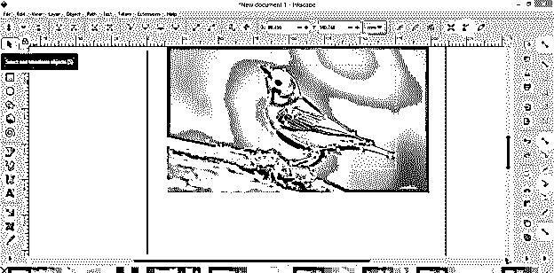

现在用这个工具选择这个鸟的选择路径，然后按住键盘上的 shift 键，然后选择背景图像，这意味着你必须选择你的图像对象和图像本身。

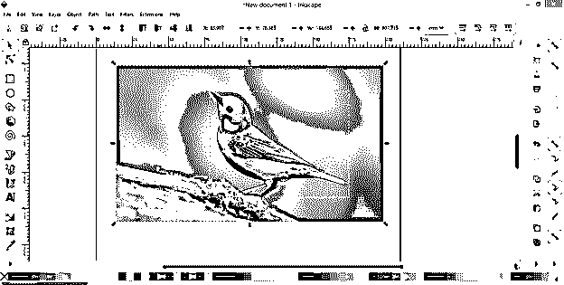

转到菜单栏的对象菜单，然后单击它。在此菜单的下拉列表中，您会找到剪辑选项，因此转到它并单击设置选项。

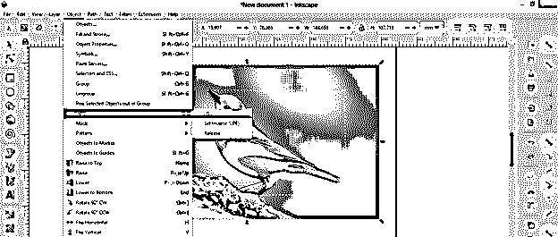

一旦你点击了这个选项，背景图像和鸟的选择将会在选择区域被裁剪，背景将会像这样从图像中移除。

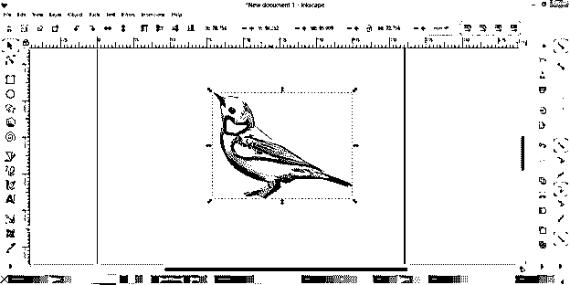

现在你可以为这只鸟设置新的背景。我将使用矩形工具为这只鸟的背景画一个矩形。

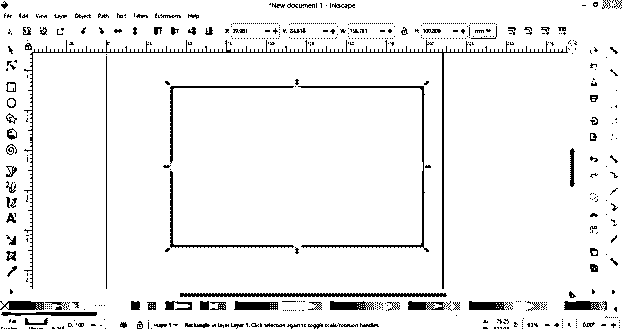

把它放在鸟层下面。你看，这是从图像中去除背景的好方法。

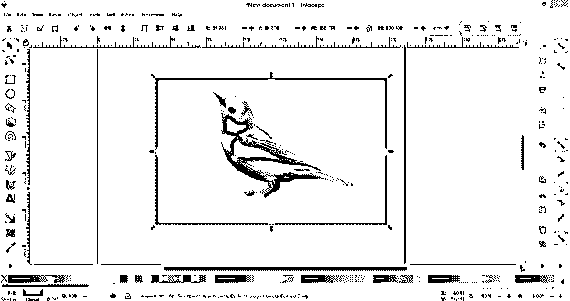

因此，您可以使用上面讨论的任何其他方法来删除 Inkscape 中的背景。

**结论:**

这里告诉你两种在这个软件中去除背景的方法，这取决于图像的类型或者你要求的最终目的，哪种方法是去除背景的最佳方法。因此，你可以拍摄不同的图像，并在这些图像上开始练习，以便很好地理解这两种方法。

### 推荐文章

这是一个去除背景的指南。这里我们一步一步详细讨论如何在 Inkscape 中去除背景。您也可以看看以下文章，了解更多信息–

1.  [印花布影](https://www.educba.com/inkscape-shadow/)
2.  [水墨渐变](https://www.educba.com/inkscape-gradient/)
3.  [墨景圆角](https://www.educba.com/inkscape-round-corners/)
4.  [Inkscape 文本](https://www.educba.com/inkscape-text/)

