# Inkscape 文本到路径

> 原文：<https://www.educba.com/inkscape-text-to-path/>

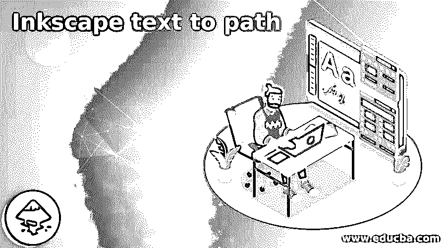

## Inkscape 文本到路径简介

Inkscape 文本到路径可以理解为将任何文本或文本字母转换为路径，这样我们就可以像使用 Inkscape 的编辑节点工具编辑任何形状一样编辑文本字母。为了将文本转换成路径，我们只需通过一些选项以及工具面板的工具，转换后的文本将不可编辑为文本，因为这将只作为形状的路径。你可以改变颜色和应用效果，渐变到转换后的文本路径，就像我们在其他矢量形状中做的一样。更重要的是，路径将是一个矢量形状。所以让我们来讨论一下。

### 如何在 Inkscape 中将文本转换成路径？

将文本转换成路径就像我们将笔画转换成路径一样简单，但是你应该记住一些不同目的的要点。那么让我们来看看这些帮助我们正确处理文本路径的点是什么？

<small>3D 动画、建模、仿真、游戏开发&其他</small>

要输入文本或字母，将从该软件的工具面板中选择文本工具，该工具位于工作屏幕的左侧。你可以简单地按 T 作为快捷键。

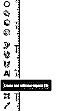

我将输入字母 E，我将把它转换成路径。

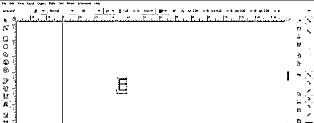

在把它转换成一个路径之前，我们应该记住在转换之后我们要做什么，并根据它从文本工具的字体面板中选择你想要的字体类型。因为一旦你把它转换成一个路径，然后它就不能作为文本编辑了，这意味着你不能改变字体类型，字体风格，也输入字母或文本，以及其他与文本相关的属性。

所以我将从字体类型列表中选择我想要的字体类型。

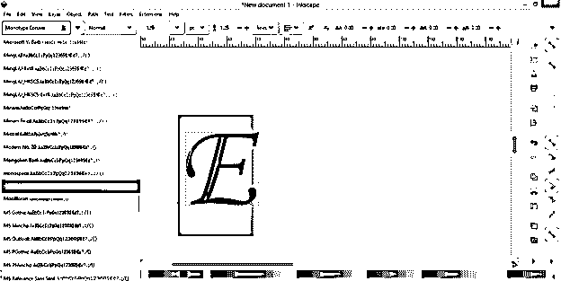

您还可以更改字体样式，如常规、斜体或粗体。这里我选择的字体只有斜体，所以我会用它。

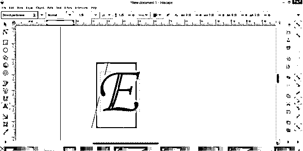

您可以在将文本转换为路径后调整其大小，也可以在转换前从字体大小列表中选择大小，这取决于您。

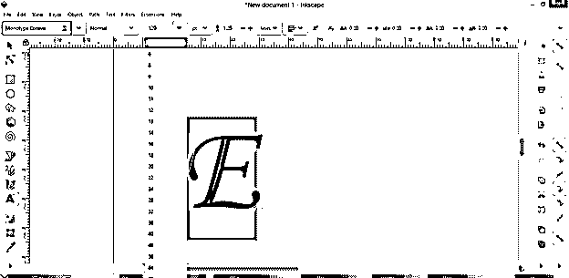

现在我将从工具面板中选择和变换对象工具。

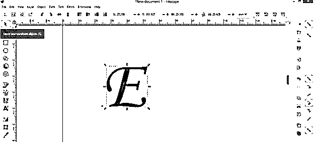

选择你想要的文本后，进入路径。这里将打开一个下拉列表。在此列表中，您会找到“对象到路径”选项，因此单击它。也可以按 Shift + Ctrl + C 作为快捷键。

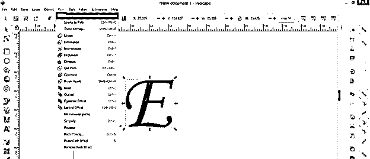

它会将您选择的文本或字母转换成路径。现在，如果你用选择工具选择这个路径，你就不能确定之前的文本字母 E 和转换后的字母 E 之间有什么不同。两者看起来是一样的。

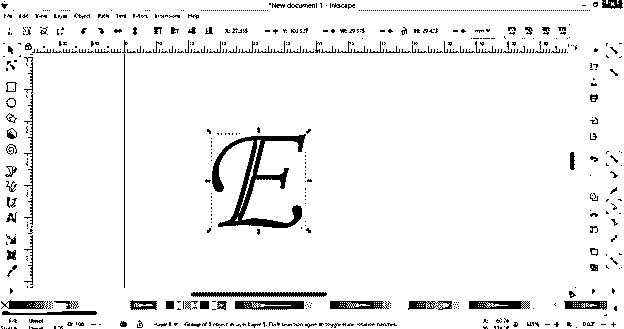

如果您再次使用文本工具，并尝试将其作为文本进行编辑，以便用其他文本替换它或更改它的样式或字体类型，那么您会看到它是不可编辑的，事实上，文本工具光标会在新的位置闪烁，以便键入其他文本。

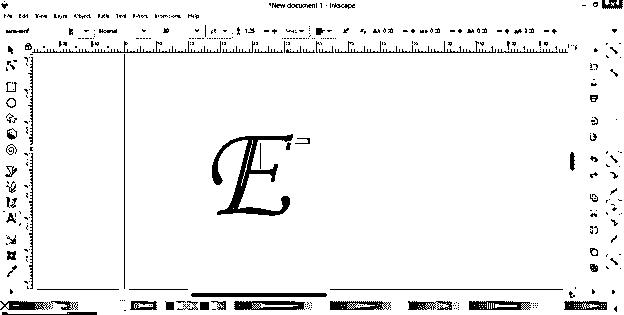

很明显，字母 E 现在是一个路径，您可以使用编辑节点工具对其进行编辑。所以我将使用节点工具。

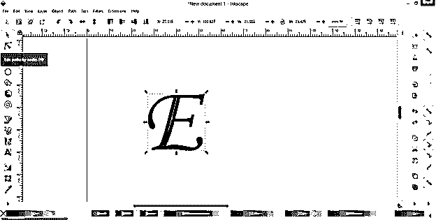

一旦你用节点工具选择了字母 E，点击它，你可以看到在这个字母的路径上有很多节点。

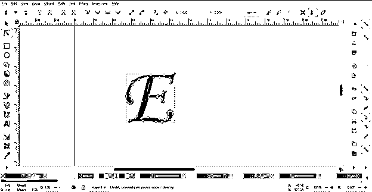

你可以在编辑节点工具的帮助下编辑这个路径的任何节点，在字母 E 的形状上有不同的变换，它会给这个字母一个创造性的外观，例如我想在这个路径的外部方向拉伸这个节点，所以我会选择这个节点，并在节点工具的帮助下向外部方向拖动它。

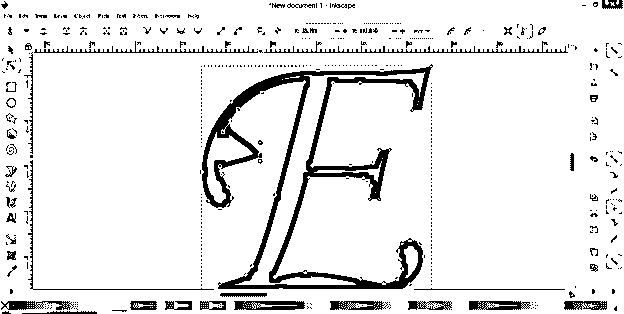

不仅仅是节点，你也可以像这样调整节点手柄来制作曲线。

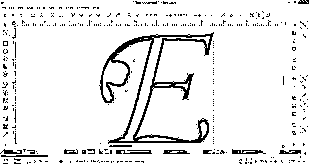

如果你愿意，你也可以从路径中删除不需要的节点，只需选择你想要删除的节点，然后按下键盘上的删除按钮。

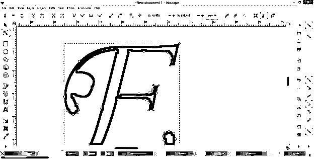

通过删除节点，您还可以更改已转换字母的路径形状。

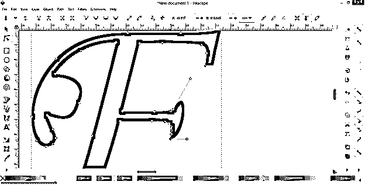

不仅仅是一个字母，你还可以将任何文本的整个单词转换成路径。那么让我们看看如果我们将一个单词或字母组合转换成一条路径会发生什么？为此，我将使用相同的文本工具键入 EDU 作为一个单词。

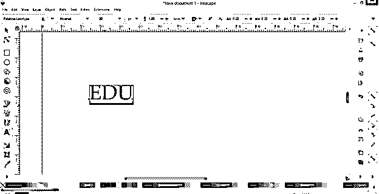

并通过按住键盘的 shift + Ctrl 键使用选择工具来增加其大小，以便保持该文本的比例。

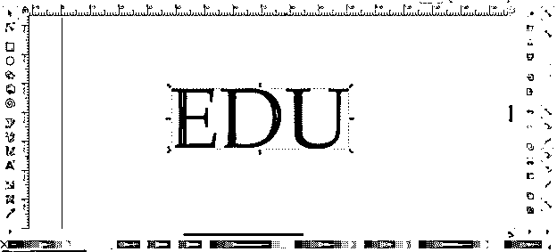

选择此文本后，我将再次转到路径菜单，并单击对象到路径选项 it。

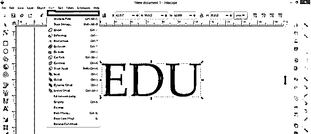

你可以看到，如果我们用节点工具选择它，这段文字的字母有许多节点。

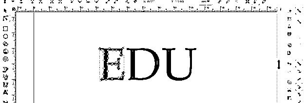

有一件事你应该注意到，任何文本的每个字母都有自己单独的路径，如果你用节点工具一个一个地选择它们。

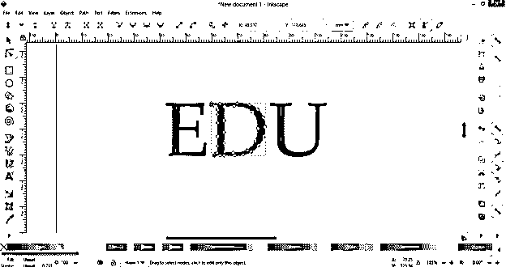

您可以分别编辑它们，这意味着另一个文本字母的路径不会受到编辑一个字母的路径的影响。

只需编辑你想要的信的节点，然后你就可以开始编辑另一封信。

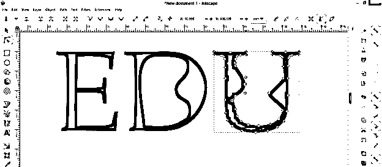

你也可以改变任何字母的颜色，就像我们改变任何形状一样。

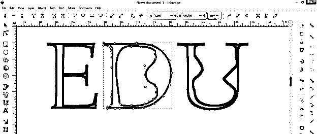

但是如果你用选择工具再次选择这个文本，它将会选择整个文本路径，而不是单独的字母路径。

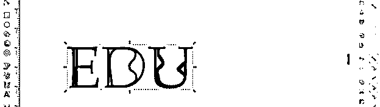

如果你想分开每一个字母路径，然后取消它们的组合，并在对象菜单中点击取消组合选项。

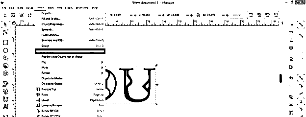

您可以看到每个文本都是单独的形式，您可以单独选择它们。

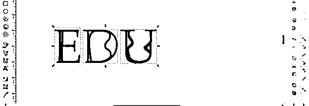

### 结论

现在，您可以非常快速地将任何文本或文本的字母转换为路径，以便用它们进行不同类型的创作，并且您还了解了用于将文本正确转换为路径的命令的主要参数。只要开始转换文本，你就会对它有越来越多的了解。

### 推荐文章

这是一个 Inkscape 文本到路径的指南。这里我们一步一步地详细讨论如何在 Inkscape 中将文本转换成路径。您也可以看看以下文章，了解更多信息–

1.  [墨迹图案](https://www.educba.com/inkscape-pattern/)
2.  [暗礁主题](https://www.educba.com/inkscape-dark-theme/)
3.  [色拉酱](https://www.educba.com/inkscape-crop/)
4.  [喷墨替代](https://www.educba.com/inkscape-alternative/)

