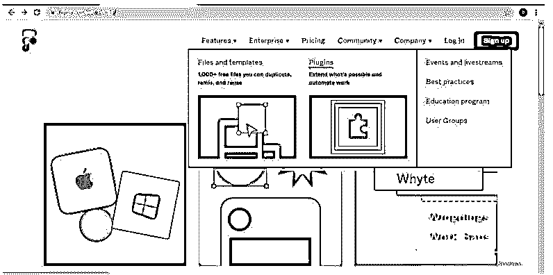
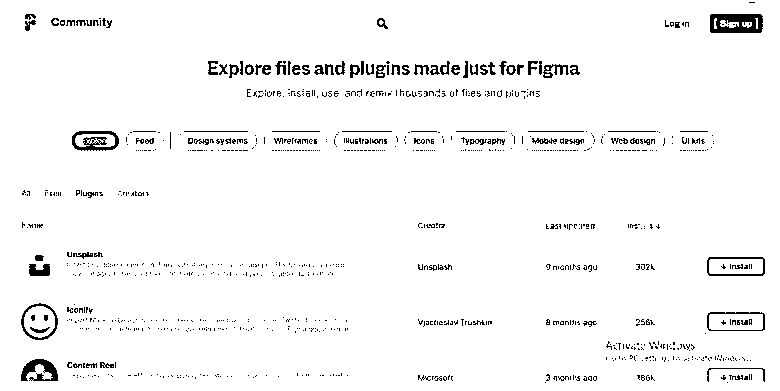
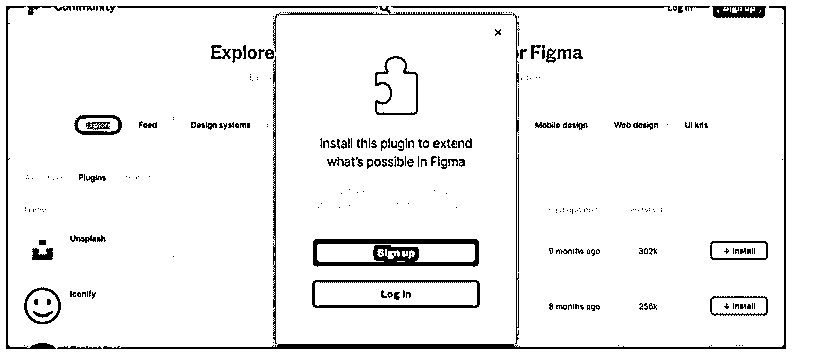
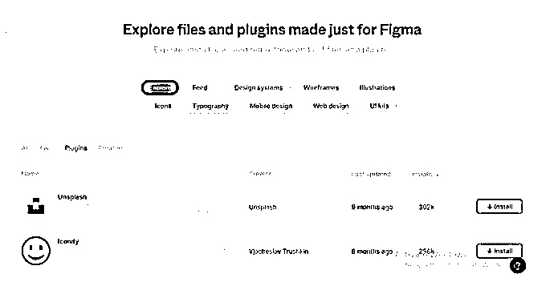
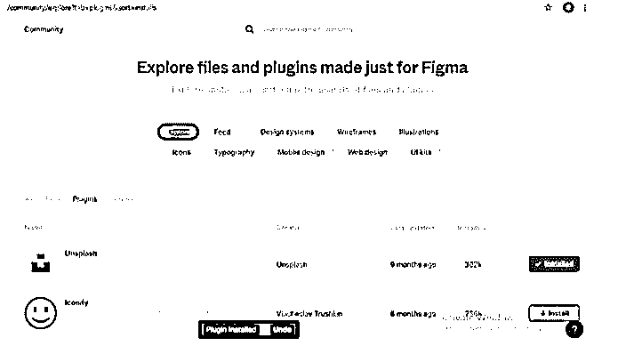
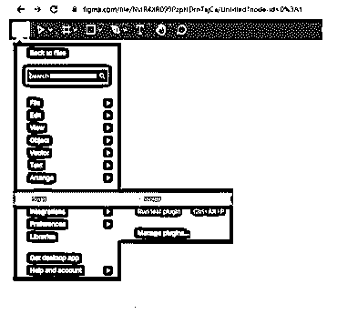
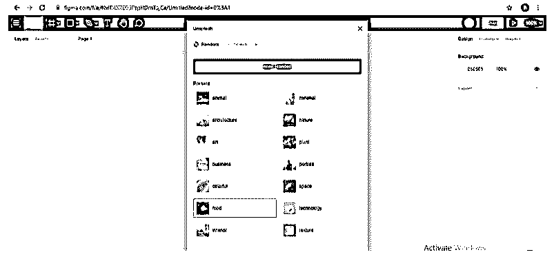

# Figma 插件

> 原文：<https://www.educba.com/figma-plugins/>

## Figma 插件简介

Figma plugins 是一个设计平台，它为 UI 设计者提供了额外的工具，以及由不同社区构建的插件集合。有了 Figma，你可以扩展你的工作能力来设计作品，它还以令人兴奋的插件形式提供了有用的功能，并不时更新格式。如果你在网上浏览 Figma，你会发现里面有很多插件，在这里我们会看到一些插件和它们的解释。您将了解如何连接这些插件，并在您的设计工作中正确使用它们。

### 顶级 Figma 插件

在我们的列表中，我们有 6 个 Figma 插件，你必须知道在这个领域管理有效的工作。

<small>3D 动画、建模、仿真、游戏开发&其他</small>

所以让我们一个一个的来看看这些插件。

#### 1.内容卷轴

正如我们从它的名字可以理解的那样，内容卷轴提供内容，但是是哪种类型的内容呢？它包括头像，文本串，不同类型的图标，你可以在你的设计工作中使用。你只需要在你的设计文件中选择图层，并在 Figma 中导出它们(你可以根据自己的情况选择一个或多个图层)，然后从这个插件中选择你想在你的设计中使用的头像、文本和其他东西。

#### 2.不溅

Unsplash 是一个几乎每种高分辨率图像的美丽集合，您可以在您的设计工作中使用它的图像而不用担心。您也可以在它的搜索框中搜索您特定类型的图像需求。你也可以对这个插件拍摄的图像进行任何操作。

#### 3.图像调色板

您可以在此基础上为您的 UI 设计开发纯色。当你用这个插件从 Figma 的任何图像中提取颜色时，它会给出 5 个颜色范围。

#### 4.Figma 聊天

正如它的名字所显示的聊天，这意味着它就像一个聊天应用程序，因此您可以使用它与人就您的设计文件进行交互，在这种交互中，您可以共享您的设计元素，以获得您的问题的解决方案。

#### 5.超级整洁

在设计中，对齐有一个重要的作用，因为我们每次都需要设计中不同元素的精确对齐。Super Tidy 是 Figma 的一个插件，它可以根据设计元素在画布上的分布快速调整我们的设计元素。它在层上按顺序呈现元素的过程中对齐并重命名元素，这个顺序基于它们在画布上的位置或分布。

#### 6.有能力的

这个插件用于区分图层之间的颜色对比。这意味着它会自动比较您选择的图层的对比度，并为您的设计提供正确的工作流程，让您了解它们的色差。

这些是 Figma 的一些重要插件，我们已经在上面看到了。你上 Figma 会发现更多。

现在让我们看看如何将它们安装到我们的个人电脑中，以便在我们的设计中使用它们。

### 如何安装 Figma 插件？

现在我们将看到 Figma 插件的安装过程。你会在 Figm.com 上找到很多插件，但是我们会通过安装一个插件来展示给你，同样的，你可以根据你的要求安装 Figma.com 的其他插件。

你要做的第一件事是在任何搜索引擎上搜索 Figma，你会找到这个网页，这是 Figma 插件主页。

现在转到该页面的“社区”选项卡，单击向下滚动框的“插件”选项。

现在在这里你会发现一些插件列表。我们将安装 Unsplash 为您的理解，所以点击它的安装按钮。

如果您没有登录，那么您必须登录到 Figma.com。如果您还没有在上面创建帐户，请单击此对话框的注册按钮，或者如果您已经有了 figma.com 帐户，请单击此框的登录按钮。

登录后，你必须再次点击你想要的插件的安装按钮。

一旦安装完毕，将会有一个安装按钮代替安装按钮。

通过这种方式，你可以安装 Figma 的任何插件用于你的设计目的。

### 怎么用？

下面给出了如何使用 Figma 插件:

现在，在安装了你想要的插件后，点击这个搜索按钮进入这个下拉列表，进入这个列表的插件选项，然后点击你想要安装的插件。

我们打开了 Unsplash 插件，所以会这样打开。因为 Unsplash 为您提供图像，所以这里是 Unsplash 插件对话框中的图像列表。你可以从这个列表中选择任何人，或者你可以在搜索框中搜索你想要的图片。一旦您想要的图像打开，您可以在 Figma 中的设计导出文件中使用打开的图像。

这样，您可以安装和使用 Figma 的插件来提高您的设计师工作能力。

### 推荐文章

这是 Figma 插件指南。在这里，我们分别讨论介绍、顶级 Figma 插件、安装和如何使用插件。您也可以看看以下文章，了解更多信息–

1.  [Figma 备选方案](https://www.educba.com/figma-alternatives/)
2.  [AutoCAD 中的偏移](https://www.educba.com/offset-in-autocad/)
3.  [AutoCAD 中的粗线](https://www.educba.com/thick-lines-in-autocad/)
4.  [AutoCAD 中的块](https://www.educba.com/block-in-autocad/)

