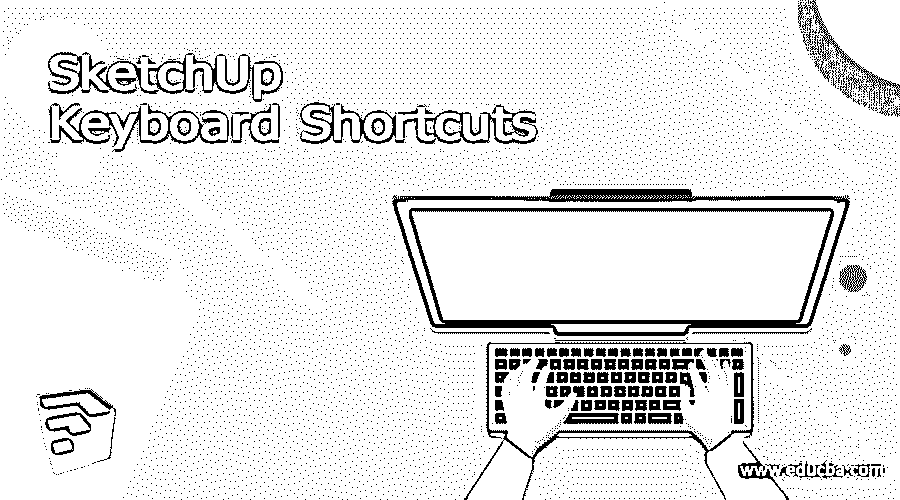

# SketchUp 键盘快捷键

> 原文：<https://www.educba.com/sketchup-keyboard-shortcuts/>

## SketchUp 键盘快捷键介绍

SketchUp 键盘快捷键是键盘的组合键或单键，这意味着您可以按下特定的键或一组键来执行该软件中的任何命令。快捷键有助于我们提高工作的准确性，并最大限度地减少我们完成任何任务所需的时间。该软件中有两种类型的快捷键，第一种是默认快捷键，第二种是自定义快捷键。默认快捷键已经为不同的命令分配了键，在自定义快捷键中，您可以为没有任何快捷键的命令分配您自己的键，或者您也可以将您想要的键重新分配给默认命令。

在本文中，我们将讨论几乎每一个不同类型的命令或工具的快捷键，或者菜单栏的选项。让我们开始讨论吧。

<small>3D 动画、建模、仿真、游戏开发&其他</small>

### SketchUp 的键盘快捷键

选择工具(空格键):选择工具是最常用的工具，所有类型的任务在这个软件中，你可以通过按键盘上的空格键快速访问它。

线条工具(L):如果你想使用线条工具，只需按键盘上的 L 键。

橡皮擦(E):在使用这个软件的过程中，我们需要多次擦除一些元素，所以你可以通过按键盘上的 E 键来激活它。

Arc tool (A): Arc tool 也是我们在这个软件中用来创建模型的工具之一，它可以通过按键盘上的一个按钮来访问。

矩形工具(R):它是形状工具之一，你可以通过按键盘的 R 键激活它。它有助于创建许多类型的形状。

圆形工具(C):它类似于矩形工具，用于创建圆形、椭圆形和其他曲线形状。你可以使用键盘的 C 键。

Push/Pull (P):这个软件最重要和最基本的工具是 Push/Pull，它是用来挤出形状来制作 3D 形状的，P 按钮是它的快捷方式。

油漆桶工具(B):你可以通过按键盘的 B 键激活这个工具。

移动工具(M):移动工具在 3D 建模中起着重要的作用，比如你可以通过选择组件的任何表面来移动它，等等。所以按下这个工具键盘上的 M 键。

旋转工具(Q):对于旋转任何组件或表面或元素，我们使用移动工具和 Q 按钮是它的快捷键。

缩放工具:按下这个工具的键盘上的 S 键，然后你可以在任何项目中缩放你选择的组件。

卷尺(T):按下键盘上的 T 键，你可以用卷尺工具来测量你的绘图对象的尺寸。

动态观察工具(O):动态观察工具将帮助你从不同的透视平面看到你绘制的模型，你可以通过按键盘的 O 键来使用它。

平移工具(H):按下平移工具键盘的 H 键，通过使用该工具，您可以按住工作屏幕，然后移动它以查看工作屏幕上的其他对象。

缩放工具(Z):使用这个工具，我们可以放大或缩小，以正确地看到元素，它可以通过按 Z 按钮激活。

新的(Ctrl + N):开始新的项目，你必须创建一个新的文件，所以按下键盘的 Ctrl + N 按钮，你可以创建它。

打开(Ctrl + O):按下键盘上的 Ctrl + O 键，打开你已经设计好的作品，一旦你按下这些键，对话框就会打开，你可以选择你想要的文件。

保存(Ctrl + S):要在本软件中保存您的工作，您可以前往菜单栏的文件菜单的保存命令，或者按下它的快捷键，即键盘的 Ctrl + S 键。

### 如何在 SketchUp 中自定义键盘快捷键？

现在让我告诉你如何在这个软件中自定义键盘快捷键，这样你就可以将你想要的快捷键分配给任何命令或工具。
你要做的第一步是进入菜单栏的窗口菜单，点击它，然后进入下拉列表的首选项选项。

一旦你点击这个选项，一个首选项对话框就会像这样打开。在这里点击列表中的快捷方式选项，你将会看到许多命令列表。

当你点击任何命令分配快捷键给它，然后如果已经有任何键分配给该命令，那么它将出现在框中的分配。例如，如果我选择相机菜单的环绕命令，那么你可以看到有一个键盘的 O 键分配给它。

现在，选择要分配快捷键的命令或工具，并在此对话框的“添加快捷键”框中键入所需的键。如果你想指定一个与 Ctrl/Alt 键组合的键，那么按住键盘上的 Ctrl/Alt 键，然后按下你想使用的另一个键，比如我按下了 Ctrl 键，然后按下 1 数字键。

现在按下这个框的加号按钮，它将出现在指定的框中，这意味着您的快捷键已经被指定到您想要的命令。现在按确定按钮保存更改。

我告诉了你这个软件几乎每一个重要的快捷键，这样你就可以在这个软件中轻松地工作。还有一个优点是你可以根据自己的情况为任何命令或工具定制快捷键。

### 结论

现在你可以开始使用这些不同命令的快捷键以及这个软件中的工具来处理任何项目工作，它肯定会以不同的方式帮助你。你只需要开始学习这个软件的不同工具，并在你的每一步中使用快捷键，这样快捷键就会成为你的习惯。

### 推荐文章

这是一个 SketchUp 键盘快捷键指南，在这里我们讨论一下 SketchUp 的键盘快捷键介绍，如何自定义键盘快捷键？您也可以看看以下文章，了解更多信息–

1.  [SketchUp 替代方案](https://www.educba.com/sketchup-alternative/)
2.  [SketchUp 旋转](https://www.educba.com/sketchup-rotate/)
3.  [SketchUp vs Fusion 360](https://www.educba.com/sketchup-vs-fusion-360/)
4.  [SketchUp AutoCAD](https://www.educba.com/sketchup-autocad/)

